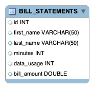

# Batch Processing with Spring Cloud Task

In this guide we will develop a Spring Boot application that uses Spring Cloud Task and deploy it to Cloud Foundry, Kubernetes, and on your local machine. In another guide, we will deploy the Task using Data Flow.

We will start from the [Spring Initializr](https://start.spring.io/) and create a Spring Cloud Task application.

NOTE: All code for this project can be found here: https://github.com/cppwfs/edutasksamples

## Development

Suppose a cell phone data provider needs to create billing statements for customers. The usage data is stored in JSON files that are stored on the file system. The billing solution must pull data from these files, generate the billing data from this usage data, and store it in a `BILLING_STATEMENTS` table.

We could implement this entire solution into a single Spring Boot Application that utilizes Spring Batch, however for this example we will break up the solution into 2 phases:

1. _billsetuptask_ - will be a Spring Boot application using Spring Cloud Task that will simply create the `BILL_STATEMENTS` table. While this is a very simple application, it does show the basic features of Spring Cloud Task.
1. _billrun_ - will be a Spring Boot application using Spring Cloud Task and Spring Batch that will read usage data from a json file and price the each row and put the resulting data into the `BILL_STATEMENTS` table.

For this section we will create a Spring Cloud Task/Boot application that will create the `BILL_STATEMENTS` table that will be used by the BillRun application.


### Initialzr

1. Visit the [Spring Initialzr site](https://start.spring.io/).
1. Select the latest release of spring boot.
1. Create a new Maven project with a Group name of `io.spring` and an Artifact name of `billsetuptask`.
1. In the Dependencies text box, type `task` to select the Cloud Task dependency.
1. In the Dependencies text box, type `jdbc` then select the JDBC dependency.
1. In the Dependencies text box, type `h2` then select the H2 dependency.
   1. We use H2 for unit testing.
1. In the Dependencies text box, type `mysql` then select mysql dependency(or your favorite database).
   1. We use MySql for the runtime database.
1. Click the Generate Project button.
1. Unzip the billsetuptask.zip file and import the project into your favorite IDE.

Another option instead of using the UI to initialize your project you can do the following:

1. Execute the following curl command:

   ```bash
   curl https://start.spring.io/starter.zip -d language=java -d type=maven-project -d baseDir=billrun -d dependencies="batch,mysql,jdbc,h2,cloud-task" >billsetuptask.zip
   ```

2. Unzip the billsetuptask.zip file and import the project into your favorite IDE

### Setting up MySql

1. If you don't have an instance of MySql installed available to you, you can follow these instructions to run a MySql docker image for this example.

   1. Pull the MySql docker image

      ```bash
      $ docker pull mysql:5.7.25
      ```

   2. Start the MySql

      ```bash
      $ docker run -p 3306:3306 --name some-mysql -e MYSQL_ROOT_PASSWORD=password  -e MYSQL_DATABASE=practice -d mysql:5.7.24
      ```

### Biz Logic

Now let’s create the elements required for this application.

1.  Using your IDE create the package `io.spring.billsetuptask.configuration`.
1.  Create a [TaskConfiguration](https://github.com/cppwfs/edutasksamples/blob/master/billsetuptask/src/main/java/io/spring/billsetuptask/configuration/TaskConfiguration.java) class in the `io.spring.billsetuptask.configuration` package using your favorite IDE that looks like the contents below.

```java
{/* highlight-range{2} */}
@Configuration
@EnableTask
public class TaskConfiguration {

    @Autowired
    private DataSource dataSource;

    @Bean
    public CommandLineRunner commandLineRunner() {
        return args -> {
            JdbcTemplate jdbcTemplate = new JdbcTemplate(dataSource);
            jdbcTemplate.execute("CREATE TABLE IF NOT EXISTS " +
                    "BILL_STATEMENTS ( id int, " +
                    "first_name varchar(50), last_name varchar(50), " +
                    "minutes int,data_usage int, bill_amount double)");
        };
    }
}
```

The `@EnableTask` annotation sets up a TaskRepository which stores information about the task execution such as the start and end time of the task and the exit code.

### Testing

Now let’s create our test. Update the contents of the [BillsetuptaskApplicationTests.java](https://github.com/cppwfs/edutasksamples/blob/master/billsetuptask/src/test/java/io/spring/billsetuptask/BillsetuptaskApplicationTests.java) with the following code:

```java
@RunWith(SpringRunner.class)
@SpringBootTest
public class BillsetuptaskApplicationTests {

	@Autowired
	private DataSource dataSource;

	@Test
	public void testRepository() {
		JdbcTemplate jdbcTemplate = new JdbcTemplate(this.dataSource);
		int result = jdbcTemplate.queryForObject(
		"SELECT COUNT(*) FROM BILL_STATEMENTS", Integer.class);

		assertThat(result).isEqualTo(0);
	}
}
```

## Deployment

Deploy to local, Cloud Foundry and Kubernetes

### Local

1. Now let’s take the next step of building the project.
   From a command line change directory to the location of your project and build the project using maven
   `mvn clean package`

1. Now let’s execute the application with the configurations required to create the "BILL_STATEMENTS" table in the MySql database.
   To configure the execution of the billsetuptask application utilize the following arguments:

   1. _spring.datasource.url_ - set the URL to your database instance. In the sample below we are connecting to a mysql `practice` database on our local machine at port 3306.
   1. _spring.datasource.username_ - the user name to be used for the MySql database. In the sample below it is `root`
   1. _spring.datasource.password_ - the password to be used for the MySql database. In the sample below it is `password`
   1. _spring.datasource.driverClassName_ - The driver to use to connect to the MySql database. In the sample below it is `com.mysql.jdbc.Driver'

   ```bash
   $ java -jar target/billsetuptask-0.0.1-SNAPSHOT.jar \
   --spring.datasource.url=jdbc:mysql://localhost:3306/practice?useSSL=false \
   --spring.datasource.username=root \
   --spring.datasource.password=password \
   --spring.datasource.driverClassName=com.mysql.jdbc.Driver
   ```

### Cloud Foundry

As Alana I must ask for an org/space

### Kubernetes

Where all the cool kids play.
