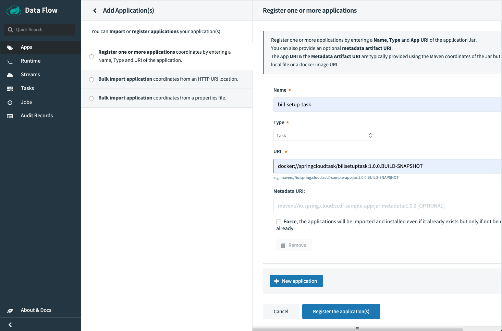

# Deploying a task application in Kubernetes

This guide will walk you through how to deploy and run a simple [spring-cloud-task](https://spring.io/projects/spring-cloud-task) application on Kubernetes using Spring Cloud Data Flow.

We will deploy the sample [billsetuptask]() application to Kubernetes.

## Setting up SCDF the Kubernetes cluster

For this we need a running [Kubernetes cluster with Spring Cloud Data Flow deployed](/documentation/installation/kubernetes/). Here we will deploy to `minikube`.

### Verify Spring Cloud Data Flow is up and running

When SCDF is running, you should see the `scdf-server` pod in a `Running` state and the associated service created. On minikube, `EXTRNAL-IP = <pending>` is normal.

```bash
$ kubectl get all -l app=scdf-server
NAME                              READY   STATUS    RESTARTS   AGE
pod/scdf-server-65789665d-79hrz   1/1     Running   0          5m39s

NAME                  TYPE           CLUSTER-IP      EXTERNAL-IP   PORT(S)        AGE
service/scdf-server   LoadBalancer   10.109.181.91   <pending>     80:30403/TCP   5m39s

NAME                          READY   UP-TO-DATE   AVAILABLE   AGE
deployment.apps/scdf-server   1/1     1            1           5m39s

NAME                                    DESIRED   CURRENT   READY   AGE
replicaset.apps/scdf-server-65789665d   1         1         1       5m39s
```

### Build a Docker image for the sample task application

We will build the `billsetuptask` app, which is configured with the [jib maven plugin](https://github.com/GoogleContainerTools/jib/tree/master/jib-maven-plugin#build-your-image):

Clone the task samples git repo, and cd to the `billsetuptask` directory.

```bash
$ eval $(minikube docker-env)
$ mvn clean package jib:dockerBuild
```

This will add the image to the `minikube` Docker registry.
Verify its presence by finding `springcloudtask/billsetuptask` in the list of images:

```bash
$ docker images
```

### Open the Spring Cloud Dataflow Dashboard

Use the following command to get the SCDF Server URL.

```bash
$ minikube service --url scdf-server
http://192.168.99.100:30403
```

The SCDF server url will be different for each minikube installation. Open your browser at `<scdf-url>/dashboard`.

This will take you to the Applications page where you can add an application.


### Register the task app

For SCDF to launch the task, we first need to register the task, specifying a name and a resource URI for the docker image.
To identify the application resource as a Docker image, the URI uses the `docker://` prefix followed by the image label, in this case `springcloudtask/billsetuptask:1.0.0.BUILD-SNAPSHOT`. Here, we register an application named `bill-setup-task` and set its type to `Task`.

Select `Add Applications` and `Register one or more applications`. Fill in the form, as shown, and hit `Register the application(s)`.



### Create a Task.

Now that we have registered the application, we need to create a task definition. Registering the application tells SCDF how to access the application resource, in this case a Docker image. The task definition includes optional runtime parameters and is required before SCDF can launch the task.
