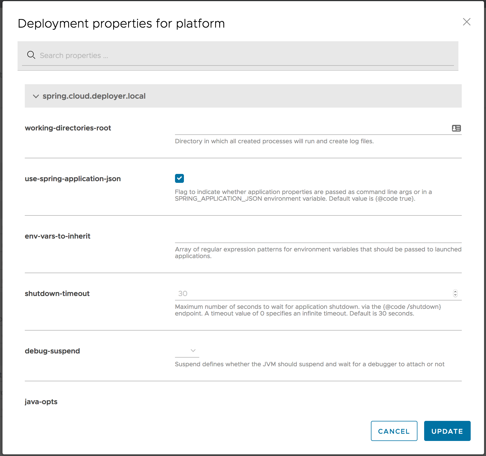
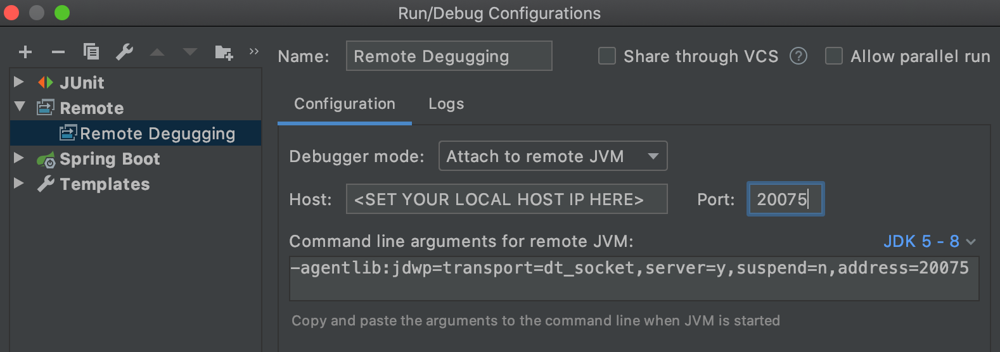
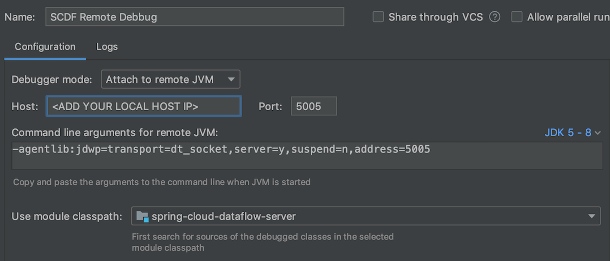

# Customizing Docker Compose

The Docker Compose [installation](%currentPath%/installation/local/docker) guide explains how to use the [docker-compose.yml](https://raw.githubusercontent.com/spring-cloud/spring-cloud-dataflow/%github-tag%/spring-cloud-dataflow-server/docker-compose.yml) for installing `Data Flow`, `Skipper`, `Kafka` and `MySQL`.
You can extend this basic configuration with the help of the provided extension docker-compose files.
For example if you want to use `RabbitMQ` or `PostgreSQL` instead or to enable Data Flow for `Monitoring`, you can combine some of the provided docker-compose extension files like this:

<!--TABS-->

<!--Linux / OSX-->

```bash
docker-compose -f ./docker-compose.yml \
               -f ./docker-compose-rabbitmq.yml \
               -f ./docker-compose-postgres.yml \
               -f ./docker-compose-influxdb.yml up
```

<!--Windows-->

```bash
docker-compose -f .\docker-compose.yml -f .\docker-compose-rabbitmq.yml -f .\docker-compose-postgres.yml -f .\docker-compose-influxdb.yml up
```

<!--END_TABS-->

Following paragraphs offer a detailed description of the provided extension docker-compose files that can be applied on top of the `docker-compose.yml`. When more than one docker compose file is used, they are applied in the order of their definition.

## Prometheus & Grafana

The [docker-compose-prometheus.yml](https://raw.githubusercontent.com/spring-cloud/spring-cloud-dataflow/%github-tag%/spring-cloud-dataflow-server/docker-compose-prometheus.yml) extends the default configuration in `docker-compose.yml` to enable the Stream and Task monitoring with Prometheus and Grafana:

<!--TABS-->

<!--Linux / OSX-->

```bash
wget https://raw.githubusercontent.com/spring-cloud/spring-cloud-dataflow/%github-tag%/spring-cloud-dataflow-server/docker-compose-prometheus.yml
docker-compose -f ./docker-compose.yml -f ./docker-compose-prometheus.yml up
```

<!--Windows-->

```bash
curl https://raw.githubusercontent.com/spring-cloud/spring-cloud-dataflow/%github-tag%/spring-cloud-dataflow-server/docker-compose-prometheus.yml -o docker-compose-prometheus.yml
docker-compose -f .\docker-compose.yml -f .\docker-compose-prometheus.yml up
```

<!--END_TABS-->

In addition to the basic services the extended configuration adds `Prometheus`, `Prometheus-RSocket-Proxy` for service-discovery, and `Grafana` with pre-built Stream and Task dashboards.

The `docker-compose-prometheus.yml` configurations expose the following container ports to the host machine:

| Host ports | Container ports | Description                                                                                                                                    |
| ---------- | --------------- | ---------------------------------------------------------------------------------------------------------------------------------------------- |
| 9090       | 9090            | Prometheus server port. Use it to reach the Prometheus web console at http://localhost:9090                                                    |
| 3000       | 3000            | Grafana server port. Use it to reach the Grafana dashboard http://localhost:3000                                                               |
| 9096       | 9096            | Prometheus RSocket Proxy (Spring Boot) Server Port                                                                                             |
| 7001       | 7001            | Prometheus RSocket Proxy TCP accept port. Stream and Task application can be configured to use this port to report their metrics to the proxy. |
| 8081       | 8081            | Prometheus RSocket Proxy WebSocket port. Stream and Task application can be configured to use this port to report their metrics to the proxy.  |

<!--NOTE-->

The `docker-compose-prometheus.yml` expects existing Docker images: `springcloud/spring-cloud-dataflow-prometheus-local` and `springcloud/spring-cloud-dataflow-grafana-prometheus` with tags that match the configured `DATAFLOW_VERSION` value

<!--END_NOTE-->

## InfluxDB & Grafana

The [docker-compose-influxdb.yml](https://raw.githubusercontent.com/spring-cloud/spring-cloud-dataflow/%github-tag%/spring-cloud-dataflow-server/docker-compose-influxdb.yml) enables Stream and Task monitoring with `InfluxDB` and `Grafana` with pre-built Stream and Task dashboards:

<!--TABS-->

<!--Linux / OSX-->

```bash
wget https://raw.githubusercontent.com/spring-cloud/spring-cloud-dataflow/%github-tag%/spring-cloud-dataflow-server/docker-compose-influxdb.yml
docker-compose -f ./docker-compose.yml -f ./docker-compose-influxdb.yml up
```

<!--Windows-->

```bash
curl https://raw.githubusercontent.com/spring-cloud/spring-cloud-dataflow/%github-tag%/spring-cloud-dataflow-server/docker-compose-influxdb.yml -o docker-compose-influxdb.yml
docker-compose -f .\docker-compose.yml -f .\docker-compose-influxdb.yml up
```

<!--END_TABS-->

The `docker-compose-influxdb.yml` configurations expose the following container ports to the host machine:

| Host ports | Container ports | Description                                                                      |
| ---------- | --------------- | -------------------------------------------------------------------------------- |
| 8086       | 8086            | Influx DB server port. Use http://localhost:8086 to connect to the Influx DB     |
| 3000       | 3000            | Grafana server port. Use it to reach the Grafana dashboard http://localhost:3000 |

<!--NOTE-->

The `docker-compose-influxdb.yml` expects an existing Docker image: `springcloud/spring-cloud-dataflow-grafana-influxdb` with a Tag that matches the configured `DATAFLOW_VERSION` value.

<!--END_NOTE-->

## Postgres Instead of MySQL

The [docker-compose-postgres.yml](https://raw.githubusercontent.com/spring-cloud/spring-cloud-dataflow/%github-tag%/spring-cloud-dataflow-server/docker-compose-postgres.yml) configures using `PostgreSQL` instead of `MySQL` for both Spring Cloud Data Flow and SKipper. It disables the default `mysql` service, adds a new `postgres` service and overrides the Data Flow and Skipper configurations to use the postgres:

<!--TABS-->

<!--Linux / OSX-->

```bash
wget https://raw.githubusercontent.com/spring-cloud/spring-cloud-dataflow/%github-tag%/spring-cloud-dataflow-server/docker-compose-postgres.yml
docker-compose -f ./docker-compose.yml -f ./docker-compose-postgres.yml up
```

<!--Windows-->

```bash
curl https://raw.githubusercontent.com/spring-cloud/spring-cloud-dataflow/%github-tag%/spring-cloud-dataflow-server/docker-compose-postgres.yml -o docker-compose-postgres.yml
docker-compose -f .\docker-compose.yml -f .\docker-compose-postgres.yml up
```

<!--END_TABS-->

The `docker-compose-postgres.yml` configurations expose the following container ports to the host machine:

| Host ports | Container ports | Description                                                                                                             |
| ---------- | --------------- | ----------------------------------------------------------------------------------------------------------------------- |
| 5432       | 5432            | PostgreSql DB server port. Use `jdbc:postgresql://localhost:5432/dataflow` to connect to the DB form your local machine |

## RabbitMQ Instead of Kafka

The [docker-compose-rabbitmq.yml](https://raw.githubusercontent.com/spring-cloud/spring-cloud-dataflow/%github-tag%/spring-cloud-dataflow-server/docker-compose-rabbitmq.yml) configures RabbitMQ instead of Kafka as message broker. It disables the default `kafka` and `zookeeper` services, adds a new `rabbitmq` service and overrides the `dataflow-server`'s service binder configuration to RabbitMQ (e.g. `spring.cloud.dataflow.applicationProperties.stream.spring.rabbitmq.host=rabbitmq`). Finally overrides the `app-import` service to register the rabbit apps:

<!--TABS-->

<!--Linux / OSX-->

```bash
wget https://raw.githubusercontent.com/spring-cloud/spring-cloud-dataflow/%github-tag%/spring-cloud-dataflow-server/docker-compose-rabbitmq.yml
docker-compose -f ./docker-compose.yml -f ./docker-compose-rabbitmq.yml up
```

<!--Windows-->

```bash
curl https://raw.githubusercontent.com/spring-cloud/spring-cloud-dataflow/%github-tag%/spring-cloud-dataflow-server/docker-compose-rabbitmq.yml -o docker-compose-rabbitmq.yml
docker-compose -f .\docker-compose.yml -f .\docker-compose-rabbitmq.yml up
```

<!--END_TABS-->

## Debugging

Following paragraphs explain how to debug DataFlow (or Skipper) server and/or Stream Applications deployed by them.

<!--TIP-->

In the debug configurations below allays use the local machine `IP` address rather than the `localhost` name!

<!--END_TIP-->

### Debug Stream Applications

For debugging a Stream Applications, when deploying the stream set the application deployment property: [deployer.<appName>.local.debugPort](https://docs.spring.io/spring-cloud-dataflow/docs/current/reference/htmlsingle/#configuration-local-deployer) to value in the `20000 - 20105`. You can do it directly form the deployment UI panel. For example here we set the `debugPort` to `20075`.

  

Open the stream application project in you IntelliJ. Then configure a Remote Debug configuration by setting the `Host:` to the IP address of you local machine (don't use `localhost` but the IP address!) and set the `Port:` to the value used in the deployment property above.

  

### Debug Data Flow Server

The [docker-compose-debug-dataflow.yml](https://raw.githubusercontent.com/spring-cloud/spring-cloud-dataflow/%github-tag%/spring-cloud-dataflow-server/docker-compose-debug-dataflow.yml) enables remote debugging of the Data Flow Server. To enable the debugging run:

<!--TABS-->

<!--Linux / OSX-->

```bash
wget https://raw.githubusercontent.com/spring-cloud/spring-cloud-dataflow/%github-tag%/spring-cloud-dataflow-server/docker-compose-debug-dataflow.yml
docker-compose -f ./docker-compose.yml -f ./docker-compose-debug-dataflow.yml up
```

<!--Windows-->

```bash
curl https://raw.githubusercontent.com/spring-cloud/spring-cloud-dataflow/%github-tag%/spring-cloud-dataflow-server/docker-compose-debug-dataflow.yml -o docker-compose-debug-dataflow.yml
docker-compose -f .\docker-compose.yml -f .\docker-compose-debug-dataflow.yml up
```

<!--END_TABS-->

The `dataflow-server` service will wait for a debugger to connect on port `5005` to start debugging. The following screenshot shows how to configure remote debug with IntelliJ. Set the `Host:` with the IP address of you local machine. Do not use `localhost` as it won't work inside the docker containers.

  

Often while debugging, you will need to build new local `spring-cloud-dataflow-server:latest` docker image. You can achieve this running the following commands from the DataFlow root directory:

```bash
./mvnw clean install -DskipTests
./mvnw docker:build -pl spring-cloud-dataflow-server
```

### Debug Skipper Server

Similarly you can use the [docker-compose-debug-skipper.yml](https://raw.githubusercontent.com/spring-cloud/spring-cloud-dataflow/%github-tag%/spring-cloud-dataflow-server/docker-compose-debug-skipper.yml) to enable remote debugging of the Skipper Server:

<!--TABS-->

<!--Linux / OSX-->

```bash
wget https://raw.githubusercontent.com/spring-cloud/spring-cloud-dataflow/%github-tag%/spring-cloud-dataflow-server/docker-compose-debug-skipper.yml
docker-compose -f ./docker-compose.yml -f ./docker-compose-debug-skipper.yml up
```

<!--Windows-->

```bash
curl https://raw.githubusercontent.com/spring-cloud/spring-cloud-dataflow/%github-tag%/spring-cloud-dataflow-server/docker-compose-debug-skipper.yml -o docker-compose-debug-skipper.yml
docker-compose -f .\docker-compose.yml -f .\docker-compose-debug-skipper.yml up
```

<!--END_TABS-->

The `skipper` service will wait for a debugger to connect on port `6006`.

## Integration Testing

The self-documented [DataFlowIT.java](https://github.com/spring-cloud/spring-cloud-dataflow/blob/%github-tag%/spring-cloud-dataflow-server/src/test/java/org/springframework/cloud/dataflow/integration/test/DataFlowIT.java) class demonstrates how to reuse the same docker-compose files to build DataFlow integration and smoke tests.

## Multi-platform support

This configuration connects your local `Skipper` server to a remote platform such as `Kubernetes` or `Cloud Foundry` and allows you deploy streaming data pipelines on those platforms. As a prerequisite it expects the `Apache Kafka` (or `RabbitMQ`) binder provisioned on the remote platform.

<!--NOTE-->

The Task/Batch applications require direct database access. But because the `Data Flow` server and `Database` run locally you can start Task application only in your local platform!
Also because the `Scheduler` service is not supported by by the Local Deployer, it is not supported by the docker-compose configuration either.

<!--END_NOTE-->

The [docker-compose-cf.yml](https://raw.githubusercontent.com/spring-cloud/spring-cloud-dataflow/%github-tag%/spring-cloud-dataflow-server/docker-compose-cf.yml) adds a remote `Cloud Foundry` account as a Data Flow runtime platform under the name `cf`. You will need to edit the `docker-compose-cf.yml` to add your CF API URL and access credentials.

```bash
wget https://raw.githubusercontent.com/spring-cloud/spring-cloud-dataflow/%github-tag%/spring-cloud-dataflow-server/docker-compose-rabbitmq.yml
wget https://raw.githubusercontent.com/spring-cloud/spring-cloud-dataflow/%github-tag%/spring-cloud-dataflow-server/docker-compose-cf.yml
docker-compose -f ./docker-compose.yml -f ./docker-compose-rabbitmq.yml -f ./docker-compose-cf.yml up
```

Because `Kafka` is not supported on CF you, also will need to switch to `Rabbit` using the `docker-compose-rabbitmq.yml`. The `docker-compose-cf.yml` expects a `rabbit` service configured in the target CF environment.

The [docker-compose-k8s.yml](https://raw.githubusercontent.com/spring-cloud/spring-cloud-dataflow/%github-tag%/spring-cloud-dataflow-server/docker-compose-cf.yml) adds a remote `Kubernetes` account as a Data Flow runtime platform under the name `k8s`. You will need to edit the `docker-compose-k8s.yml` to add your Kubernetes master URL and access credentials.

```bash
wget https://raw.githubusercontent.com/spring-cloud/spring-cloud-dataflow/%github-tag%/spring-cloud-dataflow-server/docker-compose-k8s.yml
STREAM_APPS_URI=https://dataflow.spring.io/kafka-docker-latest docker-compose -f ./docker-compose.yml -f ./docker-compose-k8s.yml up
```

The default maven based app starters can not be deployed in a Kubernetes environment. Switch to the docker based app distribution using the `STREAM_APPS_URI` variable.

The `docker-compose-k8s.yml` expects a `kafka-broker` service pre-deployed in the target Kubernetes environment. Follow the [choose a message broker](%currentPath%/installation/kubernetes/kubectl/#choose-a-message-broker) instructions to deploy kafka-broker service.
