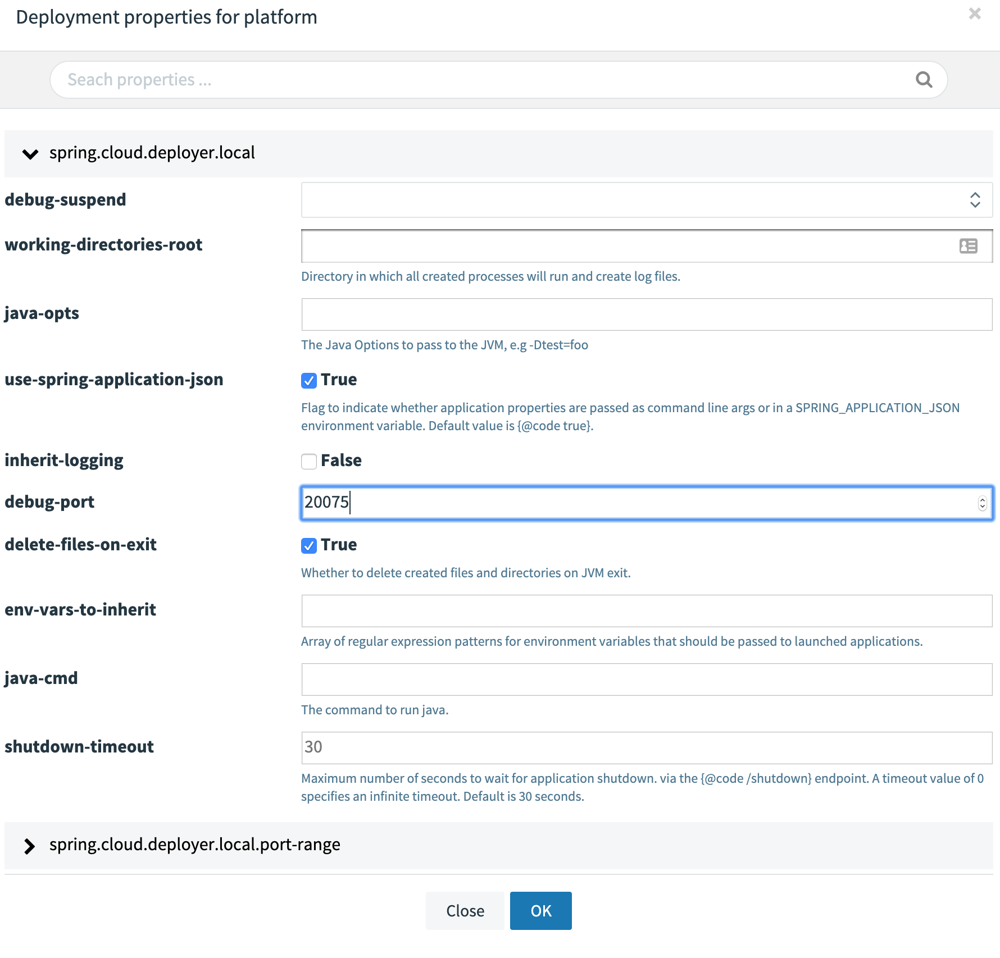

# Customizing Docker Compose

The Docker Compose [installation](%currentPath%/installation/local/docker) guide explains how to use [docker-compose.yml](https://raw.githubusercontent.com/spring-cloud/spring-cloud-dataflow/%github-tag%/src/docker-compose/docker-compose.yml) for installing `Data Flow`, `Skipper`, `Kafka`, and `MySQL`.
You can extend this basic configuration with the help of the provided extension docker-compose files.
For example, if you want to use `RabbitMQ` or `PostgreSQL` or enable Data Flow for `Monitoring`, you can combine some of the provided docker-compose extension files:

<!--TABS-->

<!--Linux / OSX-->

```bash
docker-compose -f ./docker-compose.yml \
               -f ./docker-compose-rabbitmq.yml \
               -f ./docker-compose-postgres.yml \
               -f ./docker-compose-influxdb.yml up
```

<!--Windows-->

```bash
docker-compose -f .\docker-compose.yml -f .\docker-compose-rabbitmq.yml -f .\docker-compose-postgres.yml -f .\docker-compose-influxdb.yml up
```

<!--END_TABS-->

The following sections offer a detailed description of the provided extension docker-compose files that you can apply on top of the `docker-compose.yml`. When you use more than one docker-compose file, they are applied in the order of their definition.

## Prometheus & Grafana

The [docker-compose-prometheus.yml](https://raw.githubusercontent.com/spring-cloud/spring-cloud-dataflow/%github-tag%/src/docker-compose/docker-compose-prometheus.yml) file extends the default configuration in `docker-compose.yml` to enable the [Stream and Task monitoring with Prometheus and Grafana](%currentPath%//feature-guides/streams/monitoring/#prometheus):

<!--TABS-->

<!--Linux / OSX-->

```bash
wget -O docker-compose-prometheus.yml https://raw.githubusercontent.com/spring-cloud/spring-cloud-dataflow/%github-tag%/src/docker-compose/docker-compose-prometheus.yml
docker-compose -f ./docker-compose.yml -f ./docker-compose-prometheus.yml up
```

<!--Windows-->

```bash
curl https://raw.githubusercontent.com/spring-cloud/spring-cloud-dataflow/%github-tag%/src/docker-compose/docker-compose-prometheus.yml -o docker-compose-prometheus.yml
docker-compose -f .\docker-compose.yml -f .\docker-compose-prometheus.yml up
```

<!--END_TABS-->

In addition to the basic services, the extended configuration adds `Prometheus` and `Prometheus-RSocket-Proxy` for service-discovery and adds `Grafana` with pre-built Stream and Task dashboards.

The `docker-compose-prometheus.yml` configurations expose the following container ports to the host machine:

| Host ports | Container ports | Description                                                                                                                                    |
| ---------- | --------------- | ---------------------------------------------------------------------------------------------------------------------------------------------- |
| 9090       | 9090            | Prometheus server port. Use it to reach the Prometheus web console at http://localhost:9090                                                    |
| 3000       | 3000            | Grafana server port. Use it to reach the Grafana dashboard http://localhost:3000                                                               |
| 9096       | 9096            | Prometheus RSocket Proxy (Spring Boot) Server Port                                                                                             |
| 7001       | 7001            | Prometheus RSocket Proxy TCP accept port. You can configure Stream and Task application to use this port to report their metrics to the proxy. |
| 8086       | 8086            | Prometheus RSocket Proxy WebSocket port. You can configure Stream and Task application to use this port to report their metrics to the proxy.  |

<!--NOTE-->

The `docker-compose-prometheus.yml` file expects existing Docker images (`springcloud/spring-cloud-dataflow-prometheus-local` and `springcloud/spring-cloud-dataflow-grafana-prometheus`) with tags that match the configured `DATAFLOW_VERSION` value.

<!--END_NOTE-->

## InfluxDB & Grafana

The [docker-compose-influxdb.yml](https://raw.githubusercontent.com/spring-cloud/spring-cloud-dataflow/%github-tag%/src/docker-compose/docker-compose-influxdb.yml) enables Stream and Task monitoring with `InfluxDB` and `Grafana` with pre-built Stream and Task dashboards:

<!--TABS-->

<!--Linux / OSX-->

```bash
wget -O docker-compose-influxdb.yml https://raw.githubusercontent.com/spring-cloud/spring-cloud-dataflow/%github-tag%/src/docker-compose/docker-compose-influxdb.yml
docker-compose -f ./docker-compose.yml -f ./docker-compose-influxdb.yml up
```

<!--Windows-->

```bash
curl https://raw.githubusercontent.com/spring-cloud/spring-cloud-dataflow/%github-tag%/src/docker-compose/docker-compose-influxdb.yml -o docker-compose-influxdb.yml
docker-compose -f .\docker-compose.yml -f .\docker-compose-influxdb.yml up
```

<!--END_TABS-->

The `docker-compose-influxdb.yml` configurations expose the following container ports to the host machine:

| Host ports | Container ports | Description                                                                       |
| ---------- | --------------- | --------------------------------------------------------------------------------- |
| 8086       | 8086            | Influx DB server port. Use http://localhost:8086 to connect to the Influx DB.     |
| 3000       | 3000            | Grafana server port. Use it to reach the Grafana dashboard http://localhost:3000. |

<!--NOTE-->

The `docker-compose-influxdb.yml` expects an existing Docker image (`springcloud/spring-cloud-dataflow-grafana-influxdb`) with a tag that matches the configured `DATAFLOW_VERSION` value.

<!--END_NOTE-->

## Wavefront

The [docker-compose-wavefront.yml](https://raw.githubusercontent.com/spring-cloud/spring-cloud-dataflow/%github-tag%/src/docker-compose/docker-compose-wavefront.yml) enables Stream and Task monitoring with `Wavefront` with pre-built Stream and Task dashboards.

[Wavefront](https://www.wavefront.com/) is a SaaS offering, and you need to first [create a user account](https://www.wavefront.com/sign-up/) and use that account to set the `WAVEFRONT_KEY` and `WAVEFRONT_URI` environment variables, as explained later in this section.

<!--TABS-->

<!--Linux / OSX-->

```bash
wget -O docker-compose-wavefront.yml https://raw.githubusercontent.com/spring-cloud/spring-cloud-dataflow/%github-tag%/src/docker-compose/docker-compose-wavefront.yml
docker-compose -f ./docker-compose.yml -f ./docker-compose-wavefront.yml up
```

<!--Windows-->

```bash
curl https://raw.githubusercontent.com/spring-cloud/spring-cloud-dataflow/%github-tag%/src/docker-compose/docker-compose-wavefront.yml -o docker-compose-wavefront.yml
docker-compose -f .\docker-compose.yml -f .\docker-compose-wavefront.yml up
```

<!--END_TABS-->

You can use the following environment variables to configure the `docker-compose-wavefront.yml`:

| Variable name      | Default value                | Description                                                                              |
| ------------------ | ---------------------------- | ---------------------------------------------------------------------------------------- |
| `WAVEFRONT_KEY`    | (required)                   | Wavefront user API Key                                                                   |
| `WAVEFRONT_URI`    | https://vmware.wavefront.com | Wavefront entry point URI                                                                |
| `WAVEFRONT_SOURCE` | scdf-docker-compose          | Unique identifier for Wavefront for the metrics coming from this Data Flow installation. |

<!--TIP-->

You can use the Wavefront's Browse/Source menu to find the metrics coming from the `WAVEFRONT_SOURCE` source.

<!--END_TIP-->

## Zipkin Server

The [docker-compose-zipkin.yml](https://raw.githubusercontent.com/spring-cloud/spring-cloud-dataflow/%github-tag%/src/docker-compose/docker-compose-zipkin.yml) enables Stream distributed trace collection and visualization with `Zipkin Server`. Open the Zipkin's UI at [http://localhost:9411/zipkin](http://localhost:9411/zipkin) to find the distributed traces collected from deployed streaming applications.

All Spring Cloud [Stream Applications](https://github.com/spring-cloud/stream-applications) are pre-configured with `Spring Cloud Sleuth` to support message distributed tracing. The traced information is sent to an external systems to visualize latency. Spring Cloud Sleuth supports OpenZipkin compatible systems such as [Zipkin Server](https://github.com/openzipkin/zipkin/tree/master/zipkin-server) or the [Wavefront Distributed Tracing](https://docs.wavefront.com/tracing_basics.html).

The Zipkin distributed tracing is disabled by default. Use the [spring sleuth properties](https://cloud.spring.io/spring-cloud-sleuth/reference/html/appendix.html) to alter the default behavior. For example the `docker-compose-zipkin.yaml` leverages the SCDF common streaming properties to set the `spring.zipkin.enabled=true` and `spring.zipkin.base-url=http://zipkin-server:9411` for deployed stream applications.

<!--TABS-->

<!--Linux / OSX-->

```bash
wget -O docker-compose-zipkin.yml https://raw.githubusercontent.com/spring-cloud/spring-cloud-dataflow/%github-tag%/src/docker-compose/docker-compose-zipkin.yml
docker-compose -f ./docker-compose.yml -f ./docker-compose-zipkin.yml up
```

<!--Windows-->

```bash
curl https://raw.githubusercontent.com/spring-cloud/spring-cloud-dataflow/%github-tag%/src/docker-compose/docker-compose-zipkin.yml -o docker-compose-zipkin.yml
docker-compose -f .\docker-compose.yml -f .\docker-compose-zipkin.yml up
```

<!--END_TABS-->

The `docker-compose-zipkin.yml` configurations expose the following container ports to the host machine:

| Host ports | Container ports | Description                                           |
| ---------- | --------------- | ----------------------------------------------------- |
| 9411       | 9411            | Zipkin Server listen port for the HTTP API and web UI |

<!--TIP-->

You can use the `Zipkin UI` at [http://localhost:9411/zipkin](http://localhost:9411/zipkin) to browse the distributed traces collected from deployed streaming applications.

<!--END_TIP-->

## Postgres Instead of MySQL

The [docker-compose-postgres.yml](https://raw.githubusercontent.com/spring-cloud/spring-cloud-dataflow/%github-tag%/src/docker-compose/docker-compose-postgres.yml) file configures using `PostgreSQL` instead of `MySQL` for both Spring Cloud Data Flow and SKipper. It disables the default `mysql` service, adds a new `postgres` service, and overrides the Data Flow and Skipper configurations to use `postgres` service:

<!--TABS-->

<!--Linux / OSX-->

```bash
wget -O docker-compose-postgres.yml https://raw.githubusercontent.com/spring-cloud/spring-cloud-dataflow/%github-tag%/src/docker-compose/docker-compose-postgres.yml
docker-compose -f ./docker-compose.yml -f ./docker-compose-postgres.yml up
```

<!--Windows-->

```bash
curl https://raw.githubusercontent.com/spring-cloud/spring-cloud-dataflow/%github-tag%/src/docker-compose/docker-compose-postgres.yml -o docker-compose-postgres.yml
docker-compose -f .\docker-compose.yml -f .\docker-compose-postgres.yml up
```

<!--END_TABS-->

The `docker-compose-postgres.yml` configurations expose the following container ports to the host machine:

| Host ports | Container ports | Description                                                                                                             |
| ---------- | --------------- | ----------------------------------------------------------------------------------------------------------------------- |
| 5432       | 5432            | PostgreSql DB server port. Use `jdbc:postgresql://localhost:5432/dataflow` to connect to the DB from your local machine |

## RabbitMQ Instead of Kafka

The [docker-compose-rabbitmq.yml](https://raw.githubusercontent.com/spring-cloud/spring-cloud-dataflow/%github-tag%/spring-cloud-dataflow-server/docker-compose-rabbitmq.yml) configures RabbitMQ (instead of Kafka) as the message broker. It disables the default `kafka` and `zookeeper` services, adds a new `rabbitmq` service, and overrides the service binder configuration of the `dataflow-server` to RabbitMQ (for example, `spring.cloud.dataflow.applicationProperties.stream.spring.rabbitmq.host=rabbitmq`). Finally, it overrides the `app-import` service to register the RabbitMQ apps:

<!--TABS-->

<!--Linux / OSX-->

```bash
wget -O docker-compose-rabbitmq.yml https://raw.githubusercontent.com/spring-cloud/spring-cloud-dataflow/%github-tag%/src/docker-compose/docker-compose-rabbitmq.yml
docker-compose -f ./docker-compose.yml -f ./docker-compose-rabbitmq.yml up
```

<!--Windows-->

```bash
curl https://raw.githubusercontent.com/spring-cloud/spring-cloud-dataflow/%github-tag%/src/docker-compose/docker-compose-rabbitmq.yml -o docker-compose-rabbitmq.yml
docker-compose -f .\docker-compose.yml -f .\docker-compose-rabbitmq.yml up
```

<!--END_TABS-->

## Debugging

The following sections explain how to debug the DataFlow (or Skipper) server and the Stream Applications deployed by them.

<!--TIP-->

In the debug configurations shown here fail to run, use the local machine `IP` address rather than the `localhost` name.

<!--END_TIP-->

### Debug Stream Applications

When deploying the stream to debug a Stream Applications, set the application deployment property ([deployer.<appName>.local.debugPort](https://docs.spring.io/spring-cloud-dataflow/docs/current/reference/htmlsingle/#configuration-local-deployer)) to a value in the `20000 - 20105` range. You can do it directly form the deployment UI panel. The following example sets `debugPort` to `20075`:

  

Open the stream application project in your IDE. Then configure a Remote Debug configuration by setting the `Host:` to the IP address of your local machine and set the `Port:` to the value used in the deployment property above.

  

<!--NOTE-->

You must use the IP address rather than `localhost`.

<!--END_NOTE-->

### Debug Data Flow Server

The [docker-compose-debug-dataflow.yml](https://raw.githubusercontent.com/spring-cloud/spring-cloud-dataflow/%github-tag%/src/docker-compose/docker-compose-debug-dataflow.yml) file enables remote debugging of the Data Flow Server. To enable the debugging, run:

<!--TABS-->

<!--Linux / OSX-->

```bash
wget -O docker-compose-debug-dataflow.yml https://raw.githubusercontent.com/spring-cloud/spring-cloud-dataflow/%github-tag%/src/docker-compose/docker-compose-debug-dataflow.yml
docker-compose -f ./docker-compose.yml -f ./docker-compose-debug-dataflow.yml up
```

<!--Windows-->

```bash
curl https://raw.githubusercontent.com/spring-cloud/spring-cloud-dataflow/%github-tag%/src/docker-compose/docker-compose-debug-dataflow.yml -o docker-compose-debug-dataflow.yml
docker-compose -f .\docker-compose.yml -f .\docker-compose-debug-dataflow.yml up
```

<!--END_TABS-->

The `dataflow-server` service waits for a debugger to connect on port `5005` to start debugging. The following screenshot shows how to configure remote debug with IntelliJ. Set the `Host:` with the IP address of your local machine. Do not use `localhost`, as it does not work inside the docker containers.

  

Often, while debugging, you need to build a new local `spring-cloud-dataflow-server:latest` Docker image. You can achieve this by running the following commands from the DataFlow root directory:

```bash
./mvnw clean install -DskipTests
./mvnw docker:build -pl spring-cloud-dataflow-server
```

### Debug Skipper Server

Similarly, you can use the [docker-compose-debug-skipper.yml](https://raw.githubusercontent.com/spring-cloud/spring-cloud-dataflow/%github-tag%/src/docker-compose/docker-compose-debug-skipper.yml) file to enable remote debugging of the Skipper Server:

<!--TABS-->

<!--Linux / OSX-->

```bash
wget -O docker-compose-debug-skipper.yml https://raw.githubusercontent.com/spring-cloud/spring-cloud-dataflow/%github-tag%/src/docker-compose/docker-compose-debug-skipper.yml
docker-compose -f ./docker-compose.yml -f ./docker-compose-debug-skipper.yml up
```

<!--Windows-->

```bash
curl https://raw.githubusercontent.com/spring-cloud/spring-cloud-dataflow/%github-tag%/src/docker-compose/docker-compose-debug-skipper.yml -o docker-compose-debug-skipper.yml
docker-compose -f .\docker-compose.yml -f .\docker-compose-debug-skipper.yml up
```

<!--END_TABS-->

The `skipper` service waits for a debugger to connect on port `6006`.

## Integration Testing

The self-documented [DataFlowIT.java](https://github.com/spring-cloud/spring-cloud-dataflow/blob/%github-tag%/spring-cloud-dataflow-server/src/test/java/org/springframework/cloud/dataflow/integration/test/DataFlowIT.java) class demonstrates how to reuse the same docker-compose files to build DataFlow integration and smoke tests.

## Multi-platform Support

This configuration connects your local `Skipper` server to a remote platform (such as `Kubernetes` or `Cloud Foundry`) and lets you deploy streaming data pipelines on those platforms. As a prerequisite, it expects the `Apache Kafka` (or `RabbitMQ`) binder provisioned on the remote platform.

<!--NOTE-->

The Task and Batch applications require direct database access. However, because the `Data Flow` server and `Database` run locally, you can start Task application only on your local platform.
Also, because the `Scheduler` service is not supported by by the Local Deployer, it is also not supported by the docker-compose configuration.

<!--END_NOTE-->

The [docker-compose-cf.yml](https://raw.githubusercontent.com/spring-cloud/spring-cloud-dataflow/%github-tag%/src/docker-compose/docker-compose-cf.yml) file adds a remote `Cloud Foundry` account as a Data Flow runtime platform under the name of `cf`. You need to edit the `docker-compose-cf.yml` to add your CF API URL and access credentials.

```bash
wget -O docker-compose-rabbitmq.yml https://raw.githubusercontent.com/spring-cloud/spring-cloud-dataflow/%github-tag%/src/docker-compose/docker-compose-rabbitmq.yml
wget -O docker-compose-cf.yml https://raw.githubusercontent.com/spring-cloud/spring-cloud-dataflow/%github-tag%/src/docker-compose/docker-compose-cf.yml
docker-compose -f ./docker-compose.yml -f ./docker-compose-rabbitmq.yml -f ./docker-compose-cf.yml up
```

Because `Kafka` is not supported on CF, you also need to switch to `Rabbit` by using the `docker-compose-rabbitmq.yml` file. The `docker-compose-cf.yml` file expects a `rabbit` service to be configured in the target CF environment.

The [docker-compose-k8s.yml](https://raw.githubusercontent.com/spring-cloud/spring-cloud-dataflow/%github-tag%/src/docker-compose/docker-compose-k8s.yml) file adds a remote `Kubernetes` account as a Data Flow runtime platform under the name of `k8s`. You need to edit the `docker-compose-k8s.yml` to add your Kubernetes master URL and access credentials.

```bash
wget -O docker-compose-k8s.yml https://raw.githubusercontent.com/spring-cloud/spring-cloud-dataflow/%github-tag%/src/docker-compose/docker-compose-k8s.yml
STREAM_APPS_URI=https://dataflow.spring.io/kafka-docker-latest docker-compose -f ./docker-compose.yml -f ./docker-compose-k8s.yml up
```

You cannot deploy the default Maven-based app starters in a Kubernetes environment. You can switch to the Docker-based app distribution by setting the `STREAM_APPS_URI` variable.

The `docker-compose-k8s.yml` expects a `kafka-broker` service to be pre-deployed in the target Kubernetes environment. Follow the [choose a message broker](%currentPath%/installation/kubernetes/kubectl/#choose-a-message-broker) instructions to deploy a `kafka-broker` service.
