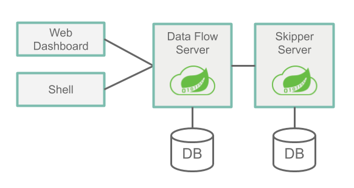
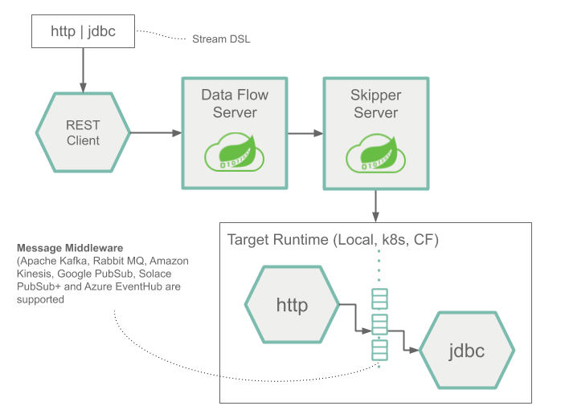
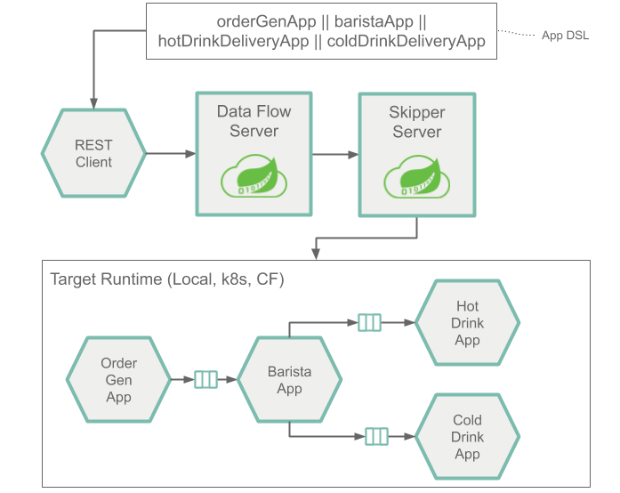
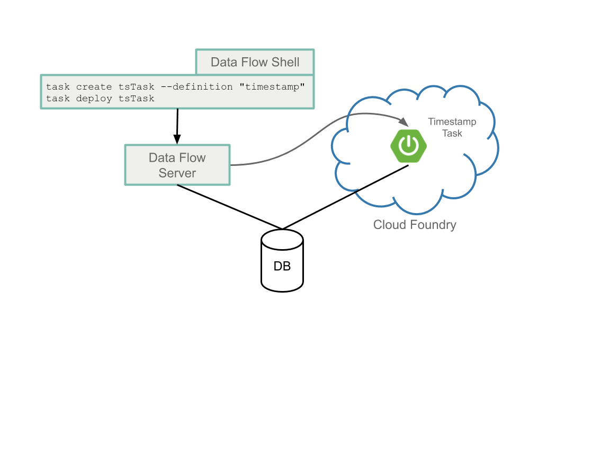
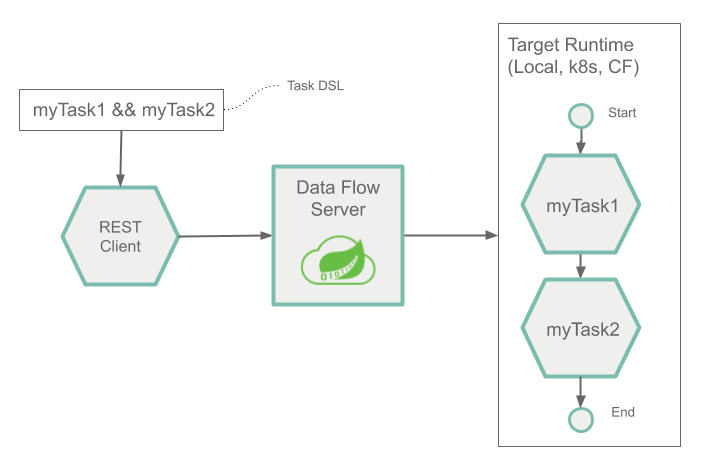

# Architecture

This guide explains the main concepts of Data Flow's architecture:

- Data Flow's Server Components.
- The types of applications the server components can deploy for Streams and Batch Jobs.
- The microservice architecture of the deployed applications and how that is defined by using a DSL.
- The platforms where they are deployed.

Other sections of the guide explain:

- How the Server Components are secured and the tooling used to interact with them.
- Runtime monitoring of Streaming data pipelines.
- The Spring projects that you can use to develop Stream and Batch data pipelines.

## Server Components

Data Flow has two main components:

- Data Flow Server
- Skipper Server

The main entry point to access Data Flow is through the RESTful API of the Data Flow Server.
The Web Dashboard is served from the Data Flow Server. The Data Flow Server and the Data Flow Shell application both communicate through the web API.

The servers can be run on several platforms: Cloud Foundry, Kubernetes, or on your Local machine.
Each server stores its state in a relational database.

The following image shows a high-level view of the architecture and the paths of communication:



The Data Flow Server is responsible for

- Parsing the Stream and Batch Job definitions based on a Domain Specific Language (DSL - Domain-Specific Language).
- Validating and persisting Stream, Task, and Batch Job definitions.
- Registering artifacts such as .jar and docker images to names used in the DSL.
- Deploying Batch Jobs to one or more platforms.
- Delegating Job scheduling to a platform.
- Querying detailed Task and Batch Job execution history.
- Adding configuration properties to Streams that configure messaging inputs and outputs as well as passing along deployment properties (such as initial number of instances, memory requirements and data partitioning).
- Delegating Stream Deployment to Skipper.
- Auditing actions (such as Stream create, deploy, undeploy and Batch create, launch, delete).
- Providing Stream and Batch Job DSL tab-completion features.

The Skipper Server is responsible for:

- Deploying Streams to one or more platforms.
- Upgrading and rolling back Stream on one or more platforms by using a State Machine based blue/green update strategy.
- Storing the history of each Stream's manifest file (which represents the final description of what applications have been deployed).

### Database

The Data Flow Server and Skipper Server need to have an RDBMS installed.
By default, the servers use an embedded H2 database.
You can configure the servers to use external databases.
The supported databases are H2, HSQLDB, MySQL, Oracle, Postgresql, DB2, and SqlServer.
The schemas are automatically created when each server starts.

### Security

The Data Flow and Skipper Server executable jars use OAuth 2.0 authentication to secure the relevant REST endpoints.
These can be accessed by using either basic authentication or by using OAuth2 access tokens.
For an OAuth provider, we recommend the CloudFoundry User Account and Authentication (UAA) Server, which also provides comprehensive LDAP support. See the [Security Section](https://docs.spring.io/spring-cloud-dataflow/docs/%dataflow-version%/reference/htmlsingle/#configuration-local-security) in the reference guide for more information on configuring security features to your needs.

[[note]]
| By default, the REST endpoints (administration, management, and health) as well as the Dashboard UI do not require authenticated access.

## Application Types

Applications come in two flavors:

- Long-lived applications. There are two types of long-lived applications.

  - Message-driven applications where an unbounded amount of data is consumed or produced through a single input or output (or both).
  - The second is a message-driven application that can have multiple inputs and outputs. It could also be an application that does not use messaging middleware at all.

- Short-lived applications that process a finite set of data and then terminate.
  There are two variations of short-lived applications.

  - The first is a Task that runs your code and records the status of the execution in the Data Flow database.
    It can, optionally, use the Spring Cloud Task framework and need not be a Java application.
    However, the application does need to record its run status in Data Flow's database.
  - The second is an extension of the first that includes the Spring Batch framework as the foundation of performing batch processing.

It is common to write long-lived applications based on the Spring Cloud Stream framework and short-lived applications based on the Spring Cloud Task or Spring Batch frameworks.
There are many guides in the documentation that show you how to use these frameworks in developing data pipelines.
However, you can also write long-lived and short-lived applications that do not use Spring.
They can also be written in other programming languages.

Depending on the runtime, you can package applications in two ways:

- A Spring Boot uber-jar that is can be accessed from a Maven repository, from a file location, or over HTTP.
- A Docker image hosted in a Docker registry.

### Long-lived Applications

Long-lived applications are expected to run continuously.
If the application stops, the platform is responsible for restarting it.

The Spring Cloud Stream framework provides a programming model to simplify the writing of message-driven microservice applications that are connected to a common messaging system.
You can write core business logic that is agnostic to the specific middleware.
The middleware to use is determined by adding a Spring Cloud Stream Binder library as a dependency to the application.
There are binding libraries for the following messaging middleware products:

- [RabbitMQ](https://www.rabbitmq.com)
- [Kafka](https://kafka.apache.org)
- [Kafka Streams](https://kafka.apache.org/documentation/streams/)
- [Amazon Kinesis](https://aws.amazon.com/kinesis/)
- [Google Pub/Sub](https://cloud.google.com/pubsub/docs/)
- [Solace PubSub+](https://solace.com/software/)
- [Azure Event Hubs](https://azure.microsoft.com/en-us/services/event-hubs/)

[[note]]
| The Data Flow server delegates to the Skipper server to deploy long-lived applications.

#### Streams with Sources, Processors and Sinks

Spring Cloud Stream defines the concept of a binding interface that encapsulates in code a message exchange pattern, namely what the applications inputs and outputs are.
Spring Cloud Stream provides several binding interfaces that correspond to the following common message exchange contracts:

- `Source`: Message producer that sends messages to a destination.
- `Sink`: Message consumer that reads messages from a destination.
- `Processor`: The combination of a source and a sink. A processor consumes message from a destination and produces messages to send to another destination.

Applications of these three types are registered with Data Flow by using the `source`, `processor` and `sink` to describe the `type` of the application being registered.

The following example shows the shell syntax for registration of a `http` source (an application that listens for HTTP requests and sends HTTP payload to a destination) and a `log` sink (an application that consumes from a destination and logs the received message):

```
dataflow:>app register --name http --type source --uri maven://org.springframework.cloud.stream.app:http-source-rabbit:1.2.0.RELEASE
Successfully registered application 'source:http'

dataflow:>app register --name log --type sink --uri maven://org.springframework.cloud.stream.app:log-sink-rabbit:1.1.0.RELEASE
Successfully registered application 'sink:log'
```

With `http` and `log` registered with Data Flow, a stream definition can be created by using the Stream Pipeline DSL, which uses a pipes and filters syntax, as the following example shows:

```
dataflow:>stream create --name httpStream --definition "http | log"
```

The pipe symbol in `http | log` represents the connection of the source output to the sink input.
Data Flow sets the appropriate properties when deploying the stream so that the `source` can communicate with the `sink` over the messaging middleware.

#### Streams with Multiple Inputs and Outputs

Sources, Sink, and Processors all have a single output, a single input, or both.
This is what makes it possible for Data Flow to set application properties that pair an output destination to an input destination.
However, a message processing application could have more than one input or output destination.
Spring Cloud Stream supports this by letting you define a custom binding interface.

To define a stream that contains an application with multiple inputs, you must register the application by using the `app` type instead of the `source`, `sink`, or `processor` types.
The stream definition uses the Stream Application DSL, which replaces the single pipe symbol (`|`) with the double pipe symbol (`||`).
Think of `||` as meaning 'in parallel', with no implied connection between the applications.

The following example shows a fictional 'orderStream':

```
dataflow:> stream create --definition "orderGeneratorApp || baristaApp || hotDrinkDeliveryApp || coldDrinkDeliveryApp" --name orderStream
```

When you define a Stream by using the `|` symbol, Data Flow can configure each application in the stream to communicate with its neighboring application in the DSL, since there is always one output paired to one input.
When you use the `||` symbol, you must provide configuration properties that pair together the multiple output and input destinations.

[[note]]
| You can also create a stream with a single application by using the Stream Application DSL as well as deploying an application that does not use messaging middleware.

These examples give you a general sense of the long-lived application types.
Additional guides go into more detail on how to develop, test, and register long-lived applications and how to deploy them.

The next major section discusses the runtime architecture of the deployed stream.

<!-- **TODO This should be a link. I'd add it, but I can't figure out the order of this documentation, given that this file doesn't seem to be linked into the documentation. ** -->

### Short-lived Applications

Short-lived applications run for a period of time (often minutes to hours) and then terminate.
Their runs may be based on a schedule (for example, execute at 6pm every weekday) or in response to an event (for example, a file being put in an FTP server).

The Spring Cloud Task framework lets you develop a short-lived microservice that records the life cycle events (such as the start time, end time and the exit code) of a short lived application.

A task application is registered with Data Flow using the name `task` to describe the type of application.

The following example shows the shell syntax for registering a `timestamp` task (an application that prints the current time and exits):

```
dataflow:> app register --name timestamp --type task --uri maven://org.springframework.cloud.task.app:timestamp-task:2.1.0.RELEASE
```

The task definition is created by referencing the name of the task, as the following example shows:

```
dataflow:> task create tsTask --definition "timestamp"
```

The Spring Batch framework is probably what comes to mind for Spring developers who write short-lived applications.
Spring Batch provides a much richer set of functionality than Spring Cloud Task and is recommended when processing large volumes of data.
A use case might be to read many CSV files, transform each row of data, and write each transformed row to a database.
Spring Batch provides its own database schema with a much more rich set of information about the execution of a Spring Batch job.
Spring Cloud Task is integrated with Spring Batch so that, if a Spring Cloud Task application defined a Spring Batch Job, a link between the Spring Cloud Task and Spring Cloud Batch run tables is created.

Tasks that use Spring Batch are registered and created in the same way as shown previously.

[[note]]
| The Spring Cloud Data Flow server launches the task to the platform.

#### Composed Tasks

Spring Cloud Data Flow lets a user create a directed graph, where each node of the graph is a task application.

This is done by using the Composed Task Domain Specific Language for composed tasks.
There are several symbols in the Composed Task DSL that determine the overall flow.
The [reference guide](http://docs.spring.io/spring-cloud-dataflow/docs/%dataflow-version%/reference/htmlsingle/##_composed_tasks_dsl) goes into detail. The following example shows how the double ampersand symbol (`&&`) is used for conditional execution:

```
dataflow:> task create simpleComposedTask --definition "task1 && task2"
```

The DSL expression (`task1 && task2`) means that `task2` is launched only if `task1` has executed successfully.
The graph of tasks are run through a task application called the _Composed Task Runner_.

Additional guides will go into more detail on how to develop, test, and register short-lived applications and how to deploy them.

## Prebuilt Applications

To kick start your development, you can use many pre-built applications to integrate with common data sources and sinks.
For example, you can use a `cassandra` sink that writes data to Cassandra and a `groovy-transform` processor that transforms the incoming data by using a Groovy script.

The installation instructions show how to register these applications with Spring Cloud Data Flow.

You can find more information on pre-built applications in the [concepts guide](%currentPath%/concepts/).

## Microservice Architectural Style

The Data Flow and Skipper servers deploy Streams and Composed Batch Jobs to the platform as a collection of microservice applications, each running in their own process.
Each microservice application can be scaled up or down independently of the other, and each has its own versioning lifecycle.
Skippers lets you independently upgrade or roll back each application in a stream at runtime.

When using Spring Cloud Stream and Spring Cloud Task, each microservice application builds upon Spring Boot as the foundational library.
This gives all microservice applications functionality, such as health checks, security, configurable logging, monitoring, and management functionality, as well as executable JAR packaging.

It is important to emphasize that these microservice applications are "just apps" that you can run for yourself by using `java -jar` and passing in appropriate configuration properties.
Creating your own microservice application for data processing is similar to creating other Spring Boot applications. You can start by using the Spring Initializr web site to create the basic scaffolding of either a Stream-based or a Task-based microservice.

In addition to passing the appropriate application properties to each applications, the Data Flow and Skipper servers are responsible for preparing the target platform’s infrastructure.
For example, in Cloud Foundry, it would bind specified services to the applications. For Kubernetes, it would create the deployment and service resources.

The Data Flow Server helps simplify the deployment of multiple related applications onto a target runtime, setting up necessary input and output topics, partitions, and metrics functionality.
However, you can also opt to deploy each of the microservice applications manually and not use Data Flow or Skipper at all.
This approach might be more appropriate to start out with for small scale deployments, gradually adopting the convenience and consistency of Data Flow as you develop more applications.
Manual deployment of Stream and Task-based microservices is also a useful educational exercise that can help you better understand some of the automatic application configuration and platform targeting steps that the Data Flow Server provides.
The Stream and Batch developer guides follow this approach.

#### Comparison to Other Architectures

Spring Cloud Data Flow’s architectural style is different than other Stream and Batch processing platforms.
For example in Apache Spark, Apache Flink, and Google Cloud Dataflow, applications run on a dedicated compute engine cluster.
The nature of the compute engine gives these platforms a richer environment for performing complex calculations on the data as compared to Spring Cloud Data Flow, but it introduces the complexity of another execution environment that is often not needed when creating data-centric applications.
That does not mean that you cannot do real-time data computations when you use Spring Cloud Data Flow.
For example, you can develop applications that use the Kafka Streams API that time-sliding-window and moving-average functionality as well as joins of the incoming messages against sets of reference data.

A benefit of this approach is that we can delegate to popular platforms as the execution runtime.
Data Flow can benefit from their feature set (resilience, scalability) as well as the knowledge you may already have about those platforms as you maybe using them for other purposes.
This reduces the cognitive distance for creating and managing data-centric applications as many of the same skills used for deploying other end-user/web applications are applicable.

### Streams

The following image shows the runtime architecture of a simple stream:



The Stream DSL is sent by `POST` to the Data Flow Server. Based on the mapping of DSL application names to Maven and Docker artifacts, the `http` source and `jdbc` sink applications are deployed by Skipper to the target platform.
Data that is posted to the HTTP application is then stored in a database.

[[note]]
| The `http` source and `jdbc` sink applications are running on the specified platform and have no connection to the Data Flow or Skipper server.

The runtime architecture of a stream consisting of applications that can have multiple inputs and outputs is shown below.



Architecturally, it is the same as when using `Source`, `Sink` or `Processor` applications.
The Stream Application DSL to define this architecture uses the double pipe symbol (`||`) instead of the single pipe (`|`) symbol.
Also, when you deploy this stream, you must provide more information that describes how to connect each application to another by using the messaging system.

### Tasks and Batch Jobs

The following image shows the runtime architecture for a Task and a Spring Batch Job:



### Composed Tasks

The following image shows the runtime architecture for a composed task:



## Platforms

You can deploy the Spring Cloud Data Flow Server and the Skipper Server on Cloud Foundry, Kubernetes, and your local Machine.

You can also deploy the applications that are deployed by these servers to multiple platforms:

- Local: Can deploy to the local machine, Cloud Foundry, or Kubernetes.
- Cloud Foundry: Can deploy to Cloud Foundry or Kubernetes.
- Kubernetes: Can deploy to Kubernetes or Cloud Foundry.

The most common architecture is to install the Data Flow and Skipper server on the same platform where you deploy your applications.
You can also deploy to multiple Cloud Foundry org, space, and foundations and multiple Kubernetes Clusters.

There are community implementations that let you deploy to other platforms, namely [HashiCorp Nomad](https://github.com/donovanmuller/spring-cloud-dataflow-server-nomad), [Red Hat OpenShift](https://github.com/donovanmuller/spring-cloud-dataflow-server-openshift), and [Apache Mesos](https://github.com/trustedchoice/spring-cloud-dataflow-server-mesos).

<!--IMPORTANT-->

The local server is supported in production for Task deployment as a replacement for the Spring Batch Admin project. The local server is not supported in production for Stream deployments.

<!--END_IMPORTANT-->
