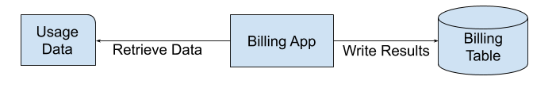
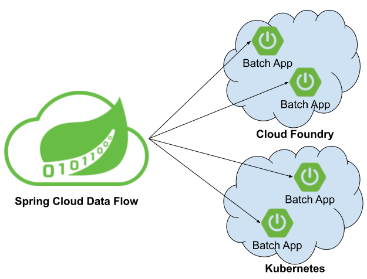

# What is Batch Processing

Batch processing, is defined as the processing of a finite amount of data without interaction or interruption.
Applications that implement batch processing are referred to as ephemeral or short lived apps.
An example of a batch process would be a billing application.

This application runs nightly reading the customer usage data from flat file, generating pricing information for those records and inserting the billing information into a billing table.
Once all of the usage data has been read, priced and the results inserted into the billing table, the app terminates.

That sounds pretty simple, but we have to think about what happens if the batch processing app fails four hours into a six hour run because the database ran out of table space.
Once more table space has been added, we don't want restart the processing from the very beginning. So billing application needs to have the ability to restart from where we left off.

## Spring Batch

In the previous section we expressed the minimum requirements for our batch billing application.
But before we start coding the restartability feature, the reader and writers, lets take a look at Spring Batch.
Spring Batch provides reusable functions that are essential in processing large volumes of records, including logging/tracing, transaction management, job processing statistics, job restart, skip, and resource management.
Out of the box Spring Batch handles `Batch Job` restartability as well as providing us a `FlatFileItemReader` and a `JdbcBatchItemWriter` so we don't have to write that boiler plate code.
This way we can focus on the business logic of pricing the usage data.

## Running Batch Apps in the Cloud

We can now see how Spring Batch can simplify our life when writing batch application, but how to run a batch application in the cloud?
Both Cloud Foundry and Kubernetes support the concept of running ephemeral (short lived) apps on their platforms.
Cloud Foundry refers to ephemeral apps as tasks and Kubernetes refers to them as Jobs.
But to run an ephemeral app in the cloud we need to have some basic features:

- Record when the application started and ended
- Record the exit code of the application
- Record the exit message or the error message returned from the application.
- Have the capability to prevent an application from running if it is already running
- Have the ability to notify other apps that the application has reached certain stages of processing.

That sounds like a lot of work, but don't worry Spring Cloud Task does all this for you and more.
Spring Cloud Task allows a user to develop and run short lived microservices locally or in the cloud.
All you have to do is add the `@EnableTask` annotation.

## Orchestrating Batch apps

Once you have written your batch application using Spring Batch and Spring Cloud Task how do we orchestrate the launching of the application?
This is where Spring Cloud Data Flow can help. Spring Cloud Data Flow allows a user to launch a batch application via an ad-hoc request or a batch-job scheduler.
Moreover you can launch your batch applications on the following platforms:

- Cloud Foundry
- Kubernetes
- local server

Spring Cloud Dataflow allows you to launch or schedule the launch of your batch app via the UI, a RESTful api, or the Spring Cloud Data Flow Shell.

## Next Steps

If your interested in writing and deploying your first batch processing application, take a look at our [Batch Developer Guides](%currentPath%/batch-developer-guides/).
