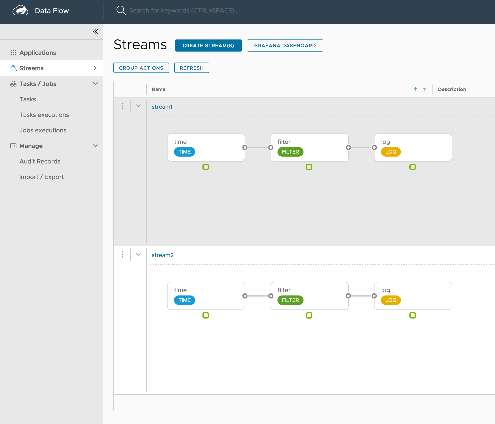
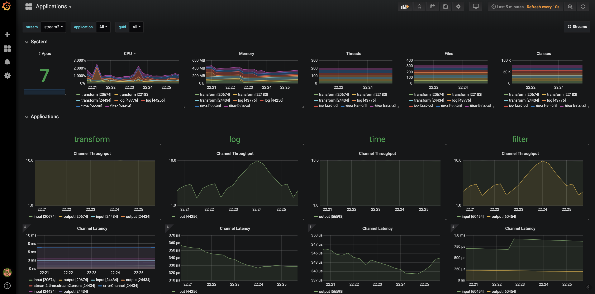
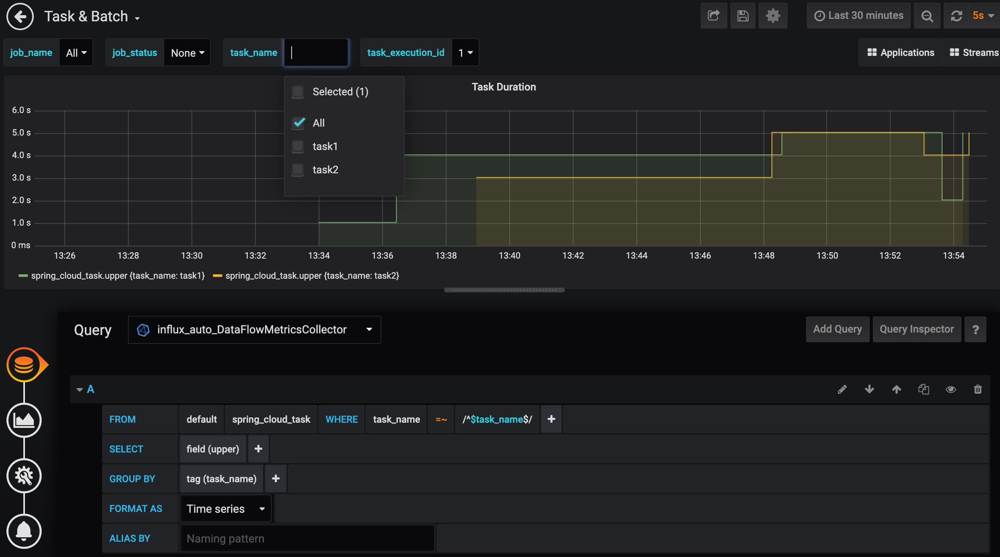
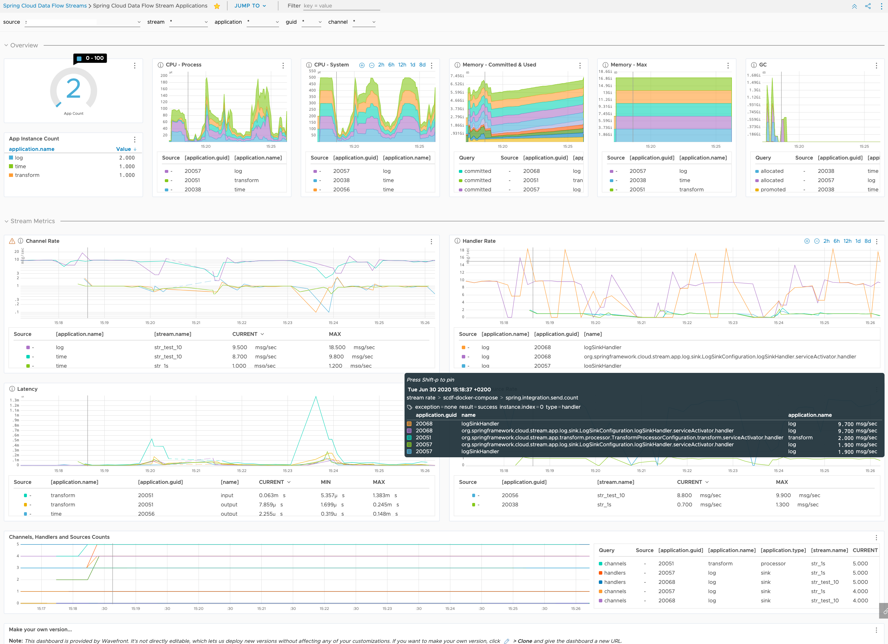

# Monitoring

The Data Flow metrics architecture is designed around the Micrometer library, which is a vendor-neutral application metrics facade, supporting the most popular monitoring systems.

The Micrometer instrumentation library powers the delivery of application metrics from Spring Boot and includes metrics for message rates and errors, which is critical to the monitoring of deployed streams.

The prebuilt applications are configured to support two of the most popular monitoring systems, Prometheus, Wavefront and InfluxDB. You can declaratively select which monitoring system to use.

To help you get started, Data Flow provides Grafana and Wavefront dashboards that you can customize for your needs.
You can also opt for the [Wavefront Data Flow Integration Tile](https://www.wavefront.com/integrations/).

Follow the [Stream Monitoring Feature Guide](%currentPath%/feature-guides/streams/monitoring/) and [Task Monitoring Feature Guide](%currentPath%/feature-guides/batch/monitoring/) for detailed information on how to set up the monitoring infrastructure.

The following image shows Data Flow with enabled monitoring and Grafana buttons:

The following image shows the Stream applications view in the Grafana dashboard:

Here's the Tasks & Batch applications view in Grafana dashboard:

Here's Wavefront Stream applications dashboard:

Next: visit the [Stream Monitoring Feature Guide](%currentPath%/feature-guides/streams/monitoring/) and [Task Monitoring Feature Guide](%currentPath%/feature-guides/batch/monitoring/) guides for further information on how to set up the Data Flow monitoring infrastructure.
