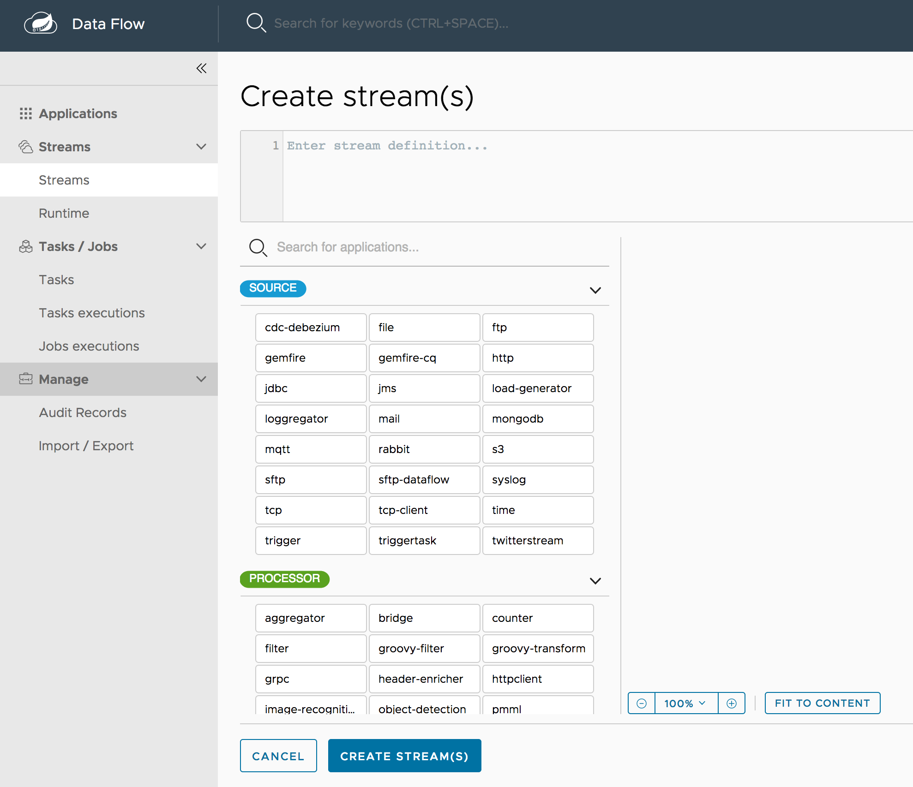
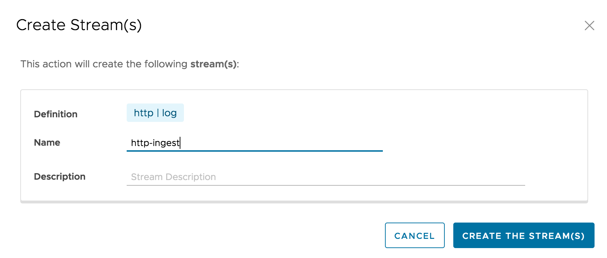
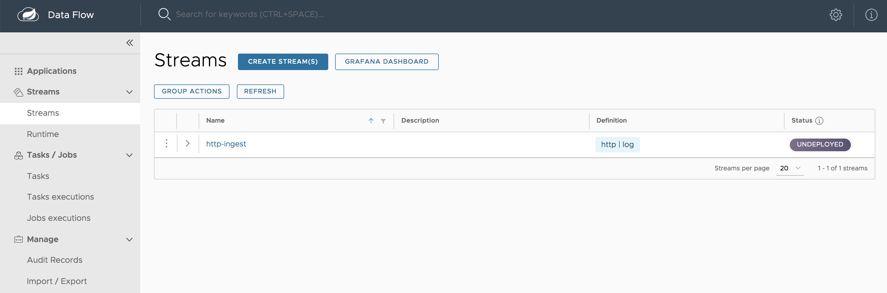
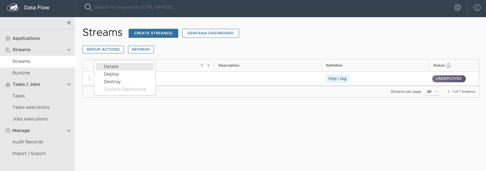
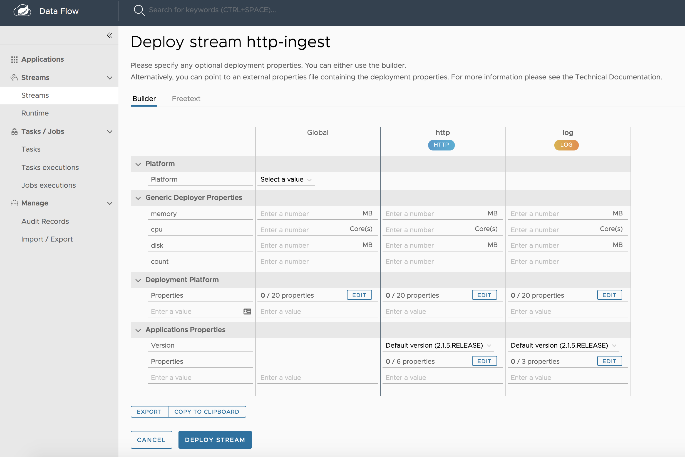

# Introduction

Spring Cloud Data Flow provides over 70 pre-built streaming applications that you can use right away to implement common streaming use cases.
In this guide we will use two of these applications to construct a simple data pipeline that produces data sent from an external http request and consumes that data by logging the payload to the terminal.

Instructions for registering these pre-built applications with Data Flow are provided in the [Installation guide](%currentPath%/installation/).

## Stream DSL overview

Streams can be created using a Domain Specific Language (DSL) using the Shell or the Dashboard as well as programmatically in Java.
The Dashboard also lets you drag and drop applications onto a palate, and connect them visually.
The Dashboard is bi-directional, so visual actions update the DSL and edits to the DSL update the view of the stream.

The DSL is modelled after the Unix pipes and filter syntax.
As an example, the stream DSL `http | log` represents `http` application sending the data it received from a HTTP post to the messaging middleware.  
The `log` application receives the message with that data from the messaging middleware and logs it to the terminal.
Each name in the DSL is associated with an application via the application registration process.
The applications are connected via a `|` symbol representing the messaging middleware that acts as the 'pipe' between the applications.

## Creating the Stream

To create a stream:

1.  In the menu, click **Streams**.

2.  Click the **Create Stream(s)** button.

    The screen changes to the following image:

    

3.  In the text area, type `http | log`.

4.  Click **Create Stream**.

5.  Enter `http-ingest` for the stream name, as shown in the following
    image:

    

6.  Click "Create the stream" button.

    The Definitions page appears.

    

## Deploying a Stream

Now that you have defined a stream, you can deploy it. To do so:

1.  Click the play (deploy) button next to the "`http-ingest`" definition
    that you created in the previous section.

        

        The UI shows the available properties that can be applied to the
        apps in the "`http-ingest`" stream. This example shown in the following
        image uses the defaults:

        

If you are using the local Data Flow Server, add the following deployment property to set the port to avoid a port collision.

**TODO show in UI**

```
stream deploy http-ingest --properties app.http.server.port=9000
```

2.  Click the **Deploy Stream** button.

    The UI returns to the Definitions page.

    The stream is now in "`deploying`" status, and its status becomes
    "`deployed`" when it is finished deploying. You may need to refresh
    your browser to see the updated status.

## Sending data to the Stream

Once the stream is deployed and running, you can now post some `HTTP` events:

```
TODO: Use curl and show successful response
```

## Verifying output

### Local

Once a stream is deployed, you can view its logs. To do so:

1.  Click **Runtime** in the menu.

2.  Click "`http-ingest.log`".

3.  Copy the path in the "`stdout`" text box on the dashboard

4.  In another console window, type the following, replacing
    `/path/from/stdout/textbox/in/dashboard` with the value you copied
    in the previous step:

        $ docker exec -it skipper tail -f /path/from/stdout/textbox/in/dashboard

    The output of the log sink appears in the new window. You will see output as shown below.
    When you have seen enough output from sending http requests, press Ctrl+C to end the `tail` command.

```
log-sink                                 : Happy streaming
```

### Cloud Foundry

TODO

### Kubernetes

TODO

## Deleting a Stream

Now you can delete the stream you created. To do so:

1.  Click **Streams** in the menu.

2.  Click the down chevron on the "`http-ingest`" row.

3.  Click the **Destroy Stream**.

4.  When prompted for confirmation, click **Destroy
    Stream Definition(s)**.

## Updating and Rolling back a Stream

This information can be found in the [Continuous Delivery Basics Guide](%currentpath%/stream-developer-guides/continuous-delivery/cd-basics)

## Stream configuration

**TODO: THIS FEELS LIKE IT SHOULD BE IN ANOTHER SECTION**

The streaming data pipeline can be configured in two distinct ways.

The first is at the stream definition and the second is when deploying the stream.

As an example of configuring an application's property at the stream definition level, instead of using `http | log` as the stream definition, you can add an option that sets the logging level to `WARN` instead of the default `INFO`.
This is done by adding a `--level` option in the stream DSL, much as you would do with unix commands

```
http | log --level=WARN
```

When creating a stream definition in the dashboard, the available application options are presented to you.  
When creating a stream definition in the shell, hitting the `TAB` key will provide auto-complete suggestions.

You can also set application properties at deployment time.
When deploying a stream in the dashboard, you can select the application properties using the 'write' icon as shown below

    

When deploying a stream in the shell, the properties are passed with the prefix `app.<application-name>`.
For example:

```
stream deploy http-ingest --properties "app.http.server.port=9000"
```

It is more common to set platform specific properties when deploying a stream.
These are also available in the 'Deploy Stream Definition' dashboard as shown the previous picture.
There are two categories of platform properties, those that are common across all platforms (memory, CPU, disk, and initial count) and those that are specific to the platform.

When using the shell, the common platform deployment properties need to be prefixed with `deployer.<application-name>`.
For example:

```
stream deploy http-ingest --properties "deployer.log.memory=2048m"
```

To set specific platform properties, use the prefix `deployer.<application-name>.<platform-name>` where platform name is `local`, `cloudfoundry`, or `kubernetes`

For example:

```
stream deploy http-ingest --properties "deployer.log.local.javaOpts=-Xmx2048m -Dtest=foo
```

**TODO: Need a reference to available properties, perhaps point to the reference guide**
