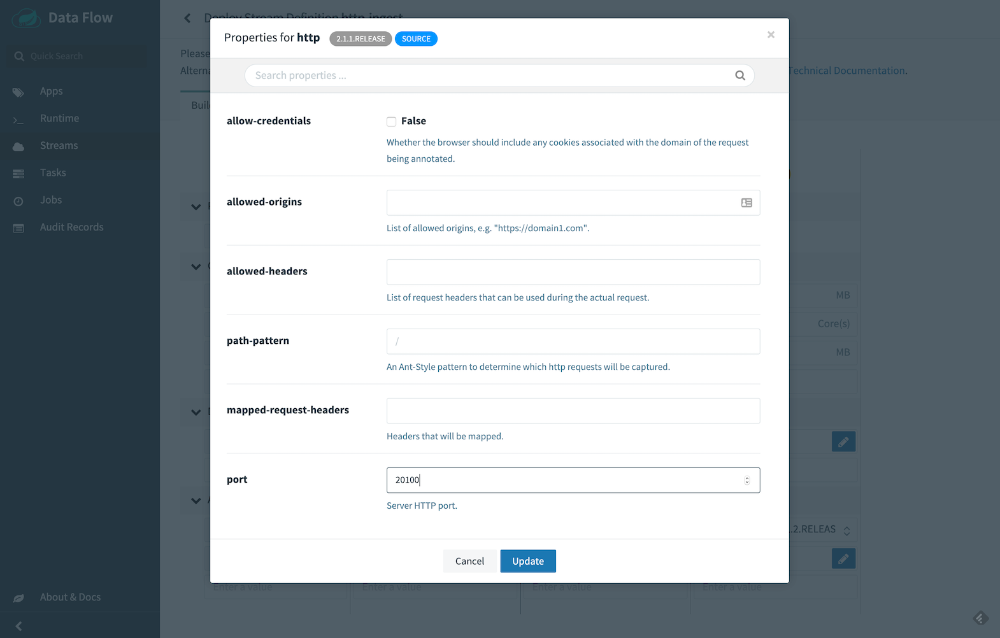

# Getting Started with Stream Processing

Spring Cloud Data Flow provides over 70 prebuilt streaming applications that you can use right away to implement common streaming use cases.
In this guide, we use two of these applications to construct a simple data pipeline that produces data sent from an external HTTP request and consumes that data by logging the payload to the terminal.

The [Installation guide](%currentPath%/installation/) includes instructions for registering these prebuilt applications with Data Flow.

## Stream DSL overview

You can create streams by using a Domain Specific Language (DSL) through the shell or the dashboard as well as programmatically in Java.
The dashboard also lets you drag and drop applications onto a palette and connect them visually.
The dashboard is bi-directional, so visual actions update the DSL.
Similarly, edits to the DSL update the view of the stream.

The DSL is modeled after the Unix pipes and filter syntax.
As an example, a stream DSL defined as `http | log` represents an `http` application sending the data it received from an HTTP post to the messaging middleware.  
The `log` application receives the message with that data from the messaging middleware and logs it to the terminal.
Each name in the DSL is associated with an application through the application registration process.
The applications are connected through a `|` symbol that represents the messaging middleware, which acts as the "pipe" between the applications.

The following diagram shows the Stream processing life cycle:


## Creating the Stream

To create a stream:

1.  In the menu, click **Streams**.

2.  Click the **Create Stream(s)** button.

    The screen changes to the following image:

    

3.  In the text area, type `http | log`.

4.  Click **Create Stream**.

5.  Enter `http-ingest` for the stream name, as follows:

    

6.  Click the **Create the stream** button.

    The Definitions page appears.

    

## Deploying a Stream

Now that you have defined a stream, you can deploy it. To do so:

1.  Click the play (deploy) button next to the `http-ingest` definition
    that you created in the previous section.
    

    The UI shows the available properties that you can apply to the
    apps in the `http-ingest` stream. This example shown in the following
    image uses the defaults:

    

<!--NOTE-->

If you use the local Data Flow Server, add the following deployment property to set the port to avoid a port collision:



<!--END_NOTE-->

<!--NOTE-->

If deploying Spring Cloud Data Flow to Kubernetes, set the `kubernetes.createLoadBalancer` deployment property to `true` on the `http` source application to expose the service externally, as follows:


<!--END_NOTE-->

2.  Click the **Deploy Stream** button.

    The UI returns to the Definitions page.

    The stream is now in `deploying` status, and its status becomes
    `deployed` when it has finished deploying. You may need to refresh
    your browser to see the updated status.

## Verifying Output

Once your application is deployed, you can verify its output. How to do so depends on where you run your application:

- [Local](#local)
- [Cloud Foundry](#cloud-foundry)
- [Kubernetes](#kubernetes)

### Local

This section details how to verify output when your application runs on a local server.

#### Test Data

Once the stream is deployed and running, you can post some data. You can use the following curl command to do so:

```bash
curl http://localhost:20100 -H "Content-type: text/plain" -d "Happy streaming"
```

#### Results

Once a stream is deployed, you can view its logs. To do so:

1.  Click **Runtime** in the menu.

2.  Click `http-ingest.log`.

3.  Copy the path in the `stdout` text box on the dashboard

4.  In another console window, type the following, replacing
    `/path/from/stdout/textbox/in/dashboard` with the value you copied
    in the previous step:

        $ docker exec -it skipper tail -f /path/from/stdout/textbox/in/dashboard

    The output of the log sink appears in the new window. You should see the output shown below.

```bash
log-sink                                 : Happy streaming
```

When you have seen enough output from sending http requests, press Ctrl+C to end the `tail` command.

### Cloud Foundry

This section details how to verify output when your application runs on Cloud Foundry.

#### Test Data

Once the stream is deployed and running in Cloud Foundry, you can post some data. You can use the following curl command to do so:

```bash
curl http://http-ingest-314-log-v1.cfapps.io -H "Content-type: text/plain" -d "Happy streaming"
```

#### Results

Now you can list the running applications again and see your
applications in the list, as follows:

    $ cf apps                                                                                                                                                                                                                                         [1h] ✭
    Getting apps in org ORG / space SPACE as email@pivotal.io...

    name                         requested state   instances   memory   disk   urls
    http-ingest-314-log-v1       started           1/1         1G       1G     http-ingest-314-log-v1.cfapps.io
    http-ingest-314-http-v1      started           1/1         1G       1G     http-ingest-314-http-v1.cfapps.io
    skipper-server               started           1/1         1G       1G     skipper-server.cfapps.io
    dataflow-server              started           1/1         1G       1G     dataflow-server.cfapps.io

Now you can verify the logs, as follows:

```bash
cf logs http-ingest-314-log-v1
...
...
2017-11-20T15:39:43.76-0800 [APP/PROC/WEB/0] OUT 2017-11-20 23:39:43.761  INFO 12 --- [ http-ingest-314.ingest-314-1] log-sink                                 : Happy streaming
```

### Kubernetes

This section details how to verify output when your application runs on Kubernetes.

Get the HTTP service URL by running a command.

If deploying to a cluster that supports a load balancer, you can determine the HTTP service address by running the following command:

```bash
export SERVICE_URL="$(kubectl get svc --namespace default http-ingest-http-v1 -o jsonpath='{.status.loadBalancer.ingress[0].ip}'):8080"
```

It may take a few minutes for the LoadBalancer IP to be available.
You can watch the status of the server by running `kubectl get svc -w http-ingest-http-v1`

If you use Minikube, you can use the following command to get the URL of the server:

```bash
export SERVICE_URL=$(minikube service --url test-http-v1)
```

You can view the HTTP URL of the application by typing the following:

`echo $SERVICE_URL`

#### Test Data

Once the stream is deployed and running in Kubernetes, you can now post some data. You can use the following curl command to do so:

```bash
curl $SERVICE_URL -H "Content-type: text/plain" -d "Happy streaming"
```

#### Results

The results should be similar to the following example:

```bash
kubectl get pods
NAME                              READY     STATUS    RESTARTS   AGE
http-ingest-log-v1-0-2k4r8          1/1       Running   0          2m
http-ingest-http-v1-qhdqq           1/1       Running   0          2m
mysql-777890292-z0dsw               1/1       Running   0          49m
rabbitmq-317767540-2qzrr            1/1       Running   0          49m
scdf-server-2734071167-bjd3g        1/1       Running   0          12m
skipper-2408247821-50z31            1/1       Running   0          15m
```

Now you can verify the logs, as follows:

```bash
kubectl logs -f http-ingest-log-v1-0-2k4r8
...
...
2017-10-30 22:59:04.966  INFO 1 --- [ http-ingest.http.http-ingest-1] log-sink                                 : Happy streaming
```

## Deleting a Stream

Now you can delete the stream you created. To do so:

1.  Click **Streams** in the menu.

2.  Click the down chevron on the `http-ingest` row.

3.  Click **Destroy Stream**.

4.  When prompted for confirmation, click **Destroy Stream Definition(s)**.

## Updating and Rolling back a Stream

You can find this information in the [Continuous Delivery](%currentPath%/stream-developer-guides/continuous-delivery) guide.

## Monitoring

You can find this information in the [Stream Monitoring](%currentPath%/feature-guides/streams/monitoring/) guide.
