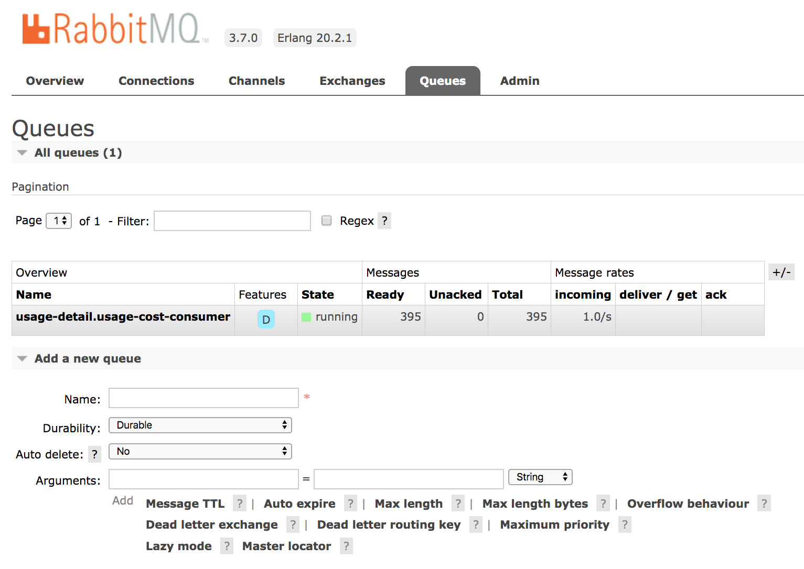
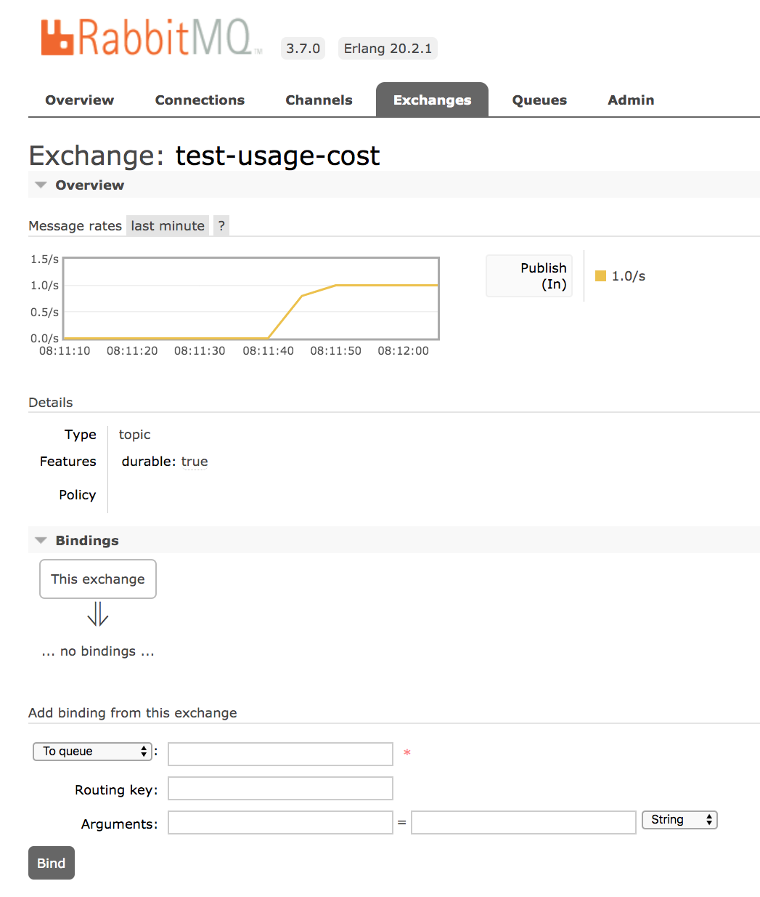
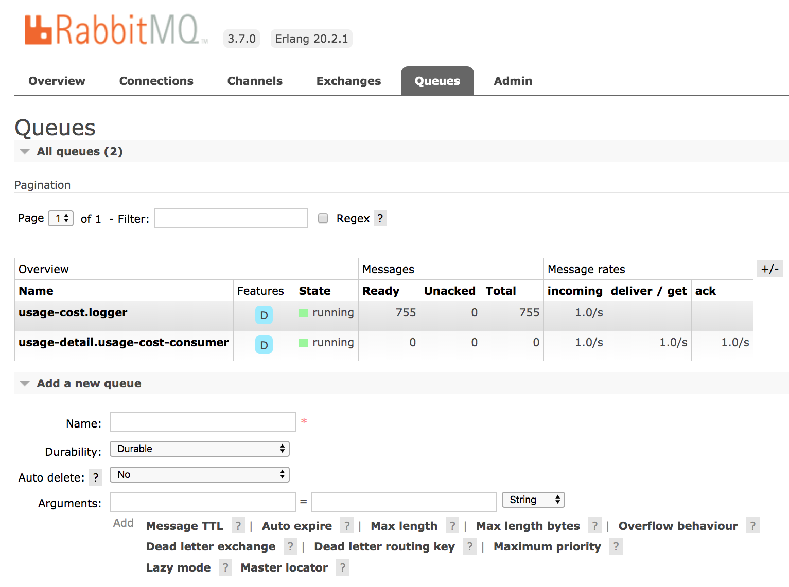

# Stream Processing with RabbitMQ

In this guide, we develop three Spring Boot applications that use Spring Cloud Stream's support for RabbitMQ and deploy them to Cloud Foundry, to Kubernetes, and on your local machine.
In another guide, we [deploy these applications by using Data Flow](%currentPath%/stream-developer-guides/streams/data-flow-stream/).
By deploying the applications manually, you get a better understanding of the steps that Data Flow automates for you.

The following sections describe how to build these applications from scratch.
If you prefer, you can download a zip file containing the sources for these applications, unzip it, and proceed to the [deployment](#deployment) section.

You can [download the project](https://github.com/spring-cloud/spring-cloud-dataflow-samples/blob/master/dataflow-website/stream-developer-guides/streams/standalone-stream-rabbitmq/dist/usage-cost-stream-rabbit.zip?raw=true) that contains all three applications from your browser. You can also use the command line, as the following example shows:

```bash
wget https://github.com/spring-cloud/spring-cloud-dataflow-samples/blob/master/dataflow-website/stream-developer-guides/streams/standalone-stream-rabbitmq/dist/usage-cost-stream-rabbit.zip?raw=true -O usage-cost-stream-rabbit.zip
```

## Development

We create three Spring Cloud Stream applications that communicate by using RabbitMQ.

The scenario is a cell phone company creating bills for its customers.
Each call made by a user has a `duration` and an amount of `data` used during the call.
As part of the process to generate a bill, the raw call data needs to be converted to a cost for the duration of the call and a cost for the amount of data used.

The call is modeled by using the `UsageDetail` class that contains the `duration` of the call and the amount of `data` used during the call.
The bill is modeled by using the `UsageCostDetail` class that contains the cost of the call (`costCall`) and the cost of the data (`costData`). Each class contains an ID (`userId`) to identify the person making the call.

The three streaming applications are as follows:

- The `Source` application named `UsageDetailSender` generates the users' call `duration` and the amount of `data` used for each `userId` and sends a message that contains the `UsageDetail` object as JSON.

- The `Processor` application named `UsageCostProcessor` consumes the `UsageDetail` and computes the cost of the call and the cost of the data per `userId`. It sends the `UsageCostDetail` object as JSON.

- The `Sink` application named `UsageCostLogger` consumes the `UsageCostDetail` object and logs the cost of the call and data.

### Source

In this step, we create the `UsageDetailSender` source.

You can either [download the initialzr generated project directly](https://start.spring.io/starter.zip?type=maven-project&language=java&bootVersion=2.2.1.RELEASE&baseDir=usage-detail-sender-rabbit&groupId=io.spring.dataflow.sample&artifactId=usage-detail-sender-rabbit&name=usage-detail-sender-rabbit&description=Demo%20project%20for%20Spring%20Boot&packageName=io.spring.dataflow.sample.usagedetailsender&packaging=jar&javaVersion=1.8&dependencies=amqp&dependencies=cloud-stream&dependencies=actuator&dependencies=web&dependencies=cloud-connectors) or visit the [Spring Initialzr site](https://start.spring.io/) and follow these instructions:

1. Create a new Maven project with a Group name of `io.spring.dataflow.sample` and an Artifact name of `usage-detail-sender-rabbit`.
1. In the **Dependencies** text box, type `RabbitMQ` to select the RabbitMQ binder dependency.
1. In the **Dependencies** text box, type `Cloud Stream` to select the Spring Cloud Stream dependency.
1. In the **Dependencies** text box, type `Actuator` to select the Spring Boot actuator dependency.
1. If your target platform is `Cloud Foundry`, type `Cloud Connectors` to select the Spring Cloud Connector dependency.
1. Click the **Generate Project** button.

Now you should `unzip` the `usage-detail-sender-rabbit.zip` file and import the project into your favorite IDE.

#### Business Logic

Now we can create the code required for this application. To do so:

1.  Create a `UsageDetail` class in the `io.spring.dataflow.sample.usagedetailsender` package that looks like the contents in [UsageDetail.java](https://github.com/spring-cloud/spring-cloud-dataflow-samples/blob/master/dataflow-website/stream-developer-guides/streams/standalone-stream-rabbitmq/usage-detail-sender/src/main/java/io/spring/dataflow/sample/UsageDetail.java).
    The `UsageDetail` class contains `userId`, `data`, and `duration` properties.
1.  Create the `UsageDetailSender` class in the `io.spring.dataflow.sample.usagedetailsender` package, which resembles the following listing:

```Java
package io.spring.dataflow.sample.usagedetailsender;

import java.util.Random;

import io.spring.dataflow.sample.domain.UsageDetail;

import org.springframework.beans.factory.annotation.Autowired;
import org.springframework.cloud.stream.annotation.EnableBinding;
import org.springframework.cloud.stream.messaging.Source;
import org.springframework.messaging.support.MessageBuilder;
import org.springframework.scheduling.annotation.EnableScheduling;
import org.springframework.scheduling.annotation.Scheduled;
@EnableScheduling
@EnableBinding(Source.class)
public class UsageDetailSender {

  @Autowired
  private Source source;

  private String[] users = {"user1", "user2", "user3", "user4", "user5"};

  @Scheduled(fixedDelay = 1000)
  public void sendEvents() {
    UsageDetail usageDetail = new UsageDetail();

    usageDetail.setUserId(this.users[new Random().nextInt(5)]);
    usageDetail.setDuration(new Random().nextInt(300));
    usageDetail.setData(new Random().nextInt(700));
    this.source.output().send(MessageBuilder.withPayload(usageDetail).build());
  }
}

```

The `@EnableBinding` annotation indicates that you want to bind your application to messaging middleware.
The annotation takes one or more interfaces as a parameter &#151; in this case, the [Source](https://github.com/spring-cloud/spring-cloud-stream/blob/master/spring-cloud-stream/src/main/java/org/springframework/cloud/stream/messaging/Source.java) interface that defines an output channel named `output`.
In the case of RabbitMQ, messages sent to the `output` channel are in turn sent to the RabbitMQ message broker by using a `TopicExchange`.

The `@EnableScheduling` annotation indicates that you want to enable Spring's scheduling capabilities, which invokes methods annotated with `@Scheduled` with the specified `fixedDelay` of `1` second.

The `sendEvents` method constructs a `UsageDetail` object and then sends it to the the output channel by accessing the `Source` object's `output().send()` method.

#### Configuration

When configuring the `source` application, we need to set:

- The `output` binding destination (RabbitMQ exchange) where the producer publishes the data.
- The `requiredGroups` to specify the consumer groups to ensure the message delivery to consumer applications.

In `src/main/resources/application.properties`, you can add the following properties:

```
spring.cloud.stream.bindings.output.destination=usage-detail
spring.cloud.stream.bindings.output.producer.requiredGroups=usage-cost-consumer
```

- The `spring.cloud.stream.bindings.output.destination` property binds the `UsageDetailSender` object's output to the `usage-detail` RabbitMQ exchange.
- The `spring.cloud.stream.bindings.output.producer.requiredGroups` property makes sure to create a durable queue named `usage-detail.usage-cost-consumer`, which consumes from the `usage-detail` RabbitMQ exchange.

##### Durable Queues

By default, the Spring Cloud Stream consumer application creates an `anonymous` auto-delete queue.
This can result in a message not being stored and forwarded by the producer if the producer application started before the consumer application.
Even though the exchange is durable, we need a `durable` queue to be bound to the exchange for the message to be stored for later consumption.
Hence, for guaranteed message delivery, you need a `durable` queue.

To pre-create durable queues and bind them to the exchange, the producer application should set the following property:

```
spring.cloud.stream.bindings.<channelName>.producer.requiredGroups
```

The `requiredGroups` property accepts a comma-separated list of groups to which the producer must ensure message delivery.
When this property is set, a durable queue is created by using the `<exchange>.<requiredGroup>` format.

#### Building

Now we can build the Usage Detail Sender application.

In the `usage-detail-sender` directory, use the following command to build the project using maven:

```bash
./mvnw clean package
```

#### Testing

Spring Cloud Stream provides the `spring-cloud-stream-test-support` dependency to test the Spring Cloud Stream application.
Instead of the `RabbitMQ` binder, the tests use the `Test` binder to trace and test your application's outbound and inbound messages.
The `Test` binder uses a utility class called `MessageCollector`, which stores the messages in-memory.

To unit test the `UsageDetailSender` application, add following code in the `UsageDetailSenderApplicationTests` class:

```java
package io.spring.dataflow.sample.usagedetailsender;

import java.util.concurrent.TimeUnit;

import com.fasterxml.jackson.databind.ObjectMapper;
import io.spring.dataflow.sample.UsageDetail;
import org.json.JSONObject;
import org.junit.Test;
import org.junit.runner.RunWith;

import org.springframework.beans.factory.annotation.Autowired;
import org.springframework.boot.test.context.SpringBootTest;
import org.springframework.cloud.stream.messaging.Source;
import org.springframework.cloud.stream.test.binder.MessageCollector;
import org.springframework.messaging.Message;
import org.springframework.test.context.junit4.SpringRunner;
import org.springframework.util.Assert;

import static org.junit.Assert.assertTrue;

@RunWith(SpringRunner.class)
@SpringBootTest(webEnvironment = SpringBootTest.WebEnvironment.RANDOM_PORT)
public class UsageDetailSenderApplicationTests {

	@Autowired
	private MessageCollector messageCollector;

	@Autowired
	private Source source;

 	@Test
 	public void contextLoads() {
 	}

	@Test
	public void testUsageDetailSender() throws Exception {
		Message message = this.messageCollector.forChannel(this.source.output()).poll(1, TimeUnit.SECONDS);
		String usageDetailJSON = message.getPayload().toString();
		assertTrue(usageDetailJSON.contains("userId"));
		assertTrue(usageDetailJSON.contains("duration"));
		assertTrue(usageDetailJSON.contains("data"));
	}
}
```

- The `contextLoads` test case verifies that the application starts successfully.
- The `testUsageDetailSender` test case uses the `Test` binder's `MessageCollector` to collect the messages sent by the `UsageDetailSender`.

### Processor

In this step, we create the `UsageCostProcessor` processor.

Either [download the initialzr generated project directly](https://start.spring.io/starter.zip?type=maven-project&language=java&bootVersion=2.1.4.RELEASE&baseDir=usage-cost-processor-rabbit&groupId=io.spring.dataflow.sample&artifactId=usage-cost-processor-rabbit&name=usage-cost-processor-rabbit&description=Demo+project+for+Spring+Boot&packageName=io.spring.dataflow.sample.usagecostprocessor&packaging=jar&javaVersion=1.8&inputSearch=&dependencies=amqp&dependencies=cloud-stream&dependencies=actuator&dependencies=web&dependencies=cloud-connectors) or visit the [Spring Initialzr site](https://start.spring.io/) and follow these instructions:

1. Create a new Maven project with a Group name of `io.spring.dataflow.sample` and an Artifact name of `usage-cost-processor-rabbit`.
1. In the **Dependencies** text box, type `Rabbitmq` to select the RabbitMQ binder dependency.
1. In the **Dependencies** text box, type `Cloud Stream` to select the Spring Cloud Stream dependency.
1. In the **Dependencies** text box, type `Actuator` to select the Spring Boot actuator dependency.
1. If your target platform is `Cloud Foundry`, type `Cloud Connectors` to select the Spring Cloud Connector dependency.
1. Click the **Generate Project** button.

Now you should `unzip` the `usage-cost-processor-rabbit.zip` file and import the project into your favorite IDE.

#### Business Logic

Now we can create the code required for this application. To do so:

1.  Create the `UsageDetail` class in the `io.spring.dataflow.sample.usagecostprocessor`. Its contents resemble the contents of [UsageDetail.java](https://github.com/spring-cloud/spring-cloud-dataflow-samples/blob/master/dataflow-website/stream-developer-guides/streams/standalone-stream-rabbitmq/usage-cost-processor/src/main/java/io/spring/dataflow/sample/UsageDetail.java).
    The `UsageDetail` class contains `userId`, `data`, and `duration` properties
1.  Create the `UsageCostDetail` class in the `io.spring.dataflow.sample.usagecostprocessor` package. Its contents resemble the contents of [UsageCostDetail.java](https://github.com/spring-cloud/spring-cloud-dataflow-samples/blob/master/dataflow-website/stream-developer-guides/streams/standalone-stream-rabbitmq/usage-cost-processor/src/main/java/io/spring/dataflow/sample/UsageCostDetail.java).
    The `UsageCostDetail` class contains `userId`, `callCost`, and `dataCost` properties.
1.  Create the `UsageCostProcessor` class in the `io.spring.dataflow.sample.usagecostprocessor` package, which receives the `UsageDetail` message, computes the call and data cost, and sends a `UsageCostDetail` message. The following listing shows the source code:

```java

package io.spring.dataflow.sample.usagecostprocessor;

import io.spring.dataflow.sample.UsageCostDetail;
import io.spring.dataflow.sample.UsageDetail;

import org.springframework.cloud.stream.annotation.EnableBinding;
import org.springframework.cloud.stream.annotation.StreamListener;
import org.springframework.cloud.stream.messaging.Processor;
import org.springframework.messaging.handler.annotation.SendTo;

@EnableBinding(Processor.class)
public class UsageCostProcessor {

	private double ratePerSecond = 0.1;

	private double ratePerMB = 0.05;

	@StreamListener(Processor.INPUT)
	@SendTo(Processor.OUTPUT)
	public UsageCostDetail processUsageCost(UsageDetail usageDetail) {
		UsageCostDetail usageCostDetail = new UsageCostDetail();
		usageCostDetail.setUserId(usageDetail.getUserId());
		usageCostDetail.setCallCost(usageDetail.getDuration() * this.ratePerSecond);
		usageCostDetail.setDataCost(usageDetail.getData() * this.ratePerMB);
		return usageCostDetail;
	}
}
```

In the preceding application, the `@EnableBinding` annotation indicates that you want to bind your application to the messaging middleware. The annotation takes one or more interfaces as a parameter &#151; in this case, the [Processor](https://github.com/spring-cloud/spring-cloud-stream/blob/master/spring-cloud-stream/src/main/java/org/springframework/cloud/stream/messaging/Processor.java) that defines and input and output channel.

The `@StreamListener` annotation binds the application's `input` channel to the `processUsageCost` method by converting the incoming JSON into `UsageDetail` object.

The `@SendTo` annotation sends the `processUsageCost` method's output to the application's `output` channel, which is, in turn, sent to the a RabbitMQ message broker by using a `TopicExchange`.

#### Configuration

When configuring the `processor` application, we need to set the following properties:

- The `input` binding destination (RabbitMQ exchange) where this application is subscribed through an `anonymous` auto-delete or `durable` queue.
- The `group` to specify the consumer group to which this consumer application belongs.
- The `output` binding destination (RabbitMQ exchange) where the producer publishes the data.
- The `requiredGroups` to specify the consumer groups to ensure the message delivery guarantee.

In `src/main/resources/application.properties`, you can add the following properties:

```
spring.cloud.stream.bindings.input.destination=usage-detail
spring.cloud.stream.bindings.input.group=usage-cost-consumer
spring.cloud.stream.bindings.output.destination=usage-cost
spring.cloud.stream.bindings.output.producer.requiredGroups=logger
```

- The `spring.cloud.stream.bindings.input.destination` and `spring.cloud.stream.bindings.input.group` properties bind the `UsageCostProcessor` object's `input` to the `usage-detail` RabbitMQ exchange through the `usage-detail.usage-cost-consumer` durable queue.
- The `spring.cloud.stream.bindings.output.destination` property binds the `UsageCostProcessor` object's output to the `usage-cost` RabbitMQ exchange.
- The `spring.cloud.stream.bindings.output.producer.requiredGroups` property makes sure to create a durable queue named `usage-cost.logger`, which consumes from the `usage-cost` RabbitMQ exchange.

There are many configuration options that you can choose to extend/override to achieve the desired runtime behavior when using RabbitMQ as the message broker. The RabbitMQ-specific binder configuration properties are listed in the [RabbitMQ-binder documentation](https://cloud.spring.io/spring-cloud-static/spring-cloud-stream-binder-rabbit/current/reference/html/spring-cloud-stream-binder-rabbit.html#_configuration_options)

#### Building

Now we can build the Usage Cost Processor application.
In the `usage-cost-processor` directory, use the following command to build the project using maven.

```
./mvnw clean package
```

#### Testing

Spring Cloud Stream provides the `spring-cloud-stream-test-support` dependency to test the Spring Cloud Stream application. Instead of the RabbitMQ binder, it uses the `Test` binder to trace and test your application's outbound and inbound messages. The `Test` binder uses a utility class `MessageCollector`, which stores the messages in-memory.

To unit test the `UsageCostProcessor`, add the following code in the `UsageCostProcessorApplicationTests` class:

```java

package io.spring.dataflow.sample.usagecostprocessor;

import java.util.concurrent.TimeUnit;

import org.junit.Test;
import org.junit.runner.RunWith;

import org.springframework.beans.factory.annotation.Autowired;
import org.springframework.boot.test.context.SpringBootTest;
import org.springframework.cloud.stream.messaging.Processor;
import org.springframework.cloud.stream.test.binder.MessageCollector;
import org.springframework.messaging.Message;
import org.springframework.messaging.support.MessageBuilder;
import org.springframework.test.context.junit4.SpringRunner;

import static org.junit.Assert.assertTrue;

@RunWith(SpringRunner.class)
@SpringBootTest
public class UsageCostProcessorApplicationTests {

  @Autowired
  private Processor processor;

  @Autowired
  private MessageCollector messageCollector;

  @Test
  public void contextLoads() {
  }

  @Test
  public void testUsageCostProcessor() throws Exception {
    this.processor.input().send(MessageBuilder.withPayload("{\"userId\":\"user3\",\"duration\":101,\"data\":502}").build());
    Message message = this.messageCollector.forChannel(this.processor.output()).poll(1, TimeUnit.SECONDS);
    assertTrue(message.getPayload().toString().equals("{\"userId\":\"user3\",\"callCost\":10.100000000000001,\"dataCost\":25.1}"));
  }

}

```

- The test case `contextLoads` verifies the application starts successfully.
- The test case `testUsageCostProcessor` uses the `Test` binder's `MessageCollector` to collect the messages from the `UsageCostProcessor` object's `output`.

### Sink

In this step, we create the `UsageCostLogger` sink.

Either [download the initialzr generated project directly](https://start.spring.io/starter.zip?type=maven-project&language=java&bootVersion=2.1.4.RELEASE&baseDir=usage-cost-logger-rabbit&groupId=io.spring.dataflow.sample&artifactId=usage-cost-logger-rabbit&name=usage-cost-logger-rabbit&description=Demo+project+for+Spring+Boot&packageName=io.spring.dataflow.sample.usagecostlogger&packaging=jar&javaVersion=1.8&dependencies=cloud-stream&dependencies=amqp&dependencies=actuator&dependencies=web&dependencies=cloud-connectors) or visit the [Spring Initialzr site](https://start.spring.io/) and follow these instructions:

1. Create a new Maven project with a Group name of `io.spring.dataflow` and an Artifact name of `usage-cost-logger-rabbit`.
1. In the **Dependencies** text box, type `rabbitmq` to select the RabbitMQ binder dependency.
1. In the **Dependencies** text box, type `cloud stream` to select the Spring Cloud Stream dependency.
1. In the **Dependencies** text box, type `Actuator` to select the Spring Boot actuator dependency.
1. If your target platform is `Cloud Foundry`, type `Cloud Connectors` to select the Spring Cloud Connector dependency.
1. Click the **Generate Project** button.

Now you should `unzip` the `usage-cost-logger-rabbit.zip` file and import the project into your favorite IDE.

#### Business Logic

To create the business logic:

1.  Create a `UsageCostDetail` class in the `io.spring.dataflow.sample.sagecostlogger` package. Its contents should resemble the contents of [UsageCostDetail.java](https://github.com/spring-cloud/spring-cloud-dataflow-samples/blob/master/dataflow-website/stream-developer-guides/streams/standalone-stream-rabbitmq/usage-cost-logger/src/main/java/io/spring/dataflow/sample/UsageCostDetail.java).
    The `UsageCostDetail` class contains `userId`, `callCost`, and `dataCost` properties.
1.  Create the `UsageCostLogger` class in the `io.spring.dataflow.sample.usagecostlogger` package, which receives the `UsageCostDetail` message and logs it. The following listing shows the source code:

```java
package io.spring.dataflow.sample.usagecostlogger;

import io.spring.dataflow.sample.UsageCostDetail;
import org.slf4j.Logger;
import org.slf4j.LoggerFactory;

import org.springframework.cloud.stream.annotation.EnableBinding;
import org.springframework.cloud.stream.annotation.StreamListener;
import org.springframework.cloud.stream.messaging.Sink;

@EnableBinding(Sink.class)
public class UsageCostLogger {

	private static final Logger logger = LoggerFactory.getLogger(UsageCostLoggerApplication.class);

	@StreamListener(Sink.INPUT)
	public void process(UsageCostDetail usageCostDetail) {
		logger.info(usageCostDetail.toString());
	}
}
```

In the preceding application, the `@EnableBinding` annotation indicates that you want to bind your application to the messaging middleware. The annotation takes one or more interfaces as a parameter &#151; in this case, the [Sink](https://github.com/spring-cloud/spring-cloud-stream/blob/master/spring-cloud-stream/src/main/java/org/springframework/cloud/stream/messaging/Sink.java) interface that defines an input channel.

The `@StreamListener` annotation binds the application's `input` channel to the `process` method by converting the incoming JSON to a `UsageCostDetail` object.

#### Configuration

When configuring the `sink` application, we need to set:

- The `input` binding destination (RabbitMQ exchange) to which this application is subscribed through an `anonymous` auto-delete or `durable` queue.
- The `group` to specify the consumer group to which this consumer application belongs.

In `src/main/resources/application.properties`, you can add the following properties:

```
spring.cloud.stream.bindings.input.destination=usage-cost
spring.cloud.stream.bindings.input.group=logger
```

The `spring.cloud.stream.bindings.input.destination` and `spring.cloud.stream.bindings.input.group` properties bind the `UsageCostLogger` object's `input` to the `usage-cost` RabbitMQ exchange through the `usage-cost.logger` durable queue.

#### Building

Now we can build the Usage Cost Logger application.
In the `usage-cost-logger` directory, use the following command to build the project with Maven:

```
./mvnw clean package
```

#### Testing

To unit test the `UsageCostLogger`, add the following code in the `UsageCostLoggerApplicationTests` class:

```java
 package io.spring.dataflow.sample.usagecostlogger;

 import io.spring.dataflow.sample.UsageCostDetail;
 import org.junit.Test;
 import org.junit.runner.RunWith;
 import org.mockito.ArgumentCaptor;

 import org.springframework.beans.factory.annotation.Autowired;
 import org.springframework.boot.autoconfigure.EnableAutoConfiguration;
 import org.springframework.boot.test.context.SpringBootTest;
 import org.springframework.cloud.stream.annotation.EnableBinding;
 import org.springframework.cloud.stream.messaging.Sink;
 import org.springframework.context.annotation.Bean;
 import org.springframework.context.annotation.Primary;
 import org.springframework.messaging.support.MessageBuilder;
 import org.springframework.test.context.junit4.SpringRunner;

 import static org.mockito.Mockito.spy;
 import static org.mockito.Mockito.verify;

 @RunWith(SpringRunner.class)
 @SpringBootTest(webEnvironment = SpringBootTest.WebEnvironment.RANDOM_PORT)
 public class UsageCostLoggerApplicationTests {

 	@Autowired
 	protected Sink sink;

 	@Autowired
 	protected UsageCostLogger usageCostLogger;

 	@Test
 	public void contextLoads() {
 	}

 	@Test
 	public void testUsageCostLogger() throws Exception {
 		ArgumentCaptor<UsageCostDetail> captor = ArgumentCaptor.forClass(UsageCostDetail.class);
 		this.sink.input().send(MessageBuilder.withPayload("{\"userId\":\"user3\",\"callCost\":10.100000000000001,\"dataCost\":25.1}").build());
 		verify(this.usageCostLogger).process(captor.capture());
 	}

 	@EnableAutoConfiguration
 	@EnableBinding(Sink.class)
 	static class TestConfig {

 		// Override `UsageCostLogger` bean for spying.
 		@Bean
 		@Primary
 		public UsageCostLogger usageCostLogger() {
 			return spy(new UsageCostLogger());
 		}
 	}
 }

```

- The `contextLoads` test case verifies the application starts successfully.
- The `testUsageCostLogger` test case verifies that the `process` method of `UsageCostLogger` is invoked by using `Mockito`.
  To do this, the static `TestConfig` class overrides the existing `UsageCostLogger` bean to create a mock bean of `UsageCostLogger`.
  Since we are mocking the `UsageCostLogger` bean, the `TestConfig` also explicitly annotates `@EnableBinding` and `@EnableAutoConfiguration`.

## Deployment

In this section, we deploy the applications created earlier to the local machine, Cloud Foundry, and Kubernetes.

When you deploy these three applications (`UsageDetailSender`, `UsageCostProcessor`, and `UsageCostLogger`), the flow of message is as follows:

```
UsageDetailSender -> UsageCostProcessor -> UsageCostLogger
```

The `UsageDetailSender` source application's output is connected to the `UsageCostProcessor` processor application's input.
The `UsageCostProcessor` application's output is connected to the `UsageCostLogger` sink application's input.

When these applications run, the `RabbitMQ` binder binds the applications' output and input boundaries into the corresponding exchanges and queues at RabbitMQ message broker.

### Local

You can run the applications as standalone applications on your `local` environment.

To install and run the `RabbitMQ` docker image, run the following command:

```bash
docker run -d --hostname rabbitmq --name rabbitmq -p 15672:15672 -p 5672:5672 rabbitmq:3.7.14-management
```

Once installed, you can log in to the RabbitMQ management console on your local machine on [http://localhost:15672](http://localhost:15672).
You can use the default account username and password: `guest` and `guest`.

#### Running the `UsageDetailSender` Source

By using the [pre-defined](#configuring-the-usagedetailsender-application) configuration properties(along with a unique server port) for `UsageDetailSender`, you can run the application, as follows:

```
java -jar target/usage-detail-sender-rabbit-0.0.1-SNAPSHOT.jar --server.port=9001 &
```

When this application is running, you can see that the `usage-detail` RabbitMQ exchange is created and the durable queue named `usage-detail.usage-cost-consumer` is bound to this exchange, as the following example shows:


Also, if you click on the `Queues` and check the queue `usage-detail.usage-cost-consumer`, you can see the messages being consumed and stored in this durable queue, as the following example shows:



When configuring the consumer applications for this `Source` application, you can set the `group` binding property to connect to the corresponding durable queue.

[[note]]
| If you do not set the `requiredGroups` property, you can see that there is no `queue` for consuming the messages from the `usage-detail` exchange and, therefore, the messages are lost if the consumer is not up before this application is started.

#### Running the Processor

By using the [pre-defined](#configuring-the-usagecostprocessor-application) configuration properties (along with a unique server port) for `UsageCostProcessor`, you can run the application, as follows:

```
java -jar target/usage-cost-processor-rabbit-0.0.1-SNAPSHOT.jar --server.port=9002 &
```

From the RabbitMQ console, you can see:

- The `UsageCostProcessor` application consumes from the `usage-detail.usage-cost-consumer` durable queue, based on the `spring.cloud.stream.bindings.input.group=usage-cost-consumer` property.
- The `UsageCostProcessor` application produces the `UsageCostDetail` and sends it to the exchange `usage-cost`, based on the `spring.cloud.stream.bindings.output.destination=usage-cost` property.
- The `usage-cost.logger` durable queue is created. It consumes the messages from the `usage-cost` exchange, based on the `spring.cloud.stream.bindings.output.producer.requiredGroups=logger` property.

When this application is running, you can see that the `usage-cost` RabbitMQ exchange is created and the durable queue named `usage-cost.logger` is bound to this exchange, as the following image shows:



Also, if you click on the `Queues` and check the `usage-cost.logger` queue, you can see the messages being consumed and stored in this durable queue, as the following image shows:



#### Running the Sink

By using the [pre-defined](#configuring-the-usagecostlogger-application) configuration properties (along with a unique server port) for `UsageCostLogger`, you can run the application, as follows:

```
java -jar target/usage-cost-logger-rabbit-0.0.1-SNAPSHOT.jar --server.port=9003 &
```

Now you can see that this application logs the usage cost detail it receives from the `usage-cost` RabbitMQ exchange through the `usage-cost.logger` durable queue, as the following example shows:

```
2019-05-08 08:16:46.442  INFO 10769 --- [o6VmGALOP_onw-1] i.s.d.s.u.UsageCostLoggerApplication     : {"userId": "user2", "callCost": "28.3", "dataCost": "29.8" }
2019-05-08 08:16:47.446  INFO 10769 --- [o6VmGALOP_onw-1] i.s.d.s.u.UsageCostLoggerApplication     : {"userId": "user2", "callCost": "12.0", "dataCost": "23.75" }
2019-05-08 08:16:48.451  INFO 10769 --- [o6VmGALOP_onw-1] i.s.d.s.u.UsageCostLoggerApplication     : {"userId": "user4", "callCost": "16.0", "dataCost": "30.05" }
2019-05-08 08:16:49.454  INFO 10769 --- [o6VmGALOP_onw-1] i.s.d.s.u.UsageCostLoggerApplication     : {"userId": "user1", "callCost": "17.7", "dataCost": "18.0" }
```

### Cloud Foundry

This section walks you through how to deploy the `UsageDetailSender`, `UsageCostProcessor`, and `UsageCostLogger` applications on PWS CloudFoundry environment.

#### Creating a RabbitMQ service

To create a RabbitMQ service:

1. Log in to the PWS with your credentials.
1. From the CF market place, create a RabbitMQ service instance that uses the `cloudamqp` service on the `lemur` plan, as follows:

```bash
cf create-service cloudamqp lemur rabbitmq
```

#### Cloud Foundry Deployment

To deploy on Cloud Foundry:

1. Create a CF manifest YAML file named `usage-detail-sender.yml` for the `UsageDetailSender` by using its [configuration properties](#configuring-the-usagedetailsender-application), as follows:

```
applications:
- name: usage-detail-sender
  timeout: 120
  path: ./target/usage-detail-sender-rabbit-0.0.1-SNAPSHOT.jar
  memory: 1G
  buildpack: java_buildpack
  services:
    - rabbitmq
```

Push the `UsageDetailSender` application by using its manifest YAML file, as follows:

```
cf push -f usage-detail-sender.yml
```

Create a CF manifest YAML file named `usage-cost-processor.yml` for the `UsageCostProcessor` by using its [configuration properties](#configuring-the-usagecostprocessor-application), as follows:

```
applications:
- name: usage-cost-processor
  timeout: 120
  path: ./target/usage-cost-processor-rabbit-0.0.1-SNAPSHOT.jar
  memory: 1G
  buildpack: java_buildpack
  services:
    - rabbitmq
```

Push the `UsageCostProcessor` application by using its manifest YAML file, as follows:

```
cf push -f usage-cost-processor.yml
```

Create a CF manifest YAML file named `usage-cost-logger.yml` for the `UsageCostLogger` by using its [configuration properties](#configuring-the-usagecostlogger-application), as follows:

```
applications:
- name: usage-cost-logger
  timeout: 120
  path: ./target/usage-cost-logger-rabbit-0.0.1-SNAPSHOT.jar
  memory: 1G
  buildpack: java_buildpack
  services:
    - rabbitmq
```

Push the `UsageCostLogger` application by using its manifest YAML file, as follows:

```
cf push -f usage-cost-logger.yml
```

You can see the applications running by using the `cf apps` command, as follows:

```
cf apps
```

The following listings shows typical output:

```
name                   requested state   instances   memory   disk   urls
usage-cost-logger      started           1/1         1G       1G     usage-cost-logger.cfapps.io
usage-cost-processor   started           1/1         1G       1G     usage-cost-processor.cfapps.io
usage-detail-sender    started           1/1         1G       1G     usage-detail-sender.cfapps.io
```

```
   2019-05-13T23:23:33.36+0530 [APP/PROC/WEB/0] OUT 2019-05-13 17:53:33.362  INFO 15 --- [e-cost.logger-1] i.s.d.s.u.UsageCostLoggerApplication     : {"userId": "user5", "callCost": "1.0", "dataCost": "12.350000000000001" }
   2019-05-13T23:23:33.46+0530 [APP/PROC/WEB/0] OUT 2019-05-13 17:53:33.467  INFO 15 --- [e-cost.logger-1] i.s.d.s.u.UsageCostLoggerApplication     : {"userId": "user1", "callCost": "19.0", "dataCost": "10.0" }
   2019-05-13T23:23:34.46+0530 [APP/PROC/WEB/0] OUT 2019-05-13 17:53:34.466  INFO 15 --- [e-cost.logger-1] i.s.d.s.u.UsageCostLoggerApplication     : {"userId": "user4", "callCost": "2.2", "dataCost": "5.15" }
   2019-05-13T23:23:35.46+0530 [APP/PROC/WEB/0] OUT 2019-05-13 17:53:35.469  INFO 15 --- [e-cost.logger-1] i.s.d.s.u.UsageCostLoggerApplication     : {"userId": "user3", "callCost": "21.0", "dataCost": "17.3" }
```

### Running on Kubernetes

This section walks you through how to deploy the three Spring Cloud Stream applications on Kubernetes.

#### Setting up the Kubernetes cluster

For this example, we need a running [Kubernetes cluster](%currentPath%/installation/kubernetes/#creating-a-kubernetes-cluster). For this example, we deploy to `minikube`.

##### Verifying Minikube is running

To verify that you have a running Minikube instance, run the following command (show with sample output):

```bash
$minikube status

host: Running
kubelet: Running
apiserver: Running
kubectl: Correctly Configured: pointing to minikube-vm at 192.168.99.100
```

#### Installing RabbitMQ

You can install the RabbitMQ message broker by using the default configuration from Spring Cloud Data Flow.
To do so, run the following command:

```bash
kubectl apply -f https://raw.githubusercontent.com/spring-cloud/spring-cloud-dataflow/%github-tag%/src/kubernetes/rabbitmq/rabbitmq-deployment.yaml \
-f https://raw.githubusercontent.com/spring-cloud/spring-cloud-dataflow/%github-tag%/src/kubernetes/rabbitmq/rabbitmq-svc.yaml
```

#### Building the Docker Images

To build the Docker images, we use the [jib maven plugin](https://github.com/GoogleContainerTools/jib/tree/master/jib-maven-plugin#build-your-image). If you downloaded the [source distribution](#development), the jib plugin is already configured. If you built the apps from scratch, add the following under `plugins` in each `pom.xml` file:

```xml
<plugin>
    <groupId>com.google.cloud.tools</groupId>
    <artifactId>jib-maven-plugin</artifactId>
    <version>0.10.1</version>
    <configuration>
        <from>
            <image>springcloud/openjdk</image>
        </from>
        <to>
            <image>${docker.org}/${project.artifactId}:${docker.version}</image>
        </to>
        <container>
            <useCurrentTimestamp>true</useCurrentTimestamp>
        </container>
    </configuration>
</plugin>
```

Then add the following properties, under `properties`. For this example, we use the following properties:

```xml
<docker.org>springcloudstream</docker.org>
<docker.version>${project.version}</docker.version>
```

Now run the maven build to create the Docker images in the `minikube` docker registry, as follows:

```bash
$ eval $(minikube docker-env)
$./mvnw package jib:dockerBuild
```

[[tip]]
| If you downloaded the project source, the project includes a parent pom file to build all the modules with a single command. Otherwise, run the builds for the source, processor, and sink individually. You need to run `eval $(minikube docker-env)` only once for each terminal session.

#### Deploying the Stream

To deploy the stream, you must first copy and paste the following YAML content and save it to `usage-cost-stream.yaml`

```yaml
kind: Pod
apiVersion: v1
metadata:
  name: usage-detail-sender
  labels:
    app: usage-cost-stream
spec:
  containers:
    - name: usage-detail-sender
      image: springcloudstream/usage-detail-sender-rabbit:0.0.1-SNAPSHOT
      ports:
        - containerPort: 80
          protocol: TCP
      env:
        - name: SPRING_RABBITMQ_ADDRESSES
          value: rabbitmq
        - name: SERVER_PORT
          value: '80'
  restartPolicy: Always

---
kind: Pod
apiVersion: v1
metadata:
  name: usage-cost-processor
  labels:
    app: usage-cost-stream
spec:
  containers:
    - name: usage-cost-processor
      image: springcloudstream/usage-cost-processor-rabbit:0.0.1-SNAPSHOT
      ports:
        - containerPort: 80
          protocol: TCP
      env:
        - name: SPRING_RABBITMQ_ADDRESSES
          value: rabbitmq
        - name: SERVER_PORT
          value: '80'
  restartPolicy: Always

---
kind: Pod
apiVersion: v1
metadata:
  name: usage-cost-logger
  labels:
    app: usage-cost-stream
spec:
  containers:
    - name: usage-cost-logger
      image: springcloudstream/usage-cost-logger-rabbit:0.0.1-SNAPSHOT
      ports:
        - containerPort: 80
          protocol: TCP
      env:
        - name: SPRING_RABBITMQ_ADDRESSES
          value: rabbitmq
        - name: SERVER_PORT
          value: '80'
  restartPolicy: Always
```

Then you can deploy the apps, as follows:

```bash
kubectl apply -f usage-cost-stream.yaml
```

If all is well, you should see the following output:

```
pod/usage-detail-sender created
pod/usage-cost-processor created
pod/usage-cost-logger created
```

The preceding YAML specifies three pod resources, for the source, processor, and sink applications. Each pod has a single container that references the respective docker image.

We set the logical hostname for the RabbitMQ broker for each app to connect to it. Here we use the RabbitMQ service name, `rabbitmq` in this case. We also set the label `app: user-cost-stream` to logically group our apps.

#### Verifying the Deployment

To verify the deployment, use the following command to tail the log for the `usage-cost-logger` sink:

```bash
kubectl logs -f usage-cost-logger
```

You should see messages similar to the following streaming:

```bash
2019-05-02 15:48:18.550  INFO 1 --- [container-0-C-1] i.s.d.s.u.UsageCostLoggerApplication     : {"userId": "Mark", "callCost": "21.1", "dataCost": "26.05" }
2019-05-02 15:48:19.553  INFO 1 --- [container-0-C-1] i.s.d.s.u.UsageCostLoggerApplication     : {"userId": "Ilaya", "callCost": "4.2", "dataCost": "15.75" }
2019-05-02 15:48:20.549  INFO 1 --- [container-0-C-1] i.s.d.s.u.UsageCostLoggerApplication     : {"userId": "Mark", "callCost": "28.400000000000002", "dataCost": "15.0" }
2019-05-02 15:48:21.553  INFO 1 --- [container-0-C-1] i.s.d.s.u.UsageCostLoggerApplication     : {"userId": "Ilaya", "callCost": "16.8", "dataCost": "28.5" }
2019-05-02 15:48:22.551  INFO 1 --- [container-0-C-1] i.s.d.s.u.UsageCostLoggerApplication     : {"userId": "Mark", "callCost": "22.700000000000003", "dataCost": "20.3" }
2019-05-02 15:48:23.556  INFO 1 --- [container-0-C-1] i.s.d.s.u.UsageCostLoggerApplication     : {"userId": "Janne", "callCost": "16.6", "dataCost": "2.6" }
2019-05-02 15:48:24.557  INFO 1 --- [container-0-C-1] i.s.d.s.u.UsageCostLoggerApplication     : {"userId": "Janne", "callCost": "6.7", "dataCost": "1.0" }
2019-05-02 15:48:25.555  INFO 1 --- [container-0-C-1] i.s.d.s.u.UsageCostLoggerApplication     : {"userId": "Glenn", "callCost": "3.7", "dataCost": "2.6500000000000004" }
2019-05-02 15:48:26.557  INFO 1 --- [container-0-C-1] i.s.d.s.u.UsageCostLoggerApplication     : {"userId": "Janne", "callCost": "24.200000000000003", "dataCost": "32.9" }
2019-05-02 15:48:27.556  INFO 1 --- [container-0-C-1] i.s.d.s.u.UsageCostLoggerApplication     : {"userId": "Glenn", "callCost": "19.200000000000003", "dataCost": "7.4" }
2019-05-02 15:48:28.559  INFO 1 --- [container-0-C-1] i.s.d.s.u.UsageCostLoggerApplication     : {"userId": "Sabby", "callCost": "17.7", "dataCost": "27.35" }
2019-05-02 15:48:29.562  INFO 1 --- [container-0-C-1] i.s.d.s.u.UsageCostLoggerApplication     : {"userId": "Ilaya", "callCost": "26.8", "dataCost": "32.45" }
2019-05-02 15:48:30.561  INFO 1 --- [container-0-C-1] i.s.d.s.u.UsageCostLoggerApplication     : {"userId": "Janne", "callCost": "26.5", "dataCost": "33.300000000000004" }
2019-05-02 15:48:31.562  INFO 1 --- [container-0-C-1] i.s.d.s.u.UsageCostLoggerApplication     : {"userId": "Sabby", "callCost": "16.1", "dataCost": "5.0" }
2019-05-02 15:48:32.564  INFO 1 --- [container-0-C-1] i.s.d.s.u.UsageCostLoggerApplication     : {"userId": "Janne", "callCost": "16.3", "dataCost": "23.6" }
2019-05-02 15:48:33.567  INFO 1 --- [container-0-C-1] i.s.d.s.u.UsageCostLoggerApplication     : {"userId": "Ilaya", "callCost": "29.400000000000002", "dataCost": "2.1" }
2019-05-02 15:48:34.567  INFO 1 --- [container-0-C-1] i.s.d.s.u.UsageCostLoggerApplication     : {"userId": "Janne", "callCost": "5.2", "dataCost": "20.200000000000003" }
```

#### Cleaning Up

To delete the stream, we can use the label we created earlier, as follows:

```bash
kubectl delete pod -l app=usage-cost-stream
```

To uninstall RabbitMQ, run the following command:

```bash
kubectl delete all -l app=rabbitmq
```

## What's Next

The [Apache Kafka guide](%currentPath%/stream-developer-guides/streams/standalone-stream-kafka/) shows you how to create the same three applications but with Apache Kafka instead.
Alternatively, you can use Spring Cloud Data Flow to deploy the three applications, as detailed in [Stream Processing using Spring Cloud Data Flow](%currentPath%/stream-developer-guides/streams/data-flow-stream/).
