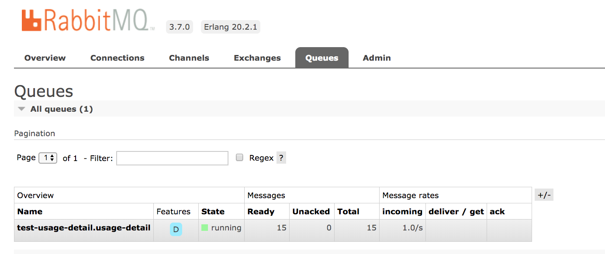
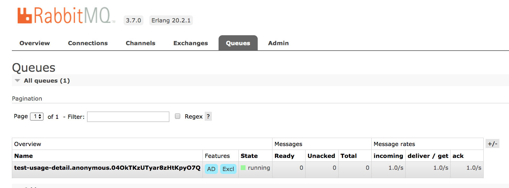
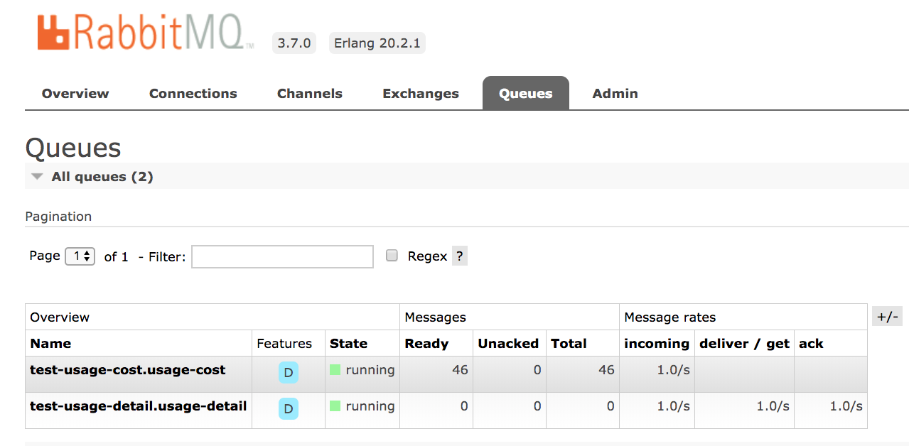
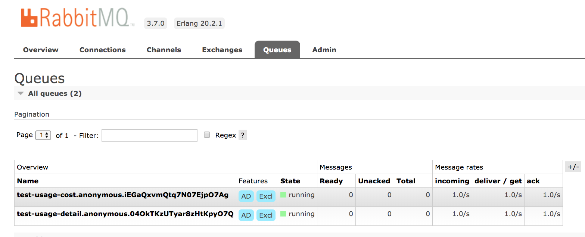

# Stream Processing with RabbitMQ

We will start from Spring initializr and create three Spring Cloud Stream applications by choosing `RabbitMQ` binder.

Lets consider a scenario where the mobile phone service company calculates the users' call and data cost based on the usage.

The streaming application has:

- The `Source` application named `UsageDetailSender` generates the users' `call` and `data` usage per `userId`.

- The `Processor` application named `UsageCostProcessor` computes the call and data usage cost per `userId`.

- The `Sink` application named `UsageCostLogger` logs the usage cost detail in the application log.

The domain models used in these applications are:

- UsageDetail
  - userId
  - data
  - duration
- UsageCostDetail
  - userId
  - callCost
  - dataCost

We will then run them on your local machine, Cloud Foundry and Kubernetes without using Spring Cloud Data Flow.
This provides a foundation to understand the steps that Data Flow will automate for you.

## Development

The following sections describe how to build this stream from scratch. If you prefer, you can [download a zip file containing the completed application](https://github.com/spring-cloud/spring-cloud-dataflow-samples/blob/master/dataflow-website/stream-developer-guides/streams/standalone-stream-rabbitmq/dist/usage-cost-stream-rabbit.zip?raw=true) for the sample stream, unzip it. There is a top level `pom.xml` that will build all three examples, or you can change directory into each example and build them individually. In both cases, the command to build is the same.

```bash
./mvnw clean package
```

You can proceed to the the [deployment](#deployment) section for your platform if you don't want to build the stream from scratch.

### Source

You can develop the `UsageDetailSender` source application by following the steps listed below or [download](https://github.com/spring-cloud/spring-cloud-dataflow-samples/raw/master/dataflow-website/stream-developer-guides/streams/standalone-stream-rabbitmq/dist/usage-detail-sender.zip) the zip file containing the source code of `UsageDetailSender` source application.

Either visit the [Spring Initialzr site](https://start.spring.io/) and follow the instructions below or [download the initialzr generated project directly](https://start.spring.io/starter.zip?fakeusernameremembered=&fakepasswordremembered=&type=maven-project&language=java&bootVersion=2.1.4.RELEASE&baseDir=usage-detail-sender-rabbit&groupId=io.spring.dataflow.sample&artifactId=usage-detail-sender-rabbit&name=usage-detail-sender-rabbit&description=Demo+project+for+Spring+Boot&packageName=io.spring.dataflow.sample.usagedetailsender&packaging=jar&javaVersion=1.8&inputSearch=&style=amqp&style=cloud-stream&style=actuator&style=web).

1. Create a new Maven project with a Group name of `io.spring.dataflow.sample` and an Artifact name of `usage-detail-sender-rabbit`.
1. In the Dependencies text box, type `RabbitMQ` to select the RabbitMQ binder dependency.
1. In the Dependencies text box, type `Cloud Stream` to select the Spring Cloud Stream dependency.
1. In the Dependencies text box, type `Actuator` to select the Spring Boot actuator dependency.
1. Click the Generate Project button.

Now you should `unzip` the `usage-detail-sender-rabbit.zip` file and import the project into your favorite IDE.

#### Business Logic

If you haven't downloaded the completed source example, you will need to perform the following development steps.

1.  Create a `UsageDetail` class in the `io.spring.dataflow.sample` package using your favorite IDE that looks like the contents in [UsageDetail.java](https://github.com/spring-cloud/spring-cloud-dataflow-samples/blob/master/dataflow-website/stream-developer-guides/streams/standalone-stream-rabbitmq/usage-detail-sender/src/main/java/io/spring/dataflow/sample/UsageDetail.java).
    This `UsageDetail` model contains `userId`, `data` and `duration` properties.
1.  Create the `Source` application produces usage detail for each user including call duration, data usage.
    Create the class `UsageDetailSender` in the `io.spring.dataflow.sample.usagedetailsender` package using your favorite IDE that looks like the below content:

    ```java
    package io.spring.dataflow.sample.usagedetailsender;

    import java.util.Random;

    import io.spring.dataflow.sample.UsageDetail;

    import org.springframework.beans.factory.annotation.Autowired;
    import org.springframework.cloud.stream.annotation.EnableBinding;
    import org.springframework.cloud.stream.messaging.Source;
    import org.springframework.messaging.support.MessageBuilder;
    import org.springframework.scheduling.annotation.EnableScheduling;
    import org.springframework.scheduling.annotation.Scheduled;

    @EnableScheduling
    @EnableBinding(Source.class)
    public class UsageDetailSender {

    	@Autowired
    	private Source source;

    	private String[] users = {"user1", "user2", "user3", "user4", "user5"};

    	@Scheduled(fixedDelay = 1000)
    	public void sendEvents() {
    		UsageDetail usageDetail = new UsageDetail();
    		usageDetail.setUserId(this.users[new Random().nextInt(5)]);
    		usageDetail.setDuration(new Random().nextInt(300));
    		usageDetail.setData(new Random().nextInt(700));
    		this.source.output().send(MessageBuilder.withPayload(usageDetail).build());
    	}
    }

    ```

In the above application, the `@EnableBinding` annotation lets you bind your `Source` application's `output` to the configured `RabbitMQ` exchange using the RabbitMQ binder.
The `@EnableScheduling` annotation invokes `sendEvents` with the configured fixed delay `1` second.

#### Building

Now let’s build the Usage Detail Sender application.
In the directory `usage-detail-sender` use the following command to build the project using maven.

```bash
./mvnw clean package
```

#### Testing

Spring Cloud Stream provides `spring-cloud-stream-test-support` dependency to test the standalone Spring Cloud Stream application.
Instead of the `RabbitMQ` binder, you can use the `Test` binder to trace and test your application's outbound/inbound messages.
The `Test` binder uses `MessageCollector` which stores the messages in-memory.

To test this `UsageDetailSender` application, in the class `UsageDetailSenderApplicationTests` you can add following code:

    ```java
    package io.spring.dataflow.sample.usagedetailsender;

    import java.util.concurrent.TimeUnit;

    import com.fasterxml.jackson.databind.ObjectMapper;
    import io.spring.dataflow.sample.UsageDetail;
    import org.json.JSONObject;
    import org.junit.Test;
    import org.junit.runner.RunWith;

    import org.springframework.beans.factory.annotation.Autowired;
    import org.springframework.boot.test.context.SpringBootTest;
    import org.springframework.cloud.stream.messaging.Source;
    import org.springframework.cloud.stream.test.binder.MessageCollector;
    import org.springframework.messaging.Message;
    import org.springframework.test.context.junit4.SpringRunner;
    import org.springframework.util.Assert;

    import static org.junit.Assert.assertTrue;

    @RunWith(SpringRunner.class)
    @SpringBootTest(webEnvironment = SpringBootTest.WebEnvironment.RANDOM_PORT)
    public class UsageDetailSenderApplicationTests {

    	@Autowired
    	private MessageCollector messageCollector;

    	@Autowired
    	private Source source;

    	@Test
    	public void contextLoads() {
    	}

    	@Test
    	public void testUsageDetailSender() throws Exception {
    		Message message = this.messageCollector.forChannel(this.source.output()).poll(1, TimeUnit.SECONDS);
    		String usageDetailJSON = message.getPayload().toString();
    		assertTrue(usageDetailJSON.contains("userId"));
    		assertTrue(usageDetailJSON.contains("duration"));
    		assertTrue(usageDetailJSON.contains("data"));
    	}

    }

    ```

In this case, the `UsageDetailSender`'s `output` is bound to the `Test` binder.

1. The test case `contextLoads` verifies the application starts successfully.
1. The test case `testUsageDetailSender` uses `Test` binder's `MessageCollector` to collect the messages sent by the `UsageDetailSender`.

### Processor

You can develop the processor application by following the steps listed below or [download](https://github.com/spring-cloud/spring-cloud-dataflow-samples/raw/master/dataflow-website/stream-developer-guides/streams/standalone-stream-rabbitmq/dist/usage-cost-processor.zip) the zip file containing the source code of `UsageCostProcessor` processor application.

Either visit the [Spring Initialzr site](https://start.spring.io/) and follow the instructions below or [download the initialzr generated project directly](https://start.spring.io/starter.zip?fakeusernameremembered=&fakepasswordremembered=&type=maven-project&language=java&bootVersion=2.1.4.RELEASE&baseDir=usage-cost-processor-rabbit&groupId=io.spring.dataflow.sample&artifactId=usage-cost-processor-rabbit&name=usage-cost-processor-rabbit&description=Demo+project+for+Spring+Boot&packageName=io.spring.dataflow.sample.usagecostprocessor&packaging=jar&javaVersion=1.8&inputSearch=&style=amqp&style=cloud-stream&style=actuator&style=web).

1. Create a new Maven project with a Group name of `io.spring.dataflow.sample` and an Artifact name of `usage-cost-processor-rabbit`.
1. In the Dependencies text box, type `Rabbitmq` to select the RabbitMQ binder dependency.
1. In the Dependencies text box, type `Cloud Stream` to select the Spring Cloud Stream dependency.
1. In the Dependencies text box, type `Actuator` to select the Spring Boot actuator dependency.
1. Click the Generate Project button.

Now you should `unzip` the `usage-cost-processor-rabbit.zip` file and import the project into your favorite IDE.

#### Business Logic

If you haven't downloaded the completed processor example, you will need to perform the following development steps.

1.  Create a `UsageDetail` class in the `io.spring.dataflow.sample` using your favorite IDE that looks like the contents in [UsageDetail.java](https://github.com/spring-cloud/spring-cloud-dataflow-samples/blob/master/dataflow-website/stream-developer-guides/streams/standalone-stream-rabbitmq/usage-cost-processor/src/main/java/io/spring/dataflow/sample/UsageDetail.java).
    This `UsageDetail` model contains `userId`, `data` and `duration` properties
1.  Create a `UsageCostDetail` class in the `io.spring.dataflow.sample` using using your favorite IDE that looks like the contents in [UsageCostDetail.java](https://github.com/spring-cloud/spring-cloud-dataflow-samples/blob/master/dataflow-website/stream-developer-guides/streams/standalone-stream-rabbitmq/usage-cost-processor/src/main/java/io/spring/dataflow/sample/UsageCostDetail.java).
    This `UsageCostDetail` model contains `userId`, `callCost` and `dataCost` properties.
1.  Create the `Processor` application that receives the `UsageDetail` from the previously created `source`, computes the call/data cost and returning the `UsageCostDetail`.
    In `io.spring.dataflow.sample.usagecostprocessor` package, create a class `UsageCostProcessor` that looks like the content below:

    ```java

    package io.spring.dataflow.sample.usagecostprocessor;

    import io.spring.dataflow.sample.UsageCostDetail;
    import io.spring.dataflow.sample.UsageDetail;

    import org.springframework.cloud.stream.annotation.EnableBinding;
    import org.springframework.cloud.stream.annotation.StreamListener;
    import org.springframework.cloud.stream.messaging.Processor;
    import org.springframework.messaging.handler.annotation.SendTo;

    @EnableBinding(Processor.class)
    public class UsageCostProcessor {

    	private double ratePerSecond = 0.1;

    	private double ratePerMB = 0.05;

    	@StreamListener(Processor.INPUT)
    	@SendTo(Processor.OUTPUT)
    	public UsageCostDetail processUsageCost(UsageDetail usageDetail) {
    		UsageCostDetail usageCostDetail = new UsageCostDetail();
    		usageCostDetail.setUserId(usageDetail.getUserId());
    		usageCostDetail.setCallCost(usageDetail.getDuration() * this.ratePerSecond);
    		usageCostDetail.setDataCost(usageDetail.getData() * this.ratePerMB);
    		return usageCostDetail;
    	}
    }

    ```

In the above application, the `@EnableBinding` annotation lets you bind your `Processor` application's `input` and `output` to the configured `RabbitMQ` exchanges using the RabbitMQ binder.
The annotation `@StreamListener` binds the application's `input` to the `processUsageCost` method by converting the incoming data into `UsageDetail` domain object.
The annotation `@SendTo` sends the `processUsageCost` method's output to the application's `output` which binds to the configured RabbitMQ exchange.

#### Building

Now let's build the Usage Cost Processor application. In the directory `usage-cost-processor` use the following command to build the project using maven.

```
./mvnw clean package
```

#### Testing

To test the `UsageCostProcessor`, you can add the following code that uses `spring-cloud-stream-test-support` dependency to bind the application's `output` and `input` to the `Test` binder:

    ```java

    package io.spring.dataflow.sample.usagecostprocessor;

    import java.util.concurrent.TimeUnit;

    import org.junit.Test;
    import org.junit.runner.RunWith;

    import org.springframework.beans.factory.annotation.Autowired;
    import org.springframework.boot.test.context.SpringBootTest;
    import org.springframework.cloud.stream.messaging.Processor;
    import org.springframework.cloud.stream.test.binder.MessageCollector;
    import org.springframework.messaging.Message;
    import org.springframework.messaging.support.MessageBuilder;
    import org.springframework.test.context.junit4.SpringRunner;

    import static org.junit.Assert.assertTrue;

    @RunWith(SpringRunner.class)
    @SpringBootTest
    public class UsageCostProcessorApplicationTests {

    	@Autowired
    	private Processor processor;

    	@Autowired
    	private MessageCollector messageCollector;

    	@Test
    	public void contextLoads() {
    	}

    	@Test
    	public void testUsageCostProcessor() throws Exception {
    		this.processor.input().send(MessageBuilder.withPayload("{\"userId\":\"user3\",\"duration\":101,\"data\":502}").build());
    		Message message = this.messageCollector.forChannel(this.processor.output()).poll(1, TimeUnit.SECONDS);
    		assertTrue(message.getPayload().toString().equals("{\"userId\":\"user3\",\"callCost\":10.100000000000001,\"dataCost\":25.1}"));
    	}

    }

    ```

1. The test case `contextLoads` verifies the application starts successfully.
1. The test case `testUsageCostProcessor` uses `Test` binder's `MessageCollector` to collect the messages from the `UsageCostProcessor`'s `output`.

### Sink

You can develop the sink application by following the steps listed below or [download](https://github.com/spring-cloud/spring-cloud-dataflow-samples/raw/master/dataflow-website/stream-developer-guides/streams/standalone-stream-rabbitmq/dist/usage-cost-logger.zip) the zip file containing the source code of `UsageCostLogger` sink application.

Either visit the [Spring Initialzr site](https://start.spring.io/) and follow the instructions below or [download the initialzr generated project directly](https://start.spring.io/starter.zip?fakeusernameremembered=&fakepasswordremembered=&type=maven-project&language=java&bootVersion=2.1.4.RELEASE&baseDir=usage-cost-logger-rabbit&groupId=io.spring.dataflow.sample&artifactId=usage-cost-logger-rabbit&name=usage-cost-logger-rabbit&description=Demo+project+for+Spring+Boot&packageName=io.spring.dataflow.sample.usagecostlogger&packaging=jar&javaVersion=1.8&inputSearch=&style=cloud-stream&style=amqp&style=actuator&style=web)

1. Create a new Maven project with a Group name of `io.spring.dataflow` and an Artifact name of `usage-cost-logger-rabbit`.
1. In the Dependencies text box, type `rabbitmq` to select the RabbitMQ binder dependency.
1. In the Dependencies text box, type `cloud stream` to select the Spring Cloud Stream dependency.
1. In the Dependencies text box, type `Actuator` to select the Spring Boot actuator dependency.
1. Click the Generate Project button.

Now you should `unzip` the `usage-cost-logger-rabbit.zip` file and import the project into your favorite IDE.

#### Biz Logic

1.  Create a `UsageCostDetail` class in the `io.spring.dataflow.sample` using using your favorite IDE that looks like the contents in [UsageCostDetail.java](https://github.com/spring-cloud/spring-cloud-dataflow-samples/blob/master/dataflow-website/stream-developer-guides/streams/standalone-stream-rabbitmq/usage-cost-logger/src/main/java/io/spring/dataflow/sample/UsageCostDetail.java).
    This `UsageCostDetail` model contains `userId`, `callCost` and `dataCost` properties.
1.  Create the `Sink` application that receives the `UsageCostDetail` from the previously created `processor` and logs it.
    In `io.spring.dataflow.sample.usagecostlogger` package, create a class `UsageCostLogger` that looks like the content below:

    ```java
    package io.spring.dataflow.sample.usagecostlogger;

    import io.spring.dataflow.sample.UsageCostDetail;
    import org.slf4j.Logger;
    import org.slf4j.LoggerFactory;

    import org.springframework.cloud.stream.annotation.EnableBinding;
    import org.springframework.cloud.stream.annotation.StreamListener;
    import org.springframework.cloud.stream.messaging.Sink;

    @EnableBinding(Sink.class)
    public class UsageCostLogger {

    	private static final Logger logger = LoggerFactory.getLogger(UsageCostLoggerApplication.class);

    	@StreamListener(Sink.INPUT)
    	public void process(UsageCostDetail usageCostDetail) {
    		logger.info(usageCostDetail.toString());
    	}
    }

    ```

In the above application, the `@EnableBinding` annotation lets you bind your `Sink` application's `input` to the configured `RabbitMQ` exchange using the RabbitMQ binder.

#### Building

Now let's build the Usage Cost Logger application. In the directory `usage-cost-logger` use the following command to build the project using maven.

```
./mvnw clean package
```

#### Testing

To test the `UsageCostLogger`, you can add the following code that uses `spring-cloud-stream-test-support` dependency to bind the application's `input` to the `Test` binder:

    ```java

    package io.spring.dataflow.sample.usagecostlogger;

    import io.spring.dataflow.sample.UsageCostDetail;
    import org.junit.Test;
    import org.junit.runner.RunWith;
    import org.mockito.ArgumentCaptor;

    import org.springframework.beans.factory.annotation.Autowired;
    import org.springframework.boot.autoconfigure.EnableAutoConfiguration;
    import org.springframework.boot.test.context.SpringBootTest;
    import org.springframework.cloud.stream.annotation.EnableBinding;
    import org.springframework.cloud.stream.messaging.Sink;
    import org.springframework.context.annotation.Bean;
    import org.springframework.context.annotation.Primary;
    import org.springframework.messaging.support.MessageBuilder;
    import org.springframework.test.context.junit4.SpringRunner;

    import static org.mockito.Mockito.spy;
    import static org.mockito.Mockito.verify;

    @RunWith(SpringRunner.class)
    @SpringBootTest(webEnvironment = SpringBootTest.WebEnvironment.RANDOM_PORT)
    public class UsageCostLoggerApplicationTests {

    	@Autowired
    	protected Sink sink;

    	@Autowired
    	protected UsageCostLogger usageCostLogger;

    	@Test
    	public void contextLoads() {
    	}

    	@Test
    	public void testUsageCostLogger() throws Exception {
    		ArgumentCaptor<UsageCostDetail> captor = ArgumentCaptor.forClass(UsageCostDetail.class);
    		this.sink.input().send(MessageBuilder.withPayload("{\"userId\":\"user3\",\"callCost\":10.100000000000001,\"dataCost\":25.1}").build());
    		verify(this.usageCostLogger).process(captor.capture());
    	}

    	@EnableAutoConfiguration
    	@EnableBinding(Sink.class)
    	static class TestConfig {

    		// Override `UsageCostLogger` bean for spying.
    		@Bean
    		@Primary
    		public UsageCostLogger usageCostLogger() {
    			return spy(new UsageCostLogger());
    		}
    	}
    }

    ```

1.  The test case `contextLoads` verifies the application starts successfully.
1.  The test case `testUsageCostLogger` verifies if the `process` method of `UsageCostLogger` is invoked using `Mockito`.
    To do this, the static class `TestConfig` overrides the existing `UsageCostLogger` bean to create a Mock bean of `UsageCostLogger`.
    Since we are mocking the `UsageCostLogger` bean, the `TestConfig` also annotates `@EnableBinding` and `@EnableAutoConfiguration` explicitly.

## Deployment

In this section we will deploy the apps created above to the local machine, Cloud Foundry and Kubernetes.

When you deploy these three applications (UsageDetailSender, UsageCostProcessor and UsageCostLogger), the flow of message looks like this:

```
UsageDetailSender -> UsageCostProcessor -> UsageCostLogger
```

The source application `UsageDetailSender`'s output is connected to the `UsageCostProcessor` processor application's input.
The `UsageCostProcessor` application's output is connected to the `UsageCostLogger` sink application's input.

Since we use RabbitMQ as the messaging middleware, we have selected Spring Cloud Stream `RabbitMQ` binder for this application.
When these applications are run, the `RabbitMQ` binder binds the applications output/input boundaries into the corresponding destinations (exchanges) at RabbitMQ message broker.

Let's choose our destinations at RabbitMQ:

- UsageDetailSender's output and `UsageCostProcessor`'s input are bound to `test-usage-detail` exchange
- UsageCostProcessor's output and `UsageCostLogger`'s input are bound to `test-usage-cost` exchange.

By default, the Spring Cloud Stream applications that use `RabbitMQ` binder create a durable topic exchange to produce data.
Similarly, the Spring Cloud Stream application with the `RabbitMQ` binder and consumes data creates an anonymous auto-delete queue.
This can result in a message not being stored and forwarded by the producer if the producer application started before the consumer application.
Even though the exchange is durable, there needs to be a durable queue bound to the exchange for the message to be stored for later consumption.

To pre-create durable queues and bind them to the exchange, producer applications should set the property:

```
spring.cloud.stream.bindings.<channelName>.producer.requiredGroups
```

The `requiredGroups` property accepts a comma-separated list of groups to which the producer must ensure message delivery even if they start after it has been created.

To consume from the durable queues, the consumer applications should then specify the property:

```
spring.cloud.stream.bindings.<channelName>.group
```

The `group` property accepts a comma-separated list of groups that should generally match with the `requiredGroups`.

NOTE: Consumer groups are also the means by which multiple instances of a consuming application can participate in a competing consumer relationship with other members of the same consumer group.

### Local

You can run the above applications as standalone applications on your `local` environment.

You can [download](https://www.rabbitmq.com/download.html) and setup `RabbitMQ` on your local.

Once installed, you can login to RabbitMQ management console on your local using on [http://localhost:15672](http://localhost:15672).
You can use the default account username/password: `guest/guest`.

#### Running the Source

We can individually run these custom applications before creating a pipeline using Spring Cloud Data Flow.
To run, we need to explicitly set the Spring Cloud Stream bindings destination property and the server port for accessing the actuator endpoints:

```
spring.cloud.stream.bindings.output.destination=test-usage-detail
server.port=9001
```

In this case, we can use some test RabbitMQ `exchanges` to verify the outbound and inbound messages.
For instance, you can set the `output` binding to a test RabbitMQ exchange `test-usage-detail` and see if the messages get posted to the exchange.
You can run the standalone `UsageDetailSender` source application as,

```
java -jar target/usage-detail-sender-rabbit-0.0.1-SNAPSHOT.jar --spring.cloud.stream.bindings.output.destination=test-usage-detail --server.port=9001 &
```

Now, you can see the messages being sent to the `RabbitMQ` exchange `test-usage-detail` every 1 second in the RabbitMQ management console.


At this point of time, there will be no `queue` for consuming the messages from the `test-usage-detail` exchange.

If you want to ensure message delivery guarantee for the messages published to the `RabbitMQ` exchange `test-usage-detail` from the `UsageDetailSender` source application, you need to setup the `requiredGroups` property to create `durable` queues.

To set this up, you need the property:

```
spring.cloud.stream.bindings.output.producer.requiredGroups=usage-detail
```

You can have a comma separated list of names for the `requiredGroups` property.

When you run your `UsageDetailSender` source application with the `requiredGroups` property:

```
java -jar target/usage-detail-sender-rabbit-0.0.1-SNAPSHOT.jar --spring.cloud.stream.bindings.output.destination=test-usage-detail --server.port=9001 --spring.cloud.stream.bindings.output.producer.requiredGroups=usage-detail &
```

you would see a durable queue created with the name `test-usage-detail.usage-detail` (using the format `<exchange>.<requiredGroup>`) that consumes the messages from the RabbitMQ exchange `test-usage-detail`.



When configuring the consumer applications for this `Source` application, you can set the `group` binding property to connect to the corresponding durable queue.

#### Running the Processor

To run the `UsageCostProcessor` application, you need to set the `input` binding to the test RabbitMQ exchange `test-usage-detail` to receive the `UsageDetail` data and the `output` binding to the test RabbitMQ exchange `test-usage-cost` to send the computed `UsageCostDetail`.
You also need to set the `server.port` to access the actuator endpoints.

```
spring.cloud.stream.bindings.input.destination=test-usage-detail
spring.cloud.stream.bindings.output.destination=test-usage-cost
server.port=9002
```

You can run the standalone `UsageCostProcessor` processor application as,

```
java -jar target/usage-cost-processor-rabbit-0.0.1-SNAPSHOT.jar --spring.cloud.stream.bindings.input.destination=test-usage-detail --spring.cloud.stream.bindings.output.destination=test-usage-cost --server.port=9002 &
```

Now, you can see that the `UsageCostProcessor` application receives the messages from the `RabbitMQ` exchange `test-usage-detail`, processes the cost and send the result to the `test-usage-cost` RabbitMQ exchange.

From the RabbitMQ console:


You can also see that there is an `anonymous` auto-delete queue created that consumes the messages from `test-usage-detail` exchange.
This `anonymous` queue is bound to the `UsageCostProcessor` application's input.

From the RabbitMQ console:



If you want the processor application to consume from the `durable` queue, you need to make use of the `group` bindings property for the `UsageCostProcessor` application - provided you already have set up the `requiredGroups` for the `UsageDetailSender` application above.

```
spring.cloud.stream.bindings.input.group=usage-detail
```

Also, if you want the `UsageCostProcessor` application's output message delivery guarantee, then you need to set the `requiredGroups` for the `output` binding:

```
spring.cloud.stream.bindings.output.producer.requiredGroups=usage-cost
```

Now, you can run the `UsageCostProcessor` application as:

```
java -jar target/usage-cost-processor-rabbit-0.0.1-SNAPSHOT.jar --spring.cloud.stream.bindings.input.destination=test-usage-detail --spring.cloud.stream.bindings.output.destination=test-usage-cost --server.port=9002 --spring.cloud.stream.bindings.input.group=usage-detail --spring.cloud.stream.bindings.output.producer.requiredGroups=usage-cost &
```

From the RabbitMQ console, you can see:

1. The `UsageCostProcessor` application consumes from the durable queue `test-usage-detail.usage-detail` - based on the `spring.cloud.stream.bindings.input.group=usage-detail` property.
1. The `UsageCostProcessor` application produces the `UsageCostDetail` to the exchange `test-usage-cost` - based on the `spring.cloud.stream.bindings.output.destination=test-usage-cost` property
1. Durable queue `test-usage-cost.usage-cost` is created which consumes the messages from the exchange `test-usage-cost` - based on the `spring.cloud.stream.bindings.output.producer.requiredGroups=usage-cost` property



#### Running the Sink

To run the `UsageCostLogger` application you need to set the `input` binding that connects to the RabbitMQ exchange `test-usage-cost` to receive the `UsageCostDetail` from the `UsageCostProcessor` and the `server.port`:

```
spring.cloud.stream.bindings.input.destination=test-usage-cost
server.port=9003
```

You can run the standalone `UsageCostLogger` sink application as,

```
java -jar target/usage-cost-logger-rabbit-0.0.1-SNAPSHOT.jar --spring.cloud.stream.bindings.input.destination=test-usage-cost --server.port=9003 &
```

Now, you can see that this application logs the usage cost detail it receives from the `test-usage-cost` RabbitMQ exchange:

```
2019-05-08 08:16:46.442  INFO 10769 --- [o6VmGALOP_onw-1] i.s.d.s.u.UsageCostLoggerApplication     : {"userId": "user2", "callCost": "28.3", "dataCost": "29.8" }
2019-05-08 08:16:47.446  INFO 10769 --- [o6VmGALOP_onw-1] i.s.d.s.u.UsageCostLoggerApplication     : {"userId": "user2", "callCost": "12.0", "dataCost": "23.75" }
2019-05-08 08:16:48.451  INFO 10769 --- [o6VmGALOP_onw-1] i.s.d.s.u.UsageCostLoggerApplication     : {"userId": "user4", "callCost": "16.0", "dataCost": "30.05" }
2019-05-08 08:16:49.454  INFO 10769 --- [o6VmGALOP_onw-1] i.s.d.s.u.UsageCostLoggerApplication     : {"userId": "user1", "callCost": "17.7", "dataCost": "18.0" }
```

Here, the `UsageCostLogger` sink application is bound to the `anonymous` queue which consumes from the `test-usage-cost`.

From the RabbitMQ console:



If you want to consume from the `durable` queue created using the `requiredGroups` property in the `UsageCostProcessor` application, you can set:

```
spring.cloud.stream.bindings.input.group=usage-cost
```

To run the `UsageCostLogger` application that consumes from the durable queue `usage-cost`:

```
java -jar target/usage-cost-logger-rabbit-0.0.1-SNAPSHOT.jar --spring.cloud.stream.bindings.input.destination=test-usage-cost --server.port=9003 --spring.cloud.stream.bindings.input.group=usage-cost &
```

### Cloud Foundry

### Kubernetes

This section will walk you through how to deploy and run the sample stream application on Kubernetes.

#### Setting up the Kubernetes cluster

For this we need a running [Kubernetes cluster](%currentPath%/installation/kubernetes/#creating-a-kubernetes-cluster). For this example we will deploy to `minikube`.

##### Verify minikube is up and running:

```bash
$minikube status

host: Running
kubelet: Running
apiserver: Running
kubectl: Correctly Configured: pointing to minikube-vm at 192.168.99.100
```

#### Install RabbitMQ

We will install the RabbitMQ message broker, using the default configuration from Spring Cloud Data Flow. Execute the following command:

```bash
kubectl apply -f https://raw.githubusercontent.com/spring-cloud/spring-cloud-dataflow/master/src/kubernetes/rabbitmq/rabbitmq-deployment.yaml \
-f https://raw.githubusercontent.com/spring-cloud/spring-cloud-dataflow/master/src/kubernetes/rabbitmq/rabbitmq-svc.yaml
```

#### Build docker images

For this we will use the [jib maven plugin](https://github.com/GoogleContainerTools/jib/tree/master/jib-maven-plugin#build-your-image). If you downloaded the [source distribution](#development), the jib plugin is already configured. If you built the apps from scratch, add the following under `plugins` in each pom.xml:

```xml
<plugin>
    <groupId>com.google.cloud.tools</groupId>
    <artifactId>jib-maven-plugin</artifactId>
    <version>0.10.1</version>
    <configuration>
        <from>
            <image>springcloud/openjdk</image>
        </from>
        <to>
            <image>${docker.org}/${project.artifactId}:${docker.version}</image>
        </to>
        <container>
            <useCurrentTimestamp>true</useCurrentTimestamp>
        </container>
    </configuration>
</plugin>
```

Then add the following properties, under `properties` For this example, we will use:

```xml
<docker.org>springcloudstream</docker.org>
<docker.version>${project.version}</docker.version>
```

Now run the maven build to create the docker images in the `minikube` docker registry:

```bash
$ eval $(minikube docker-env)
$./mvnw package jib:dockerBuild
```

[[tip]]
| If you downloaded the project source, the project includes a parent pom to build all the modules with a single command. Otherwise, run the build for the source, processor, and sink individually. You only need to execute `eval $(minikube docker-env)` once for each terminal session.

#### Deploy the stream

Copy and paste the following yaml and save it to `usage-cost-stream.yaml`

```yaml
kind: Pod
apiVersion: v1
metadata:
  name: usage-detail-sender
  labels:
    app: usage-cost-stream
spec:
  containers:
    - name: usage-detail-sender
      image: springcloudstream/usage-detail-sender-rabbit:0.0.1-SNAPSHOT
      ports:
        - containerPort: 80
          protocol: TCP
      env:
        - name: SPRING_RABBITMQ_ADDRESSES
          value: rabbitmq
        - name: SPRING_CLOUD_STREAM_BINDINGS_OUTPUT_DESTINATION
          value: user-details
        - name: SERVER_PORT
          value: '80'
  restartPolicy: Always

---
kind: Pod
apiVersion: v1
metadata:
  name: usage-cost-processor
  labels:
    app: usage-cost-stream
spec:
  containers:
    - name: usage-cost-processor
      image: springcloudstream/usage-cost-processor-rabbit:0.0.1-SNAPSHOT
      ports:
        - containerPort: 80
          protocol: TCP
      env:
        - name: SPRING_RABBITMQ_ADDRESSES
          value: rabbitmq
        - name: SPRING_CLOUD_STREAM_BINDINGS_INPUT_GROUP
          value: usage-cost-stream
        - name: SPRING_CLOUD_STREAM_BINDINGS_INPUT_DESTINATION
          value: user-details
        - name: SPRING_CLOUD_STREAM_BINDINGS_OUTPUT_DESTINATION
          value: user-cost
        - name: SERVER_PORT
          value: '80'
  restartPolicy: Always

---
kind: Pod
apiVersion: v1
metadata:
  name: usage-cost-logger
  labels:
    app: usage-cost-stream
spec:
  containers:
    - name: usage-cost-logger
      image: springcloudstream/usage-cost-logger-rabbit:0.0.1-SNAPSHOT
      ports:
        - containerPort: 80
          protocol: TCP
      env:
        - name: SPRING_RABBITMQ_ADDRESSES
          value: rabbitmq
        - name: SPRING_CLOUD_STREAM_BINDINGS_INPUT_GROUP
          value: usage-cost-stream
        - name: SPRING_CLOUD_STREAM_BINDINGS_INPUT_DESTINATION
          value: user-cost
        - name: SERVER_PORT
          value: '80'
  restartPolicy: Always
```

Then deploy the apps:

```bash
kubectl apply -f usage-cost-stream.yaml
```

if all is well, you should see

```
pod/usage-detail-sender created
pod/usage-cost-processor created
pod/usage-cost-logger created
```

The above YAML specifies three pod resources, for the source, processor, and sink applications. Each pod has a single container, referencing the respective docker image.

We set the Spring Cloud Stream binding parameters using environment variables. The input and output destination names have to be correct to wire the stream, specifically, the output of the source must be the same as the input of the processor, and the output of the processor must be the same as the input of the sink.

- Usage Detail Sender: `SPRING_CLOUD_STREAM_BINDINGS_OUTPUT_DESTINATION=user-details`
- Usage Cost Processor: `SPRING_CLOUD_STREAM_BINDINGS_INPUT_DESTINATION=user-details` and `SPRING_CLOUD_STREAM_BINDINGS_OUTPUT_DESTINATION=user-cost`
- Usage Cost Logger: `SPRING_CLOUD_STREAM_BINDINGS_INPUT_DESTINATION=user-cost`

We also set the logical hostname for the RabbitMQ broker for each app to connect to it. Here we use the RabbitMQ service name, `rabbitmq` in this case. We also set the label `app: user-cost-stream` to logically group our apps.

#### Verify the deployment

Use the following command to tail the log for the `usage-cost-logger` sink:

```bash
kubectl logs -f usage-cost-logger
```

You should see messages streaming like:

```bash
2019-05-02 15:48:18.550  INFO 1 --- [container-0-C-1] i.s.d.s.u.UsageCostLoggerApplication     : {"userId": "Mark", "callCost": "21.1", "dataCost": "26.05" }
2019-05-02 15:48:19.553  INFO 1 --- [container-0-C-1] i.s.d.s.u.UsageCostLoggerApplication     : {"userId": "Ilaya", "callCost": "4.2", "dataCost": "15.75" }
2019-05-02 15:48:20.549  INFO 1 --- [container-0-C-1] i.s.d.s.u.UsageCostLoggerApplication     : {"userId": "Mark", "callCost": "28.400000000000002", "dataCost": "15.0" }
2019-05-02 15:48:21.553  INFO 1 --- [container-0-C-1] i.s.d.s.u.UsageCostLoggerApplication     : {"userId": "Ilaya", "callCost": "16.8", "dataCost": "28.5" }
2019-05-02 15:48:22.551  INFO 1 --- [container-0-C-1] i.s.d.s.u.UsageCostLoggerApplication     : {"userId": "Mark", "callCost": "22.700000000000003", "dataCost": "20.3" }
2019-05-02 15:48:23.556  INFO 1 --- [container-0-C-1] i.s.d.s.u.UsageCostLoggerApplication     : {"userId": "Janne", "callCost": "16.6", "dataCost": "2.6" }
2019-05-02 15:48:24.557  INFO 1 --- [container-0-C-1] i.s.d.s.u.UsageCostLoggerApplication     : {"userId": "Janne", "callCost": "6.7", "dataCost": "1.0" }
2019-05-02 15:48:25.555  INFO 1 --- [container-0-C-1] i.s.d.s.u.UsageCostLoggerApplication     : {"userId": "Glenn", "callCost": "3.7", "dataCost": "2.6500000000000004" }
2019-05-02 15:48:26.557  INFO 1 --- [container-0-C-1] i.s.d.s.u.UsageCostLoggerApplication     : {"userId": "Janne", "callCost": "24.200000000000003", "dataCost": "32.9" }
2019-05-02 15:48:27.556  INFO 1 --- [container-0-C-1] i.s.d.s.u.UsageCostLoggerApplication     : {"userId": "Glenn", "callCost": "19.200000000000003", "dataCost": "7.4" }
2019-05-02 15:48:28.559  INFO 1 --- [container-0-C-1] i.s.d.s.u.UsageCostLoggerApplication     : {"userId": "Sabby", "callCost": "17.7", "dataCost": "27.35" }
2019-05-02 15:48:29.562  INFO 1 --- [container-0-C-1] i.s.d.s.u.UsageCostLoggerApplication     : {"userId": "Ilaya", "callCost": "26.8", "dataCost": "32.45" }
2019-05-02 15:48:30.561  INFO 1 --- [container-0-C-1] i.s.d.s.u.UsageCostLoggerApplication     : {"userId": "Janne", "callCost": "26.5", "dataCost": "33.300000000000004" }
2019-05-02 15:48:31.562  INFO 1 --- [container-0-C-1] i.s.d.s.u.UsageCostLoggerApplication     : {"userId": "Sabby", "callCost": "16.1", "dataCost": "5.0" }
2019-05-02 15:48:32.564  INFO 1 --- [container-0-C-1] i.s.d.s.u.UsageCostLoggerApplication     : {"userId": "Janne", "callCost": "16.3", "dataCost": "23.6" }
2019-05-02 15:48:33.567  INFO 1 --- [container-0-C-1] i.s.d.s.u.UsageCostLoggerApplication     : {"userId": "Ilaya", "callCost": "29.400000000000002", "dataCost": "2.1" }
2019-05-02 15:48:34.567  INFO 1 --- [container-0-C-1] i.s.d.s.u.UsageCostLoggerApplication     : {"userId": "Janne", "callCost": "5.2", "dataCost": "20.200000000000003" }
```

#### Clean up

To delete the stream we can use the label we created:

```bash
kubectl delete pod -l app=usage-cost-stream
```

To uninstall RabbitMQ:

```bash
kubectl delete all -l app=rabbitmq
```

## Testing

**TODO We did not cover testing, in order to get to the heart of the matter quickly. We can circle back and show how to create unit test for spring cloud stream apps.**
