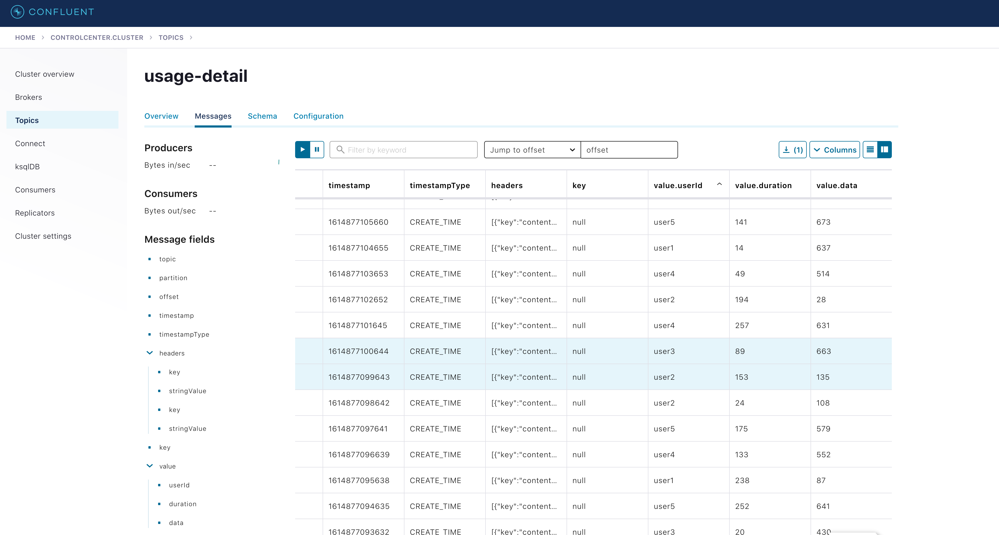
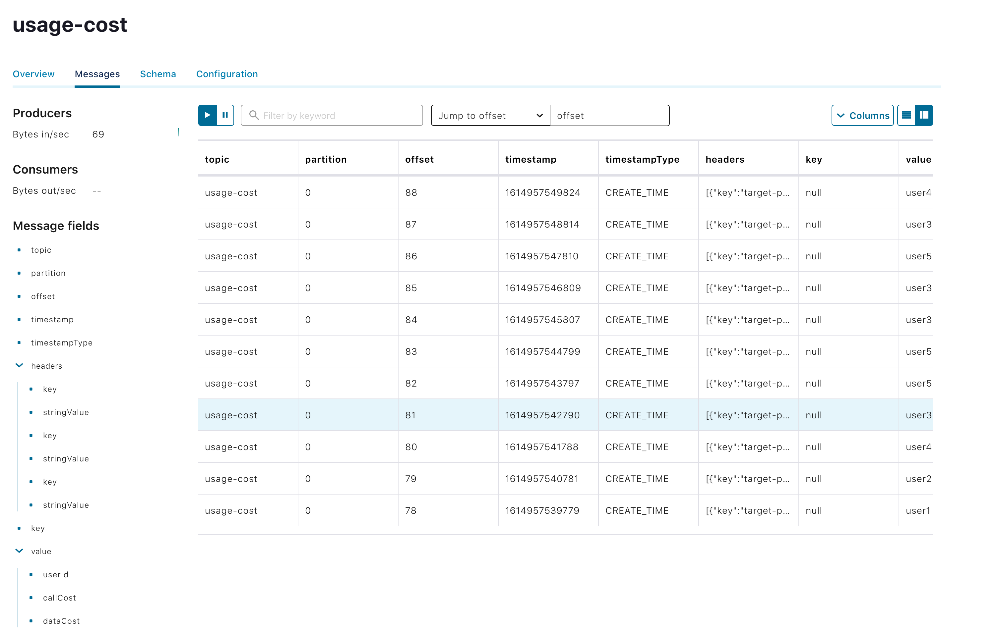

# Local Deployment

If you have configured and built the [sample stream applications](%currentPath%/stream-developer-guides/streams/standalone-stream-sample) and configured it to run with one of the supported message brokers, you can run them as stand-alone applications in your `local` environment.

<!--TABS-->

<!--Kafka-->

If you have not already done so, you can either download and run `Kafka` in your local environment, or use `docker-compose` to run `Kafka` and `Zookeeper` as containers.

## Install and Run Kafka

[Download](https://kafka.apache.org/downloads) and unpack the archive. Then start the `ZooKeeper` and `Kafka` servers by running the following commands from the Kafka install directory:

```bash
./bin/zookeeper-server-start.sh config/zookeeper.properties &
```

```bash
./bin/kafka-server-start.sh config/server.properties &
```

## Run with Docker Compose

Alternately, you can download the [trial Confluent platform](https://docs.confluent.io/platform/current/quickstart/ce-docker-quickstart.html) for Docker

```bash
curl --silent --output docker-compose.yml \
  https://raw.githubusercontent.com/confluentinc/cp-all-in-one/6.1.0-post/cp-all-in-one/docker-compose.yml
```

To start the platform:

```bash
docker-compose up -d
```

In addition to the Kafka broker, this installs other Confluent components, including [Control Center](https://docs.confluent.io/platform/current/monitor/index.html). Access Control Center at http://localhost:9021 , and choose `Topics` to display messages published to the topics.

## Running the Source

By using the [pre-defined](%currentPath%/stream-developer-guides/streams/standalone-stream-sample#source) configuration properties for `UsageDetailSender`, you can run the application, as follows:

```bash
java -jar target/usage-detail-sender-kafka-0.0.1-SNAPSHOT.jar &
```

If you installed Kafka binaries, you can see the messages being sent to the `usage-detail` Kafka topic by using the Kafka console consumer, as follows:

```bash
./bin/kafka-console-consumer.sh --bootstrap-server localhost:9092 --topic usage-detail
```

If you have installed the Confluent platform, access Control Center, as described above. Select the `usage-detail` topic, and the `Messages` tab. You should see something like this:



To list the topics, run the following command:

```bash
./bin/kafka-topics.sh --zookeeper localhost:2181 --list
```

## Running the Processor

By using the [pre-defined](%currentPath%/stream-developer-guides/streams/standalone-stream-sample#processor) configuration properties for `UsageCostProcessor`, you can run the application, as follows:

```
java -jar target/usage-cost-processor-kafka-0.0.1-SNAPSHOT.jar  &
```

With the `UsageDetail` data in the `usage-detail` Kafka topic from the `UsageDetailSender` source application, you can see the `UsageCostDetail` from the `usage-cost` Kafka topic, as follows:

```
 ./bin/kafka-console-consumer.sh --bootstrap-server localhost:9092 --topic usage-cost
```

Or, using the Control Center:



## Running the Sink

By using the [pre-defined](%currentPath%/stream-developer-guides/streams/standalone-stream-sample#sink) configuration properties for `UsageCostLogger`, you can run the application, as follows:

```
java -jar target/usage-cost-logger-kafka-0.0.1-SNAPSHOT.jar &
```

Now you can see that this application logs the usage cost detail.

```bash
...
2021-03-05 10:44:05.193  INFO 55690 --- [container-0-C-1] i.s.d.s.u.UsageCostLoggerApplication     : {"userId": "user2", "callCost": "0.7000000000000001", "dataCost": "21.8" }
2021-03-05 10:44:05.193  INFO 55690 --- [container-0-C-1] i.s.d.s.u.UsageCostLoggerApplication     : {"userId": "user2", "callCost": "0.7000000000000001", "dataCost": "21.8" }
2021-03-05 10:44:06.195  INFO 55690 --- [container-0-C-1] i.s.d.s.u.UsageCostLoggerApplication     : {"userId": "user4", "callCost": "0.5", "dataCost": "24.55" }
2021-03-05 10:44:06.199  INFO 55690 --- [container-0-C-1] i.s.d.s.u.UsageCostLoggerApplication     : {"userId": "user4", "callCost": "0.5", "dataCost": "24.55" }
...
```

## Clean up

If you started the Confluent platform with `docker-compose`, to clean up:

```bash
docker-compose stop
```

<!--RabbitMQ-->

# Local Deployment using RabbitMQ

If you have configured and built the [sample stream applications](%currentPath%/stream-developer-guides/streams/standalone-stream-sample) to run with RabbitMQ, You can run the applications as stand-alone applications in your `local` environment.

## Install and Run RabbitMQ

To install and run the `RabbitMQ` docker image, run the following command:

```bash

docker run -d --hostname rabbitmq --name rabbitmq -p 15672:15672 -p 5672:5672 rabbitmq:3.7.14-management

```

Once installed, you can log in to the RabbitMQ management console on your local machine on [http://localhost:15672](http://localhost:15672).
You can use the default account username and password: `guest` and `guest`.

## Running the `UsageDetailSender` Source

By using the [pre-defined](%currentPath%/stream-developer-guides/streams/standalone-stream-sample#source) configuration properties for `UsageDetailSender`, you can run the application, as follows:

```
java -jar target/usage-detail-sender-rabbit-0.0.1-SNAPSHOT.jar &
```

When this application is running, you can see that the `usage-detail` RabbitMQ exchange is created and that the queue named `usage-detail.usage-cost-consumer` is bound to this exchange, as follows:


Also, if you click on the `Queues` and check the queue `usage-detail.usage-cost-consumer`, you can see the messages being consumed and stored in this durable queue, as follows:


When configuring the consumer applications for this `Source` application, you can set the `group` binding property to connect to the corresponding durable queue.

If you do not set the `requiredGroups` property, you can see that there is no `queue` for consuming the messages from the `usage-detail` exchange and, therefore, the messages are lost if the consumer is not up before this application is started.

## Running the Processor

By using the [pre-defined](%currentPath%/stream-developer-guides/streams/standalone-stream-sample#processor) configuration properties for `UsageCostProcessor`, you can run the application, as follows:

```
java -jar target/usage-cost-processor-rabbit-0.0.1-SNAPSHOT.jar &
```

From the RabbitMQ console, you can see:

- The `UsageCostProcessor` application consumes from the `usage-detail.usage-cost-consumer` durable queue, based on the `spring.cloud.stream.bindings.input.group=usage-cost-consumer` property.
- The `UsageCostProcessor` application produces the `UsageCostDetail` and sends it to the exchange `usage-cost`, based on the `spring.cloud.stream.bindings.output.destination=usage-cost` property.
- The `usage-cost.logger` durable queue is created. It consumes the messages from the `usage-cost` exchange, based on the `spring.cloud.stream.bindings.output.producer.requiredGroups=logger` property.

When this application is running, you can see that the `usage-cost` RabbitMQ exchange is created and the durable queue named `usage-cost.logger` is bound to this exchange, as follows:


Also, if you click on the `Queues` and check the `usage-cost.logger` queue, you can see the messages being consumed and stored in this durable queue, as follows:


## Running the Sink

By using the [pre-defined](%currentPath%/stream-developer-guides/streams/standalone-stream-sample#sink) configuration properties for `UsageCostLogger`, you can run the application, as follows:

```
java -jar target/usage-cost-logger-rabbit-0.0.1-SNAPSHOT.jar &
```

Now you can see that this application logs the usage cost detail it receives from the `usage-cost` RabbitMQ exchange through the `usage-cost.logger` durable queue, as follows:

```
2019-05-08 08:16:46.442  INFO 10769 --- [o6VmGALOP_onw-1] i.s.d.s.u.UsageCostLoggerApplication     : {"userId": "user2", "callCost": "28.3", "dataCost": "29.8" }
2019-05-08 08:16:47.446  INFO 10769 --- [o6VmGALOP_onw-1] i.s.d.s.u.UsageCostLoggerApplication     : {"userId": "user2", "callCost": "12.0", "dataCost": "23.75" }
2019-05-08 08:16:48.451  INFO 10769 --- [o6VmGALOP_onw-1] i.s.d.s.u.UsageCostLoggerApplication     : {"userId": "user4", "callCost": "16.0", "dataCost": "30.05" }
2019-05-08 08:16:49.454  INFO 10769 --- [o6VmGALOP_onw-1] i.s.d.s.u.UsageCostLoggerApplication     : {"userId": "user1", "callCost": "17.7", "dataCost": "18.0" }
```

<!--END_TABS-->
