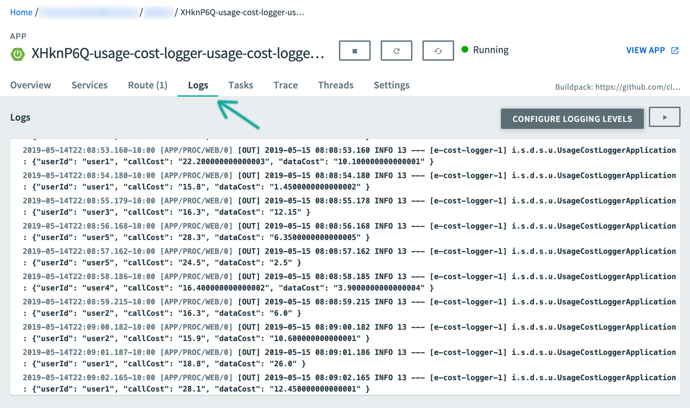

# Stream Processing with Data Flow using RabbitMQ

In this section we will show how to register stream applications with Data Flow, create a Stream DSL, and deploy the stream to Cloud Foundry, Kubernetes and your local machine.

In the previous guide, we created `Source`, `Processor` and `Sink` streaming applications and deployed them as standalone applications on multiple platforms.
In this guide, we will register these applications with Data Flow, create a Stream DSL and deploy the stream to Cloud Foundry, Kubernetes, and your local machine.

## Development

All the sample applications from the previous guide are available as `maven` and `docker` artifacts at the `https://repo.spring.io` maven repository.

For the `UsageDetailSender` source:

```
maven://io.spring.dataflow.sample:usage-detail-sender-rabbit:0.0.1-SNAPSHOT
```

```
docker://springcloudstream/usage-detail-sender-rabbit:0.0.1-SNAPSHOT
```

For the `UsageCostProcessor` processor:

```
maven://io.spring.dataflow.sample:usage-cost-processor-rabbit:0.0.1-SNAPSHOT
```

```
docker://springcloudstream/usage-cost-processor-rabbit:0.0.1-SNAPSHOT
```

For the `UsageCostLogger` sink:

```
maven://io.spring.dataflow.sample:usage-cost-logger-rabbit:0.0.1-SNAPSHOT
```

```
docker://springcloudstream/usage-cost-logger-rabbit:0.0.1-SNAPSHOT
```

### The Data Flow Dashboard

Assuming Data Flow is [installed](%currentPath%/installation/) and running on one of the supported platforms, open your browser at `<data-flow-url>/dashboard`. Here, `<data-flow-url>` depends on the platform. Consult the [installation guide](%currentPath%/installation) to determining the base URL for your installation. If Data Flow is running on your local machine, go to http://localhost:9393/dashboard.

### Application Registration

Applications in Data Flow are registered as named resources so that they may be referenced when using the Data Flow DSL to configure and compose streaming pipelines. Registration associates a logical application name and type with a physical resource, given by a URI.

The URI conforms to a [schema](https://docs.spring.io/spring-cloud-dataflow/docs/current/reference/htmlsingle/#spring-cloud-dataflow-register-stream-apps) and may represent a Maven artifact, a Docker image, or an actual `http(s)` or `file` URL. Data Flow defines some logical application types which indicate its role as a streaming component, a task, or a standalone application. For streaming applications, as you might expect, we will use `Source`,`Processor`, and `Sink` types.

The Data Flow Dashboard will land on the Application Registration view where we will register the source, processor, and sink apps.


In this step, we will register the applications we created previously.
When you register an application, you provide:

- it's location URI (maven, http, docker, file etc.,)
- application version
- application type (Source, Processor, Sink)
- application name

| App Name             | App Type  | App URI                                                                      |
| -------------------- | --------- | ---------------------------------------------------------------------------- |
| usage-detail-sender  | Source    | maven://io.spring.dataflow.sample:usage-detail-sender-rabbit:0.0.1-SNAPSHOT  |
| usage-cost-processor | Processor | maven://io.spring.dataflow.sample:usage-cost-processor-rabbit:0.0.1-SNAPSHOT |
| usage-cost-logger    | Sink      | maven://io.spring.dataflow.sample:usage-cost-logger-rabbit:0.0.1-SNAPSHOT    |

[[note]]
| If you are running Spring Cloud Data Flow server on the docker environment, make sure that your application artifact URIs are accessible.
|For instance, you may not be able to access `file:/` from SCDF/Skipper docker containers unless you have the application locations
|accessible. It is recommended to use `http://`, `maven://` or `docker://` for applications' URIs.

Let's assume you are running Spring Cloud Data Flow, Skipper servers running on your local development environment.

Register the `UsageDetailSender` source application:

From the Applications view, select `Add Application(s)`.
This will display a view to allow you to register applications.

Register the `maven` artifact of the `UsageDetailSender` application with the name `usage-detail-sender`:

> (uri = `maven://io.spring.dataflow.sample:usage-detail-sender-rabbit:0.0.1-SNAPSHOT`)


If you are using a `docker` artifact, then

> (uri = `docker://springcloudstream/usage-detail-sender-rabbit:0.0.1-SNAPSHOT`)


Select `Register one or more applications` and enter the `name`, `type`, and `URI` for the source application.

Click on `New application` to display another instance of the form to enter the values for the processor.

Register the `maven` artifact of the `UsageCostProcessor` processor application with the name `usage-cost-processor`:

> (uri = `maven://io.spring.dataflow.sample:usage-cost-processor-rabbit:0.0.1-SNAPSHOT`)


If you are using a `docker` artifact, then

> (uri = `docker://springcloudstream/usage-cost-processor-rabbit:0.0.1-SNAPSHOT`)


Register the `maven` artifact of the `UsageCostLogger` sink application with the name `usage-cost-logger`

> (uri = `maven://io.spring.dataflow.sample:usage-cost-logger-rabbit:0.0.1-SNAPSHOT`)


If you are using a `docker` artifact, then

> (uri = `docker://springcloudstream/usage-cost-logger-rabbit:0.0.1-SNAPSHOT`)


Click on `Register the application(s)` to complete the registration. This will take you back to the Applications view which lists your applications.


### Create the Stream Definition

Select `Streams` from the left navigation bar. This will display the main Streams view.


Select `Create stream(s)` to display a graphical editor to create the stream definition.


You will see the `Source`, `Processor` and `Sink` applications, as registered above, in the left panel. Drag and drop each app to the canvas and then use the handles to connect them together. Notice the equivalent Data Flow DSL definition in the top text panel. Click `Create Stream`.

You can type the name of the stream `usage-cost-logger` when creating the stream.

## Deployment

Click on the arrow head icon to deploy the stream. This will take you to the Deploy Stream page from where you may enter additional deployment properties.

Select `Deploy Stream`.


When deploying the stream, choose the target platform accounts from local, Kubernetes or Cloud Foundry. This is based on the Spring Cloud Skipper server deployer platform account setup.


When all the applications are running, the stream is successfully deployed.


The process described above is basically the same for all platforms. The following sections addresses platform-specific details for deploying on Data Flow on Local, Cloud Foundry, and Kubernetes.

### Local

**NOTE** If you are deploying the stream on `local` environment, you need to set a unique value for the `server.port` application property for each application so that they can use different port on `local`.

Once the stream is deployed on `Local` development environment, you can look the runtime applications via Dashboard's runtime page or using the SCDF Shell command `runtime apps`.
The runtime applications show information about where each application is running in the local environment and their log files locations.

**NOTE** If you are running SCDF on docker, to access the log files of the streaming applications:

`docker exec <stream-application-docker-container-id> tail -f <stream-application-log-file>`

```
2019-04-19 22:16:04.864  INFO 95238 --- [container-0-C-1] c.e.demo.UsageCostLoggerApplication      : {"userId": "Mark", "callCost": "0.17", "dataCost": "0.32800000000000007" }
2019-04-19 22:16:04.872  INFO 95238 --- [container-0-C-1] c.e.demo.UsageCostLoggerApplication      : {"userId": "Janne", "callCost": "0.20800000000000002", "dataCost": "0.298" }
2019-04-19 22:16:04.872  INFO 95238 --- [container-0-C-1] c.e.demo.UsageCostLoggerApplication      : {"userId": "Ilaya", "callCost": "0.175", "dataCost": "0.16150000000000003" }
2019-04-19 22:16:04.872  INFO 95238 --- [container-0-C-1] c.e.demo.UsageCostLoggerApplication      : {"userId": "Glenn", "callCost": "0.145", "dataCost": "0.269" }
2019-04-19 22:16:05.256  INFO 95238 --- [container-0-C-1] c.e.demo.UsageCostLoggerApplication      : {"userId": "Ilaya", "callCost": "0.083", "dataCost": "0.23800000000000002" }
2019-04-19 22:16:06.257  INFO 95238 --- [container-0-C-1] c.e.demo.UsageCostLoggerApplication      : {"userId": "Janne", "callCost": "0.251", "dataCost": "0.026500000000000003" }
2019-04-19 22:16:07.264  INFO 95238 --- [container-0-C-1] c.e.demo.UsageCostLoggerApplication      : {"userId": "Janne", "callCost": "0.15100000000000002", "dataCost": "0.08700000000000001" }
2019-04-19 22:16:08.263  INFO 95238 --- [container-0-C-1] c.e.demo.UsageCostLoggerApplication      : {"userId": "Sabby", "callCost": "0.10100000000000002", "dataCost": "0.33" }
2019-04
```

### Cloud Foundry

Before registering and deploying stream applications to Cloud Foundry using the instructions above, please ensure that you have an instance of Spring Cloud Data Flow sucessfully running on Cloud Foundry. Follow the Cloud Foundry [installation guide](%currentPath%/installation/cloudfoundry/cf-cli) for reference.

Once you have followed the steps of this chapter above and registered the apps as well as deployed the stream, you will see the sucessfully deployed applications in your in your Org/Space in Cloud Foundry:


Of course, you have access to the runtime information of your stream applications in the Spring Cloud Data Flow Dashboard as well. Simply click onto the `Runtime` button in the left navigation:


Besides verifying the runtime status of your stream, you should also verify the logging output produced by the `usage-cost-logger` Sink. In Cloud Foundry Apps Manager, click onto the `Logs` tab of the `usage-cost-logger` sink application. The logging statements should look like the following:



### Kubernetes

Once you have the Spring Cloud Data Flow server up and running in Kubernetes using the instructions from the [installation guide](%currentPath%/installation/kubernetes/), you can:

- Register the stream applications
- Create, deploy and manage streams

#### Registering applications with Spring Cloud Data Flow server

The Kubernetes environment requires the application artifacts to be `docker` images.

For the `UsageDetailSender` source:

```
docker://springcloudstream/usage-detail-sender-rabbit:0.0.1-SNAPSHOT
```

For the `UsageCostProcessor` processor:

```
docker://springcloudstream/usage-cost-processor-rabbit:0.0.1-SNAPSHOT
```

For the `UsageCostLogger` sink:

```
docker://springcloudstream/usage-cost-logger-rabbit:0.0.1-SNAPSHOT
```

You can register these applications as described in the app registration step [above](#application-registration).

#### Stream Deployment

Once the applications are registered, you can deploy the stream per the instructions from the stream deployment section [above](#deployment).

##### List the Pods

The following command:

```bash
 kubectl get pods
```

lists the pods (including the server components and the streaming applications):

```
NAME                                                         READY   STATUS    RESTARTS   AGE
scdf-release-data-flow-server-795c77b85c-tqdtx               1/1     Running   0          36m
scdf-release-data-flow-skipper-85b6568d6b-2jgcv              1/1     Running   0          36m
scdf-release-mysql-744757b689-tsnnz                          1/1     Running   0          36m
scdf-release-rabbitmq-5fb7f7f644-878pz                       1/1     Running   0          36m
usage-cost-logger-usage-cost-logger-v1-568599d459-hk9b6      1/1     Running   0          2m41s
usage-cost-logger-usage-cost-processor-v1-79745cf97d-dwjpw   1/1     Running   0          2m42s
usage-cost-logger-usage-detail-sender-v1-6cd7d9d9b8-m2qf6    1/1     Running   0          2m41s
```

##### Verify the Logs

To be sure the steps in the previous sections have worked correctly, you should verify the logs.
The following example shows how to make sure that the values you expect appear in the logs:

```bash
kubectl logs -f usage-cost-logger-usage-cost-logger-v1-568599d459-hk9b6
```

```
2019-05-17 17:53:44.189  INFO 1 --- [e-cost-logger-1] i.s.d.s.u.UsageCostLoggerApplication     : {"userId": "user2", "callCost": "0.7000000000000001", "dataCost": "23.950000000000003" }
2019-05-17 17:53:45.190  INFO 1 --- [e-cost-logger-1] i.s.d.s.u.UsageCostLoggerApplication     : {"userId": "user4", "callCost": "2.9000000000000004", "dataCost": "10.65" }
2019-05-17 17:53:46.190  INFO 1 --- [e-cost-logger-1] i.s.d.s.u.UsageCostLoggerApplication     : {"userId": "user3", "callCost": "5.2", "dataCost": "28.85" }
2019-05-17 17:53:47.192  INFO 1 --- [e-cost-logger-1] i.s.d.s.u.UsageCostLoggerApplication     : {"userId": "user4", "callCost": "1.7000000000000002", "dataCost": "30.35" }
```

## Comparison with standalone deployment

In this section, we deployed the stream using Spring Cloud Data Flow using the stream DSL:

```
usage-detail-sender | usage-cost-processor | usage-cost-logger
```

When these three applications are deployed as standalone applications, you need to set the binding properties that connect the applications to make them a stream.

Instead, Spring Cloud Data Flow lets you deploy all these three streaming applications as a single stream by taking care of the plumbing of one application to the other to form the data flow.
