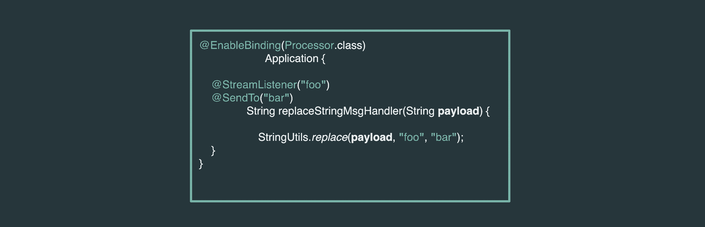

# Programming Models

Spring Cloud Stream provides the flexibility to build the streaming applications using different programming models.

- Imperative
- Functional
- Kafka Streams

In the following section, we will review how a business logic can be built with different programming models.

To highlight the use of programming with a concrete example, let's think of a scenario where we are receiving data from an HTTP endpoint. Once when the data is available, suppose we would want to transform the payload by adding prefix and suffixes. Finally, we would want to verify the transformed data.

## Download Applications

To demonstrate the before mentioned use-case, we will start by downloading two out-of-the-box applications.

- [HTTP Source](https://github.com/spring-cloud-stream-app-starters/http)

```bash
wget https://repo.spring.io/release/org/springframework/cloud/stream/app/http-source-kafka/2.1.0.RELEASE/http-source-kafka-2.1.0.RELEASE.jar
```

- [Log Sink](https://github.com/spring-cloud-stream-app-starters/log)

```bash
wget https://repo.spring.io/release/org/springframework/cloud/stream/app/log-sink-kafka/2.1.1.RELEASE/log-sink-kafka-2.1.1.RELEASE.jar
```

## Custom Processor

For the data transformation between the source and sink steps, we will highlight a custom processor application and use that as a base to demonstrate different programming models.

**Code:**

<!--TABS-->
<!--Imperative-->

```java
@EnableBinding(Processor.class)
public class SimpleStreamSampleProcessor {

	@StreamListener(Processor.INPUT)
	@SendTo(Processor.OUTPUT)
	public String messenger(String data) {
		return "Hello: " + data + "!";
	}
}
```

<!--Functional-->

```java
public class FunctionStreamSampleProcessor {

	@Bean
	public Function<String, String> messenger() {
		return data -> "Hello: " + data + "!";
	}
}
```

<!--Kafka Streams-->

```java
@EnableBinding(KafkaStreamsProcessor.class)
public class KafkaStreamsSampleProcessor {

	@StreamListener("input")
	@SendTo("output")
	public KStream<String, String> messenger(KStream<String, String> data) {
		return data.map((k, v) -> new KeyValue<>(null, "Hello: " + v + "!"));
	}
}
```

<!--END_TABS-->

[[note]]
| The business logic in the processor simply transforms the received payload by adding the "Hello: " prefix and then the "!" suffix in the end.
|
| The "same business logic" can be implemented with different programming models, and each of the variations is implementing a simple `messenger` function, which can be independently tested and evolved in isolation.
|
| **Takeaway**: Developers have the choice to choose from the available programming model styles.

**Configuration: _(application.properties)_**

<!--TABS-->
<!--Imperative-->

```properties
spring.cloud.stream.bindings.input.destination=incomingDataTopic
spring.cloud.stream.bindings.output.destination=outgoingDataTopic
```

<!--Functional-->

```properties
spring.cloud.stream.bindings.input.destination=incomingDataTopic
spring.cloud.stream.bindings.output.destination=outgoingDataTopic
```

<!--Kafka Streams-->

```properties
spring.cloud.stream.bindings.input.destination=incomingDataTopic
spring.cloud.stream.bindings.output.destination=outgoingDataTopic

spring.cloud.stream.kafka.streams.binder.applicationId=kstreams-sample
```

<!--END_TABS-->

[[note]]
| In the Kafka Streams configuration, you'd notice the extra property `spring.cloud.stream.kafka.streams.binder.applicationId`, which is required by the framework internally to identify the Kafka Streams application uniquely.



## Testing

1. Start Kafka on localhost.

2. Clone and build the processor sample from [here](https://github.com/sabbyanandan/stream-programming-models).

3. Start the following applications.

**Source:**

Start the Http-source application with the output destination bound to `incomingDataTopic` topic in Kafka.

```bash
java -jar http-source-kafka-2.1.0.RELEASE.jar --spring.cloud.stream.bindings.output.destination=incomingDataTopic --server.port=9001
```

**Processor:**

Start one of the processor variations from the built directory. For example:

```bash
java -jar simple/target/simple-0.0.1-SNAPSHOT.jar
```

**Sink:**

Finally, let's start the Log-sink application with input destination bound to `outgoingDataTopic` topic in Kafka.

```bash
java -jar log-sink-kafka-2.1.1.RELEASE.jar --spring.cloud.stream.bindings.input.destination=outgoingDataTopic --server.port=9003
```

Now that the applications are up and running, let's post some sample data to verify the results.

**Data:**
Post sample data to the port where HTTP-source application is running. In this case, it is running at port 9001.

```bash
curl localhost:9001 -H "Content-type: text/plain" -d "test data"
```

**Results:**
In the Log-sink application console, we should now see a similar output as follows.

```bash
2019-04-30 15:03:27.620  INFO 38035 --- [container-0-C-1] log-sink                                 : Hello: test data!
```

With this result, we are able to verify that the data from the HTTP-source application is processed by the `simple-0.0.1-SNAPSHOT` processor, and the processed data is printed in the console with the prefix "Hello: " and the suffix "!" in the end, which equates to "Hello: test data!" as a result.

## Composing functional beans in Processor applications

The functional composition support is **not** applicable for the out-of-the-box Spring Cloud Stream `Processor` applications, since there is ambiguity in whether the function needs to be applied before or after the existing processor’s application logic.
It is hard to determine that.

However, you can create your own processor applications that use functional composition with the standard `java.util.Function` APIs, as the following example shows:

```java
@Configuration
public static class FunctionProcessorConfiguration {

  @Bean
  public Function<String, String> upperAndConcat() {
  return upper().andThen(concat());
  }

  @Bean
  public Function<String, String> upper() {
     return value -> value.toUpperCase();
  }

  @Bean
  public Function<String, String> concat() {
     return value -> "Hello "+ value;
  }
}
```

When you deploy your stream with the custom `processor` application, you need to deploy the `processor` application by defining the following property: `spring.cloud.stream.function.definition` to compose functional beans.

In this example it would be set to.

```properties
spring.cloud.stream.function.definition=upper|concat
```
