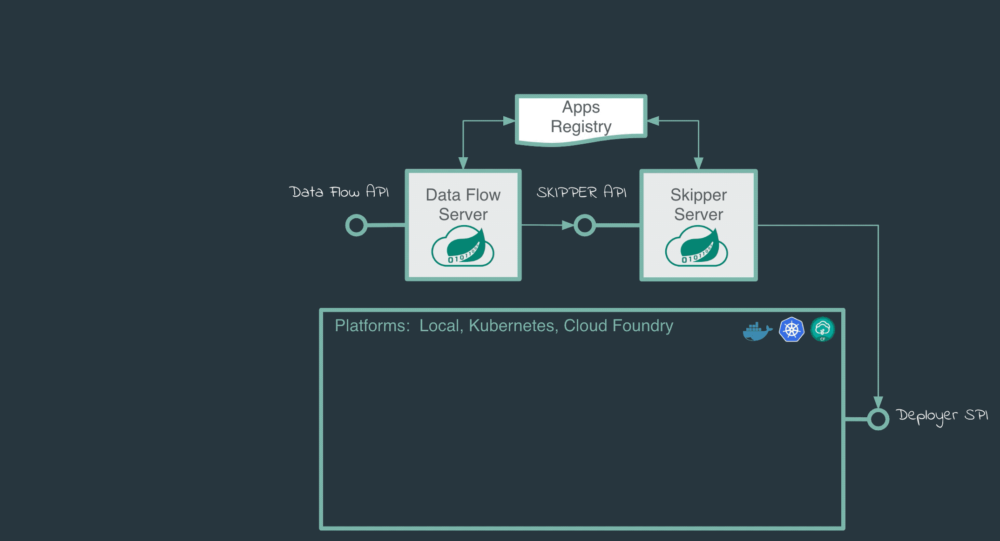

# Continuous Delivery of streaming applications

The applications composed in the streaming data pipeline will often need to be changed.
The change can be a new version of the application that fixes a bug or setting a different value of an application property.
To avoid downtime from stream processing, we would like to do a rolling upgrade of just the applications in the stream that have changed.
Furthermore, should the upgrade not be what is desired, a quick rollback to a previous version of the application should be easy to perform.

Spring Cloud Data Flow provides support for continuous delivery of event streaming applications via the Skipper server.



To demonstrate this, lets use some of the out of the box streaming applications that were already registered when installing Data Flow.

## Local

### Stream Creation and Deployment

Create and deploy a stream that has source which ingests `http` events and the `transform` processor that applies a transformation logic and the `log` sink that shows the result of the transformed events.

In the following stream definition, you can make sure to provide unique server ports for each of the applications as they get to deploy on `local`.

```
stream create http-ingest --definition "http --server.port=9000 | transform --expression=payload.toUpperCase() --server.port=9001 | log --server.port=9002" --deploy
```

You can verify stream status from the `stream list` command.

```
stream list
```

```
╔═══════════╤══════════════════════════════════════════════════════════════════════════════════════════════════════════════════════════════╤═════════════════════════════╗
║Stream Name│                                                      Stream Definition                                                       │           Status            ║
╠═══════════╪══════════════════════════════════════════════════════════════════════════════════════════════════════════════════════════════╪═════════════════════════════╣
║http-ingest│http --server.port=9000 | transform --transformer.expression=payload.toUpperCase() --server.port=9001 | log --server.port=9002│The stream is being deployed.║
╚═══════════╧══════════════════════════════════════════════════════════════════════════════════════════════════════════════════════════════╧═════════════════════════════╝
```

```
stream list
```

```
╔═══════════╤══════════════════════════════════════════════════════════════════════════════════════════════════════════════════════════════╤═════════════════════════════════════════╗
║Stream Name│                                                      Stream Definition                                                       │                 Status                  ║
╠═══════════╪══════════════════════════════════════════════════════════════════════════════════════════════════════════════════════════════╪═════════════════════════════════════════╣
║http-ingest│http --server.port=9000 | transform --transformer.expression=payload.toUpperCase() --server.port=9001 | log --server.port=9002│The stream has been successfully deployed║
╚═══════════╧══════════════════════════════════════════════════════════════════════════════════════════════════════════════════════════════╧═════════════════════════════════════════╝

```

Post some data from the Spring Cloud Data Flow shell:

```
http post --target "http://localhost:9000" --data "spring"
```

From the log file of the `log` application, you will see the following:

```
log-sink                                 :  SPRING
```

The command `stream manifest http-ingest` shows all the applications and their properties for this version fo the the stream.

```
stream manifest http-ingest
```

You can see the following result:

```json
{/* highlight-range{8,29,50} */}
"apiVersion": "skipper.spring.io/v1"
"kind": "SpringCloudDeployerApplication"
"metadata":
  "name": "http"
"spec":
  "resource": "maven://org.springframework.cloud.stream.app:http-source-rabbit:jar"
  "resourceMetadata": "maven://org.springframework.cloud.stream.app:http-source-rabbit:jar:jar:metadata:2.1.0.RELEASE"
  "version": "2.1.0.RELEASE"
  "applicationProperties":
    "spring.metrics.export.triggers.application.includes": "integration**"
    "spring.cloud.dataflow.stream.app.label": "http"
    "spring.cloud.stream.metrics.key": "http-ingest.http.${spring.cloud.application.guid}"
    "spring.cloud.stream.bindings.output.producer.requiredGroups": "http-ingest"
    "spring.cloud.stream.metrics.properties": "spring.application.name,spring.application.index,spring.cloud.application.*,spring.cloud.dataflow.*"
    "server.port": "9000"
    "spring.cloud.stream.bindings.output.destination": "http-ingest.http"
    "spring.cloud.dataflow.stream.name": "http-ingest"
    "spring.cloud.dataflow.stream.app.type": "source"
  "deploymentProperties":
    "spring.cloud.deployer.group": "http-ingest"
---
"apiVersion": "skipper.spring.io/v1"
"kind": "SpringCloudDeployerApplication"
"metadata":
  "name": "log"
"spec":
  "resource": "maven://org.springframework.cloud.stream.app:log-sink-rabbit:jar"
  "resourceMetadata": "maven://org.springframework.cloud.stream.app:log-sink-rabbit:jar:jar:metadata:2.1.1.RELEASE"
  "version": "2.1.1.RELEASE"
  "applicationProperties":
    "spring.metrics.export.triggers.application.includes": "integration**"
    "spring.cloud.dataflow.stream.app.label": "log"
    "spring.cloud.stream.metrics.key": "http-ingest.log.${spring.cloud.application.guid}"
    "spring.cloud.stream.bindings.input.group": "http-ingest"
    "spring.cloud.stream.metrics.properties": "spring.application.name,spring.application.index,spring.cloud.application.*,spring.cloud.dataflow.*"
    "server.port": "9002"
    "spring.cloud.dataflow.stream.name": "http-ingest"
    "spring.cloud.dataflow.stream.app.type": "sink"
    "spring.cloud.stream.bindings.input.destination": "http-ingest.transform"
  "deploymentProperties":
    "spring.cloud.deployer.group": "http-ingest"
---
"apiVersion": "skipper.spring.io/v1"
"kind": "SpringCloudDeployerApplication"
"metadata":
  "name": "transform"
"spec":
  "resource": "maven://org.springframework.cloud.stream.app:transform-processor-rabbit:jar"
  "resourceMetadata": "maven://org.springframework.cloud.stream.app:transform-processor-rabbit:jar:jar:metadata:2.1.0.RELEASE"
  "version": "2.1.0.RELEASE"
  "applicationProperties":
    "spring.metrics.export.triggers.application.includes": "integration**"
    "spring.cloud.dataflow.stream.app.label": "transform"
    "spring.cloud.stream.metrics.key": "http-ingest.transform.${spring.cloud.application.guid}"
    "spring.cloud.stream.bindings.input.group": "http-ingest"
    "transformer.expression": "payload.toUpperCase()"
    "spring.cloud.stream.metrics.properties": "spring.application.name,spring.application.index,spring.cloud.application.*,spring.cloud.dataflow.*"
    "spring.cloud.stream.bindings.output.producer.requiredGroups": "http-ingest"
    "server.port": "9001"
    "spring.cloud.dataflow.stream.name": "http-ingest"
    "spring.cloud.stream.bindings.output.destination": "http-ingest.transform"
    "spring.cloud.dataflow.stream.app.type": "processor"
    "spring.cloud.stream.bindings.input.destination": "http-ingest.http"
  "deploymentProperties":
    "spring.cloud.deployer.group": "http-ingest"

```

For instance, you can see the `transform` application has the property "transformer.expression": "payload.toUpperCase()".
The command `stream history http-ingest` shows the history for this event stream, listing all the available versions.

```
stream history --name http-ingest
```

```
╔═══════╤════════════════════════════╤════════╤════════════╤═══════════════╤════════════════╗
║Version│        Last updated        │ Status │Package Name│Package Version│  Description   ║
╠═══════╪════════════════════════════╪════════╪════════════╪═══════════════╪════════════════╣
║1      │Wed May 08 20:45:18 IST 2019│DEPLOYED│http-ingest │1.0.0          │Install complete║
╚═══════╧════════════════════════════╧════════╧════════════╧═══════════════╧════════════════╝
```

### Stream Update

If you want to update the existing deployed stream to use a different version of the `log` application, you can perform stream `update` action.

First, you can register the required version of the `log` application:

```
app register --name log --type sink --uri maven://org.springframework.cloud.stream.app:log-sink-rabbit:2.1.0.RELEASE
```

and perform the stream update as follows:

```
stream update --name http-ingest --properties "version.log=2.1.0.RELEASE"
```

When the `stream update` is run, you can do:

```
jps
```

and see the `log` application `log-sink-rabbit-2.1.0.RELEASE.jar` gets deployed and the existing `log-sink-rabbit-2.1.1.RELEASE.jar` is destroyed.

Once the stream update is completed, you can verify the `stream manifest` to see if the version of the `log` application is changed.

```
stream manifest http-ingest
```

```json
{/* highlight-range{8} */}
"apiVersion": "skipper.spring.io/v1"
"kind": "SpringCloudDeployerApplication"
"metadata":
  "name": "log"
"spec":
  "resource": "maven://org.springframework.cloud.stream.app:log-sink-rabbit:jar"
  "resourceMetadata": "maven://org.springframework.cloud.stream.app:log-sink-rabbit:jar:jar:metadata:2.1.0.RELEASE"
  "version": "2.1.0.RELEASE"
  "applicationProperties":
    "spring.metrics.export.triggers.application.includes": "integration**"
    "spring.cloud.dataflow.stream.app.label": "log"
    "spring.cloud.stream.metrics.key": "http-ingest.log.${spring.cloud.application.guid}"
    "spring.cloud.stream.bindings.input.group": "http-ingest"
    "spring.cloud.stream.metrics.properties": "spring.application.name,spring.application.index,spring.cloud.application.*,spring.cloud.dataflow.*"
    "server.port": "9002"
    "spring.cloud.dataflow.stream.name": "http-ingest"
    "spring.cloud.dataflow.stream.app.type": "sink"
    "spring.cloud.stream.bindings.input.destination": "http-ingest.transform"
  "deploymentProperties":
    "spring.cloud.deployer.count": "1"
    "spring.cloud.deployer.group": "http-ingest"
---
...
...

```

```
stream history --name http-ingest
```

```
╔═══════╤════════════════════════════╤════════╤════════════╤═══════════════╤════════════════╗
║Version│        Last updated        │ Status │Package Name│Package Version│  Description   ║
╠═══════╪════════════════════════════╪════════╪════════════╪═══════════════╪════════════════╣
║2      │Wed May 08 21:34:45 IST 2019│DEPLOYED│http-ingest │1.0.0          │Upgrade complete║
║1      │Wed May 08 21:30:00 IST 2019│DELETED │http-ingest │1.0.0          │Delete complete ║
╚═══════╧════════════════════════════╧════════╧════════════╧═══════════════╧════════════════╝
```

You can also change the configuration properties of the application without using the new version of the app.
Let’s say you want to change the transformation logic used in the `transform` application without redeploying the entire stream and update the `transform` application in isolation.

```
stream update http-ingest --properties "app.transform.expression=payload.toUpperCase().concat('!!!')"
```

When you run the `stream manifest http-ingest` command again, you will see the `transform` application is now changed to include the expression property, which transforms each of the payloads by appending !!! at the end.

Let’s test the update:

```
http post --target "http://localhost:9000" --data "spring"
```

From `log` application's log file, you will now see the following:

```
log-sink                                 : SPRING!!!
```

The command `stream history http-ingest` will include the new event in the history of this stream.

### Stream Rollback

If you want to roll back the event stream to a specific version, you can use the command `stream rollback http-ingest --releaseVersion <release-version>`.

After rolling back to the initial version of the event stream (where the `transform` application just did uppercase conversion):

```
stream rollback http-ingest --releaseVersion 1
```

```
http post --target "http://localhost:9000" --data "spring"
```

In the `log` application's log file, you will now see:

```
log-sink : SPRING
```

<!--
## Cloud Foundry
older versions of cloudfoundry.md have the converted asciidoc to markdown which includes sections on stream update/rollback along with various cf command line output. use that as the basis for this section

### Stream Creation and Deployment

blah

### Stream Update

blah

### Stream Rollback

### Kubernetes

**TODO** older versions of kubernetes.md have the converted asciidoc to markdown which includes sections on stream update/rollback along with various cf command line output. use that as the basis for this section

### Stream Creation and Deployment

blah

### Stream Update

blah

### Stream Rollback
-->
