# Debugging Stream Applications

Applications should be runnable as a standard Java JAR, which can be invoked with `java -jar`.
All dependencies (such as databases and messaging middleware) should be available and tested manually for connection issues.
Running and debugging applications is independent of deploying with SCDF and running on a platform.

## Project Build Errors

The following diagram shows a typical debugging process for build errors:

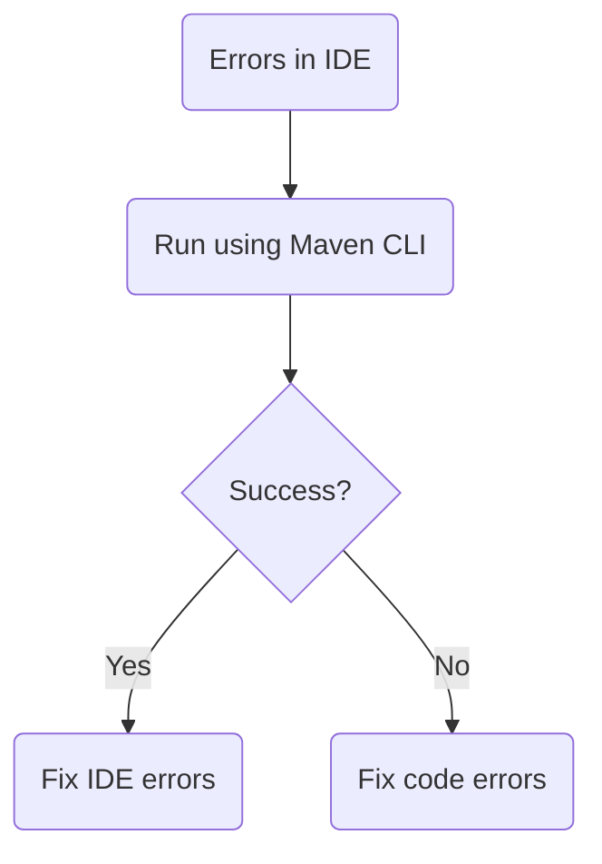

Fixing errors in the IDE depends on which IDE you use.
Verifying that the build is successful outside the IDE helps rule out project-specific issues.

## Application Startup Exceptions

The following diagram shows a typical debugging process for application startup exceptions:

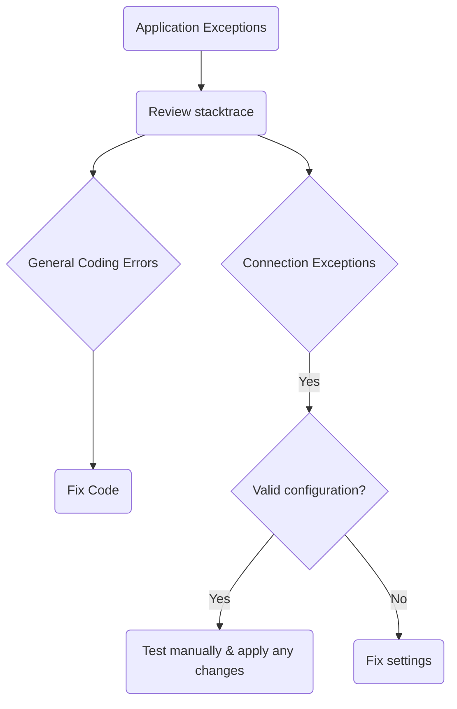

When the application starts, exceptions may occur due to general coding errors or connectivity issues.
Review the application log file to find the exceptions and fix as appropriate.
Ensure that all external services are reachable, correct credentials are provided, and any other required information is correct.

## General Application Debugging

The following diagram shows a typical debugging process for general application debugging:

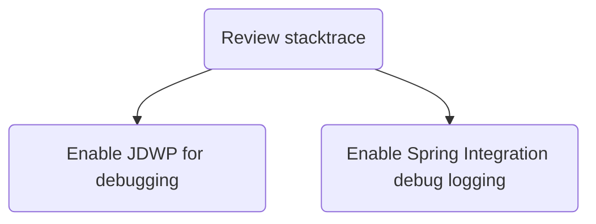

Applications can be debugged as normal Java processes as well as by using verbose log output by setting the logging level to DEBUG.

To debug your application with a debugger, add the necessary JVM argument when you start your application, as follows (with example values):

`-agentlib:jdwp=transport=dt_socket,server=y,suspend=y,address=5005`

By adding this parameter, your application waits for a debugger to connect on port `5005` so that you can start debugging.
This can be any port you choose that is not already in use.

Enabling the DEBUG level logging can also be a useful aid.
One package of interest is Spring Integration (SI): `org.springframework.integration`.
To enable debug logging of this package, add the following JVM argument when starting your application:

`-Dlogging.level.org.springframework.integration=DEBUG`

## Data Loss

The following diagram shows a typical debugging process for data loss:

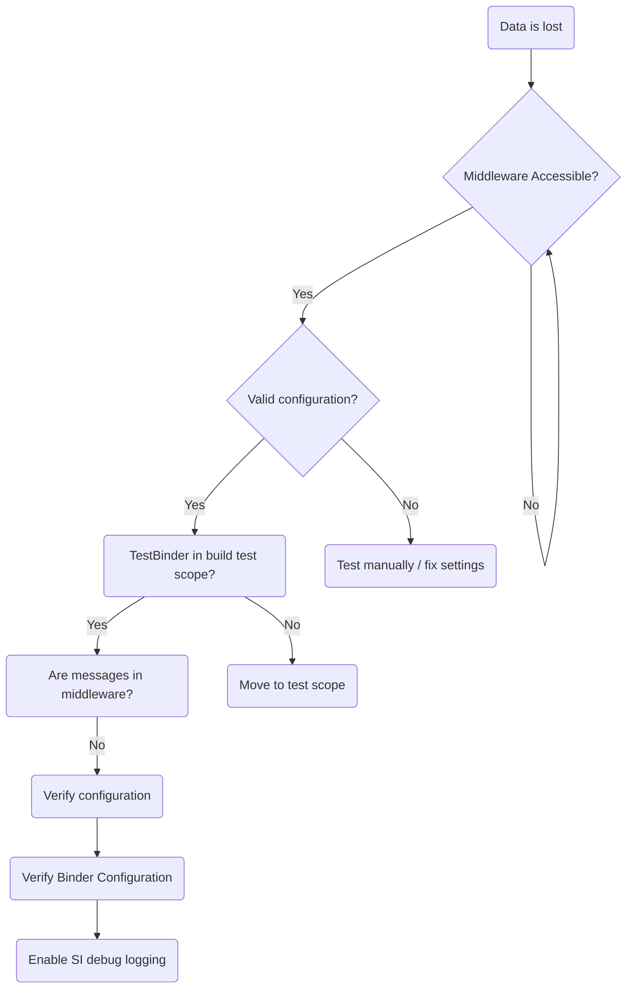

Sources, processors and sinks communicate through `Binder` instances over the chosen middleware.
Ensure that the middleware is available and all of the configuration is correct.
Configuration includes credentials, queue and topic names, hosts, and other details.
By default, if no binder dependency is included in the project's classpath, the `TestBinder` is used.

## Sources

The following diagram shows a typical debugging process for problematic sources:

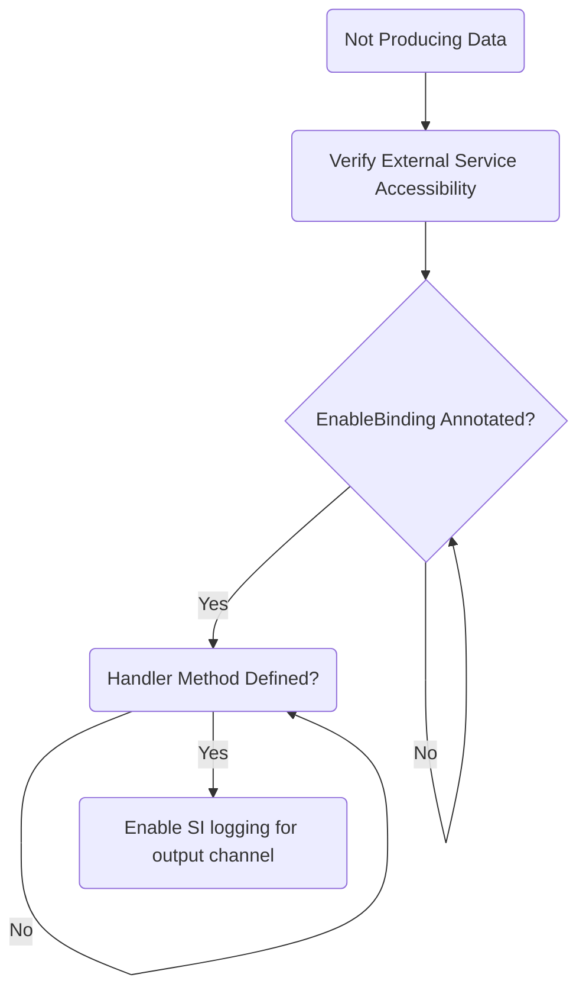

Sources obtain data from an input and send data to an output channel for downstream processing.
Ensure that the proper class-level annotation (`@EnableBinding(Source.class)`) is present and that the handler method is implemented.
The handler method should use an output channel of `Source.OUTPUT`.

## Processors - Input

The following diagram shows a typical debugging process for input sent to processors:

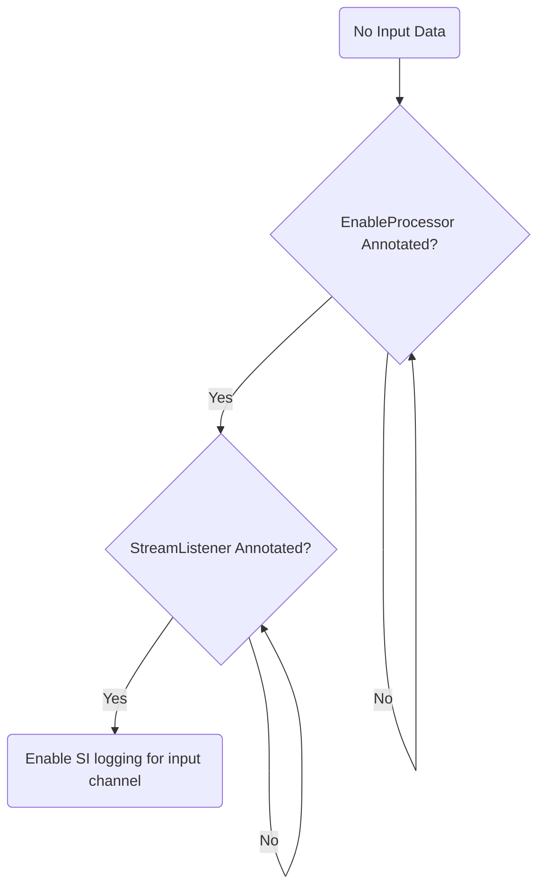

Processors obtain data and manipulate and return that data for further downstream processing.
Ensure that the proper class-level annotation (`@EnableBinding(Processor.class)`) is present and that the handler method is implemented.
The handler method should use an input channel of `Source.INPUT`.

## Processors - Output

The following diagram shows a typical debugging process for output from processors:

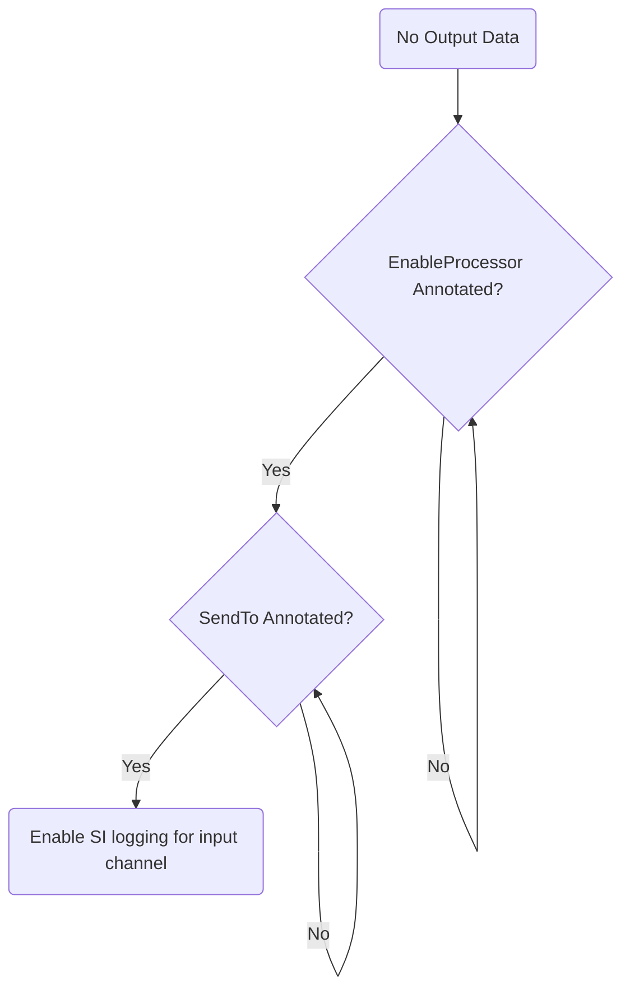

Processors obtain data and process and return that data for further downstream processing.
Ensure that the proper class level annotation (`@EnableBinding(Processor.class)`) is present and that the handler method is implemented.
The handler method should use an output channel of `Source.OUTPUT`.

## Sinks

The following diagram shows a typical debugging process for sinks:

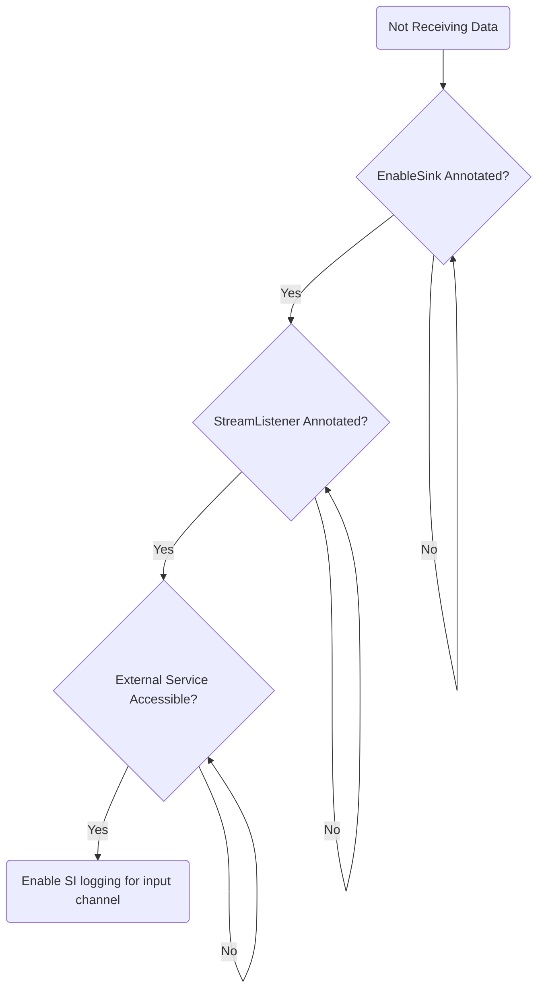

Sinks obtain data from an input channel and do something with it (such as storing the that data in an external repository).
Ensure that the proper class level annotation (`@EnableBinding(Sink.class)`) is present and that the handler method is implemented.
The handler method should use an output channel of `Source.INPUT`.

## Debugging Cloud Foundry Deployments

The following diagram shows a typical debugging process for Cloud Foundry deployments:

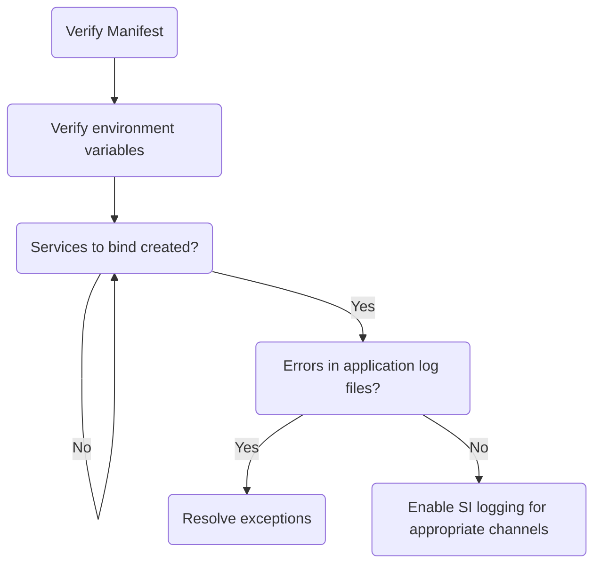

If an application runs locally but fails when deployed to Cloud Foundry, first inspect the deployment manifest (`manifest.yml`) for correctness.
This includes any environment variables that must be set, services to which to bind, and whether those services are created.
Inspect the application startup log for any exceptions to resolve.

## Debugging Kubernetes Deployments

The following diagram shows a typical debugging process for Kubernetes deployments:

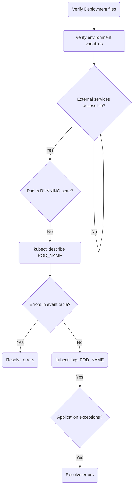

If an application runs locally but fails when deployed to Kubernetes, first inspect the deployment files for correctness.
This includes any environment variables that must be set, properties to which the services connect, and whether those services are available.
Examine the application pod's event table to see issues with creating the pod, such as image pull causes, health check failures, and others.
Inspect the application startup log for any exceptions to resolve.

#### Containers

The following diagram shows a typical debugging process for containers:

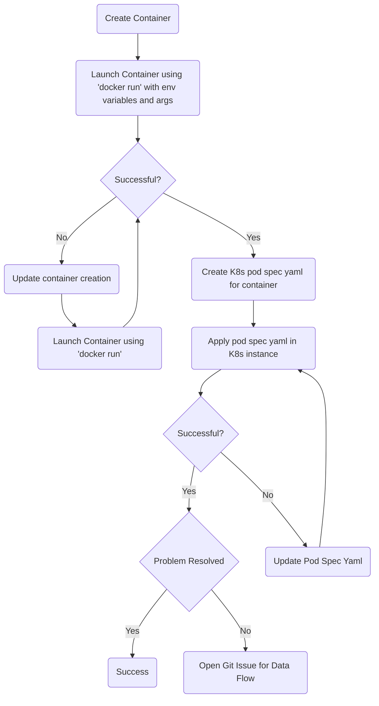

As discussed earlier, the application may run as expected from your local platform but still fails when launched from Spring Cloud Data Flow.
This could be because of how the container is created by the tool that creates the container (for example: DockerFile, Spring Boot container Plugin, Jib, and others).
The preceding chart shows how to trouble shoot why apps may fail to launch because of container-related issues.

<!-- NOTE -->

Data Flow uses [common application properties](https://docs.spring.io/spring-cloud-dataflow/docs/current/reference/htmlsingle/#_common_application_properties)
and the [Spring Boot Common Tags](https://docs.spring.io/spring-boot/docs/current/reference/html/production-ready-features.html#production-ready-metrics-common-tags)
to apply common metrics tags to all deployed `Stream` applications. Those properties often use [Spring placeholders](https://docs.spring.io/spring-boot/docs/current/reference/html/spring-boot-features.html#boot-features-external-config-placeholders-in-properties)
to resolve their values. Consider the following example:
`| management.metrics.tags.application: ${spring.cloud.dataflow.stream.name:unknown}-${spring.cloud.dataflow.stream.app.label:unknown}-${spring.cloud.dataflow.stream.app.type:unknown} |`
Some image containers may not be able to parse this correctly and incorrectly replace the embedded properties with empty strings, which may cause stream apps to fail.
If you are not using metrics, you can disable these fields by setting the `spring.cloud.dataflow.applicationProperties.streamResource` to a non-existent file, as follows: `spring.cloud.dataflow.applicationProperties.streamResource=classpath:fake.yml`

<!-- END_NOTE -->
