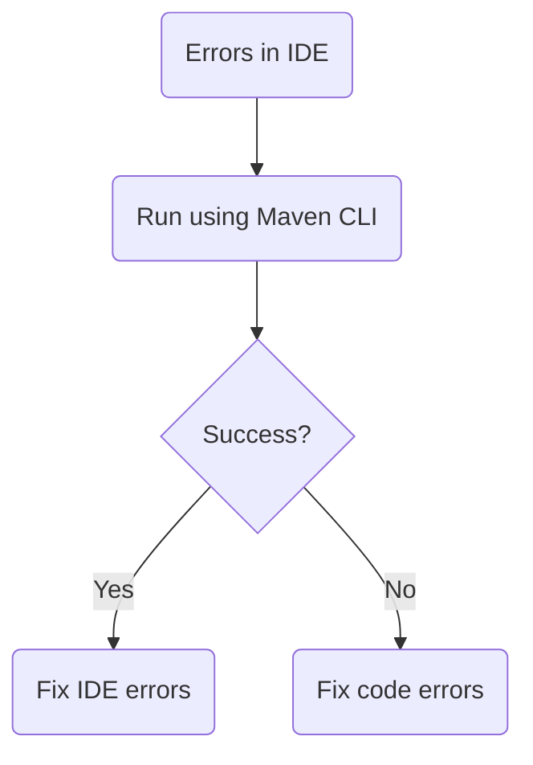
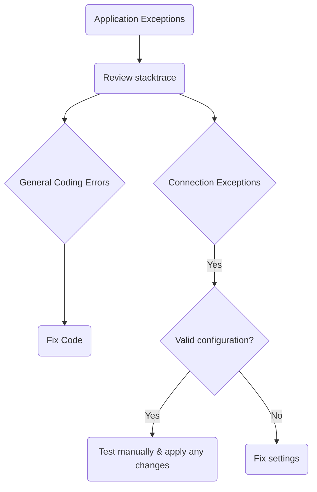
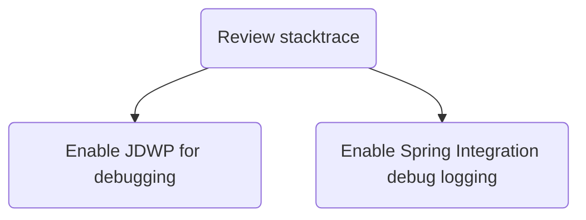
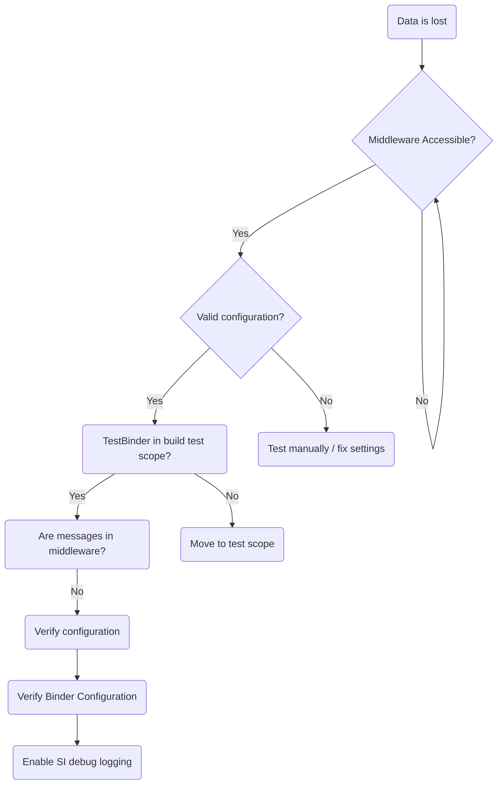
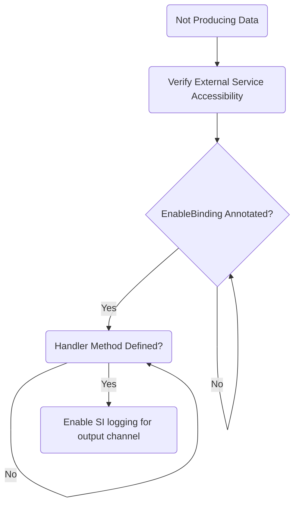
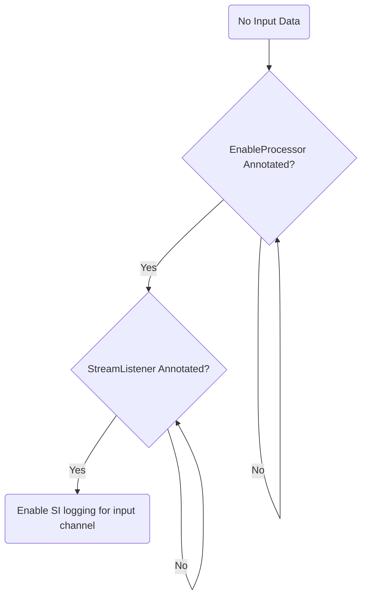
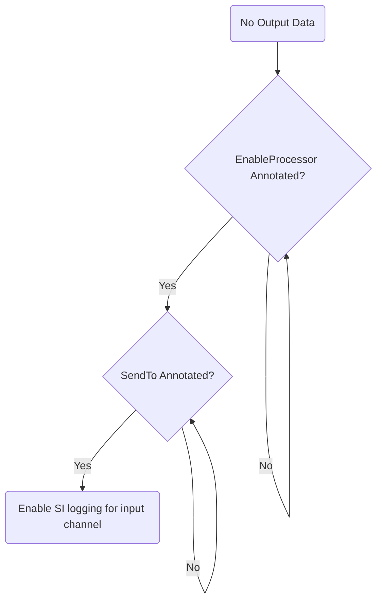
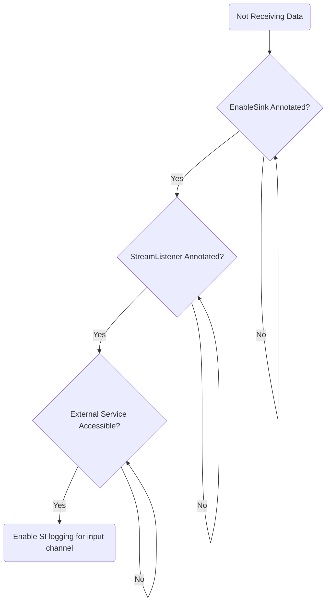
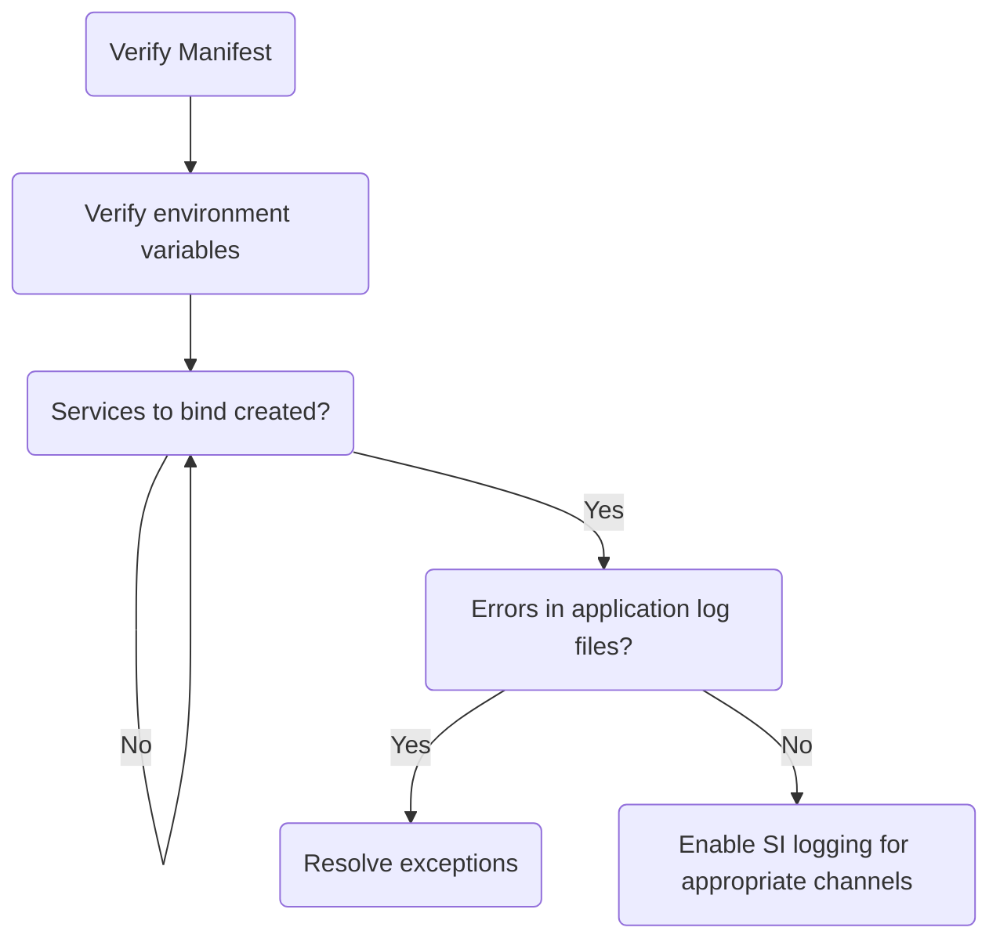
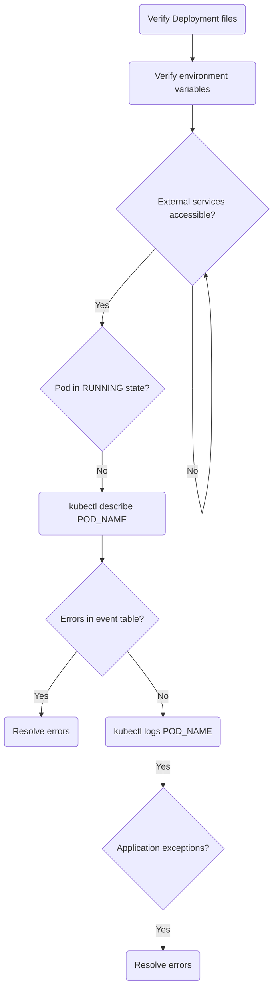

# Debugging Stream Applications

Applications should be runnable as a standard Java JAR, invoked via `java -jar`.
All dependencies such as databases and messaging middleware should be available and tested manually for connection issues.
Running and debugging applications is independent of deploying via SCDF and running on a platform.

## Project Build Errors

Fixing errors in the IDE will be dependent on which IDE is used.
By verifying the build is successful outside the IDE, this helps rule out project specific issues.

## Application Startup Exceptions

When the application starts up, exceptions may occur due to general coding errors or connectivity issues.
Review the application log file to find the exceptions and fix as appropriate.
Ensure all external services are reachable, correct credentials are provided and any other required information.

## General Application Debugging

Applications can be debugged as normal java processes as well as by utilizing verbose log output via the DEBUG logging level.

To debug your application using a debugger, add the following JVM argument when starting your application, for example:

`-agentlib:jdwp=transport=dt_socket,server=y,suspend=y,address=5005`

By adding this parameter, your application will wait for a debugger to connect on port `5005` to start debugging.
This can be any port you choose that is not already in use.

Enabling DEBUG level logging can also be a useful aid.
One package of interest is Spring Integration (SI): `org.springframework.integration`.
To enable debug logging of this package, add the following JVM argument when starting your application, for example:

`-Dlogging.level.org.springframework.integration=DEBUG`

## Data Loss

Sources, processors and sinks communicate via `Binder`'s over the chosen middleware.
Ensure the middleware is available and all configuration is correct.
Configuration includes credentials, queue/topic names, hosts, etc.
By default, if no binder dependency is included in the project's classpath, the `TestBinder` will be used.

## Sources

Sources obtain data from an input and send data to an output channel for downstream processing.
Ensure the proper class level annotation `@EnableBinding(Source.class)` is present and the handler method is implemented.
The handler method should use an output channel of `Source.OUTPUT`.

## Processors - Input

Processors obtain data, manipulate and return that data for further downstream processing.
Ensure the proper class level annotation `@EnableBinding(Processor.class)` is present and the handler method is implemented.
The handler method should use an input channel of `Source.INPUT`.

## Processors - Output

Processors obtain data, process and return that data for further downstream processing.
Ensure the proper class level annotation `@EnableBinding(Processor.class)` is present and the handler method is implemented.
The handler method should use an output channel of `Source.OUTPUT`.

## Sinks

Sinks obtain data from an input channel and for example store the that data in an external repository.
Ensure the proper class level annotation `@EnableBinding(Sink.class)` is present and the handler method is implemented.
The handler method should use an output channel of `Source.INPUT`.

## Debugging Cloud Foundry Deployments

If an application that runs locally, but fails when deployed to Cloud Foundry, first inspect the deployment manifest (manifest.yml) for correctness.
This includes any environment variables that must be set, services to bind to and those services created.
Inspect the application startup log for any exceptions to resolve.

## Debugging Kubernetes Deployments

If an application that runs locally, but fails when deployed to Kubernetes, first inspect the deployment files for correctness.
This includes any environment variables that must be set, properties for services to connect to and those services available.
Describe the application pod's event table to see issues creating the pod such as image pull causes, health check failures, etc.
Inspect the application startup log for any exceptions to resolve.
