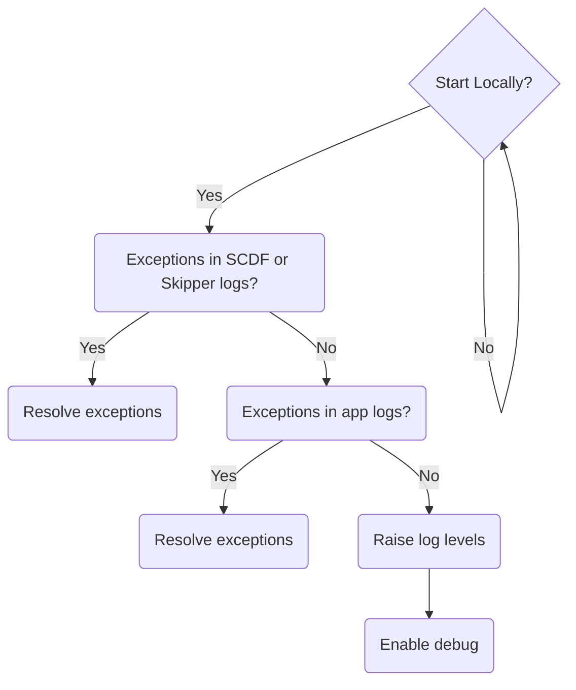
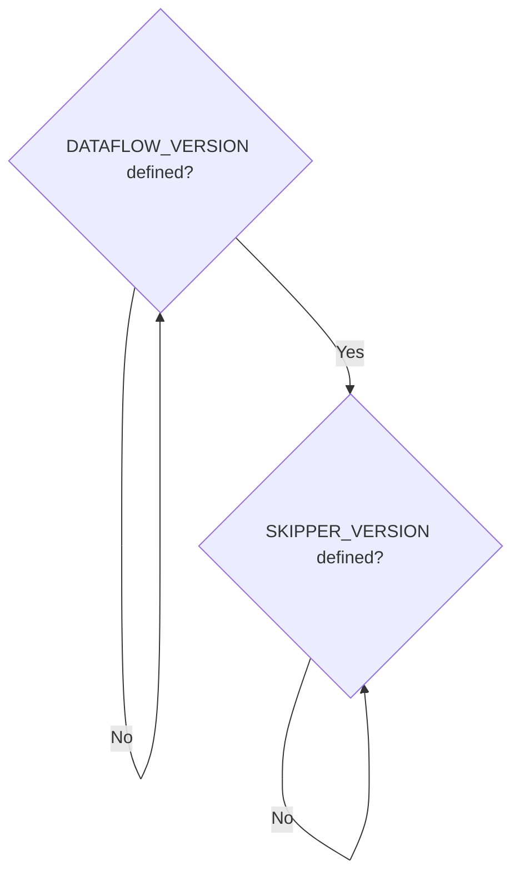
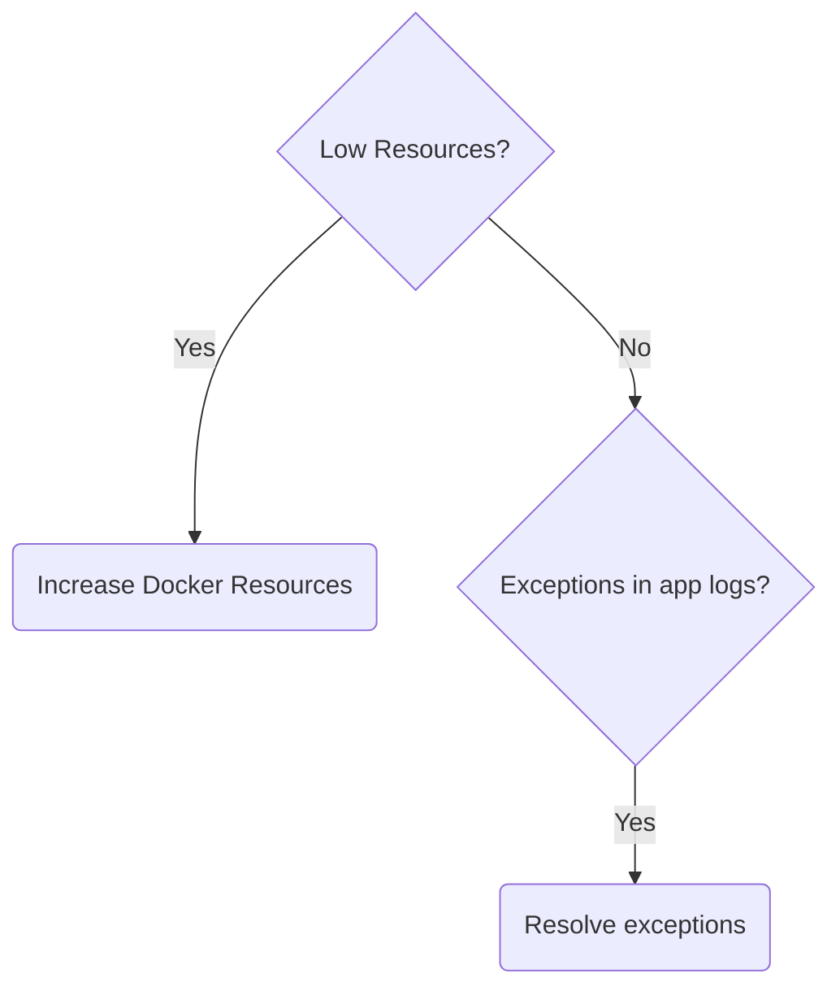
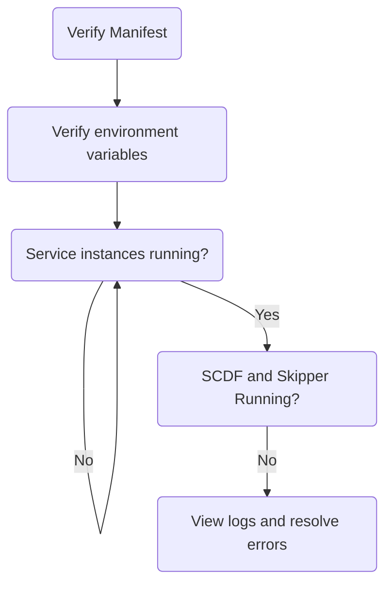
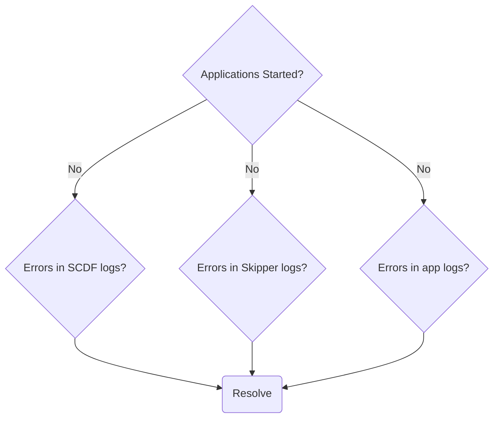
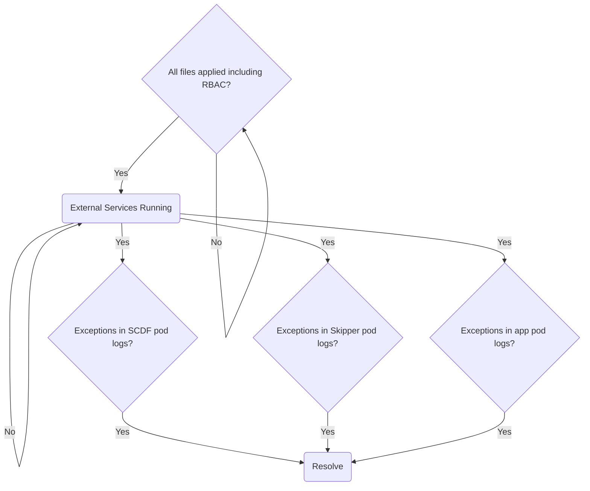
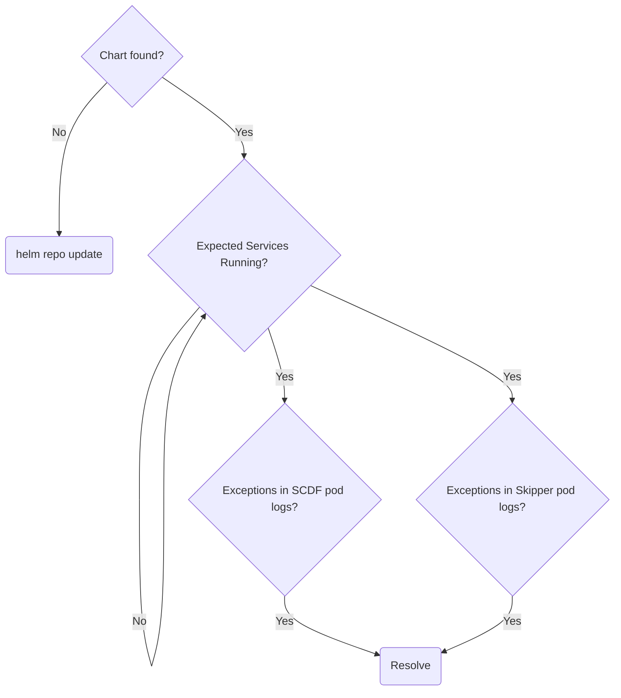
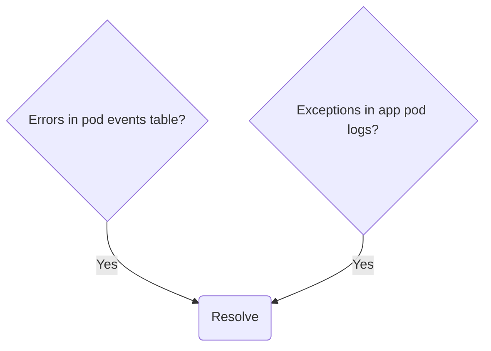

# Debugging Streams in Data Flow

If a stream fails to deploy:

- Ensure the latest GA of a particular release version is being used
- Ensure platform of choice meets at least the minimum supported version
- Before deploying stream applications in SCDF ensure the application has been successfully executed standalone. Refer to [Debugging Stream Applications](%currentPath%/stream-developer-guides/troubleshooting/debugging-stream-apps/) before continuing.

Skipper is responsible for deploying streams.
Stream deployment failure messages can typically be found in the Skipper application logs.

The rest of the guide is divided in to sections for each platform.

## Local



Application log files can be inspected on a per application basis.
To aggregate logs from all applications into one, the deployer property `inheritLogging=true` can be set.
See
["Is it possible to aggregate Local deployments into a single log?"](%currentPath%/resources/faq/#aggregatelogs)
for more information and ["How do I enable DEBUG logs for platform deployments?"](%currentPath%/resources/faq/#debuglogs) for enabling more log output.

Debugging applications via JDWP can be accomplished by setting the deployer property `debugPort`.
See ["How do I remote debug deployed applications?"](%currentPath%/resources/faq/#remotedebug) for more information.

### Docker Compose - Startup



The environment variables `DATAFLOW_VERSION` and `SKIPPER_VERSION` must be available in the current terminal environment via `export` or prefixing the `docker-compose` command.
See [Starting Docker Compose](%currentPath%/installation/local/docker/) for more information.

### Docker Compose - Runtime



By default, the amount of memory allocated to Docker may be too low.
The recommended amount of memory to allocate is 8GB.
The command `docker stats` can provide useful information into resource usage.
If applications are failing to deploy due to resource constraints, increase resource allocations.
Consult the [Docker documentation](https://docs.docker.com/) for your platform.

As streams are deployed via Skipper, applications that are part of that stream will be launched as Java processes on the Skipper container.
For every part of a stream, an application is deployed.
The overall resource allocation (memory, CPU, etc) provided to Docker should account for the number of deployed applications.
See [Viewing Stream Logs](https://docs.spring.io/spring-cloud-dataflow/docs/current/reference/htmlsingle/#getting-started-local-deploying-spring-cloud-dataflow-docker-viewing-stream-logs) for more information on viewing log files.

## Cloud Foundry

### Startup failures



### Application failures



When debugging deployment issues, raising deployer and Cloud Foundry related log levels may be useful.
See ["How do I enable DEBUG logs for platform deployments?"](%currentPath%/resources/faq/#debuglogs) for more information.

## Kubernetes

### Distributed Deployment Files



### Helm Chart



### General



When describing a pod, the `events` table section provides useful information when debugging and can be invoked by the following:

`kubectl describe po/pod_name`

For example, the events from a successfully deployed `time` application would look similar to:

```
Events:
  Type    Reason     Age   From               Message
  ----    ------     ----  ----               -------
  Normal  Scheduled  2m    default-scheduler  Successfully assigned default/ticktock-time-v16-869947b6b9-brfc4 to minikube
  Normal  Pulled     2m    kubelet, minikube  Container image "springcloudstream/time-source-rabbit:2.1.0.RELEASE" already present on machine
  Normal  Created    2m    kubelet, minikube  Created container
  Normal  Started    2m    kubelet, minikube  Started container
```

Application logs can be tailed to watch logs as they come in, for example:

`kubectl logs -f po/pod_name`

# Troubleshooting Help

If none of those above troubleshooting techniques helped and if you're still looking for help, you can reach out to us in [StackOverflow](https://stackoverflow.com/tags/spring-cloud-dataflow/) with the relevant details (see: [Wiki](https://github.com/spring-cloud/spring-cloud-dataflow/wiki/Reporting-Issues)) - we actively monitor the forum threads.
