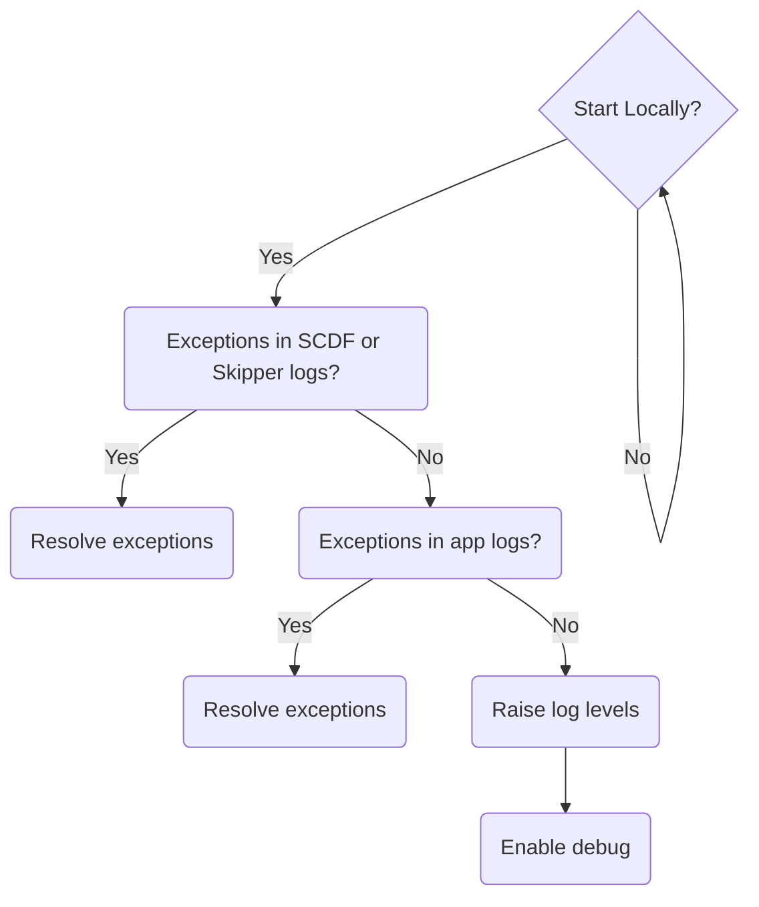
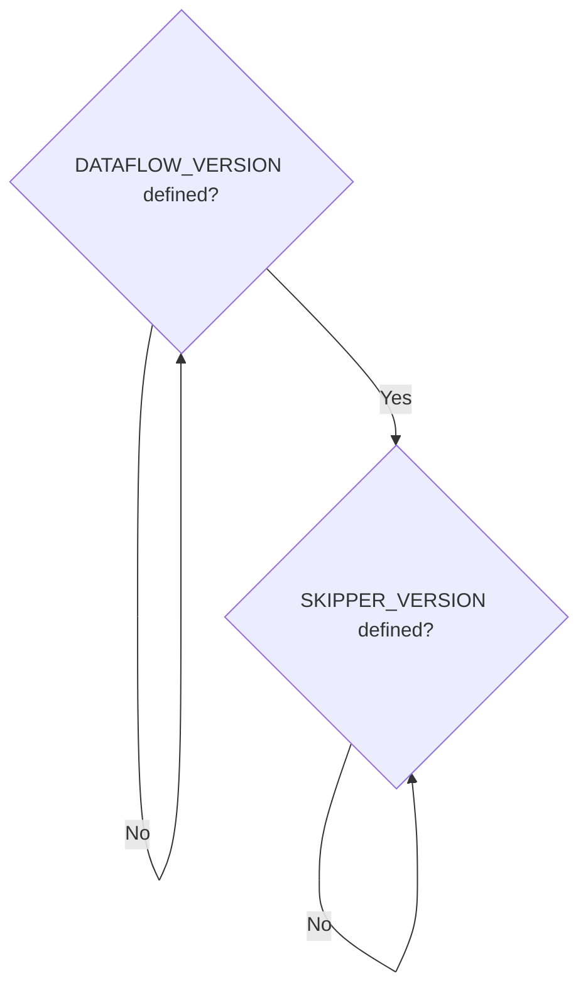
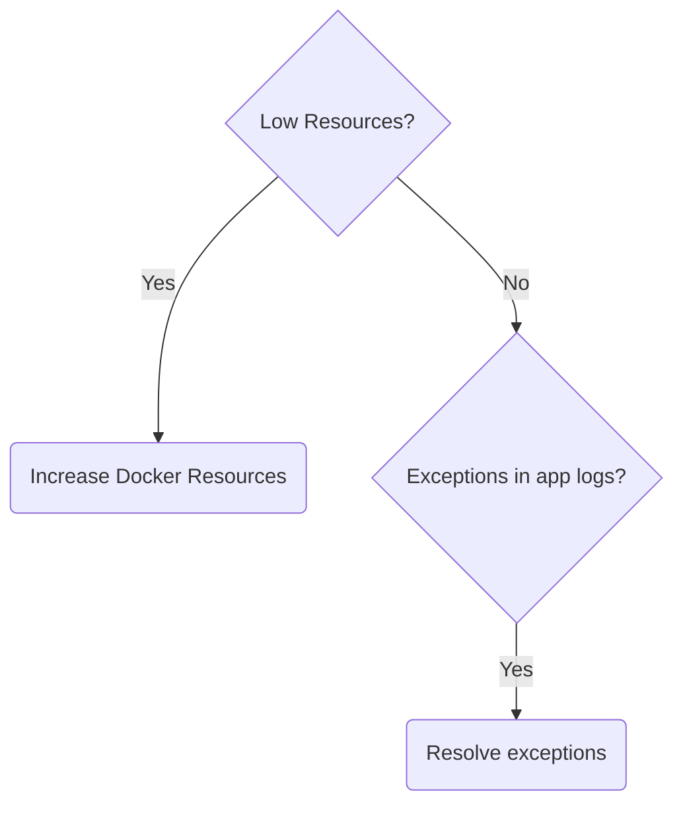
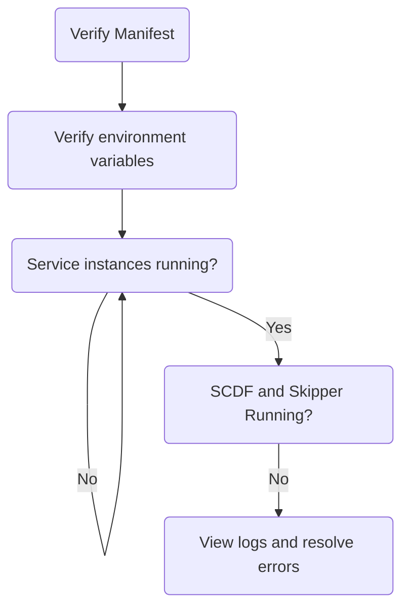
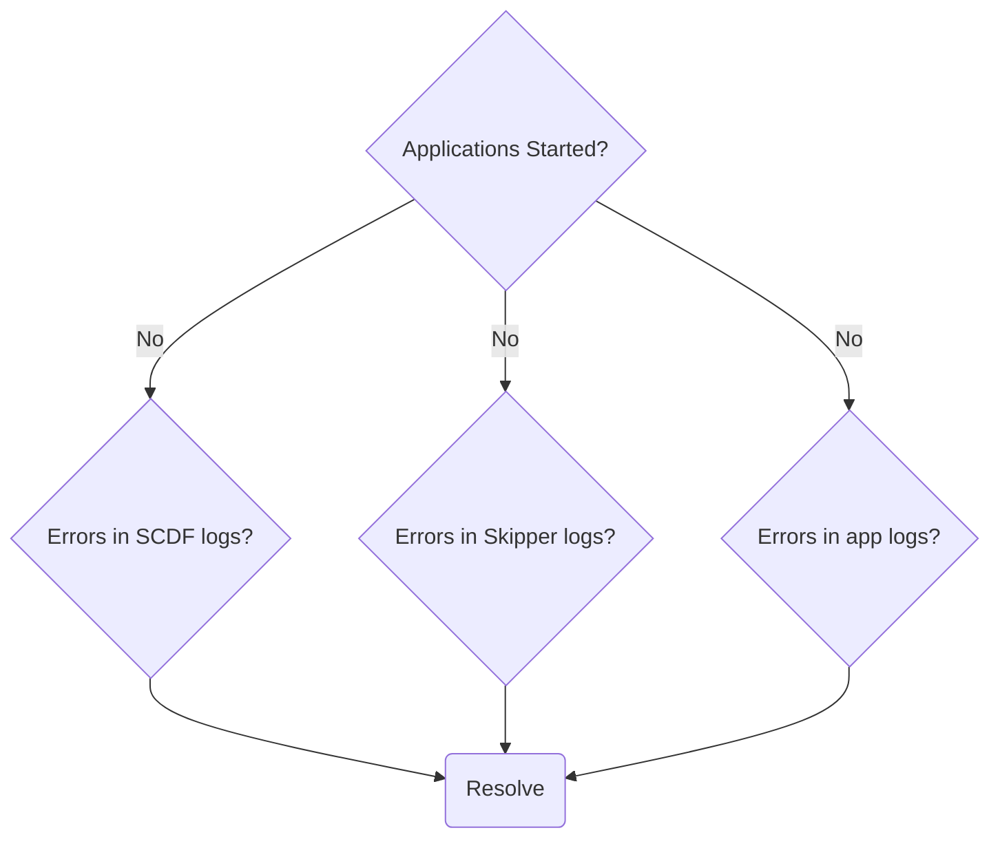
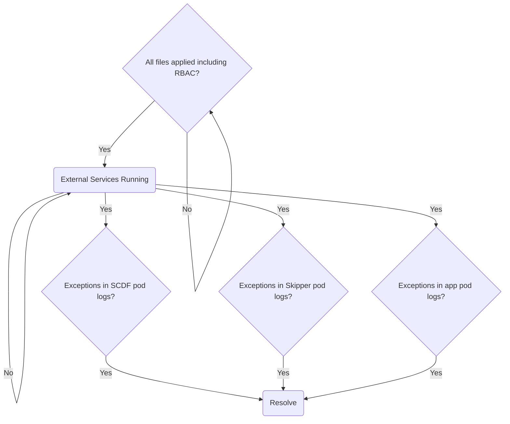
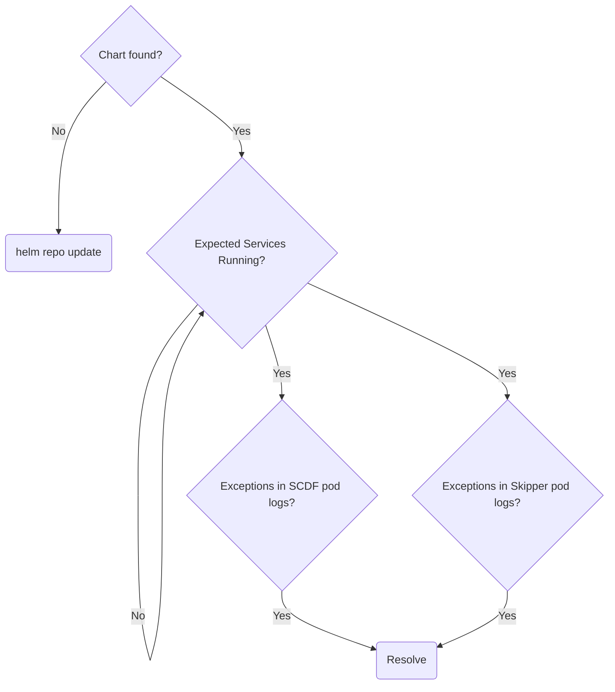
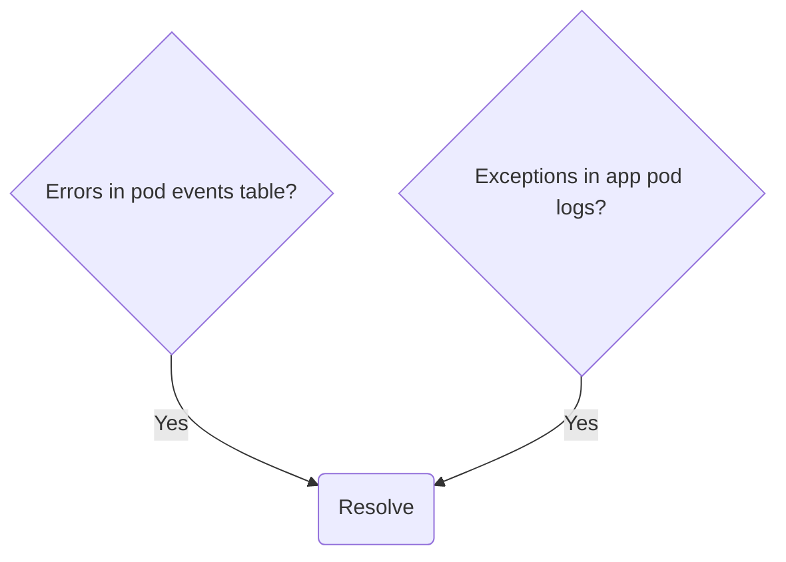

# Debugging streams

If a stream fails to deploy:

- Ensure the latest GA of a particular release version is being used
- Ensure platform of choice meets at least the minimum supported version
- All applications that are part of the stream have been tested as standalone applications outside of SCDF

Skipper is responsible for deploying streams.
Stream deployment failure messages can typically be found in the Skipper application logs.

# Local

Application log files can be inspected on a per application basis.
To aggregate logs from all applications into one, the deployer property `inheritLogging=true` can be set.
See
[Log Redirect](http://docs.spring.io/spring-cloud-dataflow/docs/current/reference/htmlsingle/#_log_redirect)
for more information and [Deployment Logs](http://docs.spring.io/spring-cloud-dataflow/docs/current/reference/htmlsingle/#troubleshooting-deployment-logs) for enabling more log output.

Debugging applications via JDWP can be accomplished by setting the deployer property `debugPort`.
See [Remote Debugging](http://docs.spring.io/spring-cloud-dataflow/docs/current/reference/htmlsingle/#_remote_debugging) for more information.

# Docker Compose - Startup

The environment variables `DATAFLOW_VERSION` and `SKIPPER_VERSION` must be available in the current shell environment via `export` or prefixing the `docker-compose` command.
See [Starting Docker Compose](http://docs.spring.io/spring-cloud-dataflow/docs/current/reference/htmlsingle/#getting-started-local-deploying-spring-cloud-dataflow-docker-starting) for more information.

# Docker Compose - Runtime

By default, the amount of memory allocated to Docker may be too low.
The command `docker stats` can provide useful information into resource usage.
If applications are failing to deploy due to resource constraints, increase resource allocations.
Consult the [Docker documentation](https://docs.docker.com/) for your platform.

As streams are deployed via Skipper, applications that are part of that stream will be launched as Java processes on the Skipper container.
See [Viewing Stream Logs](http://docs.spring.io/spring-cloud-dataflow/docs/current/reference/htmlsingle/#getting-started-local-deploying-spring-cloud-dataflow-docker-viewing-stream-logs) for more information on viewing log files.

# Cloud Foundry - Startup failures

# Cloud Foundry - Application failures

When debugging deployment issues, raising deployer and Cloud Foundry releated log levels may be useful.
See [Deployment Logs](http://docs.spring.io/spring-cloud-dataflow/docs/current/reference/htmlsingle/#troubleshooting-deployment-logs) for more information.

# Kubernetes - Distributed Deployment Files

# Kubernetes - Helm Chart

# Kubernetes - General

When describing a pod, the `events` table section provides useful information when debugging and can be invoked by the following:

`kubectl describe po/pod_name`

Application logs can be tailed to watch logs as they come in, for example:

`kubectl logs -f po/pod_name`
