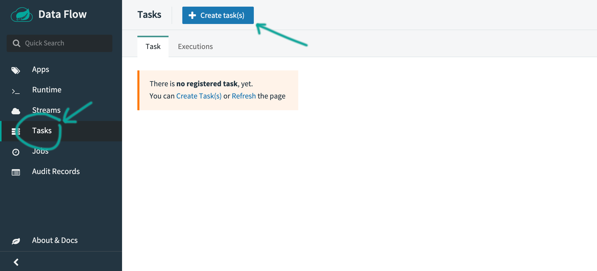
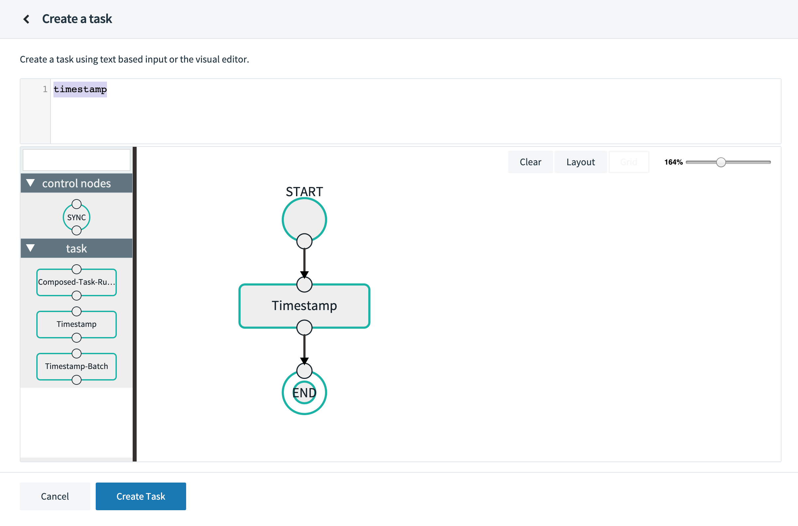
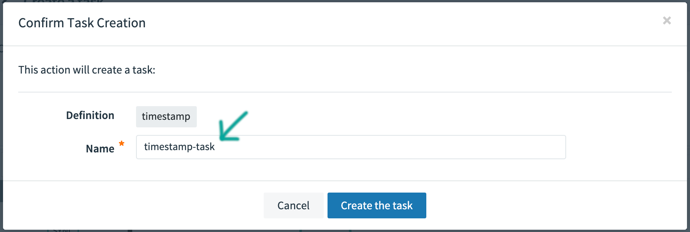
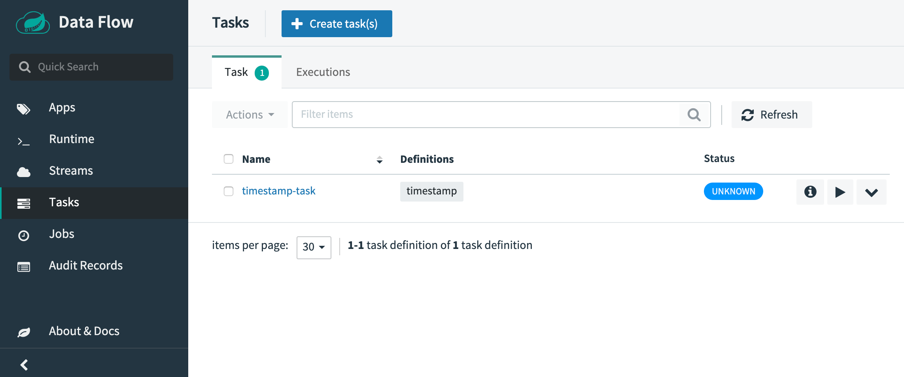
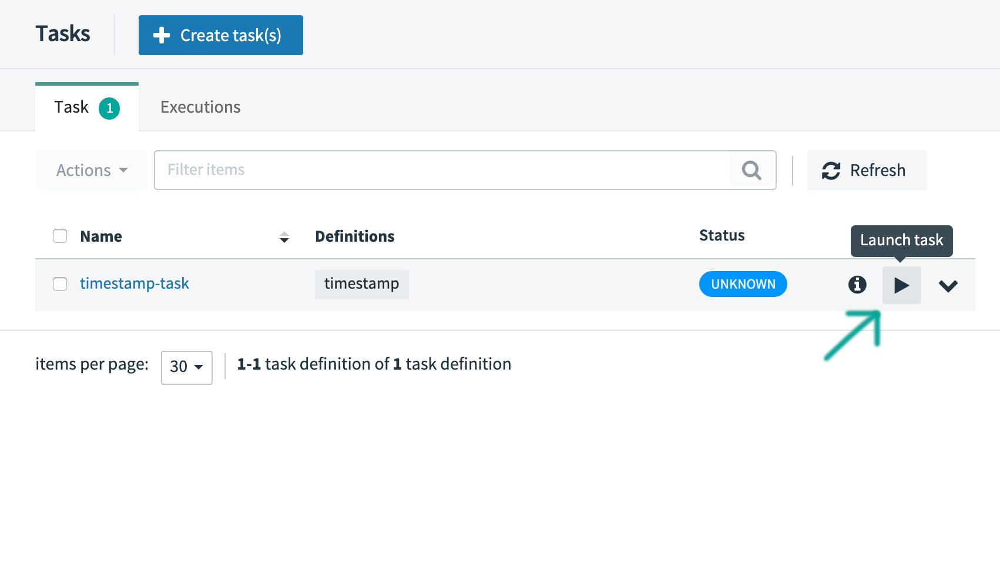
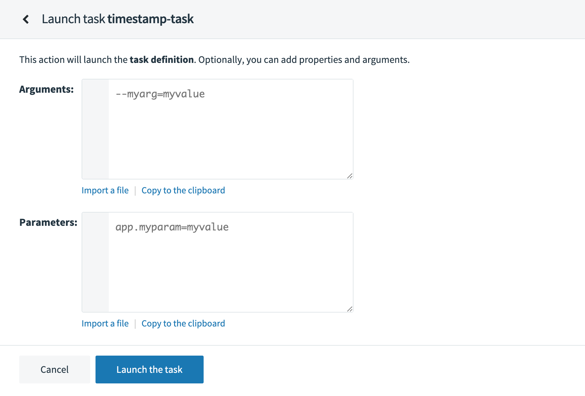
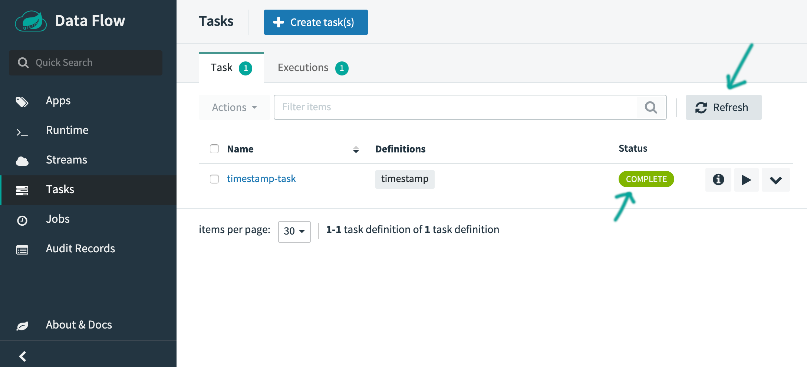
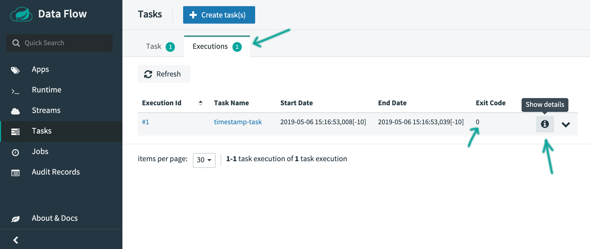
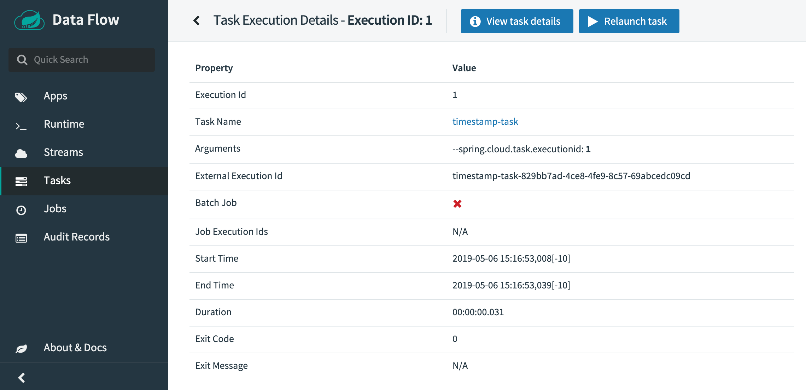
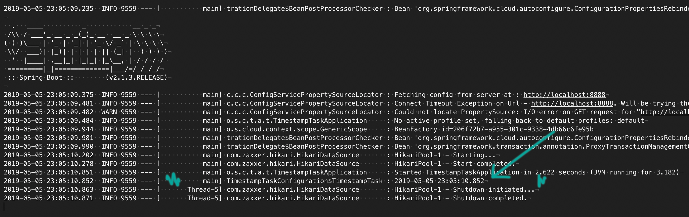

In this guide, we will create a simple task definition, and launch the task. A good starting point is to use the [Spring Cloud Task App Starters](https://cloud.spring.io/spring-cloud-task-app-starters/), that provide a set of task applications. Specifically, we will use the provided `timestamp` application, which is basically a hello-world-style application that logs the current timestamp. For this guide we assume that the respective `timestamp` task application has already been imported and registered with Spring Cloud Data Flow.

# Creating the Task

To create a task:

1.  In the menu, click **Tasks**.

2.  Click the **Create Task(s)** button.

    The screen changes to the following:

    

3.  In the text area, type `timestamp`. This will create a simple task definition using the Timestamp task application.

    

    Alternatively, you could have also dragged the Timestamp application from the apps pallette on the left onto the Flo canvas and connected `START` and `END` with the task application.

4.  Click `Create Task`.

5.  Enter `timestamp-task` as the name:

    

6.  Click the `Create the task` button.

    The Task Definitions page appears, listing the created definition `timestamp-task`.

    

## Execute a Task

Now that you have defined a task definition, let's execute it. Click the `play` (Launch task) button next to the `timestamp-task` definition that you have created in the previous section:

The UI will allow you to provide additional:

- **Arguments**: any properties that need to be passed as command line arguments
- **Parameters**: Additional properties meant for a TaskLauncher

As we don't need to provide additional argument or parameters, click the `Launch the task` button. The UI returns to the task definitions page.

After a few moments, the task definition should have the `COMPLETE` status. You may need to press the `Refresh` button to see the updated status.

## Verifying the Output

Click on the `Executions` tab:

You will see your executed task application with an exit code of `0`, indicating a successful execution. Click on the `Show details` button to see even more details:

If you would also like to see the logged timstamp and you use Spring Cloud Data Flow locally, then you can access the log files in the temporary directory defined by `java.io.tmpdir`. You should find a file `stdout.log` with contents similar to the following:

