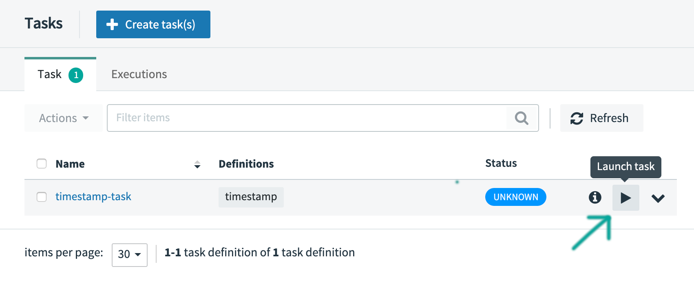

This is where we use OOTB apps to show timestamp task.

This content can come from the current 'getting started' guide.

Explain the OOTB apps.

# Creating the Task

To create a task:

1.  In the menu, click **Tasks**.

2.  Click the **Create Task(s)** button.

    The screen changes to the following:

    

3.  In the text area, type `timestamp`. This will create a simple task definition using the Timestamp task application.

    

    Alternatively, you could have also dragged the Timestamp application from the apps pallette on the left onto the Flo canvas and connected `START` and `END` with the task application.

4.  Click `Create Task`.

5.  Enter `timestamp-task` as the name:

    

6.  Click the `Create the task` button.

    The Task Definitions page appears, listing the created definition `timestamp-task`.

    

## Execute a Task

Now that you have defined a task definition, let's execute it.

Click the `play` (Launch task) button next to the `timestamp-task` definition that you have created in the previous section:

The UI will allow your to provide additional:

- **Arguments**: any properties that need to be passed as command line arguments
- **Parameters**: Additional properties meant for a TaskLauncher

As we don't needed to provide additional argument or parameters, click the `Launch the task` button. The UI returns to the task definitions page.

After a few moments, the task definition should have the `COMPLETE` status. You may need to press the `Refresh` button to see the updated status.

## Verifying the Output

If you used Spring Cloud Data Flow locally, you can access the log files in the temporary directory defined by `java.io.tmpdir`. You should find a file `stdout.log` with contents similar to the following:

**INFO** This can be overridden by specifying the deployment property `spring.cloud.deployer.local.workingDirectoriesRoot`. For more information see the chapter on [Deployer Properties](https://docs.spring.io/spring-cloud-dataflow/docs/current/reference/htmlsingle/#configuration-local-deployer) in the Spring Cloud Dataflow reference guide.
