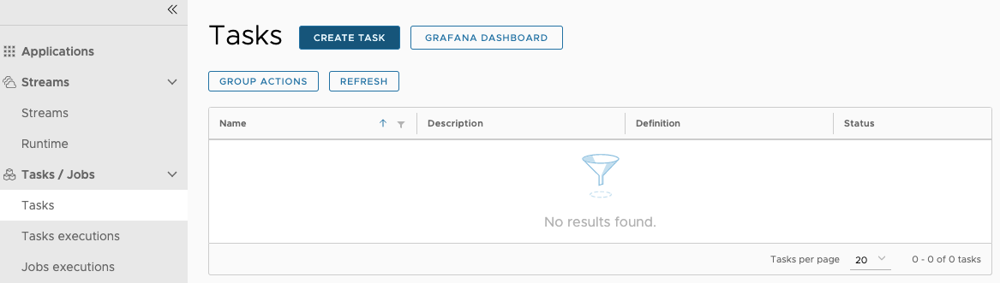
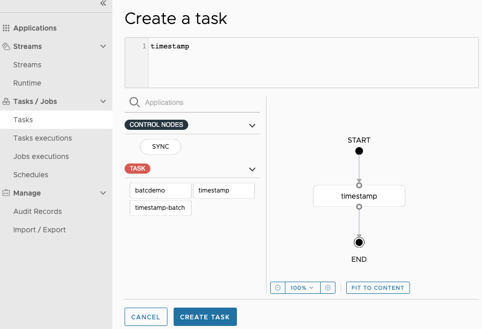
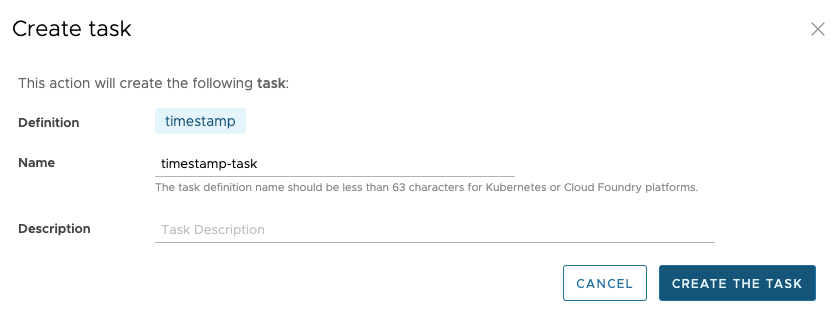
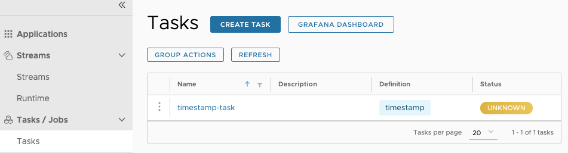
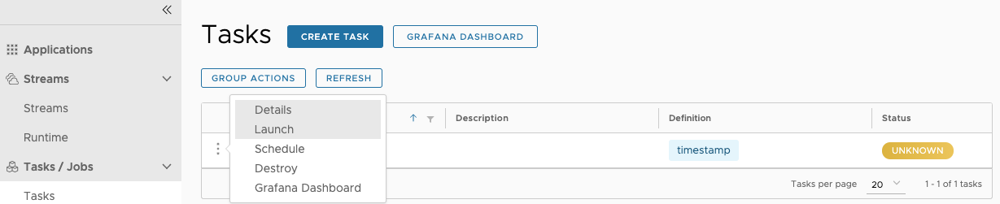
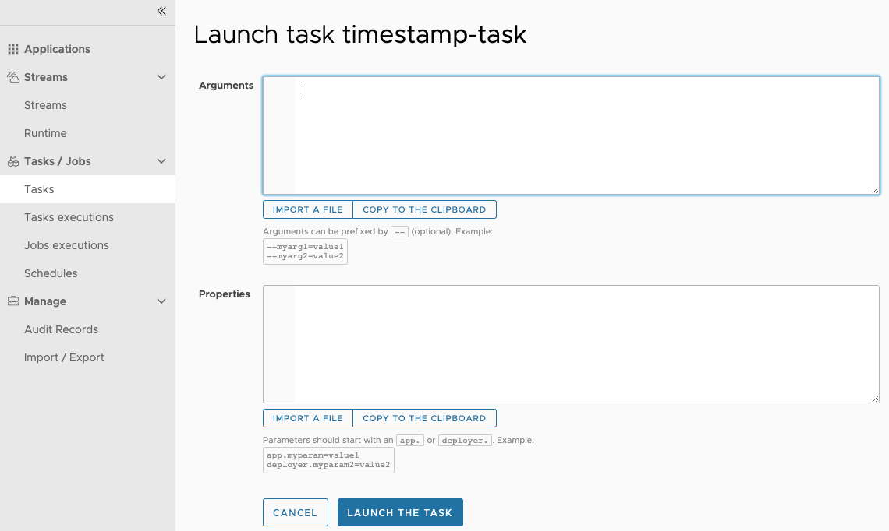
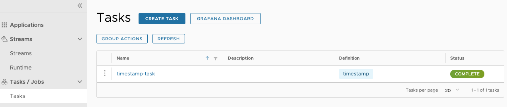
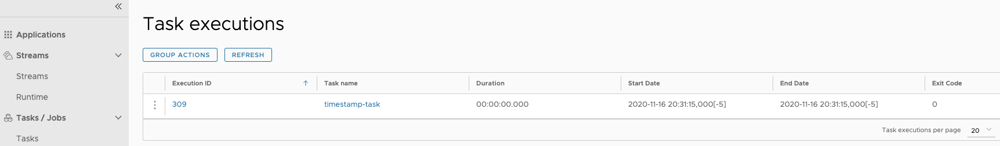
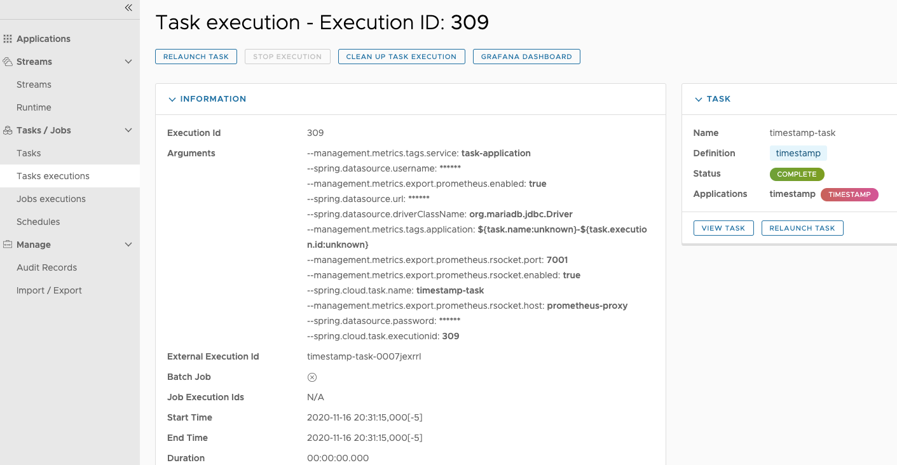
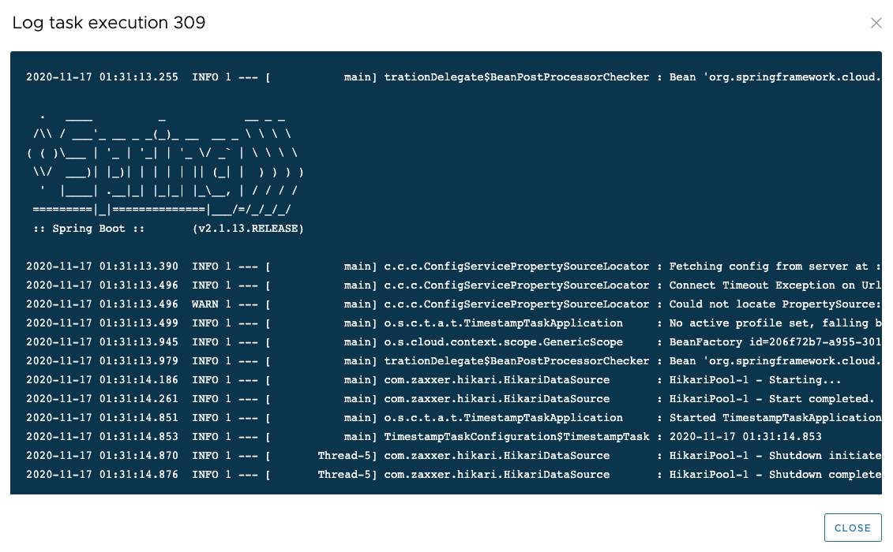

# Getting Started with Task Processing

In this guide, we create a simple task definition and launch the task.

The starting point is to use the [Spring Cloud Task App Starters](https://cloud.spring.io/spring-cloud-task-app-starters/), which provide a set of task applications.
Specifically, we use the provided `timestamp` application, which is basically a hello-world-style application that logs the current timestamp. For this guide, we assume that the respective `timestamp` task application has already been imported and registered with Spring Cloud Data Flow, as described in the [Installation guide](%currentPath%/installation/).

## Creating the Task

To create a task:

1.  In the menu, click **Tasks**.

1.  Click the **Create Task(s)** button.

    The screen changes to the following:

    

1.  In the text area, type `timestamp`. This creates a simple task definition that uses the Timestamp task application. The following image shows the Timestamp application:

    

    Alternatively, you could have also dragged the Timestamp application from the apps palette on the left to the Flo canvas and connected `START` and `END` with the task application.

1.  Click `Create Task`.

1.  Enter `timestamp-task` as the name, as the following image shows:

    

1.  Click the `Create the task` button.

    The Task Definitions page appears and lists the created definition (`timestamp-task`), as the following image shows:

    

## Running the Task

Now that you have defined a task definition, you can run it. To do so:

1. Click the "play" ("Launch task" if you hover over it) button next to the `timestamp-task` definition that you have created in the previous section, as the following image shows:

   

   The UI lets you provide additional:

   - **Arguments**: Any properties that need to be passed as command line arguments.
   - **Parameters**: Additional properties meant for a `TaskLauncher`.

   

1. As we do not need to provide additional argument or parameters, click the `Launch the task` button. The UI returns to the task definitions page, as the following image shows:

   

After a few moments, the task definition should show a status of "COMPLETE". You may need to press the **Refresh** button to see the updated status.

## Verifying the Output

To verify that the output is what you expect:

1. Click on the `Executions` tab, as the following image shows:

   

   You can see your task application with an exit code of `0`, indicating a successful execution.

1. Click on the `Show details` button to see even more details, as the following image shows:

   

If you would also like to see the logged timestamp and you use Spring Cloud Data Flow locally, you can access the log files in the temporary directory (which is defined by `java.io.tmpdir`). You should find a file named `stdout.log` with contents similar to the following:

