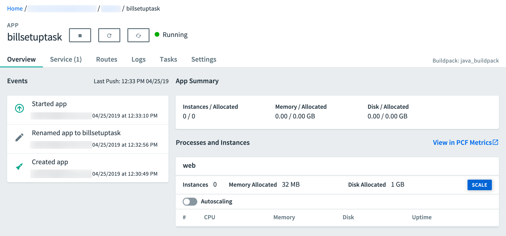
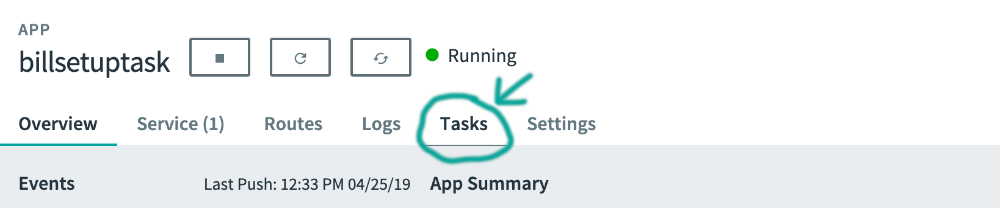
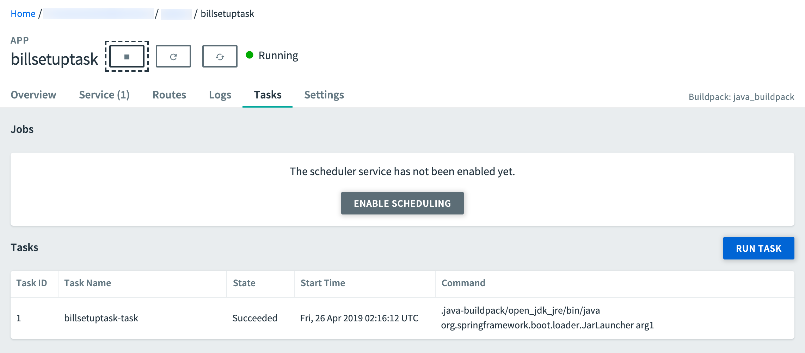

# Batch Processing with Spring Cloud Task

In this guide, we develop a Spring Boot application that uses Spring Cloud Task and deploy it to Cloud Foundry, Kubernetes, and your local machine. In another guide, we deploy the [Task application using Data Flow](%currentPath%/batch-developer-guides/batch/data-flow-simple-task/).

The following sections describe how to build this application from scratch. If you prefer, you can download a zip file that contains the sources for the application (called `billsetup`), unzip it, and proceed to the [deployment](#deployment) step.

You can [download the project](https://github.com/spring-cloud/spring-cloud-dataflow-samples/blob/master/dataflow-website/batch-developer-guides/batch/batchsamples/dist/batchsamples.zip?raw=true) from your browser or, by running the following command, from the command-line:

```bash
wget https://github.com/spring-cloud/spring-cloud-dataflow-samples/blob/master/dataflow-website/batch-developer-guides/batch/batchsamples/dist/batchsamples.zip?raw=true -O batchsamples.zip
```

## Development

We start from the [Spring Initializr](https://start.spring.io/) and create a Spring Cloud Task application.

Suppose a cell phone data provider needs to create billing statements for customers. The usage data is stored in JSON files that are stored on the file system. The billing solution must pull data from these files, generate the billing data from this usage data, and store it in a `BILLING_STATEMENTS` table.

For this example, we break up the solution into two phases:

1. `billsetuptask`: The `billsetuptask` application is a Spring Boot application that uses Spring Cloud Task to create the `BILL_STATEMENTS` table.
1. [`billrun`](%currentPath%/batch-developer-guides/batch/spring-batch/): The [`billrun`](%currentPath%/batch-developer-guides/batch/spring-batch/) application is a Spring Boot application that uses Spring Cloud Task and Spring Batch to read usage data and price for each row from a JSON file and put the resulting data into the `BILL_STATEMENTS` table.

For this section, we create a Spring Cloud Task and Boot application that creates the `BILL_STATEMENTS` table that are used by the BillRun application.


### Initializr

Either [download the initialzr generated project directly](https://start.spring.io/starter.zip?fakeusernameremembered=&fakepasswordremembered=&type=maven-project&language=java&baseDir=billsetuptask&groupId=io.spring&artifactId=billsetuptask&name=Bill+Setup+Task&description=Bill+Setup+Task+Sample+App&packageName=io.spring.billsetuptask&packaging=jar&inputSearch=&style=cloud-task&style=jdbc&style=h2&style=mysql) or visit the [Spring Initializr site](https://start.spring.io/) and follow these instructions:

1. Visit the [Spring Initialzr site](https://start.spring.io/).
1. Select the latest release of Spring Boot.
1. Create a new Maven project with a Group name of `io.spring` and an Artifact name of `billsetuptask`.
1. In the **Dependencies** text box, type `task` to select the Cloud Task dependency.
1. In the **Dependencies** text box, type `jdbc` then select the JDBC dependency.
1. In the **Dependencies** text box, type `h2` then select the H2 dependency.
   We use H2 for unit testing.
1. In the **Dependencies** text box, type `mysql` then select mysql dependency(or your favorite database).
   We use MySql for the runtime database.
1. Click the **Generate Project** button.

Now you should `unzip` the `usbillsetuptask.zip` file and import the project into your favorite IDE.

### Setting up MySql

If you do not have an instance of MySql installed available to you, you can follow these instructions to run a MySql docker image for this example.

1. Pull the MySql docker image by running the following command:

   ```bash
   docker pull mysql:5.7.25
   ```

2. Start MySql by running the following command:

   ```bash
   docker run -p 3306:3306 --name mysql -e MYSQL_ROOT_PASSWORD=password \
   -e MYSQL_DATABASE=task -d mysql:5.7.25
   ```

### Building The Application

Now we can create the code required for this application. To do so:

1.  Create the package `io.spring.billsetuptask.configuration`.
1.  In the `io.spring.billsetuptask.configuration` package, create a [TaskConfiguration](https://github.com/spring-cloud/spring-cloud-dataflow-samples/tree/master/dataflow-website/batch-developer-guides/batch/batchsamples/billsetuptask/src/main/java/io/spring/billsetuptask/configuration/TaskConfiguration.java) class that resembles the following listing:

```Java
@Configuration
@EnableTask
public class TaskConfiguration {

    @Autowired
    private DataSource dataSource;

    @Bean
    public CommandLineRunner commandLineRunner() {
        return args -> {
            JdbcTemplate jdbcTemplate = new JdbcTemplate(dataSource);
            jdbcTemplate.execute("CREATE TABLE IF NOT EXISTS " +
                    "BILL_STATEMENTS ( id int, " +
                    "first_name varchar(50), last_name varchar(50), " +
                    "minutes int,data_usage int, bill_amount double)");
        };
    }
}
```

The `@EnableTask` annotation sets up a `TaskRepository`, which stores information about the task execution (such as the start and end time of the task and the exit code).

### Testing

Now we can create our test. To do so, update the contents of [BillsetuptaskApplicationTests.java](https://github.com/spring-cloud/spring-cloud-dataflow-samples/tree/master/dataflow-website/batch-developer-guides/batch/batchsamples/billsetuptask/src/test/java/io/spring/billsetuptask/BillsetuptaskApplicationTests.java) with the following code:

```Java
package io.spring.billsetuptask;

import javax.sql.DataSource;
import org.junit.Test;
import org.junit.runner.RunWith;

import org.springframework.beans.factory.annotation.Autowired;
import org.springframework.boot.test.context.SpringBootTest;
import org.springframework.jdbc.core.JdbcTemplate;
import org.springframework.test.context.junit4.SpringRunner;

import static org.junit.Assert.assertEquals;


@RunWith(SpringRunner.class)
@SpringBootTest
public class BillsetuptaskApplicationTests {

	@Autowired
	private DataSource dataSource;

	@Test
	public void testRepository() {
		JdbcTemplate jdbcTemplate = new JdbcTemplate(this.dataSource);
		int result = jdbcTemplate.queryForObject(
				"SELECT COUNT(*) FROM BILL_STATEMENTS", Integer.class);

		Assert.assertEquals(0, result);
	}
}
```

## Deployment

In this section, we deploy the task application to the local machine, Cloud Foundry, and Kubernetes.

### Local

Now we can take the next step of building the project. To do so:

1. From the command line, change directory to the location of your project and build the project by running the following Maven command: `./mvnw clean package`

1. Run the application with the configurations required to create the "BILL_STATEMENTS" table in the MySql database.
   To configure how the `billsetuptask` application runs, you can use the following arguments:

   1. `spring.datasource.url`: Set the URL to your database instance. In the following sample, we connect to a mysql `task` database on our local machine at port 3306.
   1. `spring.datasource.username`: The user name to be used for the MySql database. In the following sample, it is `root`.
   1. `spring.datasource.password`: The password to be used for the MySql database. In the following sample. it is `password`.
   1. `spring.datasource.driverClassName`: The driver to use to connect to the MySql database. In the following sample, it is `com.mysql.jdbc.Driver`.

   The following command runs the `billsetuptask` application with our database connection values:

   ```bash
   java -jar target/billsetuptask-0.0.1-SNAPSHOT.jar \
   --spring.datasource.url=jdbc:mysql://localhost:3306/task?useSSL=false \
   --spring.datasource.username=root \
   --spring.datasource.password=password \
   --spring.datasource.driverClassName=com.mysql.jdbc.Driver
   ```

#### Setting the Application Name for Task Execution

Spring Cloud Task records all task executions to a table called `TASK_EXECUTION`.
Here is some of the information that is recorded by Spring Cloud Task:

- `START_TIME`: The time at which the task execution started
- `END_TIME`: The time at which the task execution completed
- `TASK_NAME`: The name associated with the task execution
- `EXIT_CODE`: The exit code that was returned by the task execution
- `EXIT_MESSAGE`: The exit message that was returned for the execution
- `ERROR_MESSAGE`: The error message (if any) that was returned for the execution
- `EXTERNAL_EXECUTION_ID`: An ID to be associated with the task execution

By default, the `TASK_NAME` is `application`.

You can use the use the following commands to query the TASK_EXECUTION table:

<!-- Rolling my own to disable erroneous formatting -->
<div class="gatsby-highlight" data-language="bash">
<pre class="language-bash"><code>$ docker exec -it mysql bash -l
# mysql -u root -ppassword
mysql&gt; select * from task.TASK_EXECUTION;
</code></pre></div>

The results should resemble the following output:

```
| TASK_EXECUTION_ID | START_TIME          | END_TIME            | TASK_NAME       | EXIT_CODE | EXIT_MESSAGE | ERROR_MESSAGE | LAST_UPDATED        | EXTERNAL_EXECUTION_ID | PARENT_EXECUTION_ID |
|-------------------|---------------------|---------------------|-----------------|-----------|--------------|---------------|---------------------|-----------------------|---------------------|
|                 1 | 2019-04-23 18:10:57 | 2019-04-23 18:10:57 | application     |         0 | NULL         | NULL          | 2019-04-23 18:10:57 | NULL                  |                NULL |
```

Spring Cloud Task lets us change this setting by using the `spring.cloud.task.name`. To do so, we add that property to our next run, as follows:

```bash
java -jar target/billsetuptask-0.0.1-SNAPSHOT.jar \
--spring.datasource.url=jdbc:mysql://localhost:3306/task?useSSL=false \
--spring.datasource.username=root \
--spring.datasource.password=password \
--spring.datasource.driverClassName=com.mysql.jdbc.Driver \
--spring.cloud.task.name=BillSetupTest1
```

Now, when you query the table, you can see that the last task run in the query now has a name of `BillSetupTest1`.

#### Cleanup

To stop and remove the mysql container that is running in the docker instance, run the following command:

```bash
docker stop mysql
docker rm mysql
```

### Cloud Foundry

This guide walks through how to deploy and run simple [spring-cloud-task](https://spring.io/projects/spring-cloud-task) stand-alone applications to Cloud Foundry.

#### Requirements

On your local machine, you need to have installed the following:

- Java
- [Git](https://git-scm.com/)

You also need to have installed the [Cloud Foundry command line interface](https://console.run.pivotal.io/tools) (see the [documentation](https://docs.run.pivotal.io/cf-cli/)).

#### Building the Application

Now we can build the project.
To do so, from a command line, change directory to the location of your project and build the project by running the following Maven command: `./mvnw clean package`

#### Setting up Cloud Foundry

First, you need a Cloud Foundry account. You can create a free account by using [Pivotal Web Services](https://run.pivotal.io/) (PWS). We use PWS for this example. If you use a different provider, your experience may slightly vary from this description.

To log into Cloud Foundry from the [Cloud Foundry command line interface](https://console.run.pivotal.io/tools), run the following command:

```bash
cf login
```

[[tip]]
| You can also target specific Cloud Foundry instances with the `-a` flag &#151; for example, `cf login -a https://api.run.pivotal.io`.

Before you push an application, you should also ensure that you setup the **MySql Service** on Cloud Foundry. You can check what services are available by running the following command:

```bash
cf marketplace
```

On [Pivotal Web Services](https://run.pivotal.io/) (PWS) you should be able to use the following command to install the MySQL service:

```bash
cf create-service cleardb spark task-example-mysql
```

[[important]]
| Make sure you name your MySQL service `task-example-mysql`. The rest of this example uses that value.

#### Task Concepts in Cloud Foundry

In order to provide configuration parameters for Cloud Foundry, we create dedicated `manifest` YAML files for each application.

For additional information on setting up a manifest, see [here](https://docs.cloudfoundry.org/devguide/deploy-apps/manifest.html)

Running tasks on Cloud Foundry is a two-stage process. Before you can actually run any tasks, you need to first push an app that is staged without any running instances. We provide the following common properties to the manifest YAML file to each application:

```yml
memory: 32M
health-check-type: process
no-route: true
instances: 0
```

The key is to set the `instances` property to `0`. Doing so ensures that the application is staged without actually being run. We also do not need a route to be created and can set `no-route` to `true`.

<!--TIP-->

Having this app staged but not running has a second advantage as well. Not only do we need this staged application to run a task in a subsequent step, but, if our database service is internal (part of your Cloud Foundry instance), we can use this application to establish an SSH tunnel to the associated MySql database service to see the persisted data. We go into the details for that a little later in this document.

<!--END_TIP-->

#### Running `billsetuptask` on Cloud Foundry

To deploy the first task application (`billsetuptask`), you must create a file named `manifest-billsetuptask.yml` with the following contents:

```yaml
applications:
  - name: billsetuptask
    memory: 32M
    health-check-type: process
    no-route: true
    instances: 0
    disk_quota: 1G
    timeout: 180
    buildpacks:
      - java_buildpack
    path: target/billsetuptask-0.0.1-SNAPSHOT.jar
    services:
      - task-example-mysql
```

Now you can run `cf push -f ./manifest-billsetuptask.yml`. Doing so stages the application, and the application should be up. You can verify that the application is up in the Cloud Foundry dashboard, as the following image shows:



You can now run the task. To do so:

```bash
cf run-task billsetuptask ".java-buildpack/open_jdk_jre/bin/java org.springframework.boot.loader.JarLauncher arg1" --name billsetuptask-task
```

<!--TIP-->

You can specify the following optional arguments:

- `-k` Disk limit (e.g. 256M, 1024M, 1G)
- `-m` Memory limit (e.g. 256M, 1024M, 1G)

<!--END_TIP-->

The task should execute successfuly. You can verify the results in the Cloud Foundry dashboard by clicking onto the `Task` tab, as the following image shows:



In the `Tasks` table, you should see your task `billsetuptask` with a `State` of `Succeeded`, as the following image shows:



#### Removing All Task Applications and Services

With the conclusion of this example, if you do not plan to proceed to the Spring Batch example, you may want to remove all instances on Cloud Foundry. To do so, run the following commands:

```bash
cf delete billsetuptask -f
cf delete-service task-example-mysql -f
```

### Kubernetes

This section walks through how to deploy and run a simple [spring-cloud-task](https://spring.io/projects/spring-cloud-task) application on Kubernetes.

We deploy the [billsetuptask](%currentPath%/batch-developer-guides/batch/data-flow-simple-task/) sample application to Kubernetes.

#### Setting up the Kubernetes Cluster

We need a running [Kubernetes cluster](%currentPath%/installation/kubernetes#creating-a-kubernetes-cluster). For this example, we deploy to `minikube`.

##### Verifying that Minikube is Running

To verify that Minikube is running, run the following command:

```bash
$ minikube status

host: Running
kubelet: Running
apiserver: Running
kubectl: Correctly Configured: pointing to minikube-vm at 192.168.99.100
```

##### Installing the Database

You need to install a MySQL server by using the default configuration from Spring Cloud Data Flow. To do so, run the following command:

```bash
kubectl apply -f https://raw.githubusercontent.com/spring-cloud/spring-cloud-dataflow/master/src/kubernetes/mysql/mysql-deployment.yaml \
-f https://raw.githubusercontent.com/spring-cloud/spring-cloud-dataflow/master/src/kubernetes/mysql/mysql-pvc.yaml \
-f https://raw.githubusercontent.com/spring-cloud/spring-cloud-dataflow/master/src/kubernetes/mysql/mysql-secrets.yaml \
-f https://raw.githubusercontent.com/spring-cloud/spring-cloud-dataflow/master/src/kubernetes/mysql/mysql-svc.yaml
```

##### Building a Docker image

We need to build the docker image for the [billsetuptask](#batch_processing_with_spring_cloud_task) application. To do so, we use the [jib Maven plugin](https://github.com/GoogleContainerTools/jib/tree/master/jib-maven-plugin#build-your-image). If you downloaded the [source distribution](#batch_processing_with_spring_cloud_task), the jib plugin is already configured. If you built the apps from scratch, add the following under `plugins` in `pom.xml`:

```xml
<plugin>
    <groupId>com.google.cloud.tools</groupId>
    <artifactId>jib-maven-plugin</artifactId>
    <version>0.10.1</version>
    <configuration>
        <from>
            <image>springcloud/openjdk</image>
        </from>
        <to>
            <image>${docker.org}/${project.artifactId}:${docker.version}</image>
        </to>
        <container>
            <useCurrentTimestamp>true</useCurrentTimestamp>
        </container>
    </configuration>
</plugin>
```

Then add the referenced properties, under `properties`. For this example, we use the following properties:

```xml
<docker.org>springcloudtask</docker.org>
<docker.version>${project.version}</docker.version>
```

Now you can add the image to the `minikube` Docker registry. To do so, run the following commands:

```bash
eval $(minikube docker-env)
./mvnw clean package jib:dockerBuild
```

You can run the following command to verify its presence (by finding `springcloudtask/billsetuptask` in the resulting list of images):

```bash
docker images
```

##### Deploying the Application

The simplest way to deploy a task application is as a standalone [Pod](https://kubernetes.io/docs/concepts/workloads/pods/pod/).
Deploying tasks as a [Job](https://kubernetes.io/docs/concepts/workloads/controllers/jobs-run-to-completion/) or [CronJob](https://kubernetes.io/docs/tasks/job/) is considered best practice for production environments but is beyond the scope of this guide.

First, save the following content to `task-app.yaml`:

```yaml
apiVersion: v1
kind: Pod
metadata:
  name: billsetuptask
spec:
  restartPolicy: Never
  containers:
    - name: task
      image: springcloudtask/billsetuptask:1.0.0.BUILD-SNAPSHOT
      env:
        - name: SPRING_DATASOURCE_PASSWORD
          valueFrom:
            secretKeyRef:
              name: mysql
              key: mysql-root-password
        - name: SPRING_DATASOURCE_URL
          value: jdbc:mysql://mysql:3306/task
        - name: SPRING_DATASOURCE_USERNAME
          value: root
        - name: SPRING_DATASOURCE_DRIVER_CLASS_NAME
          value: com.mysql.jdbc.Driver
  initContainers:
    - name: init-mysql-database
      image: mysql:5.6
      env:
        - name: MYSQL_PWD
          valueFrom:
            secretKeyRef:
              name: mysql
              key: mysql-root-password
      command:
        [
          'sh',
          '-c',
          'mysql -h mysql -u root -e "CREATE DATABASE IF NOT EXISTS task;"',
        ]
```

Now you can start the application by running the following command:

```bash
kubectl apply -f task-app.yaml
```

When the task is complete, you should see output that resembles the following:

```bash
$ kubectl get pods
NAME                     READY   STATUS      RESTARTS   AGE
mysql-5cbb6c49f7-ntg2l   1/1     Running     0          4h
billsetuptask            0/1     Completed   0          81s
```

Once you are satisfied with the results, you can delete the pod. To do so, run the following command:

```bash
kubectl delete -f task-app.yaml
```

Now you can examine the database to see the results of running the application. To do so,
log in to the `mysql` container and query the `TASK_EXECUTION` table.
Get the name of the MySQL pod by running `kubectl get pods`, as shown earlier.
Then you need to log in, as the following example shows:

<!-- Rolling my own to disable erroneous formatting -->
<div class="gatsby-highlight" data-language="bash">
<pre class="language-bash"><code>$ kubectl exec -it mysql-5cbb6c49f7-ntg2l -- /bin/bash
# mysql -u root -p$MYSQL_ROOT_PASSWORD
mysql&gt; select * from task.TASK_EXECUTION;
</code></pre></div>

To uninstall `mysql`, run the following command:

```bash
kubectl delete all -l app=mysql
```

## What's Next

Congratulations! You have created and deployed a Spring Cloud Task application. Now you can go on to the [next section](/docs/batch-developer-guides/batch/spring-batch/) and create a Spring Batch Application.
