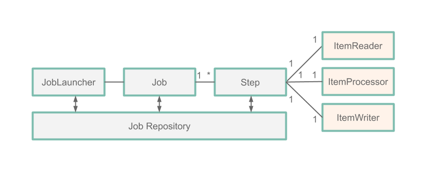
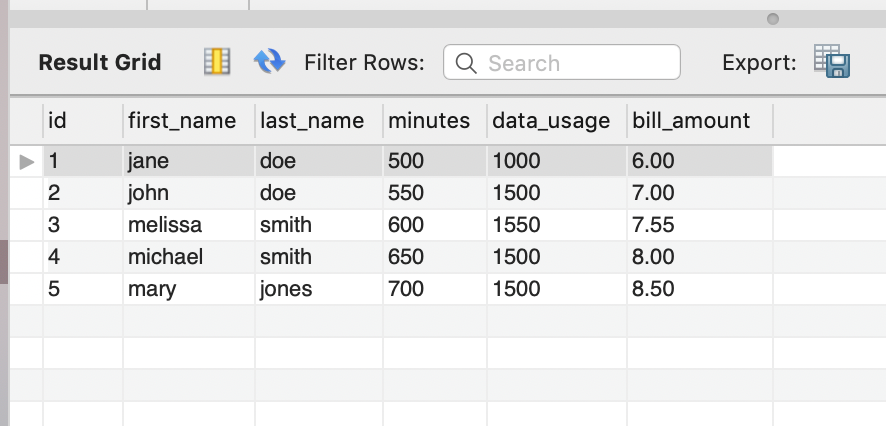
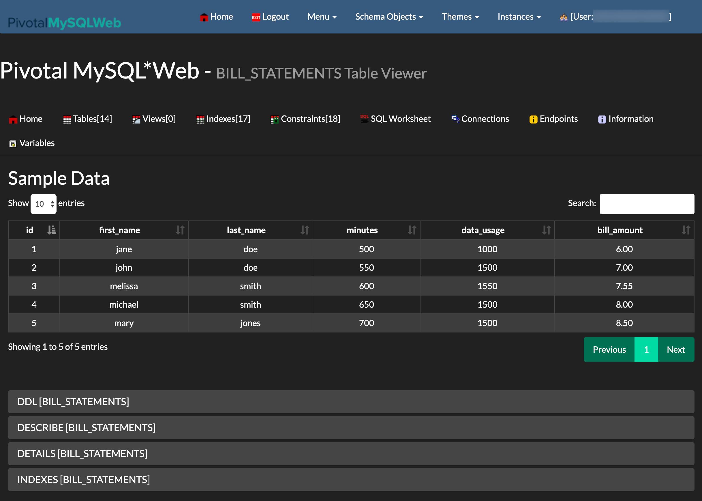

# Batch Processing with Spring Batch

In this guide, we develop a Spring Batch application and deploy it to Cloud Foundry, Kubernetes, and your local machine. In another guide, we deploy the [Spring Batch application using Data Flow](%currentPath%/batch-developer-guides/batch/data-flow-spring-batch/).

This guide describes how to build this application from scratch. If you prefer, you can download a zip file that contains the sources for the `billsetup` application, unzip it, and proceed to the [deployment](#deployment) step.

You can can [download the project](https://github.com/spring-cloud/spring-cloud-dataflow-samples/blob/master/dataflow-website/batch-developer-guides/batch/batchsamples/dist/batchsamples.zip?raw=true) from your browser or run the following command to download it from the command-line:

```bash
wget https://github.com/spring-cloud/spring-cloud-dataflow-samples/blob/master/dataflow-website/batch-developer-guides/batch/batchsamples/dist/batchsamples.zip?raw=true -O batchsamples.zip
```

## Development

We start from [Spring Initializr](https://start.spring.io/) and create a Spring Batch application.

Suppose a cell phone data provider needs to create billing statements for customers. The usage data is stored in JSON files that are stored on the file system. The billing solution must pull data from these files, generate the billing data from this usage data, and store it in a `BILL_STATEMENTS` table.

We could implement this entire solution in a single Spring Boot Application that uses Spring Batch. However, for this example, we break up the solution into two phases:

1. [`billsetuptask`](%currentPath%/batch-developer-guides/batch/data-flow-simple-task/): The [`billsetuptask`](%currentPath%/batch-developer-guides/batch/data-flow-simple-task/) application is a Spring Boot application that uses Spring Cloud Task to create the `BILL_STATEMENTS` table.
1. `billrun`: The `billrun` application is a Spring Boot application that uses Spring Cloud Task and Spring Batch to read usage data and price for each row from a JSON file and put the resulting data into the `BILL_STATEMENTS` table.

For this section, we create a Spring Cloud Task and Spring Batch `billrun` application that reads usage information from a JSON file that contains customer usage data and price for each entry and places the result into the `BILL_STATEMENTS` table.

The following image shows the `BILL_STATEMENTS` table:


### Introducing Spring Batch

Spring Batch is a lightweight, comprehensive batch framework designed to enable the development of robust batch applications. Spring Batch provides reusable functions that are essential in processing large volumes of records by offering features such as:

- Logging/tracing
- Chunk based processing
- Declarative I/O
- Start/Stop/Restart
- Retry/Skip
- Resource management

It also provides more advanced technical services and features that enable extremely high-volume and high-performance batch jobs through optimization and partitioning techniques.

For this guide, we focus on five Spring Batch components, which the following image shows:



- `Job`: A `job` is an entity that encapsulates an entire batch process. A job is comprised of one or more `steps`.
- `Step`: A `Step` is a domain object that encapsulates an independent, sequential phase of a batch job. Each `step` is comprised of an `ItemReader`, an `ItemProcessor`, and an `ItemWriter`.
- `ItemReader`: `ItemReader` is an abstraction that represents the retrieval of input for a `Step`, one item at a time.
- `ItemProcessor`: `ItemProcessor` is an abstraction that represents the business processing of an item.
- `ItemWriter`: `ItemWriter` is an abstraction that represents the output of a `Step`.

In the preceding diagram, we see that each phase of the `JobExecution` is stored in a `JobRepository` (in this case, our MySql database). This means that each action performed by Spring Batch is recorded to a database for both logging purposes and for restarting a job.

<!--NOTE-->

**NOTE:** You can read more about this process [here](https://docs.spring.io/spring-batch/4.0.x/reference/html/domain.html#domainLanguageOfBatch).

<!--END_NOTE-->

### Our Batch Job

So, for our application, we have a `BillRun` `Job` that has one `Step`, which consists of:

- `JsonItemReader`: An `ItemReader` that reads a JSON file containing the usage data.
- `BillProcessor`: An `ItemProcessor` that generates a price based on each row of data sent from the `JsonItemReader`.
- `JdbcBatchItemWriter`: An `ItemWriter` that writes the priced `Bill` record to the `BILLING_STATEMENT` table.

### Initializr

We use [Spring Initializr](https://start.spring.io/) to create our application. To do so:

1. Visit the [Spring Initializr site](https://start.spring.io/).
1. Select the latest release of Spring Boot.
1. Create a new Maven project with a Group name of `io.spring` and an Artifact name of `billrun`.
1. In the **Dependencies** text box, type `task` to select the Cloud Task dependency.
1. In the **Dependencies** text box, type `jdbc` then select the JDBC dependency.
1. In the **Dependencies** text box, type `h2` then select the H2 dependency.
   We use H2 for unit testing.
1. In the **Dependencies** text box, type `mysql` and then select the MySQL dependency (or your favorite database).
   We use MySql for the runtime database.
1. In the **Dependencies** text box, type `batch` and then select Batch.
1. Click the **Generate Project** button.
1. Unzip the `billrun.zip` file and import the project into your favorite IDE.

Alternatively, you can initialize your project by downloading a pre-built file. To do so:

1. Click [here](https://start.spring.io/starter.zip?type=maven-project&language=java&baseDir=billrun&groupId=io.spring&artifactId=billrun&name=Bill+Run&description=Bill+Run+Sample+App&packageName=io.spring.billrun&packaging=jar&dependencies=batch&dependencies=cloud-task&dependencies=jdbc&dependencies=h2&dependencies=mysql) to download the preconfigured `billrun.zip` file.

2. Unzip the billrun.zip file and import the project into your favorite IDE.

### Setting up MySql

If you do not have an instance of MySql available to you, you can follow these instructions to run a MySql docker image for this example:

1. Pull the MySql docker image by running the following command:

   ```bash
   docker pull mysql:5.7.25
   ```

1. Start MySQL by running the following command:

   ```bash
   docker run -p 3306:3306 --name mysql -e MYSQL_ROOT_PASSWORD=password \
   -e MYSQL_DATABASE=task -d mysql:5.7.25
   ```

### Building The Application

1.  Download `download: https://raw.githubusercontent.com/spring-cloud/spring-cloud-dataflow-samples/master/dataflow-website/batch-developer-guides/batch/batchsamples/billrun/src/main/resources/usageinfo.json title=usageinfo.json` and copy the resulting file to the `/src/main/resources` directory.

1.  Download `download: https://raw.githubusercontent.com/spring-cloud/spring-cloud-dataflow-samples/master/dataflow-website/batch-developer-guides/batch/batchsamples/billrun/src/main/resources/schema.sql title=schema.sql` and copy the resulting file to the `/src/main/resources` directory.

1.  In your favorite IDE create the `io.spring.billrun.model` package.

1.  Create a `Usage` class in the `io.spring.billrun.model` that looks like the contents of [Usage.java](https://github.com/spring-cloud/spring-cloud-dataflow-samples/tree/master/dataflow-website/batch-developer-guides/batch/batchsamples/billrun/src/main/java/io/spring/billrun/model/Usage.java).

1.  Create a `Bill` class in the `io.spring.billrun.model` that looks like the contents of [Bill.java](https://github.com/spring-cloud/spring-cloud-dataflow-samples/tree/master/dataflow-website/batch-developer-guides/batch/batchsamples/billrun/src/main/java/io/spring/billrun/model/Bill.java).

1.  In your favorite IDE, create the `io.spring.billrun.configuration` package.

1.  Create an `ItemProcessor` for pricing each `Usage` record. To do so, create a [`BillProcessor`](https://github.com/spring-cloud/spring-cloud-dataflow-samples/tree/master/dataflow-website/batch-developer-guides/batch/batchsamples/billrun/src/main/java/io/spring/billrun/configuration/BillProcessor.java) class in the `io.spring.billrun.configuration` that looks like the following listing:

    ```java
    public class BillProcessor implements ItemProcessor<Usage, Bill> {

      @Override
      public Bill process(Usage usage) {
         Double billAmount = usage.getDataUsage() * .001 + usage.getMinutes() * .01;
         return new Bill(usage.getId(), usage.getFirstName(), usage.getLastName(),
               usage.getDataUsage(), usage.getMinutes(), billAmount);
      }
    }
    ```

    Notice that we implement the `ItemProcessor` interface that has the `process` method that we need to override.
    Our parameter is a `Usage` object, and the return value is of type `Bill`.

1.  Now we can create a Java configuration that specifies the beans required for the `BillRun` `Job`. In this case, we need to create a [`BillingConfiguration`](https://github.com/spring-cloud/spring-cloud-dataflow-samples/tree/master/dataflow-website/batch-developer-guides/batch/batchsamples/billrun/src/main/java/io/spring/billrun/configuration/BillingConfiguration.java) class in the `io.spring.billrun.configuration` package that looks like the following listing:

    ```java
    @Configuration
    @EnableTask
    @EnableBatchProcessing
    public class BillingConfiguration {
      @Autowired
      public JobBuilderFactory jobBuilderFactory;

      @Autowired
      public StepBuilderFactory stepBuilderFactory;

      @Value("${usage.file.name:classpath:usageinfo.json}")
      private Resource usageResource;

      @Bean
      public Job job1(ItemReader<Usage> reader,
        ItemProcessor<Usage,Bill> itemProcessor, ItemWriter<Bill> writer) {
          Step step = stepBuilderFactory.get("BillProcessing")
                  .<Usage, Bill>chunk(1)
                  .reader(reader)
                  .processor(itemProcessor)
                  .writer(writer)
                  .build();

          return jobBuilderFactory.get("BillJob")
                  .incrementer(new RunIdIncrementer())
                  .start(step)
                  .build();
      }

      @Bean
      public JsonItemReader<Usage> jsonItemReader() {

          ObjectMapper objectMapper = new ObjectMapper();
          JacksonJsonObjectReader<Usage> jsonObjectReader =
                  new JacksonJsonObjectReader<>(Usage.class);
          jsonObjectReader.setMapper(objectMapper);

          return new JsonItemReaderBuilder<Usage>()
                  .jsonObjectReader(jsonObjectReader)
                  .resource(usageResource)
                  .name("UsageJsonItemReader")
                  .build();
      }

      @Bean
      public ItemWriter<Bill> jdbcBillWriter(DataSource dataSource) {
          JdbcBatchItemWriter<Bill> writer = new JdbcBatchItemWriterBuilder<Bill>()
                          .beanMapped()
                  .dataSource(dataSource)
                  .sql("INSERT INTO BILL_STATEMENTS (id, first_name, " +
                     "last_name, minutes, data_usage,bill_amount) VALUES " +
                     "(:id, :firstName, :lastName, :minutes, :dataUsage, " +
                     ":billAmount)")
                  .build();
          return writer;
      }

      @Bean
      ItemProcessor<Usage, Bill> billProcessor() {
          return new BillProcessor();
      }
    }
    ```

    The `@EnableBatchProcessing` annotation enables Spring Batch features and provides a base configuration for setting up batch jobs.
    The `@EnableTask` annotation sets up a `TaskRepository`, which stores information about the task execution (such as the start and end times of the task and the exit code).
    In the preceding configuration, we see that our `ItemReader` bean is an instance of `JsonItemReader`. The `JsonItemReader` instance reads the contents of a resource and unmarshalls the JSON data into `Usage` objects. `JsonItemReader` is one of the `ItemReader` implementations provided by Spring Batch.
    We also see that our `ItemWriter` bean is an instance of `JdbcBatchItemWriter`. The `JdbcBatchItemWriter` instance writes the results to our database. `JdbcBatchItemWriter` is one of the `ItemWriter` implementations provided by Spring Batch.
    The `ItemProcessor` is our very own `BillProcessor`. To make life easier, notice that all the beans that use Spring Batch-provided classes (`Job`, `Step`, `ItemReader`, `ItemWriter`) are being built with builders provided by Spring Batch.

### Testing

Now that we have written our code, it is time to write our test. In this case, we want to make sure that the bill information has been properly inserted into the `BILLING_STATEMENTS` table.
To create your test, update the [BillrunApplicationTests.java](https://github.com/spring-cloud/spring-cloud-dataflow-samples/blob/master/dataflow-website/batch-developer-guides/batch/batchsamples/billrun/src/test/java/io/spring/billrun/BillRunApplicationTests.java) such that it looks like the following listing:

```java
package io.spring.billrun;

import io.spring.billrun.model.Bill;
import org.junit.jupiter.api.BeforeEach;
import org.junit.jupiter.api.Test;
import org.springframework.beans.factory.annotation.Autowired;
import org.springframework.boot.test.context.SpringBootTest;
import org.springframework.jdbc.core.JdbcTemplate;

import javax.sql.DataSource;
import java.util.List;

import static org.assertj.core.api.Assertions.assertThat;

@SpringBootTest
public class BillRunApplicationTests {

	@Autowired
	private DataSource dataSource;

	private JdbcTemplate jdbcTemplate;

	@BeforeEach
	public void setup() {
		this.jdbcTemplate = new JdbcTemplate(this.dataSource);
	}

	@Test
	public void testJobResults() {
		List<Bill> billStatements = this.jdbcTemplate.query("select id, " +
						"first_name, last_name, minutes, data_usage, bill_amount " +
						"FROM bill_statements ORDER BY id",
				(rs, rowNum) -> new Bill(rs.getLong("id"),
						rs.getString("FIRST_NAME"), rs.getString("LAST_NAME"),
						rs.getLong("DATA_USAGE"), rs.getLong("MINUTES"),
						rs.getDouble("bill_amount")));

		assertThat(billStatements.size()).isEqualTo(5);
		Bill billStatement = billStatements.get(0);
		assertThat(billStatement.getBillAmount()).isEqualTo(6.0);
		assertThat(billStatement.getFirstName()).isEqualTo("jane");
		assertThat(billStatement.getLastName()).isEqualTo("doe");
		assertThat(billStatement.getId()).isEqualTo(1);
		assertThat(billStatement.getMinutes()).isEqualTo(500);
		assertThat(billStatement.getDataUsage()).isEqualTo(1000);

	}
}
```

For this test, we use `JdbcTemplate` to execute a query and retrieve the results of the `billrun`. Once the query has run, we verify that the data in the first row of the table is what we expect.

## Deployment

In this section, we deploy to a local machine, Cloud Foundry, and Kubernetes.

### Local

Now we can build the project.

1. From a command line, change directory to the location of your project and build the project by running the following Maven command: `./mvnw clean package`.

1. Run the application with the configurations required to process the usage information in the database.

   To configure the execution of the `billrun` application, use the following arguments:

   - `spring.datasource.url`: Set the URL to your database instance. In the following sample, we connect to a MySQL `task` database on our local machine at port 3306.
   - `spring.datasource.username`: The user name to be used for the MySQL database. In the following sample, it is `root`.
   - `spring.datasource.password`: The password to be used for the MySQL database. In the following sample, it is `password`.
   - `spring.datasource.driverClassName`: The driver to use to connect to the MySQL database. In the following sample, it is `com.mysql.jdbc.Driver`.
   - `spring.datasource.initialization-mode`: Initializes the database with the `BILL_STATEMENTS` and `BILL_USAGE` tables required for this application. In the following sample, we state that we `always` want to do this. Doing so does not overwrite the tables if they already exist.
   - `spring.batch.initialize-schema`: Initializes the database with the tables required for Spring Batch. In the following sample, we state that we `always` want to do this. Doing so does not overwrite the tables if they already exist.

   ```bash
   java -jar target/billrun-0.0.1-SNAPSHOT.jar \
   --spring.datasource.url=jdbc:mysql://localhost:3306/task?useSSL=false \
   --spring.datasource.username=root \
   --spring.datasource.password=password \
   --spring.datasource.driverClassName=com.mysql.jdbc.Driver \
   --spring.datasource.initialization-mode=always \
   --spring.batch.initialize-schema=always
   ```

1. Log in to the `mysql` container to query the `BILL_STATEMENTS` table. To do so, run the following commands:

<!-- Rolling my own to disable erroneous formating -->
<div class="gatsby-highlight" data-language="bash">
<pre class="language-bash"><code>$ docker exec -it mysql bash -l
# mysql -u root -ppassword
mysql&gt; select * from task.BILL_STATEMENTS;
</code></pre></div>

The output should look something like the following:

| id  | first_name | last_name | minutes | data_usage | bill_amount |
| --- | ---------- | --------- | ------- | ---------- | ----------- |
| 1   | jane       | doe       | 500     | 1000       | 6.00        |
| 2   | john       | doe       | 550     | 1500       | 7.00        |
| 3   | melissa    | smith     | 600     | 1550       | 7.55        |
| 4   | michael    | smith     | 650     | 1500       | 8.00        |
| 5   | mary       | jones     | 700     | 1500       | 8.50        |

#### Cleanup

To stop and remove the MySQL container running in the Docker instance, run the following commands:

```bash
docker stop mysql
docker rm mysql
```

### Cloud Foundry

This guide walk through how to deploy and run simple [spring-batch](https://spring.io/projects/spring-batch) stand-alone applications to Cloud Foundry.

#### Requirements

On your local machine, you will need to have installed:

- Java
- [Git](https://git-scm.com/)
- The [Cloud Foundry command line interface](https://console.run.pivotal.io/tools) installed (see the [documentation](https://docs.run.pivotal.io/cf-cli/)).

#### Building the Application

Now you can build the project.
From a command line, change directory to the location of your project and build the project by using the following Maven command: `./mvnw clean package`.

#### Setting up Cloud Foundry

First, you need a Cloud Foundry account. You can create a free account by using [Pivotal Web Services](https://run.pivotal.io/) (PWS). We use PWS for this example. If you use a different provider, your experience may differ slightly from this document.

To get started, log into Cloud Foundry by using the [Cloud Foundry command line interface](https://console.run.pivotal.io/tools):

```bash
cf login
```

[[tip]]
| You can also target specific Cloud Foundry instances with the `-a` flag, for example `cf login -a https://api.run.pivotal.io`.

Before you can push the application, you must set up the **MySql Service** on Cloud Foundry. You can check what services are available by running the following command:

```bash
cf marketplace
```

On [Pivotal Web Services](https://run.pivotal.io/) (PWS), you should be able to use the following command to install the MySQL service:

```bash
cf create-service cleardb spark task-example-mysql
```

Make sure you name your MySQL service is `task-example-mysql`. We use that value throughout this document.

#### Task Concepts in Cloud Foundry

To provide configuration parameters for Cloud Foundry, we create dedicated `manifest` YAML files for each application. For additional information on setting up a manifest see [here](https://docs.cloudfoundry.org/devguide/deploy-apps/manifest.html)

Running tasks on Cloud Foundry is a two-stage process. Before you can actually run any tasks, you need to first push an app that is staged without any running instances. We provide the following common properties to the manifest YAML file to each application:

```yml
memory: 32M
health-check-type: process
no-route: true
instances: 0
```

The key is to set the `instances` property to `0`. Doing so ensures that the app is staged without being actually running. We also do not need a route to be created and can set `no-route` to `true`.

<!--TIP-->

Having this app staged but not running has a second advantage, as well. Not only do we need this staged application to run a task in a subsequent step, but, if your database service is internal (part of your Cloud Foundry instance), we can use this application to establish an SSH tunnel to the associated MySQL database service to see the persisted data. We go into the details for that a little bit later in this document.

<!--END_TIP-->

#### Running `billrun` on Cloud Foundry

Now we can deploy and run the second task application. In order to deploy, create a file called `manifest-billrun.yml` with the following content:

```yaml
applications:
  - name: billrun
    memory: 32M
    health-check-type: process
    no-route: true
    instances: 0
    disk_quota: 1G
    timeout: 180
    buildpacks:
      - java_buildpack
    path: target/billrun-0.0.1-SNAPSHOT.jar
    services:
      - task-example-mysql
```

Now run `cf push -f ./manifest-billrun.yml`. Doing so stages the application. We are now ready to run the task by running the following command:

```bash
cf run-task billrun ".java-buildpack/open_jdk_jre/bin/java org.springframework.boot.loader.JarLauncher arg1" --name billrun-task
```

Doing so should produce output similar to the following:

```bash
Task has been submitted successfully for execution.
task name:   billrun-task
task id:     1
```

If we verify the task on the Cloud Foundry dashboard, we should see that the task successfully ran. But how do we verify that the task application successfuly populated the database table? We do that next.

#### Validating the Database Results

You have multiple options for how to access a database in Cloud Foundry, depending on your individual Cloud Foundry environment. We deal with the following two options:

- Using local tools (through SSH or an external database provider)
- Using a database GUI deployed to Cloud Foundry

##### Using Local Tools (MySQLWorkbench)

First, we need to create a [key for a service instance](https://cli.cloudfoundry.org/en-US/cf/create-service-key.html) by using the `cf create-service-key` command, as the following example shows:

```bash
cf create-service-key task-example-mysql EXTERNAL-ACCESS-KEY
cf service-key task-example-mysql EXTERNAL-ACCESS-KEY
```

Doing so should give you back the credentials necessary to access the database, such as those in the following example:

```json
Getting key EXTERNAL-ACCESS-KEY for service instance task-example-mysql as ghillert@gopivotal.com...

{
 "hostname": "...",
 "jdbcUrl": "jdbc:mysql://...",
 "name": "...",
 "password": "...",
 "port": "3306",
 "uri": "mysql://...",
 "username": "..."
}
```

This should result in a response that details the access information for the respective database. The result differs, depending on whether the database service runs internally or the service is provided by a third-party. In the case of PWS and using ClearDB, we can directly connect to the database, as it is a third-party provider.

If you deal with an internal service, you may have to create an SSH tunnel by using the `cf ssh` command, as the following example shows:

```bash
cf ssh -L 3306:<host_name>:<port> task-example-mysql
```

By using the free [MySQLWorkbench](https://www.mysql.com/products/workbench/), you should see the following populated data:



##### Using a Database GUI Deployed to Cloud Foundry

Another interesting option for keeping an eye on your MySQL instance is to use [PivotalMySQLWeb](https://github.com/pivotal-cf/PivotalMySQLWeb). In a nutshell, you can push PivotalMySQLWeb to your Cloud Foundry space and bind it to your MySql instance to introspect your MySQL service without having to use local tooling.

Check out the following project:

```bash
git clone https://github.com/pivotal-cf/PivotalMySQLWeb.git
cd PivotalMySQLWeb
```

<!--IMPORTANT-->

**IMPORTANT**: You must first update your credentials in `src/main/resources/application-cloud.yml` ([Source on GitHub](https://github.com/pivotal-cf/PivotalMySQLWeb/blob/master/src/main/resources/application-cloud.yml)). By default, the username is `admin` and the password is `cfmysqlweb`.

<!--END_IMPORTANT-->

Then you can build the project, by running the following command:

```bash
./mvnw -DskipTests=true package
```

Next, you need to update the `manifest.yml` file, as the following example shows:

```yml
applications:
  - name: pivotal-mysqlweb
    memory: 1024M
    instances: 1
    random-route: true
    path: ./target/PivotalMySQLWeb-1.0.0-SNAPSHOT.jar
    services:
      - task-example-mysql
    env:
      JAVA_OPTS: -Djava.security.egd=file:///dev/urandom
```

<!--IMPORTANT-->

**IMPORTANT** You must specify your MySQL service to be `task-example-mysql`. We use that value throughout this document.

<!--END_IMPORTANT-->

In this instance, we set the `random-route` property to `true`, to generate a random URL for the application. You can watch the console for the value of the URL. Then you push the application to Cloud Foundry by running the following command:

```bash
cf push
```

Now you can login into the application and take a look at the table populated by the `billrun` task application. The following image shows its content after we have worked through the content of this example:



#### Tearing down all Task Applications and Services

With the conclusion of this example, you may also want to remove all instances on Cloud Foundry. The following commands accomplish that:

```bash
cf delete billsetuptask -f
cf delete billrun -f
cf delete pivotal-mysqlweb -f -r
cf delete-service-key task-example-mysql EXTERNAL-ACCESS-KEY -f
cf delete-service task-example-mysql -f
```

The important thing is that we need to delete the `EXTERNAL-ACCESS-KEY` service key before we can delete the `task-example-mysql` service itself. Additionally, the employed command flags are as follows:

- `-f` Force deletion without confirmation
- `-r` Also delete any mapped routes

### Kubernetes

This section walks you through running the `billrun` application on Kubernetes.

#### Setting up the Kubernetes Cluster

For this example, we need a running [Kubernetes cluster](%currentPath%/installation/kubernetes#creating-a-kubernetes-cluster). For this example, we deploy to `minikube`.

##### Verifying that Minikube is Running

To verify that Minikube is running, run the following command (shown with its output):

```bash
minikube status
host: Running
kubelet: Running
apiserver: Running
kubectl: Correctly Configured: pointing to minikube-vm at 192.168.99.100
```

##### Installing the Database

We install a MySQL server by using the default configuration from Spring Cloud Data Flow. To do so, run the following command:

```bash
kubectl apply -f https://raw.githubusercontent.com/spring-cloud/spring-cloud-dataflow/%github-tag%/src/kubernetes/mysql/mysql-deployment.yaml \
-f https://raw.githubusercontent.com/spring-cloud/spring-cloud-dataflow/%github-tag%/src/kubernetes/mysql/mysql-pvc.yaml \
-f https://raw.githubusercontent.com/spring-cloud/spring-cloud-dataflow/%github-tag%/src/kubernetes/mysql/mysql-secrets.yaml \
-f https://raw.githubusercontent.com/spring-cloud/spring-cloud-dataflow/%github-tag%/src/kubernetes/mysql/mysql-svc.yaml
```

##### Building a Docker Image for the Sample Task Application

We need to build the docker image for the [`billrun`](#batch_processing_with_spring_batch) app.

To do so, we use the [jib maven plugin](https://github.com/GoogleContainerTools/jib/tree/master/jib-maven-plugin#build-your-image). If you downloaded the [source distribution](#batch_processing_with_spring_batch), the jib plugin is already configured. If you built the apps from scratch, add the following under `plugins` in `pom.xml`:

```xml
<plugin>
    <groupId>com.google.cloud.tools</groupId>
    <artifactId>jib-maven-plugin</artifactId>
    <version>0.10.1</version>
    <configuration>
        <from>
            <image>springcloud/openjdk</image>
        </from>
        <to>
            <image>${docker.org}/${project.artifactId}:${docker.version}</image>
        </to>
        <container>
            <useCurrentTimestamp>true</useCurrentTimestamp>
        </container>
    </configuration>
</plugin>
```

Then add the referenced properties under `properties` For this example, we use the following properties:

```xml
<docker.org>springcloudtask</docker.org>
<docker.version>${project.version}</docker.version>
```

Now you can run the following commands to add the image to the `minikube` Docker registry:

```bash
eval $(minikube docker-env)
./mvnw clean package jib:dockerBuild
```

Run the following command to verify its presence (by finding `springcloudtask/billrun` in the list of images):

```bash
docker images
```

##### Deploying the Application

The simplest way to deploy a batch application is as a standalone [Pod](https://kubernetes.io/docs/concepts/workloads/pods/pod/).
Deploying batch apps as a [Job](https://kubernetes.io/docs/concepts/workloads/controllers/jobs-run-to-completion/) or [CronJob](https://kubernetes.io/docs/tasks/job/) is considered best practice for production environments but is beyond the scope of this guide.

Save the following content to `batch-app.yaml`:

```yaml
apiVersion: v1
kind: Pod
metadata:
  name: billrun
spec:
  restartPolicy: Never
  containers:
    - name: task
      image: springcloudtask/billrun:0.0.1-SNAPSHOT
      env:
        - name: SPRING_DATASOURCE_PASSWORD
          valueFrom:
            secretKeyRef:
              name: mysql
              key: mysql-root-password
        - name: SPRING_DATASOURCE_URL
          value: jdbc:mysql://mysql:3306/task
        - name: SPRING_DATASOURCE_USERNAME
          value: root
        - name: SPRING_DATASOURCE_DRIVER_CLASS_NAME
          value: com.mysql.jdbc.Driver
  initContainers:
    - name: init-mysql-database
      image: mysql:5.6
      env:
        - name: MYSQL_PWD
          valueFrom:
            secretKeyRef:
              name: mysql
              key: mysql-root-password
      command:
        [
          'sh',
          '-c',
          'mysql -h mysql -u root -e "CREATE DATABASE IF NOT EXISTS task;"',
        ]
```

To start the application, run the following command:

```bash
kubectl apply -f batch-app.yaml
```

When the task is complete, you should see output similar to the following:

```bash
kubectl get pods
NAME                     READY   STATUS      RESTARTS   AGE
mysql-5cbb6c49f7-ntg2l   1/1     Running     0          4h
billrun                  0/1     Completed   0          10s
```

Now you can delete the pod. To do so, run the following command:

```bash
kubectl delete -f batch-app.yaml
```

Now log in to the `mysql` container to query the `BILL_STATEMENTS` table.
Get the name of the `mysql`pod by using `kubectl get pods`, as shown earlier.
Then log in:

<!-- Rolling my own to disable erroneous formating -->
<div class="gatsby-highlight" data-language="bash">
<pre class="language-bash"><code>kubectl exec -it mysql-5cbb6c49f7-ntg2l -- /bin/bash
# mysql -u root -p$MYSQL_ROOT_PASSWORD
mysql&gt; select * from task.BILL_STATEMENTS;
</code></pre></div>

The output should look something like the following:

| id  | first_name | last_name | minutes | data_usage | bill_amount |
| --- | ---------- | --------- | ------- | ---------- | ----------- |
| 1   | jane       | doe       | 500     | 1000       | 6.00        |
| 2   | john       | doe       | 550     | 1500       | 7.00        |
| 3   | melissa    | smith     | 600     | 1550       | 7.55        |
| 4   | michael    | smith     | 650     | 1500       | 8.00        |
| 5   | mary       | jones     | 700     | 1500       | 8.50        |

To uninstall `mysql`, run the following command:

```bash
kubectl delete all -l app=mysql
```
