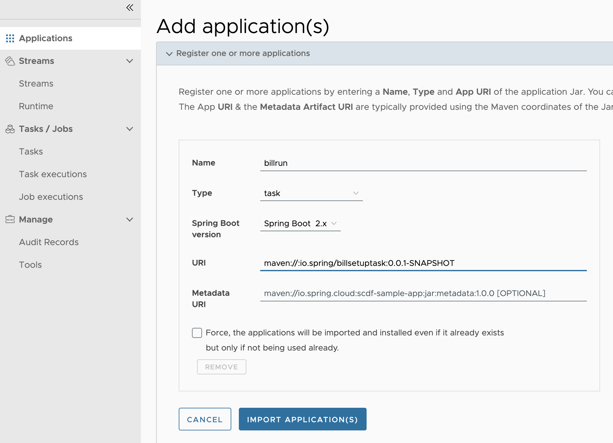
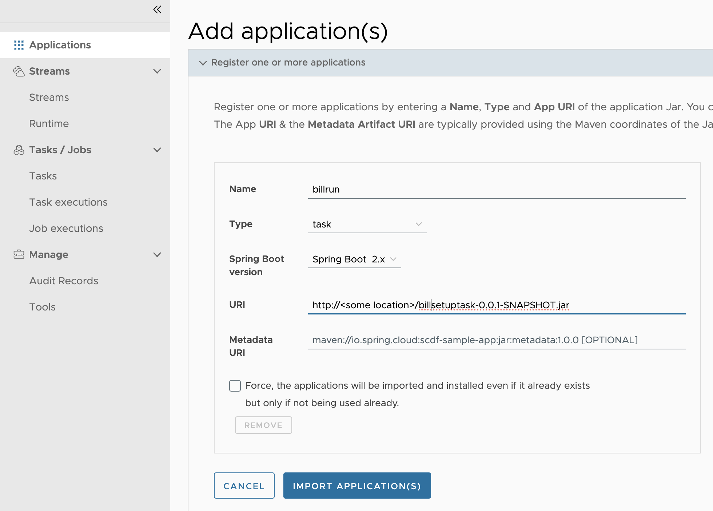
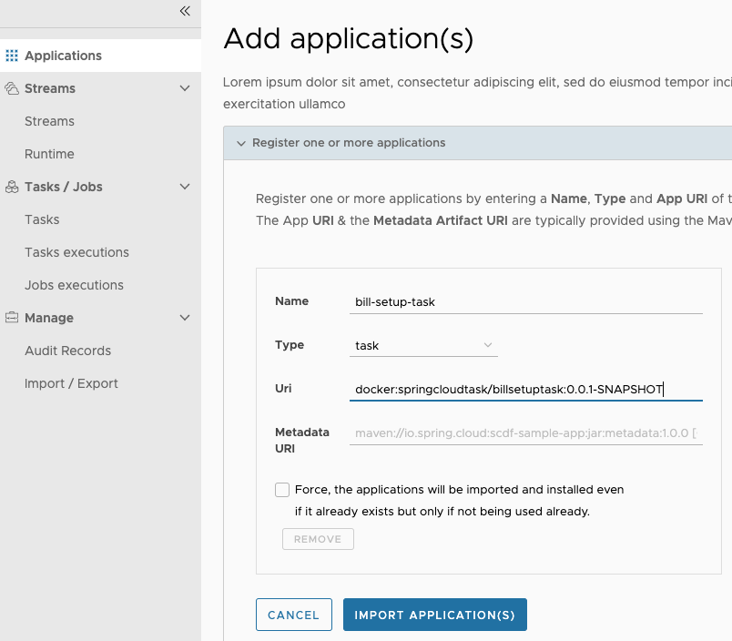
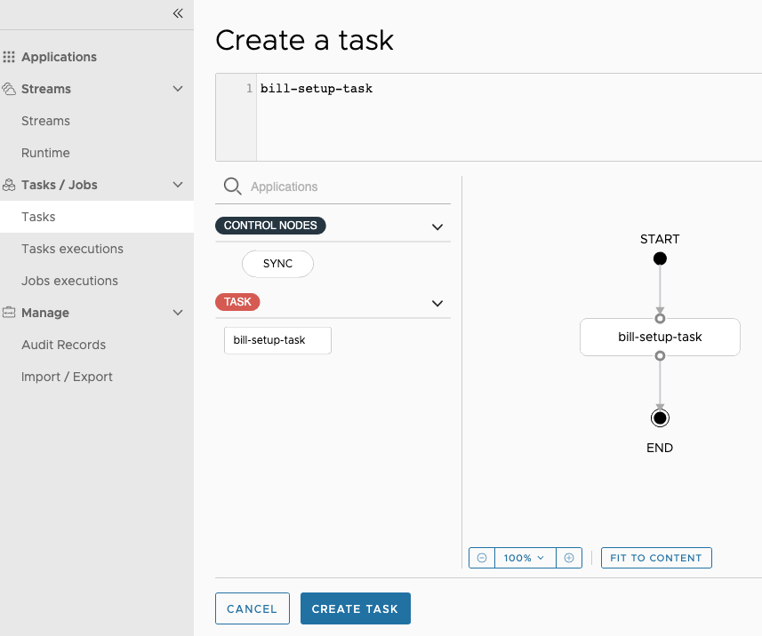
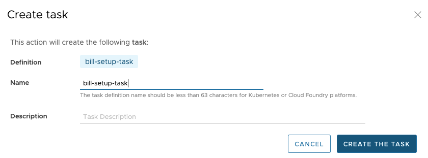
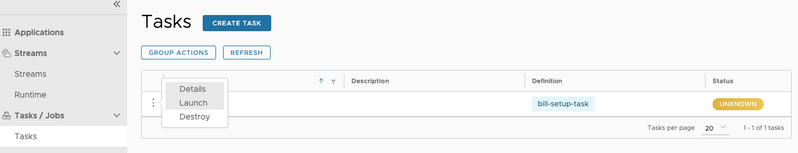
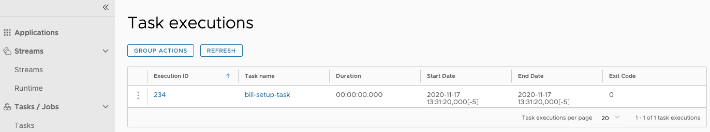

# Deploying a Spring Cloud Task application by Using Data Flow

In this section, we demonstrate how to register a Spring Cloud Task application with Data Flow, create a Task definition, and launch the Task definition on Cloud Foundry, Kubernetes, and your local machine.

## Prerequisites

Before you start on this sample, you need to do two things:

1. Install Spring Cloud Data Flow.
1. Install the Spring Cloud Task project that we use in this project.

### Installing Spring Cloud Data Flow

You must you have installed Spring Cloud Data Flow to one of the following platforms:

- [Local](%currentPath%/installation/local/)
- [Cloud Foundry](%currentPath%/installation/cloudfoundry)
- [Kubernetes](%currentPath%/installation/kubernetes/)

### Installing the Spring Cloud Task Project

For this guide, we use the [Spring Cloud Task](%currentPath%/batch-developer-guides/batch/data-flow-simple-task) sample, called `billsetuptask`.
Follow the instructions to code and build the task if you have not done so already.

## Create Task Definition

We register a Task application, create a simple Task definition, and launch the task by using the Data Flow server.
The Data Flow server provides a comprehensive [API](https://docs.spring.io/spring-cloud-dataflow/docs/current/reference/htmlsingle/#api-guide) to perform the necessary steps.
The Data Flow server includes a Data Flow Dashboard web UI client. In addition, there is a [Data Flow Shell](https://docs.spring.io/spring-cloud-dataflow/docs/current/reference/htmlsingle/#shell) command line interface (CLI), available as a separate download.
The CLI and the UI both expose the complete API functionality.
Which one to use is a matter of preference, but the UI is quite nice, so we feature it here.

### The Data Flow Dashboard

Assuming Data Flow is [installed](%currentPath%/installation/) and running on one of the supported platforms, open your browser at `<data-flow-url>/dashboard`. Here, `<data-flow-url>` depends on the platform. Consult the [installation guide](%currentPath%/installation) to determining the base URL for your installation. If Data Flow is running on your local machine, go to http://localhost:9393/dashboard.

### Application Registration

The Data Flow Dashboard lands on the Application Registration view, where we register the sample task. The following image shows adding an application in the dashboard:


#### Application Registration Concepts

Applications in Spring Cloud Data Flow are registered as named resources so that they can be referenced when using the Data Flow DSL to configure and compose tasks.
Registration associates a logical application name and type with a physical resource, given by a URI.
The URI conforms to a [schema](https://docs.spring.io/spring-cloud-dataflow/docs/current/reference/htmlsingle/#spring-cloud-dataflow-register-stream-apps) and may represent a Maven artifact, a Docker image, or an actual `http(s)` or `file` URL.
Data Flow defines some logical application types, which indicate the application's role as a streaming component, a task, or a standalone application.
Spring Cloud Task applications are always registered as a `task` type.

#### Registering an Application

<!--TABS-->

<!--Local-->

Spring Cloud Data Flow supports Maven, HTTP, file, and Docker resources for local deployments. For this example, we use the Maven resource.
The URI for a Maven artifact is generally of the form `maven://<groupId>:<artifactId>:<version>`. The maven URI for the sample application is as follows:

```
maven://io.spring:billsetuptask:0.0.1-SNAPSHOT
```

The `maven:` protocol specifies a Maven artifact, which is resolved by using the remote and local Maven repositories configured for the Data Flow server.
To register an application, select `Add Applications` and `Register one or more applications`. Fill in the form, as shown in the following image, and click `Register the application(s)`.



<!--CloudFoundry-->

Spring Cloud Data Flow supports Maven, HTTP, and Docker resources for local deployments. For this example, we use an HTTP (actually, HTTPS) resource. The URI for an HTTPS resource is of the form `https://<web-path>/<artifactName>-<version>.jar`. Spring Cloud Data Flow then pulls the artifact from the HTTPS URI.

The HTTPS URI for the sample app is as follows:

```
maven://io.spring:billsetuptask:0.0.1-SNAPSHOT
```

To register an application, select `Add Applications` and `Register one or more applications`. Fill in the form, as shown in the following image, and click `Register the application(s)`.



<!--Kubernetes-->

Spring Cloud Data Flow supports Docker resources for Kubernetes deployments.
The URI for a Docker image is of the form `docker:<docker-image-path>/<imageName>:<version>` and is resolved by using the Docker registry configured for the Data Flow task platform and image pull policy.

The Docker URI for the sample app is as follows:

```
docker:springcloudtask/billsetuptask:0.0.1-SNAPSHOT
```

To register an application, select `Add Applications` and `Register one or more applications`. Fill in the form, as shown in the following image, and click `Register the application(s)`.



<!--END_TABS-->

### Creating the Task Definition

To create a task in the Dashboard UI:

1. Select `Tasks` from the left navigation bar and select `Create task(s)`.
   Doing so displays a graphical editor that we can use to compose tasks.
   The initial canvas contains `START` and `END` nodes. To the left of the canvas, we see the available task applications, including `bill-setup-task`, which we just registered.

1. Drag that task to the canvas.

1. Connect the task to the START and END nodes to complete the task definition.
   In this case, the task definition consists of a single task application.
   If the application defined configuration properties, we would set them here.
   The following image shows the task creation UI:
   

1. Click `Create Task`.
   Doing so prompts you to name the task definition, which is the logical name for the runtime configuration we want to deploy.
   In this case, we use the same name as the task application.
   

1. Click `Create the task`.
   Doing so displays the main `Tasks` view.

### Launching the Task

The following image shows the Task UI, which we can use to launch a task:



To launch the task:

1. Press the "play" button (the middle icon, which looks like an arrowhead pointing right).
   Doing so take you to a form where you can add command line arguments and deployment parameters, but we do not need any for this task.

1. Press **Launch the task**.
   Doing so runs the task on the Data Flow server's task platform and records a new task `execution`.
   When the execution is complete, the Status turns to a green color and shows `Complete.`

1. Select the **Executions** tab to view a summary of executions for this task, as shown in the following image:


