# Deploy a Spring Batch application by Using Data Flow

In this section, we demonstrate how to register a Spring Batch application with Data Flow, create a task definition, and launch the task definition on Cloud Foundry, Kubernetes, and your local machine.

## Prerequisites

Before you start on this sample, you need to do two things:

1. Install Spring Cloud Data Flow.
1. Install the Spring Cloud Task project that we use in this project.

### Data Flow Installation

You must you have installed Spring Cloud Data Flow to one of the following platforms:

- [Local](%currentPath%/installation/local/)
- [Cloud Foundry](%currentPath%/installation/cloudfoundry)
- [Kubernetes](%currentPath%/installation/kubernetes/)

### Spring Batch Project

For this guide, we use the [Spring Batch Jobs](%currentPath%/batch-developer-guides/batch/spring-batch) sample Spring Batch application, called `billrun`.
Follow the instructions to code and build the Spring Batch application, if you have not done so already.

## Create Task Definition

We register the batch application, create a simple task definition for the batch application, and launch the task definition by using the Data Flow Server.
The Data Flow server provides a comprehensive [API](https://docs.spring.io/spring-cloud-dataflow/docs/current/reference/htmlsingle/#api-guide) to perform the necessary steps.
The Data Flow server includes a Data Flow Dashboard web UI client. In addition, you can use a [Data Flow Shell](https://docs.spring.io/spring-cloud-dataflow/docs/current/reference/htmlsingle/#shell) command line interface (CLI), which is available as a separate download.
The CLI and the UI both expose the complete API functionality.
Which one to use is a matter of preference, but the UI is quite nice, so we feature it here.

### The Data Flow Dashboard

Assuming Data Flow is [installed](%currentPath%/installation/) and running on one of the supported platforms, open your browser at `<data-flow-url>/dashboard`. Here, `<data-flow-url>` depends on the platform. Consult the [installation guide](%currentPath%/installation) to determining the base URL for your installation. If Data Flow is running on your local machine, go to http://localhost:9393/dashboard.

### Application Registration

The Data Flow Dashboard lands on the Application Registration view, where we can register the sample Spring Batch app. The following image shows the Application Registration view:

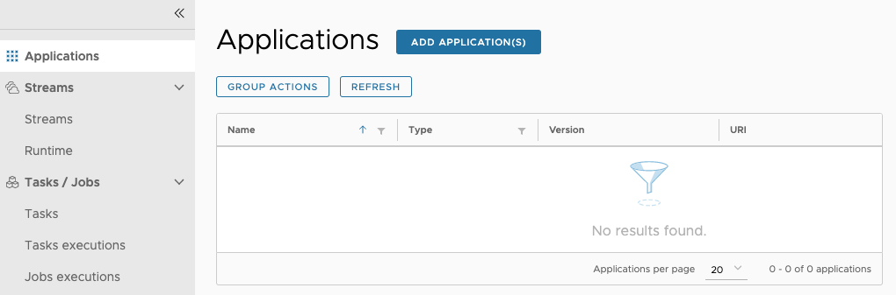

#### Application Registration Concepts

Applications in Data Flow are registered as named resources so that they can be referenced when you use the Data Flow DSL to configure and compose tasks.
Registration associates a logical application name and type with a physical resource, which is given by a URI.
The URI conforms to a [schema](https://docs.spring.io/spring-cloud-dataflow/docs/current/reference/htmlsingle/#spring-cloud-dataflow-register-stream-apps) and may represent a Maven artifact, a Docker image, or an actual `http(s)` or `file` URL.
Data Flow defines some logical application types, which indicate its role as a streaming component, a task, or a standalone application.
In this case, our Spring Batch application is registered as a `task` type.

[[tip]]
|For a Spring Batch Application to be launched by Data Flow, it must also be a Spring Cloud Task application. This is done by adding the `@EnableTask` to a configuration class or to the application as shown in our [sample](%currentPath%/batch-developer-guides/batch/spring-batch).

#### Registering an Application

<!--TABS-->

<!--Local-->

Spring Cloud Data Flow supports Maven, HTTP, file, and Docker resources for local deployments. For this example, we use the Maven resource.
The URI for a Maven artifact is generally of the form `maven://<groupId>:<artifactId>:<version>`. The Maven URI for the sample application is as follows:

```
maven://io.spring:billrun:0.0.1-SNAPSHOT
```

The `maven:` protocol specifies a Maven artifact, which is resolved by using the remote and local Maven repositories configured for the Data Flow Server.
To register an application, select `Add Applications` and `Register one or more applications`. Fill in the form, as shown in the following image, and click `Register the application(s)`.

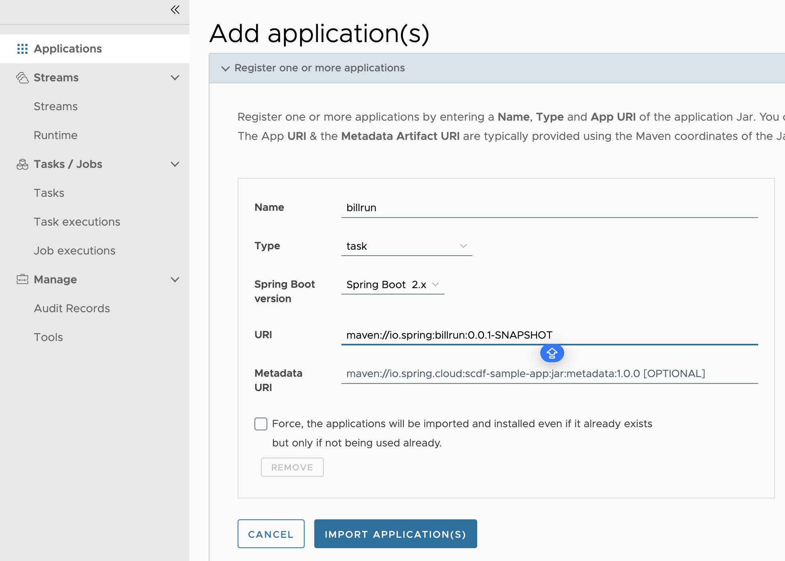

<!--CloudFoundry-->

Spring Cloud Data Flow supports Maven, HTTP, and Docker resources for local deployments. For this example, we will use an HTTP (HTTPS, actually) resource. The URI for an HTTPS resource is of the form `https://<web-path>/<artifactName>-<version>.jar`. Spring Cloud Data Flow then pulls the artifact from the HTTPS URI.

The HTTPS URI for the sample app is as follows:

```
maven://io.spring:billrun:0.0.1-SNAPSHOT
```

To register an application, select `Add Applications` and `Register one or more applications`. Fill in the form, as shown in the following image, and hit `Register the application(s)`.

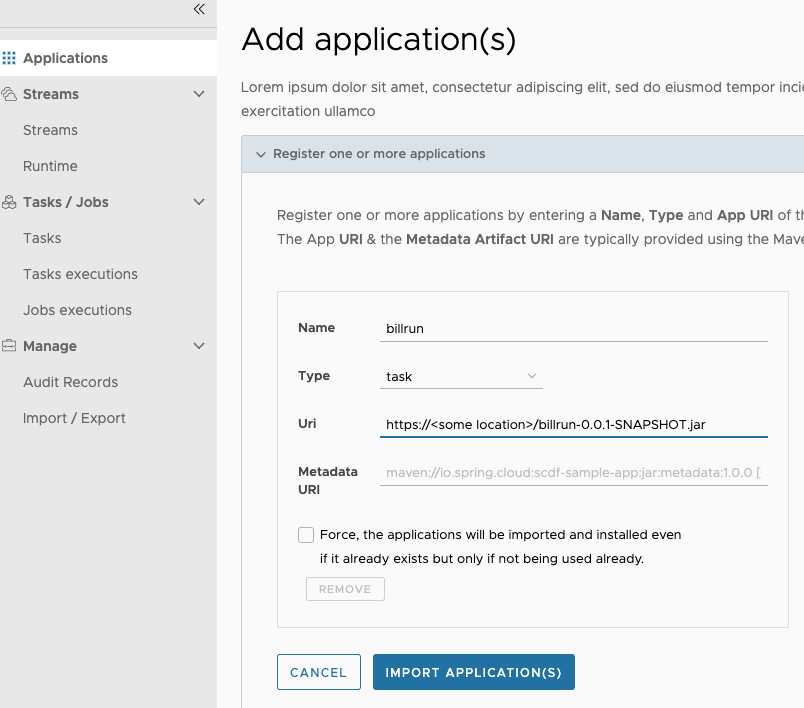

<!--Kubernetes-->

Spring Cloud Data Flow supports Docker resources for Kubernetes deployments.
The URI for a Docker image is of the form `docker:<docker-image-path>/<imageName>:<version>` and is resolved by using the Docker registry configured for the Data Flow task platform and image pull policy.

The Docker URI for the sample app is as follows:

```
docker:springcloudtask/billrun:0.0.1-SNAPSHOT
```

To register an application, select `Add Applications` and `Register one or more applications`. Fill in the form, as shown in the following image, and click `Register the application(s)`.

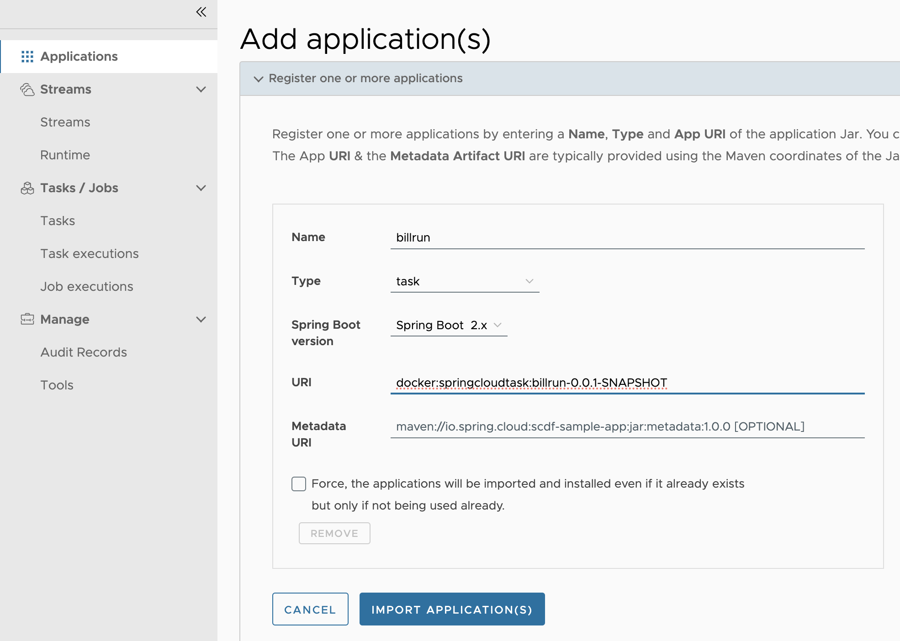

<!--END_TABS-->

### Creating the Task Definition

To create the task definition:

1. Select `Tasks` from the left navigation bar.

1. Select `Create task(s)`.
   Doing so displays a graphical editor that we can use to compose tasks.
   The initial canvas contains `START` and `END` nodes. To the left of the canvas, we see the available task applications, including `billrun`, which we just registered.

1. Drag that task (`billrun`) to the canvas and connect the task to the START and END nodes to complete the task definition.
   In this case, the task definition consists of a single task application.
   If the app defined configuration properties, we would set them here.
   The following image shows the UI for creating a task:
   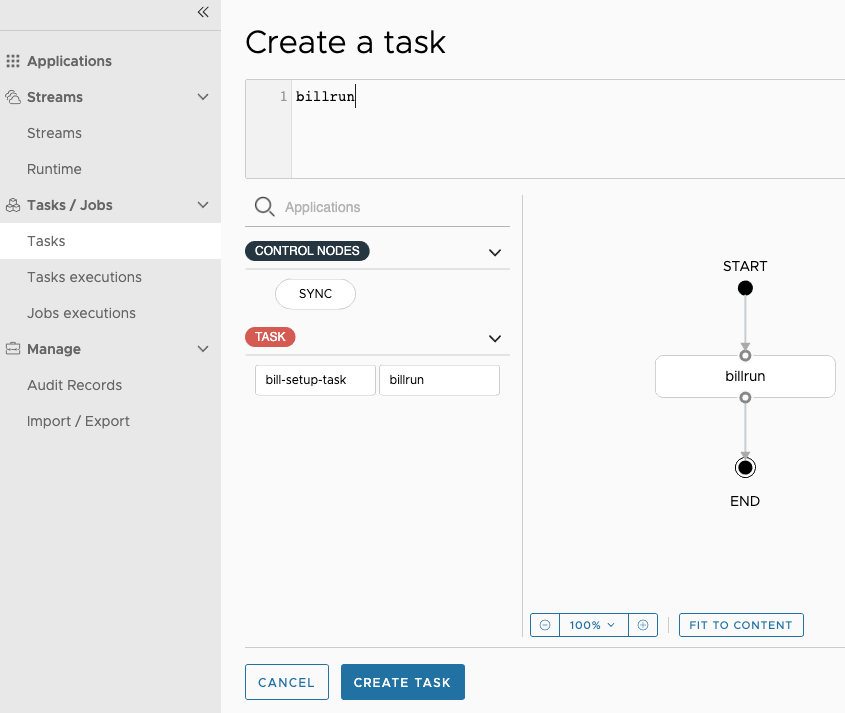

1. Click `Create Task`.
   Doing so prompts you to name the task definition, which is the logical name for the runtime configuration we want to deploy.
   In this case, we use the same name as the task application, which is `billrun`.
   Now we see the confirmation view, as the following image shows:
   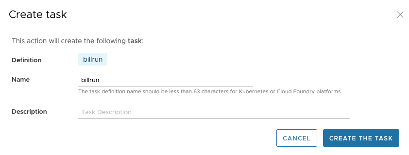

1. Click `Create the task`.
   Doing so displays the main `Tasks` view.

### Launching the Task

The following image shows the Tasks view, from which you can launch a task:

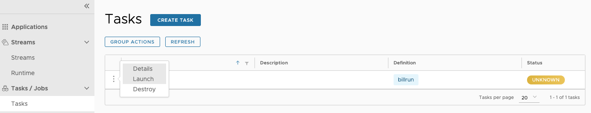

To launch a task:

1. Click the "play" button (the middle icon that looks like an arrowhead pointing right).
   Doing so takes you to a form where you can add command line arguments and deployment parameters, but we do not need any for this task.

1. Click **Launch the task**.
   Doing so runs the task on the Data Flow server's task platform and records a new task `execution`.
   When the execution is complete, the Status turns to a green color and shows `Complete.`
   Select the **Executions** tab to view a summary of executions for this task.

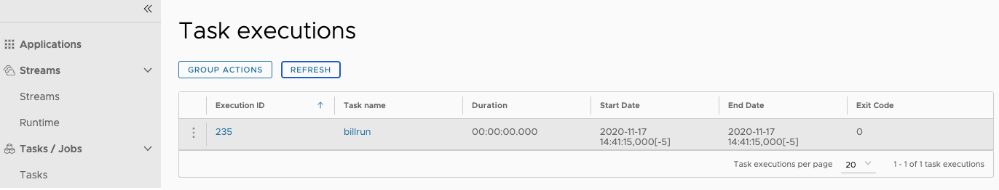

### Reviewing the Job Execution

Now that we have successfully launched the task, we can check the status of the job that was executed by the application.
To view the job executions, click the Jobs tab on the left hand side of the UI. The following image shows the Batch Job Executions view:

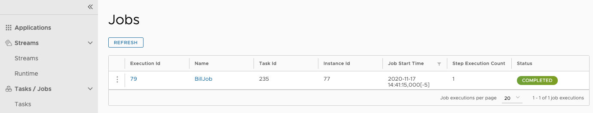

Now that we can view our job executions, we can dig in to the detail for each job execution. You can do so by clicking the `billrun` link on our job execution, which shows the details of that job execution, as the following image shows:

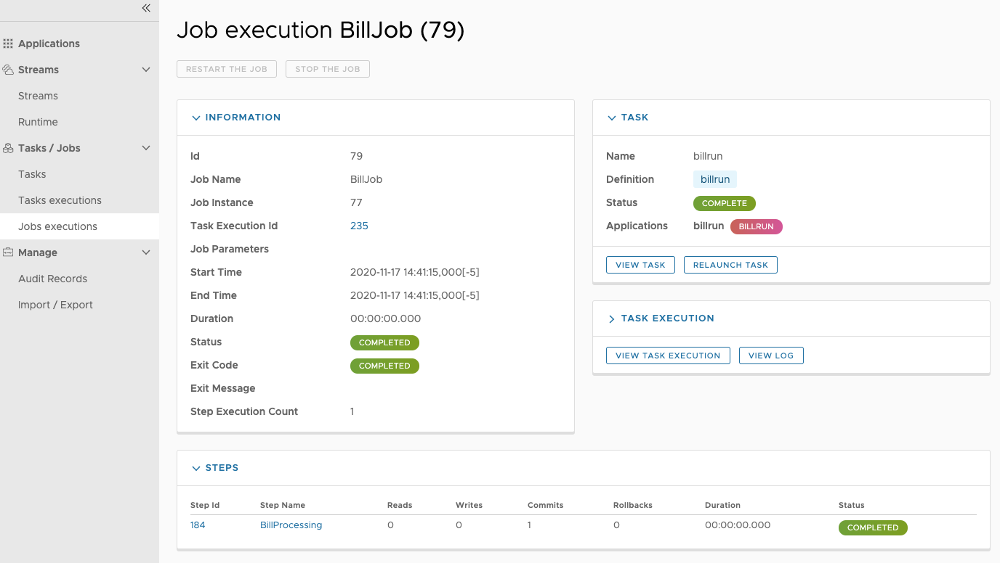

Also, for each job execution, we can view the step detail for each of the steps. You can do so by clicking the name of the step &#151; in our case, it is `BillProcessing`. The following image shows the step execution view:

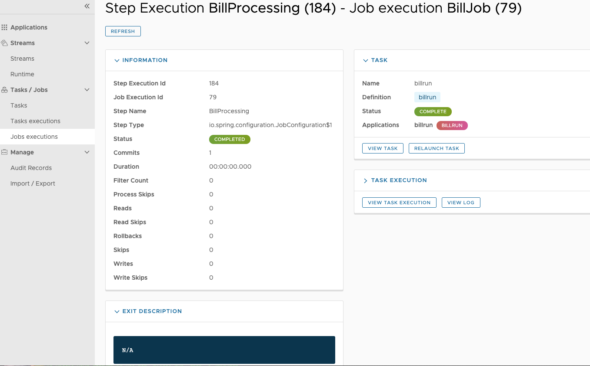
