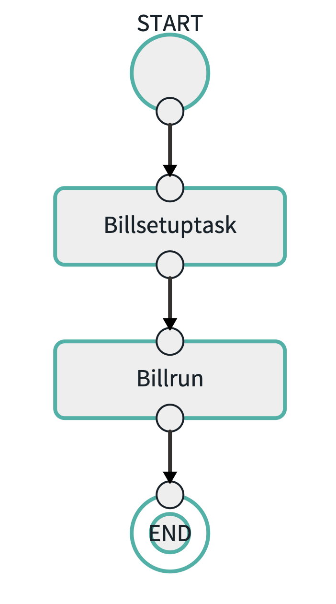
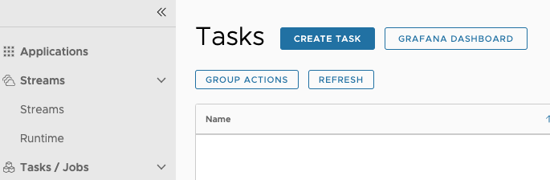
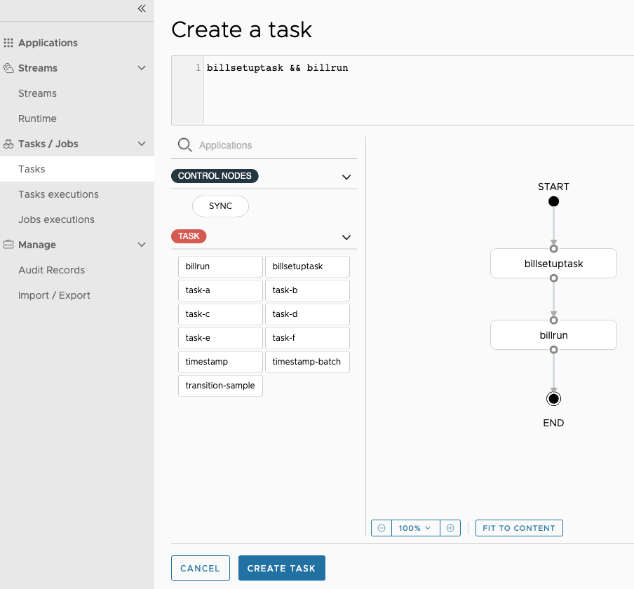
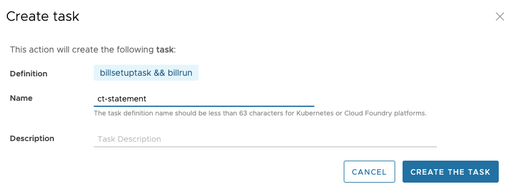
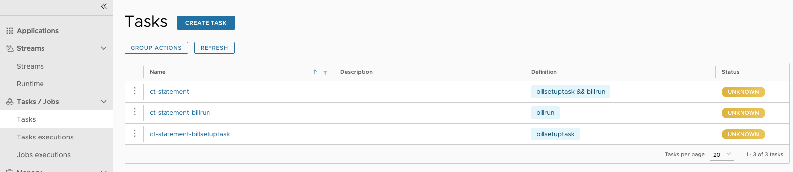
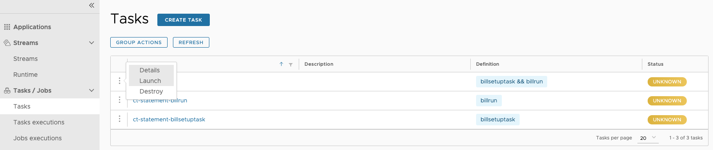
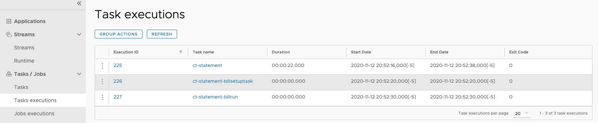
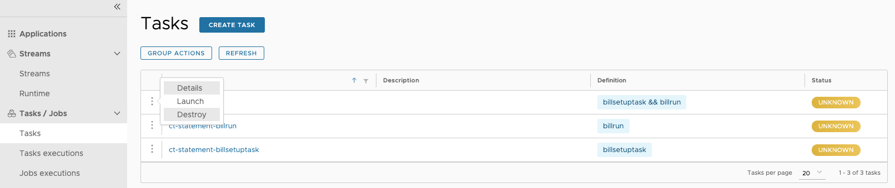

# Create and launch a Composed Task using Data Flow

In the previous sections, we used two applications:

- `billsetuptask`: The `billsetuptask` configures the database for the `billrun` application.
- `billrun`: The `billrun` reads usage information from a file and generates a billing statement record for each entry from a usage file.

Previously, we ran the `billsetuptask` application and then the `billrun` application in sequence manually.
This certainly works for the small case where we want to run two applications back to back and where the first app runs in a few seconds.
But what about the cases where there are five, ten, twenty or even more applications that need to be run in a sequence and the run time of some the applications may be hours?  
Also, what do we do in cases where one of the apps returns a non zero exit code?
Spring Cloud Data Flow provides a solution for this issue through the use of composed tasks.  
A composed task is a directed graph where each node of the graph is a task application.
For the two applications (`billsetuptask` and `billrun`) that we have used in the previous examples, the graph would look something like this:

In this section, we show how to create a composed task by using Spring Cloud Data Flow's UI and then launch the composed task to Cloud Foundry, Kubernetes, and your local machine.

## Prerequisites

Before you start on this sample, you need to do two things:

1. Install Spring Cloud Data Flow.
1. Install the Spring Cloud Task project that we use in this project.

### Data Flow Installation

You must you have installed Spring Cloud Data Flow to one of the following platforms:

- [Local](%currentPath%/installation/local/)
- [Cloud Foundry](%currentPath%/installation/cloudfoundry)
- [Kubernetes](%currentPath%/installation/kubernetes/)

### Registering the Billing Applications

For this guide, we need for you to have registered the [billsetuptask](%currentPath%/batch-developer-guides/batch/data-flow-simple-task) and the [billrun](%currentPath%/batch-developer-guides/batch/data-flow-spring-batch) applications in Spring Cloud Data Flow.

### Registering the Composed Task Runner

To register the composed task runner:

1. If you have not already done so, import the [Spring Cloud Task App Starters](https://cloud.spring.io/spring-cloud-task-app-starters/), which will give you the `composed-task-runner` application.
   To do so, click **Apps** in the left navigation bar

1. Select **Add Applications(s)**.

1. When the Add Application(s) page appears, select **Bulk import application coordinates from an HTTP URI location**.

1. In the **URI** field, enter either (based on the resource from which you will be pulling your apps):

- Maven: `%task-app-maven-version%`
- Docker: `%task-app-docker-version%`

1. Select **Import the application(s)**.

## Creating a Composed Task

To create a composed task:

1. Select `Tasks` from the left navigation bar.

1. Select `Create task(s)`. The task creation view, shown in the following image, appears:
   
   This displays a graphical editor that you can use to compose tasks.
   The initial canvas contains `START` and `END` nodes. To the left of the canvas, you can see the available task applications, including the `billsetuptask` and `billrun` applications.

1. Drag the `billsetuptask` application to the canvas.

1. Connect the START node to the `billsetuptask`.

1. Drag the `billrun` application to the canvas.

1. Connect the `billsetuptask` application to the `billrun` application

1. Connect the `billrun` application to the END node to complete the composed task definition.
   In this case, the composed task definition consists of two task apps (`billsetuptask` and `billrun`).
   If there are application-defined configuration properties, we would set them here.

1. Click `Create Task`.
   This prompts you to name the task definition, which is the logical name for the runtime configuration we want to deploy.
   In this case, we use the same name as the task application, which is `ct-statement`.
   The task confirmation view, shown in the following image, appears:
   

1.Press `Create the task`.
Doing so displays the main `Tasks` view.

<!--TIP-->

**TIP:** To see all the things that you can do with the Composed Task Graph, see the Composed Task [section](https://docs.spring.io/spring-cloud-dataflow/docs/current/reference/htmlsingle/#_composed_tasks_dsl) of the reference documentation.

<!--END_TIP-->

### Launching the Task

Once we return to the task list (shown in the following image), we can see that we now have three task definitions:

We see that the following three task definitions were created when we created the ct-statement task:

- `ct-statement`: This definition represents the composed task runner that runs the tasks in the composed task graph.
- `ct-statement-billsetuptask`: This definition represents the `billsetuptask` app that is run.
- `ct-statement-billrun`: This definition represents the `billrun` app that is to be run.

Now we can launch "ct-statement" by pressing the "play" button (the middle icon that looks like an arrowhead pointing right).
Doing so takes you to a form where you can add command line arguments and deployment parameters, but we do not need any for this composed task.
Click **Launch the task**, as the following image shows:

Doing so runs the composed task runner on the Data Flow server's task platform, which manages the execution of the composed task graph.

<!--TIP-->

**TIP:** If a composed task needs to be run multiple times, you need to set the `increment-instance-enabled` property to `true` for each launch.

<!--END_TIP-->

### Verifying the Results

When the execution is complete, the status for each of the task definitions turns to a green color and shows `Complete.`
You can select the **Executions** tab (shown in the following image) to view a summary of executions for this task.

### Deleting a Composed Task

As shown earlier, a composed task creates a definition for each application in the graph.
To delete all the definitions that were created as a part of the composed task, we can delete the composed task runner definition.
To do so:

1. Select the checkbox next to the ct-statement definition

1. Click the `Actions` button at the upper left hand corner

1. Select the `Destroy Tasks` option (shown in the following image).

   

   Doing so deletes the definitions that comprised the ct-statement composed task.
