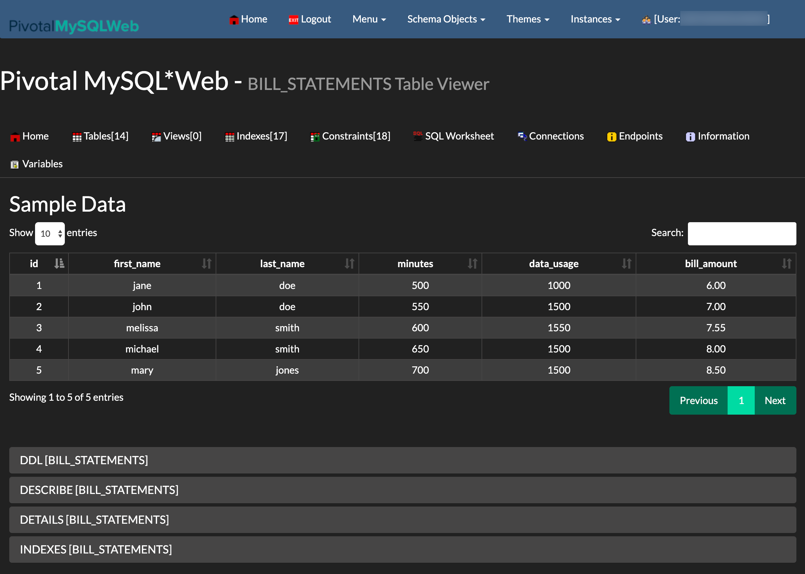

# Deploying a task application to Cloud Foundry

This guide will walk through how to deploy and run simple [spring-cloud-task](https://spring.io/projects/spring-cloud-task) stand-alone applications to Cloud Foundry.

# Requirements

On your local machine, you will need to have installed:

- Java
- [Git](https://git-scm.com/)

Please also make sure that you have the [Cloud Foundry command line interface](https://console.run.pivotal.io/tools) installed ([documentation](https://docs.run.pivotal.io/cf-cli/)).

## Project Setup

The example consists of 2 applications:

- billsetuptask
- billrun

The first task application `billsetuptask` will create an SQL table that is needed by the second task application.


The second task (Spring Batch) application `billrun` will read JSON files containing simple user cellphone usage data from a specified directory, price it and place the results in the previously created database table.

They are both located in the same Git repository. In order to get started, please checkout the project using:

```bash
git clone https://github.com/spring-cloud/spring-cloud-dataflow-samples.git
cd spring-cloud-dataflow-samples/dataflow-website/batch-developer-guides/batch/batchsamples
```

Let's first build the entire project:

```bash
./mvnw clean package
```

This will create 2 executable Jar files, one for each application:

- billsetuptask/target/**billsetuptask-0.0.1-SNAPSHOT.jar**
- billrun/target/**billrun-0.0.1-SNAPSHOT.jar**

## Setting up Cloud Foundry

First of all you need a Cloud Foundry account. You can create a free account using [Pivotal Web Services](https://run.pivotal.io/) (PWS). We will use PWS for this example. If you use a different provider, your experience may vary slightly.

Log into Cloud Foundry using the [Cloud Foundry command line interface](https://console.run.pivotal.io/tools):

```bash
cf login
```

**INFO** You can also target specific Cloud Foundry instances with the `-a` flag, for example `cf login -a https://api.run.pivotal.io`.

Before you can push any of the 2 applications, please also ensure that you setup the **MySql Service** on Cloud Foundry. You can check what services are available using:

```bash
cf marketplace
```

On [Pivotal Web Services](https://run.pivotal.io/) (PWS) you should be able to use the following command to install the MySQL service:

```bash
cf create-service cleardb spark task-example-mysql
```

Please make sure you name your MySQL service is `task-example-mysql`.

## Task Concepts in Cloud Foundry

In order to provide configuration parameters for Cloud Foundry, we will create dedicated `manifest` YAML files for each application.

**INFO** For additional information on setting up a manifest see [here](https://docs.cloudfoundry.org/devguide/deploy-apps/manifest.html)

Running tasks on Cloud Foundry is a 2-stage process. Before you can actually run any tasks you need to first push an app that is staged without any running instances. We are providing the following common properties to the manifest YAML file to each application:

```yml
memory: 32M
health-check-type: process
no-route: true
instances: 0
```

The key is to set the `instances` property to `0`. This will ensure that the app is staged without being actually running. We also do not need a route to be created and can set `no-route` to `true`.

**TIP** Having this app staged but not running has a second advantage as well. Not only do we need this staged application to run a task in a subsequent step, but if your database service is internal (part of your Cloud Foundry instance) we can use this application to establish an SSH tunnel to the associated MySql database service to see the persisted data. But we go into the details for that a little bit further down below.

## Running billsetuptask on Cloud Foundry

In order to deploy the first task application `billsetuptask`, create file `manifest-billsetuptask.yml` with the following contents:

```yaml
applications:
  - name: billsetuptask
    memory: 32M
    health-check-type: process
    no-route: true
    instances: 0
    disk_quota: 1G
    timeout: 180
    buildpacks:
      - java_buildpack
    path: billsetuptask/target/billsetuptask-0.0.1-SNAPSHOT.jar
    services:
      - task-example-mysql
```

Now run `cf push -f ./manifest-billsetuptask.yml`. This will stage the application and the app should be up which you can also verify in the Cloud Foundry dashboard.


We are now ready to run the task:

```bash
cf run-task billsetuptask ".java-buildpack/open_jdk_jre/bin/java org.springframework.boot.loader.JarLauncher arg1" --name billsetuptask-task
```

**TIP** If needed you also can specify the following optional arguments:

- `-k` Disk limit (e.g. 256M, 1024M, 1G)
- `-m` Memory limit (e.g. 256M, 1024M, 1G)

The task should execute successfuly. Verify the results in the Cloud Foundry dashboard by clicking onto the `Task` tab:


In the `Tasks` table you should see your task `billsetuptask` with a `State` of `Succeeded`:


## Running billrun on Cloud Foundry

Now we will deploy and run the second task application. In order to deploy, create file `manifest-billrun.yml`:

```yaml
applications:
  - name: billrun
    memory: 32M
    health-check-type: process
    no-route: true
    instances: 0
    disk_quota: 1G
    timeout: 180
    buildpacks:
      - java_buildpack
    path: billrun/target/billrun-0.0.1-SNAPSHOT.jar
    services:
      - task-example-mysql
```

Now run `cf push -f ./manifest-billrun.yml`. This will stage the application. We are now ready to run the task:

```bash
cf run-task billrun ".java-buildpack/open_jdk_jre/bin/java org.springframework.boot.loader.JarLauncher arg1" --name billrun-task
```

This should produce output like the following:

```bash
Task has been submitted successfully for execution.
task name:   billrun-task
task id:     1
```

Verifying the task on the Cloud Foundry dashboard, the task should have executed successfully. But how do we verify that the task application successfuly populated the database table?

## Validating the Database Results

There are multiple options available on how to access database data in Cloud Foundry also depending on your individual Cloud Foundry environment. Two options that we will look at are:

- Using local tools (via SSH or external database provider)
- Using a Database GUI deployed to Cloud Foundry

### Using local tools (MySQLWorkbench)

First we need to create a [key for a service instance](http://cli.cloudfoundry.org/en-US/cf/create-service-key.html) using the `cf create-service-key` command:

```bash
cf create-service-key task-example-mysql EXTERNAL-ACCESS-KEY
cf service-key task-example-mysql EXTERNAL-ACCESS-KEY
```

This should give you back the credentials neccessary to access the database, e.g.:

```json
Getting key EXTERNAL-ACCESS-KEY for service instance task-example-mysql as ghillert@gopivotal.com...

{
 "hostname": "...",
 "jdbcUrl": "jdbc:mysql://...",
 "name": "...",
 "password": "...",
 "port": "3306",
 "uri": "mysql://...",
 "username": "..."
}
```

This should result in a response detailing the access information for the respective database. The result will be different depending on whether the used database service is running internally or whether the service is provided by a third-party. In case of PWS, using ClearDB, we can directly connect to the database as it is a third-party provider.

If you are dealing with an internal service, you may have to create an SSH tunnel via the `cf ssh` command, e.g.:

```bash
cf ssh -L 3306:<host_name>:<port> task-example-mysql
```

Using the free [MySQLWorkbench](https://www.mysql.com/products/workbench/) you should see the following populated data:


### Using a Database GUI deployed to Cloud Foundry

Another interesting option to keep an eye on your MySQL instance is to use [PivotalMySQLWeb](https://github.com/pivotal-cf/PivotalMySQLWeb). In a nutshell, you can push PivotalMySQLWeb to your Cloud Foundry space and bind it to your MySql instance allowing you to introspect your MySQL service without having to use local tooling.

Check out the project:

```bash
git clone https://github.com/pivotal-cf/PivotalMySQLWeb.git
cd PivotalMySQLWeb
```

**IMPORTANT**: Please update the credentials first in `src/main/resources/application-cloud.yml` ([Source on GitHub](https://github.com/pivotal-cf/PivotalMySQLWeb/blob/master/src/main/resources/application-cloud.yml)). By default the username is `admin` and the password is `cfmysqlweb`.

Then build the project:

```bash
./mvnw -DskipTests=true package
```

Next, update the `manifest.yml` file:

```yml
applications:
  - name: pivotal-mysqlweb
    memory: 1024M
    instances: 1
    random-route: true
    path: ./target/PivotalMySQLWeb-1.0.0-SNAPSHOT.jar
    services:
      - task-example-mysql
    env:
      JAVA_OPTS: -Djava.security.egd=file:///dev/urandom
```

**IMPORTANT** specify your MySQL service `task-example-mysql`

In this instance we set the property `random-route` to `true` in order to generate a random URL for the application. Watch the console for a printout of the URL. Push the app to Cloud Foundry:

```bash
cf push
```

Now you can login into the application an take a look at the table populated by the `billrun` task application.



## Teardown of all Task Applications and Services

With the conclusion of this example you may also want to remove all instances on Cloud Foundry. The following commands will accomplish that:

```bash
cf delete billsetuptask -f
cf delete billrun -f
cf delete pivotal-mysqlweb -f -r
cf delete-service-key task-example-mysql EXTERNAL-ACCESS-KEY -f
cf delete-service task-example-mysql -f
```

The important thing to note here is that we need to delete the service key `EXTERNAL-ACCESS-KEY` before we can delete the `task-example-mysql` service itself. Additionally employed command flags are:

- `-f` Force deletion without confirmation
- `-r` Also delete any mapped routes
