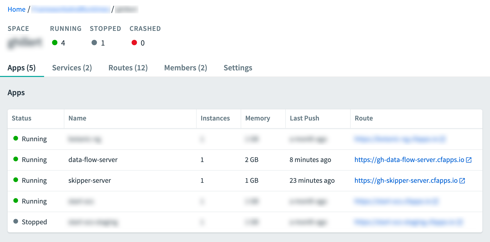

# Setting up Cloud Foundry to Launch Tasks

To run the two task applications by using Spring Cloud Data Flow, we also set up the following two server instances on Cloud Foundry:

- [Spring Cloud Data Flow](https://cloud.spring.io/spring-cloud-dataflow/)
- [Spring Cloud Skipper](https://cloud.spring.io/spring-cloud-skipper/)

To download Spring Cloud Data Flow, run the following command:

```bash
wget %maven-repo-url%/org/springframework/cloud/spring-cloud-dataflow-server/%dataflow-version%/spring-cloud-dataflow-server-%dataflow-version%.jar
```

To download Spring Cloud Skipper, run the following command:

```bash
wget %maven-repo-url%/org/springframework/cloud/spring-cloud-skipper-server/%skipper-version%/spring-cloud-skipper-server-%skipper-version%.jar
```

Later in this document, we describe how to deploy those two jars to Cloud Foundry.

## Setting up Services

To set up services, you first need a Cloud Foundry account. You can create a free account by using [Pivotal Web Services](https://run.pivotal.io/) (PWS). We use PWS for this example. If you use a different provider, your experience may differ slightly from the experience described in this document.

Once you have an account, to log into Cloud Foundry by using the [Cloud Foundry command line interface](https://console.run.pivotal.io/tools), run the following command:

```bash
cf login
```

<!--TIP-->

You can also target specific Cloud Foundry instances with the `-a` flag &#151; for example, `cf login -a https://api.run.pivotal.io`.

<!--END_TIP-->

We use the following Cloud Foundry services:

- PostgreSQL
- RabbitMQ

<!--NOTE-->

RabbitMQ is not strictly needed, but, if we continue on to work with Streams, we want to be good citizens.

<!--END_NOTE-->

You can get a listing of available services on Cloud by using the `marketplace` command, as follows:

```bash
cf marketplace
```

On [Pivotal Web Services](https://run.pivotal.io/) (PWS), you should be able to use the following commands to install the PostgreSQL service and the RabbitMQ service:

```bash
cf create-service elephantsql panda postgres-service
cf create-service cloudamqp lemur rabbitmq-service
```

<!-- IMPORTANT -->

**IMPORTANT**: When choosing a Postgres service, keep an eye on the provided number of connections. On PWS, for example, the free service tier of `elephantsql` provides only four parallel database connections, which is too limiting to successfully run this example.

<!-- END_IMPORTANT -->

Make sure you name your PostgresSQL service `postgres-service`. We use that name in the rest of the examples in this document.

## Setting up Skipper on Cloud Foundry

This example uses Skipper, which you can set up on Cloud Foundry. To do so:

1. Create a file named `manifest-skipper.yml` with the following content:

   ```yaml
   applications:
     - name: skipper-server
       routes:
         - route: <your-skipper-server-route> # e.g. my-skipper-server.cfapps.io
       memory: 1G
       disk_quota: 1G
       instances: 1
       timeout: 180
       buildpacks:
         - java_buildpack
       path: ./spring-cloud-skipper-server-%skipper-version%.jar
       env:
         SPRING_APPLICATION_NAME: skipper-server
         SPRING_PROFILES_ACTIVE: cloud
         JBP_CONFIG_SPRING_AUTO_RECONFIGURATION: '{enabled: false}'
         SPRING_DATASOURCE_HIKARI_MINIMUMIDLE: 1
         SPRING_DATASOURCE_HIKARI_MAXIMUMPOOLSIZE: 4
         SPRING_APPLICATION_JSON: |-
           {
             "spring.cloud.skipper.server" : {
                "platform.cloudfoundry.accounts" : {
                      "default" : {
                          "connection" : {
                              "url" : <cf-api-url>,
                              "domain" : <cf-apps-domain>,
                              "org" : <org>,
                              "space" : <space>,
                              "username": <email>,
                              "password" : <password>,
                              "skipSsValidation" : false
                          },
                          "deployment" : {
                              "deleteRoutes" : false,
                              "services" : "rabbitmq-service",
                              "enableRandomAppNamePrefix" : false,
                              "memory" : 2048
                          }
                     }
                 }
              }
           }

       services:
         - postgres-service
   ```

1. Run `cf push -f ./manifest-skipper.yml`.

## Setting up Data Flow on Cloud Foundry

This example uses Skipper, which you can set up on Cloud Foundry. To do so:

1. Create a file named `manifest-dataflow.yml`:

   ```yaml
   ---
   applications:
     - name: data-flow-server
       routes:
         - route: <your-data-flow-server-route> # e.g. my-data-flow-server.cfapps.io
       memory: 2G
       disk_quota: 2G
       instances: 1
       path: ./spring-cloud-dataflow-server-%dataflow-version%.jar
       env:
         SPRING_APPLICATION_NAME: data-flow-server
         SPRING_PROFILES_ACTIVE: cloud
         JBP_CONFIG_SPRING_AUTO_RECONFIGURATION: '{enabled: false}'
         SPRING_CLOUD_SKIPPER_CLIENT_SERVER_URI: https://<skipper-host-name>/api
         SPRING_APPLICATION_JSON: |-
           {
             "maven" : {
                 "remoteRepositories" : {
                     "repo1" : {
                       "url" : "https://repo.spring.io/libs-snapshot"
                     }
                 }
             },
             "spring.cloud.dataflow" : {
                   "task.platform.cloudfoundry.accounts": {
                       "default" : {
                           "connection" : {
                               "url": <cf-api-url>,
                               "domain": <cf-apps-domain>,
                               "org": <org>,
                               "space" : <space>,
                               "username": <email>,
                               "password" : <password>,
                               "skipSsValidation" : true
                           },
                           "deployment" : {
                             "services" : "postgres-service"
                           }
                       }
                   },
                   "applicationProperties" : {
                       "task": {
                           "spring.datasource.hikari" : {
                                 "minimumIdle" : 1, ,  
                                 "maximumPoolSize" : 2
                           }
                       }
                   }
             }
           }
       services:
         - postgres-service
   ```

   For an explanation of the configured properties, see https://docs.spring.io/spring-cloud-dataflow/docs/current/reference/htmlsingle/#\_common\_application_properties

1. Run `cf push -f ./manifest-dataflow.yml`.

Once you have deployed Spring Cloud Data Flow and Spring Cloud Skipper, go to your Cloud Foundry dashboard. Both Spring Cloud Skipper and Spring Cloud Data Flow should have a status of `Running`, as follows:


