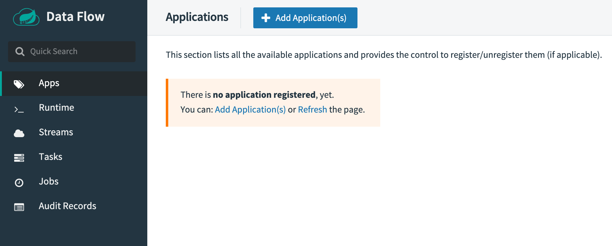
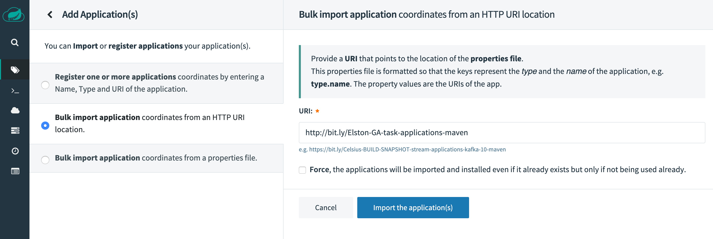
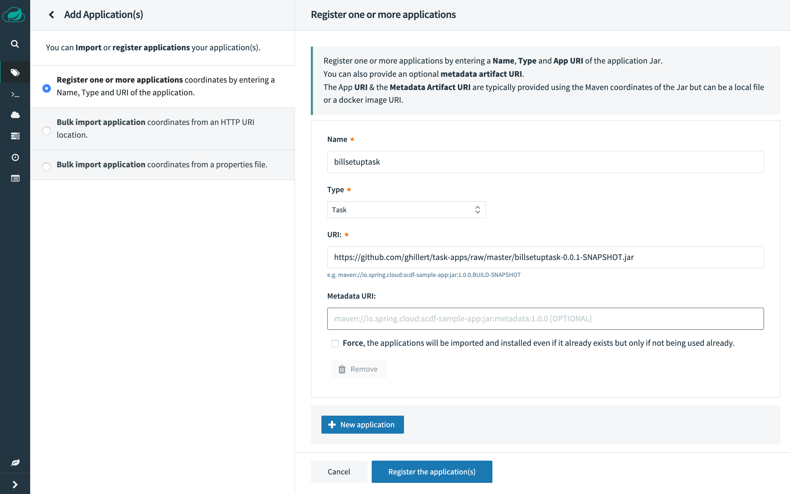
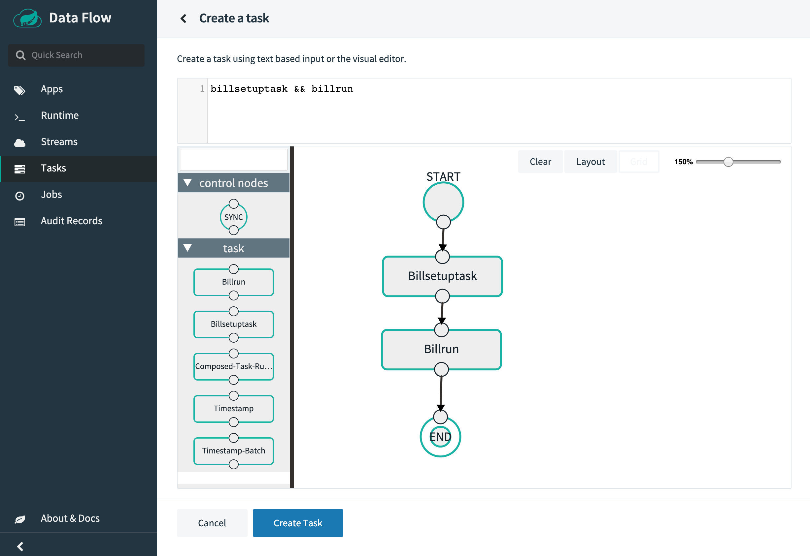
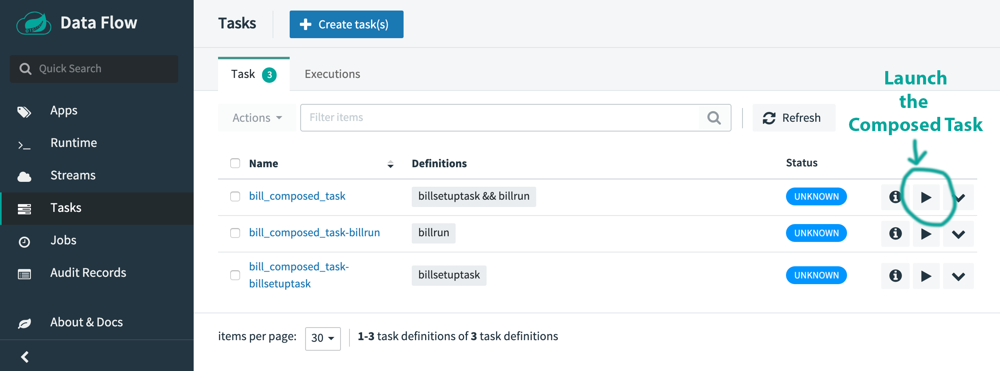

# Deploying a task application to Cloud Foundry using Spring Cloud Data Flow

This guide will walk through how to deploy and run simple [spring-cloud-task](https://spring.io/projects/spring-cloud-task) applications to Cloud Foundry using [Spring Cloud Data Flow](https://cloud.spring.io/spring-cloud-dataflow/).

In this tutorial we would like to take the [2 example task applications](https://github.com/spring-cloud/spring-cloud-dataflow-samples/tree/master/dataflow-website/batch-developer-guides/batch/batchsamples) that we previously used to deploy stand-alone to Cloud Foundry and instead deploy them to Cloud Foundry using Spring Cloud Data Flow. This not only provides you with a slick-looking GUI for your Task- and Batch needs but also allows for orchestrating your Batch processes and Task applications.

For example, up until now we have run the 2 example tasks individually. However, using Spring Cloud Data Flow and the [Composed Task](http://docs.spring.io/spring-cloud-dataflow/docs/current/reference/htmlsingle/#spring-cloud-dataflow-composed-tasks) feature, we can execute both Task in one flow.

When using Spring Cloud Dataflow to deploy task and stream applications to Cloud Foundry, you have 2 options on how to run Spring Cloud Data Flow itself:

- **locally** and target a remote Cloud Foundry instance or
- **on Cloud Foundry** itself and deloy applications there as well

For this guide, we will deploy Spring Cloud Data Flow to Cloud Foundry.

**IMPORTANT** This guide will provide you with quick steps to get you going. For more specific information, please refer to the [Cloud Foundry specific section](https://docs.spring.io/spring-cloud-dataflow/docs/current-SNAPSHOT/reference/htmlsingle/#getting-started-cloudfoundry) of the Spring Cloud Data Flow reference documentation in regards to how to set things up for Cloud Foundry.

# Requirements

On your local machine, you will need to have installed:

- Java 8
- [Git](https://git-scm.com/)

Please also make sure that you have the [Cloud Foundry command line interface](https://console.run.pivotal.io/tools) installed ([documentation](https://docs.run.pivotal.io/cf-cli/)).

## Local Project Setup

The example consists of 2 applications:

- billsetuptask
- billrun

The first task application `billsetuptask` will create an SQL table that is needed by the second task application.

```sql
CREATE TABLE IF NOT EXISTS BILL_STATEMENTS (
    id int,
    first_name varchar(50),
    last_name varchar(50),
    minutes int,
    data_usage int,
    bill_amount decimal(10,2)
);
```

The second task ([Spring Batch](https://spring.io/projects/spring-batch)) application `billrun` will read JSON files containing simple user cellphone usage data from a specified directory, price it and place the results in the previously created database table.

They are both located in the same Git repository. In order to get started, please checkout the project using:

```bash
git clone https://github.com/spring-cloud/spring-cloud-dataflow-samples.git
cd spring-cloud-dataflow-samples/dataflow-website/batch-developer-guides/batch/batchsamples
```

Let's first build the entire project:

```bash
./mvnw clean package
```

This will create 2 executable Jar files, one for each application:

- billsetuptask/target/**billsetuptask-0.0.1-SNAPSHOT.jar**
- billrun/target/**billrun-0.0.1-SNAPSHOT.jar**

In order for Spring Cloud Data Flow to consume the applications, they need to be accessibly via HTTP(S). An easy solution is to add the 2 jar files to a GitHub repository.

We can then reference the 2 applications using Urls like the following:

- https://github.com/ghillert/task-apps/raw/master/billsetuptask-0.0.1-SNAPSHOT.jar
- https://github.com/ghillert/task-apps/raw/master/billrun-0.0.1-SNAPSHOT.jar

In order to run the 2 task applications using Spring Cloud Data Flow we will also setup the following 2 server instances on Cloud Foundry:

- [Spring Cloud Data Flow](https://cloud.spring.io/spring-cloud-dataflow/)
- [Spring Cloud Skipper](https://cloud.spring.io/spring-cloud-skipper/)

Download the 2 server applications - Spring Cloud Data Flow:

```bash
wget https://repo.spring.io/milestone/org/springframework/cloud/spring-cloud-dataflow-server/2.1.0.M1/spring-cloud-dataflow-server-2.1.0.M1.jar
```

and Spring Cloud Skipper:

```bash
wget https://repo.spring.io/milestone/org/springframework/cloud/spring-cloud-skipper-server/2.0.2.RC1/spring-cloud-skipper-server-2.0.2.RC1.jar
```

We will then deploy those 2 jars to Cloud Foundry.

## Setting up Cloud Foundry

First of all you need a Cloud Foundry account. You can create a free account using [Pivotal Web Services](https://run.pivotal.io/) (PWS). We will use PWS for this example. If you use a different provider, your experience may vary slightly.

Log into Cloud Foundry using the [Cloud Foundry command line interface](https://console.run.pivotal.io/tools):

```bash
cf login
```

**INFO** You can also target specific Cloud Foundry instances with the `-a` flag, for example `cf login -a https://api.run.pivotal.io`.

We will use the following 2 Cloud Foundry services:

- PostgreSQL
- RabbitMQ

**INFO** RabbitMQ is not strictly needed but if you continue on to work with Streams we want to be good citizens.

You can get a listing of available services on Cloud using the `marketplace` command:

```bash
cf marketplace
```

On [Pivotal Web Services](https://run.pivotal.io/) (PWS) you should be able to use the following command to install the PostgreSQL service as well as RabbitMQ service:

```bash
cf create-service elephantsql panda postgres-service
cf create-service cloudamqp lemur rabbitmq-service
```

**INFO** When choosing a Postgres service, please keep an eye on the provided number of connections. On PWS, for example, the free service tier of `elephantsql` only provides 4 parallel database connections, which is too limiting to run this example sucessfully.

Please make sure you name your PostgresSQL service `postgres-service`.

# Setting up Skipper on Cloud Foundry

In order to deploy, create a file `manifest-skipper.yml`:

```yaml
applications:
  - name: skipper-server
    routes:
      - route: gh-skipper-server.cfapps.io
    memory: 1G
    disk_quota: 1G
    instances: 1
    timeout: 180
    buildpacks:
      - java_buildpack
    path: ./spring-cloud-skipper-server-2.0.2.RC1.jar
    env:
      SPRING_APPLICATION_NAME: skipper-server
      SPRING_PROFILES_ACTIVE: cloud
      JBP_CONFIG_SPRING_AUTO_RECONFIGURATION: '{enabled: false}'
      SPRING_CLOUD_SKIPPER_SERVER_STRATEGIES_HEALTHCHECK_TIMEOUTINMILLIS: 300000
      SPRING_CLOUD_SKIPPER_SERVER_PLATFORM_CLOUDFOUNDRY_ACCOUNTS[default]_CONNECTION_URL: https://api.run.pivotal.io
      SPRING_CLOUD_SKIPPER_SERVER_PLATFORM_CLOUDFOUNDRY_ACCOUNTS[default]_CONNECTION_ORG: <your-cloud-foundry-org>
      SPRING_CLOUD_SKIPPER_SERVER_PLATFORM_CLOUDFOUNDRY_ACCOUNTS[default]_CONNECTION_SPACE: <your-cloud-foundry-space>
      SPRING_CLOUD_SKIPPER_SERVER_PLATFORM_CLOUDFOUNDRY_ACCOUNTS[default]_DEPLOYMENT_DOMAIN: cfapps.io
      SPRING_CLOUD_SKIPPER_SERVER_PLATFORM_CLOUDFOUNDRY_ACCOUNTS[default]_CONNECTION_USERNAME: <your-cloud-foundry-username>
      SPRING_CLOUD_SKIPPER_SERVER_PLATFORM_CLOUDFOUNDRY_ACCOUNTS[default]_CONNECTION_PASSWORD: <your-cloud-foundry-password>
      SPRING_CLOUD_SKIPPER_SERVER_PLATFORM_CLOUDFOUNDRY_ACCOUNTS[default]_CONNECTION_SKIP_SSL_VALIDATION: false
      SPRING_CLOUD_SKIPPER_SERVER_PLATFORM_CLOUDFOUNDRY_ACCOUNTS[default]_DEPLOYMENT_DELETE_ROUTES: false
      SPRING_CLOUD_SKIPPER_SERVER_PLATFORM_CLOUDFOUNDRY_ACCOUNTS[default]_DEPLOYMENT_SERVICES: rabbitmq-service
      SPRING_CLOUD_SKIPPER_SERVER_PLATFORM_CLOUDFOUNDRY_ACCOUNTS[default]_DEPLOYMENT_STREAM_ENABLE_RANDOM_APP_NAME_PREFIX: false
      SPRING_CLOUD_SKIPPER_SERVER_PLATFORM_CLOUDFOUNDRY_ACCOUNTS[default]_DEPLOYMENT_MEMORY: 2048m
      SPRING_DATASOURCE_HIKARI_MINIMUMIDLE: 1
      SPRING_DATASOURCE_HIKARI_MAXIMUMPOOLSIZE: 4
    services:
      - postgres-service
```

Now run `cf push -f ./manifest-skipper.yml`.

# Setting up Data Flow on Cloud Foundry

In order to deploy, create a file `manifest-dataflow.yml`:

```yaml
---
applications:
  - name: data-flow-server
    routes:
      - route: <your-data-flow-server-route>
    memory: 2G
    disk_quota: 2G
    instances: 1
    path: ./spring-cloud-dataflow-server-2.1.0.M1.jar
    env:
      SPRING_APPLICATION_NAME: data-flow-server
      SPRING_PROFILES_ACTIVE: cloud
      JBP_CONFIG_SPRING_AUTO_RECONFIGURATION: '{enabled: false}'
      MAVEN_REMOTEREPOSITORIES[REPO1]_URL: https://repo.spring.io/libs-snapshot
      SPRING_CLOUD_DATAFLOW_TASK_PLATFORM_CLOUDFOUNDRY_ACCOUNTS[default]_CONNECTION_URL: https://api.run.pivotal.io
      SPRING_CLOUD_DATAFLOW_TASK_PLATFORM_CLOUDFOUNDRY_ACCOUNTS[default]_CONNECTION_ORG: <your-cloud-foundry-org>
      SPRING_CLOUD_DATAFLOW_TASK_PLATFORM_CLOUDFOUNDRY_ACCOUNTS[default]_CONNECTION_SPACE: <your-cloud-foundry-space>
      SPRING_CLOUD_DATAFLOW_TASK_PLATFORM_CLOUDFOUNDRY_ACCOUNTS[default]_CONNECTION_DOMAIN: cfapps.io
      SPRING_CLOUD_DATAFLOW_TASK_PLATFORM_CLOUDFOUNDRY_ACCOUNTS[default]_CONNECTION_USERNAME: <your-cloud-foundry-username>
      SPRING_CLOUD_DATAFLOW_TASK_PLATFORM_CLOUDFOUNDRY_ACCOUNTS[default]_CONNECTION_PASSWORD: <your-cloud-foundry-password>
      SPRING_CLOUD_DATAFLOW_TASK_PLATFORM_CLOUDFOUNDRY_ACCOUNTS[default]_CONNECTION_SKIP_SSL_VALIDATION: true
      SPRING_CLOUD_DATAFLOW_TASK_PLATFORM_CLOUDFOUNDRY_ACCOUNTS[default]_DEPLOYMENT_SERVICES: rabbitmq-service
      SPRING_CLOUD_SKIPPER_CLIENT_SERVER_URI: https://gh-skipper-server.cfapps.io/api
      SPRING_CLOUD_DATAFLOW_SERVER_URI: https://gh-data-flow-server.cfapps.io
      SPRING_DATASOURCE_HIKARI_MINIMUMIDLE: 2
      SPRING_DATASOURCE_HIKARI_MAXIMUMPOOLSIZE: 4
      SPRING_CLOUD_DATAFLOW_APPLICATIONPROPERTIES_TASK_SPRING_DATASOURCE_HIKARI_MINIMUMIDLE: 1
      SPRING_CLOUD_DATAFLOW_APPLICATIONPROPERTIES_TASK_SPRING_DATASOURCE_HIKARI_MAXIMUMPOOLSIZE: 2
    services:
      - postgres-service
```

Some explanation of the configured properties:

https://docs.spring.io/spring-cloud-dataflow/docs/current/reference/htmlsingle/#_common_application_properties

Now run `cf push -f ./manifest-dataflow.yml`.

Once deployed, go to your Cloud Foundry dashboard. Both, Spring Cloud Skipper as well as Spring Cloud Data Flow should have a status of `Running`:


Next, go to the Spring Cloud Data Flow dasboard at https://your-data-flow-server-route/dashboard. The UI should successfully start up and inform you that no application is registered, yet:



# Execute the Example

First, we need to import the [Spring Cloud Task App Starters](https://cloud.spring.io/spring-cloud-task-app-starters/), which will give us the `composed-task-runner` application. For the Task App Starters we will use the option **Bulk import application coordinates from an HTTP URI location**. We use the latest release link, e.g. `http://bit.ly/Elston-GA-task-applications-maven` as URI. Click `Import the application(s)`.



Now import our 2 custom task apps using the option **Register one or more applications**. As name use:

- billsetuptask
- billrun

Select `Task` for the Type of the applications. As URI you will use the HTTP address to where you pushed the 2 example jar files earlier, e.g. if you use GitHub something like this:

- https://github.com/ghillert/task-apps/raw/master/billsetuptask-0.0.1-SNAPSHOT.jar
- https://github.com/ghillert/task-apps/raw/master/billrun-0.0.1-SNAPSHOT.jar

We leave the input field `Metadata URI` empty.



You have the option to run the import dialog twice or to by clicking `New Application`, you can import multipls applications in one go. Once ready to import, press `Register the application(s)`.

Now we are ready to head over to the Flo designer and create the Composed Task. On the main left navigation, select `Tasks` and then click `Create task(s)`. The Flo designer will open up and you should see your 2 custom applications in the tool palette to the left. Drag each application from the palette to the main designer interface and connect the `START` icon to the `billsetuptask` icon, the `billsetuptask` to the `billrun` icon and finally the `billrun` to the `END` icon. Your flow should look like the following:



Above the visual editor, you will see the text-based task definition `billsetuptask && billrun`. Press `Create Task` and enter a name for the composed task definition, e.g. `bill_composed_task`.

You will return to the task definition screen and you will see 3 tasks that were created for you:

- bill_composed_task (The parent composed task runner)
- bill_composed_task_billsetuptask
- bill_composed_task_billrun

Congratulations, you have created a composed task definition that will deploy and execute your 2 custom tasks in sequence. Let's execute them. Click the `Launch task` icon for the `bill_composed_task` definition.



We don't have to provide any `Arguments` or `Parameters`. Simply click `Launch the task`. The operation may take a few seconds, as the task application will be deployed to Cloud Foundry.

## Verify the results

Finally, we can verify the results of the task by taking a look at the PostgreSQL database and the results table. In order to validate the results, we have to connect to the PostgresSQL database. First we need to create a service key for our PostgreSQL service `postgres-service` and then we can get the service information:

```bash
cf create-service-key postgres-service EXTERNAL-ACCESS-KEY
cf service-key postgres-service EXTERNAL-ACCESS-KEY
```

This should result in a response detailing the access information for the respective database. The result will be different depending on whether the used database service is running internally or whether the service is provided by a third-party. In case of PWS, using ElephantSQL, we can directly connect to the database as it is a third-party provider.

If you are dealing with an internal service, you may have to create a ssh tunnel via the `cf ssh` command, e.g.:

```bash
cf ssh -L 63306:<host_name>:<port> postgres-service
```

**screenshot_here**

## Teardown of all Task Applications

With the conclusion of this example you may also want to remove the created task applications. Simply mark them in the task applications table and select `Destroy task(s)`.
