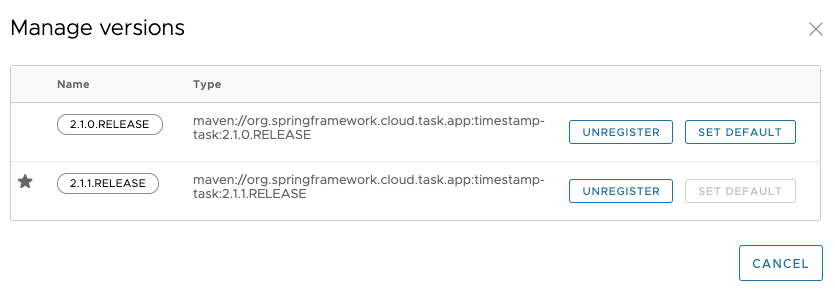

# Continuous Deployment of task applications

As task applications evolve, you want to get your updates to production.
The change can be a new version of the task application that fixes a bug or setting a deployment property different from the previous task launch.

When a task application is registered in SCDF, a version is typically associated with it. A task application can have multiple versions associated with it, with one selected as the default. The following image illustrates an application with multiple versions associated with it (see the timestamp entry).


Versions of an application are managed in SCDF by registering multiple applications with the same name and coordinates, _except_ the version will be different. For example, if you were to register an application with the following values, you would get one application registered with two versions (2.0.0.RELEASE and 2.1.0.RELEASE):

- Application 1
  ** Name: `timestamp`
  ** Type: `task`
  \*\* URI: `maven://org.springframework.cloud.task.app:timestamp-task:2.0.0.RELEASE`
- Application 2
  ** Name: `timestamp`
  ** Type: `task`
  \*\* URI: `maven://org.springframework.cloud.task.app:timestamp-task:2.1.0.RELEASE`

Besides having multiple versions, Spring Cloud Data Flow needs to know which version to run on the next launch. This is indicated by setting a version to be the default version. Whatever version of a task application is configured as the default version is the one to be run on the next launch request. You can see which version is the default in the UI as this image shows:



## Task Launch Lifecycle

Before the CD support for Tasks in SCDF, when the request to launch a task was received, Spring Cloud Data Flow would deploy the application (if needed) and run it. If the application was being run on a platform that did not need to have the application deployed every time (CloudFoundry for example), the previously deployed application was used. This flow has changed starting from 2.3. The following image shows what happens when a task launch request comes in now:


There are three main flows to consider in the preceding diagram. Launching the first time or launching with no changes is one. The other is launching when there are changes. We look at the flow with no changes first.

### Launch a Task With No Changes

1\. A launch request comes into to Data Flow. Data Flow determines that an upgrade is not required, since nothing has changed (no properties, deployment properites, or versions have changed since the last execution).

5\. On platforms that cache a deployed artifact (CloudFoundry at the writing of this documentation), Data Flow checks whether the application was previously deployed.

6\. If the application needs to be deployed, Data Flow does the deployment of the task application.

7\. Data Flow launches the application.

That flow is the default behavior and occurs every time a request comes in if nothing has changed. It is important to note that this is the same flow that Data Flow has always executed for launching of tasks.

### Launch a Task With Changes That Is Not Currently Running

The second flow to consider when launching a task is whether there was a change in any of the task application version, application properties, or deployment properties. In this case, the following flow is executed:

1\. A launch request comes into Data Flow. Data Flow determines that an upgrade is required since there was a change in either task application version, application properties, or deployment properties.

2\. Data Flow checks to see whether another instance of the task definition is currently running.

4\. If there is not another instance of the task definition currently running, the old deployment is deleted.

5\. On platforms that cache a deployed artifact (CloudFoundry at the writing of this documentation), Data Flow checks whether the application was previously deployed (this check will evaluate to `false` in this flow since the old deployment was deleted).

6\. Data Flow does the deployment of the task application with the updated values (new application version, new merged properties, and new merged deployment properties).

7\. Data Flow launches the application.

This flow is what fundamentally enables continuous deployment for Spring Cloud Data Flow.

### Launch a Task With Changes While Another Instance Is Running

The last main flow is when a launch request comes to Spring Cloud Data Flow to do an upgrade but the task definition is currently running. In this case, the launch is blocked due to the requirement to delete the current application. On some platforms (CloudFoundry at the writing of this document), deleting the application causes all currently running applications to be shut down. This feature prevents that from happening. The following process describes what happens when a task changes while another instance is running:

1\. A launch request comes into to Data Flow. Data Flow determines that an upgrade is required, since there was a change in either task application version, application properties, or deployment properties.

2\. Data Flow checks to see whether another instance of the task definition is currently running.

3\. Data Flow prevents the launch from happening because other instances of the task definition are running.

NOTE: Any launch that requires an upgrade of a task definition that is running at the time of the request is blocked from executing due to the need to delete any currently running tasks.

### Example of Continuous Deployment

We now have the `timestamp` application registered in the `Application Registry` with two versions `2.1.0.RELEASE` and `2.1.1.RELEASE`.

```bash
dataflow:>app list --id task:timestamp
╔═══╤══════╤═════════╤════╤═══════════════════════════╗
║app│source│processor│sink│           task            ║
╠═══╪══════╪═════════╪════╪═══════════════════════════╣
║   │      │         │    │> timestamp-2.1.0.RELEASE <║
║   │      │         │    │timestamp-2.1.1.RELEASE    ║
╚═══╧══════╧═════════╧════╧═══════════════════════════╝
```

The task application `timestamp` now uses the version `2.1.0.RELEASE` as the default version when launching the task.

Create a task `demo1` using the `timestamp` application registered above.

```bash
dataflow:>task create demo1 --definition "timestamp"
Created new task 'demo1'
```

Launch the task `demo1` with the deployment properties set.

```bash
dataflow:>task launch demo1 --properties "app.timestamp.format=YYYY"
Launched task 'demo1' with execution id 1
```

When the task is launched, you can check the task execution `status` and verify that the application version `2.1.0.RELEASE` is used.

```bash
dataflow:>task execution status 1
╔══════════════════════╤═══════════════════════════════════════════════════════════════════════════════════╗
║         Key          │                                       Value                                       ║
╠══════════════════════╪═══════════════════════════════════════════════════════════════════════════════════╣
║Id                    │1                                                                                  ║
║Resource URL          │org.springframework.cloud.task.app:timestamp-task:jar:2.1.0.RELEASE                ║
║Name                  │demo1                                                                              ║
║CLI Arguments         │[--spring.cloud.data.flow.platformname=default, --spring.cloud.task.executionid=1] ║
║App Arguments         │                 timestamp.format = YYYY                                           ║
║                      │       spring.datasource.username = ******                                         ║
║                      │           spring.cloud.task.name = demo1                                          ║
║                      │            spring.datasource.url = ******                                         ║
║                      │spring.datasource.driverClassName = org.h2.Driver                                  ║
║Deployment Properties │app.timestamp.format = YYYY                                                        ║
║Job Execution Ids     │[]                                                                                 ║
║Start Time            │Wed May 20 20:50:40 IST 2020                                                       ║
║End Time              │Wed May 20 20:50:40 IST 2020                                                       ║
║Exit Code             │0                                                                                  ║
║Exit Message          │                                                                                   ║
║Error Message         │                                                                                   ║
║External Execution Id │demo1-87a6e434-33ce-4b09-9f14-6b1892b6c135                                         ║
╚══════════════════════╧═══════════════════════════════════════════════════════════════════════════════════╝
```

Now, lets try to change the default version of `timestamp` application to `2.1.1.RELEASE`.

```bash
dataflow:>app default --id task:timestamp --version 2.1.1.RELEASE
New default Application task:timestamp:2.1.1.RELEASE
```

You can verify as follows:

```bash
dataflow:>app list --id task:timestamp
╔═══╤══════╤═════════╤════╤═══════════════════════════╗
║app│source│processor│sink│           task            ║
╠═══╪══════╪═════════╪════╪═══════════════════════════╣
║   │      │         │    │timestamp-2.1.0.RELEASE    ║
║   │      │         │    │> timestamp-2.1.1.RELEASE <║
╚═══╧══════╧═════════╧════╧═══════════════════════════╝
```

Now that the default version of `timestamp` application is set to use `2.1.1.RELEASE`.
This means that any subsequent launch of `timestamp` application would use `2.1.1.RELEASE` instead of the previous default `2.1.0.RELEASE`.

```bash
dataflow:>task launch demo1
Launched task 'demo1' with execution id 2
```

This can be verified using the task execution status as follows:

```bash
dataflow:>task execution status 2
╔══════════════════════╤═══════════════════════════════════════════════════════════════════════════════════╗
║         Key          │                                       Value                                       ║
╠══════════════════════╪═══════════════════════════════════════════════════════════════════════════════════╣
║Id                    │2                                                                                  ║
║Resource URL          │org.springframework.cloud.task.app:timestamp-task:jar:2.1.1.RELEASE                ║
║Name                  │demo1                                                                              ║
║CLI Arguments         │[--spring.cloud.data.flow.platformname=default, --spring.cloud.task.executionid=2 ]║
║App Arguments         │                 timestamp.format = YYYY                                           ║
║                      │       spring.datasource.username = ******                                         ║
║                      │           spring.cloud.task.name = demo1                                          ║
║                      │            spring.datasource.url = ******                                         ║
║                      │spring.datasource.driverClassName = org.h2.Driver                                  ║
║Deployment Properties │app.timestamp.format = YYYY                                                        ║
║Job Execution Ids     │[]                                                                                 ║
║Start Time            │Wed May 20 20:57:21 IST 2020                                                       ║
║End Time              │Wed May 20 20:57:21 IST 2020                                                       ║
║Exit Code             │0                                                                                  ║
║Exit Message          │                                                                                   ║
║Error Message         │                                                                                   ║
║External Execution Id │demo1-aac20c8b-9c80-40dc-ac7d-bb3f4155be41                                         ║
╚══════════════════════╧═══════════════════════════════════════════════════════════════════════════════════╝
```

Note that the `timestamp` application version `2.1.1.RELEASE` is used now along with the deployment properties from the previous task launch.
One can override these deployment properties during the task launch as well.

Note: While the deployment properties are propogated between the task launches, the task arguments are **not** propagated.The idea is to keep the arguments only per task launch.
