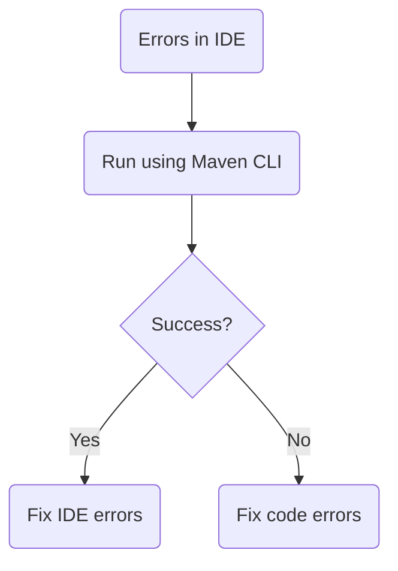
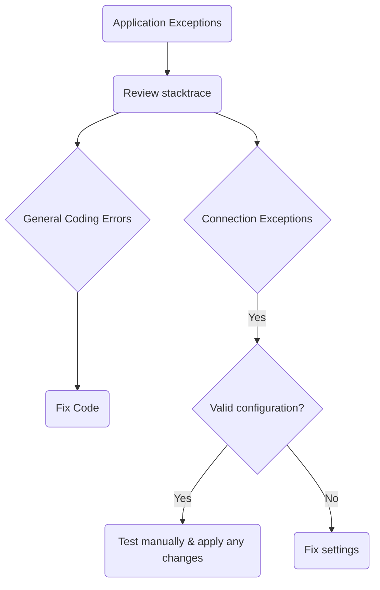
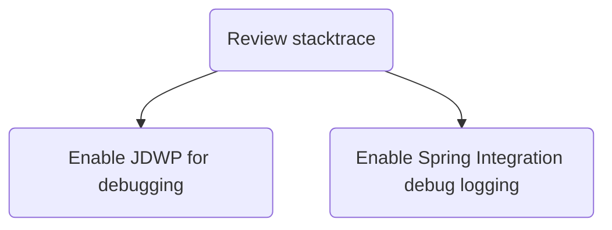
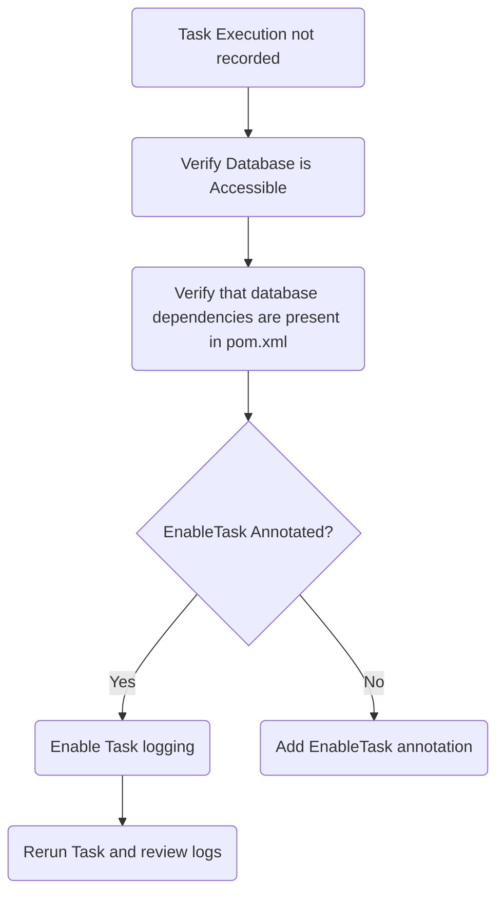
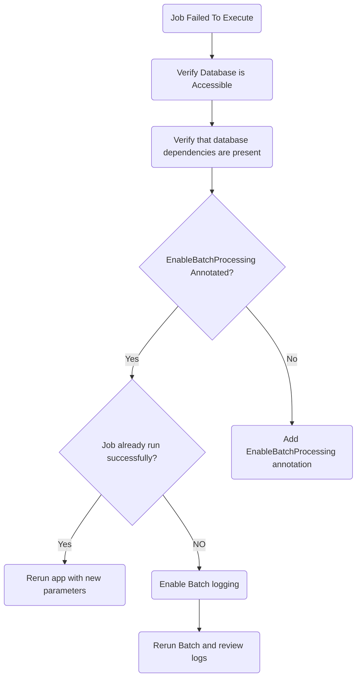
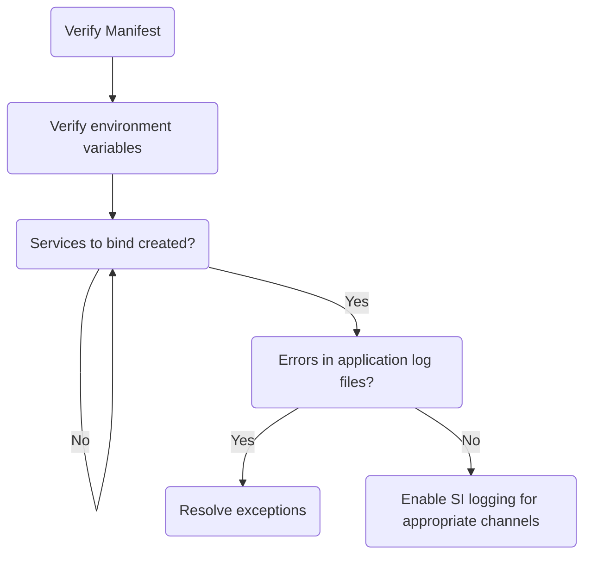
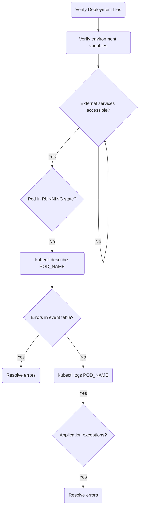

# Debugging Batch Applications

Applications should be runnable as a standard Java JAR, invoked via `java -jar`.
All dependencies such as databases and messaging middleware should be available and tested manually for connection issues.
Running and debugging applications is independent of deploying via SCDF and running on a platform.

## Project Build Errors

Fixing errors in the IDE will be dependent on which IDE is used.
By verifying the build is successful outside the IDE, this helps rule out project specific issues.

## Application Startup Exceptions

When the application starts up, exceptions may occur due to general coding errors or connectivity issues.
Review the application log file to find the exceptions and fix as appropriate.
Ensure all external services are reachable, correct credentials are provided and any other required information.

## General Application Debugging

Applications can be debugged as normal java processes as well as by utilizing verbose log output via the DEBUG logging level.

To debug your application using a debugger, add the following JVM argument when starting your application, for example:

`-agentlib:jdwp=transport=dt_socket,server=y,suspend=y,address=5005`

By adding this parameter, your application will wait for a debugger to connect on port `5005` to start debugging.
This can be any port you choose that is not already in use.

Enabling DEBUG level logging can also be a useful aid.
There are two packages of interest Spring Batch (`org.springframework.batch`) and Spring Cloud Task (`logging.level.org.springframework.cloud.task`).
To enable debug logging of this batch package, add the following JVM argument when starting your application, for example:

`-Dlogging.level.org.springframework.batch=debug`
To enable debug logging of this task package, add the following JVM argument when starting your application, for example:

`-Dlogging.level.org.springframework.cloud.task=debug`

## Task Execution Not Recorded to Database

Task applications record execution information to a database.
Ensure the proper class level annotation `@EnableTask` is present. Also verify that the proper database dependency is in your pom.xml or build.gradle.
And finally that the database connection properties are properly configured.

## Job Failed to Execute

Spring Batch requires that the application have access to a database and also that the `@EnableBatchProcessing` is present.

A common issue raised is that a user launches a batch app after it has already been successfully launched does not re-execute the `Job`. This is because batch apps by default are restartable. Thus if a batch `Job` fails during execution it can be restarted and pick up at the step where it failed on the next execution.
Each batch `Job` instance is unique. Thus if you want to start another `Job` instance you will need to update one of the `Job` parameters (command line arg).
Or when building the `Job` in your code establish a `Job` [incrementer](https://docs.spring.io/spring-batch/trunk/reference/html/configureJob.html#JobParametersIncrementer).

## Platforms

### Cloud Foundry

If an application that runs locally, but fails when deployed to Cloud Foundry, first inspect the deployment manifest (manifest.yml) for correctness.
This includes any environment variables that must be set, services to bind to and those services created.
Inspect the application startup log for any exceptions to resolve.

### Kubernetes

If an application that runs locally, but fails when deployed to Kubernetes, first inspect the deployment files for correctness.
This includes any environment variables that must be set, properties for services to connect to and those services available.
Describe the application pod's event table to see issues creating the pod such as image pull causes, health check failures, etc.
Inspect the application startup log for any exceptions to resolve.
