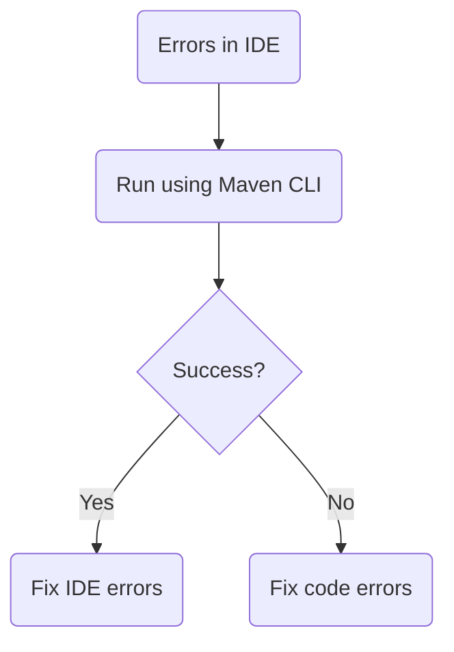
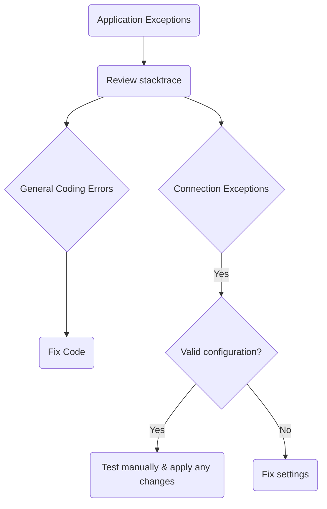
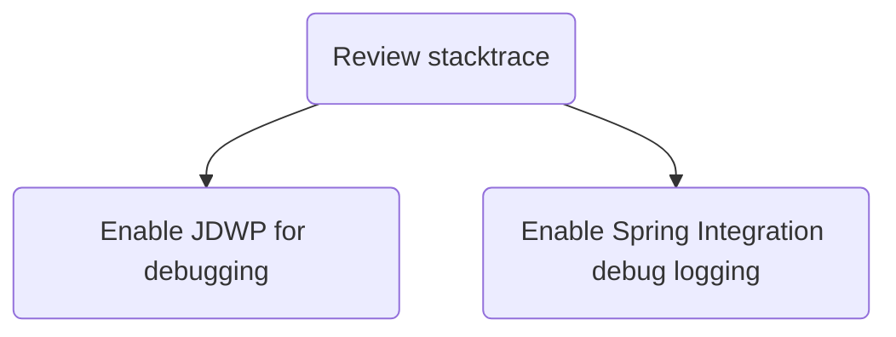
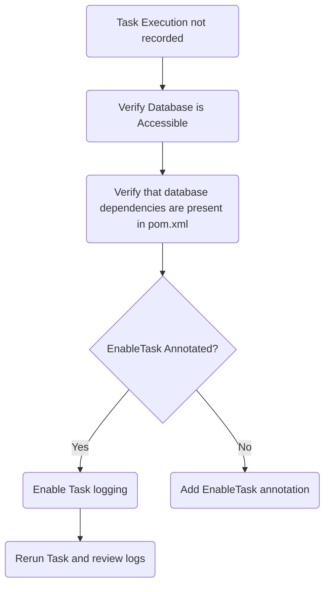
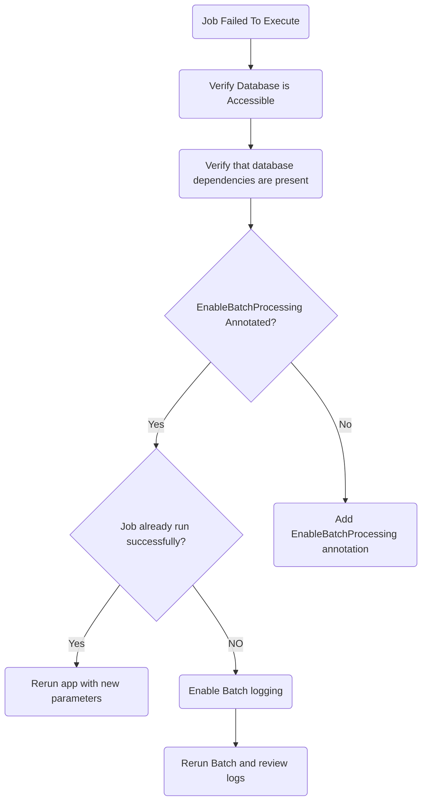
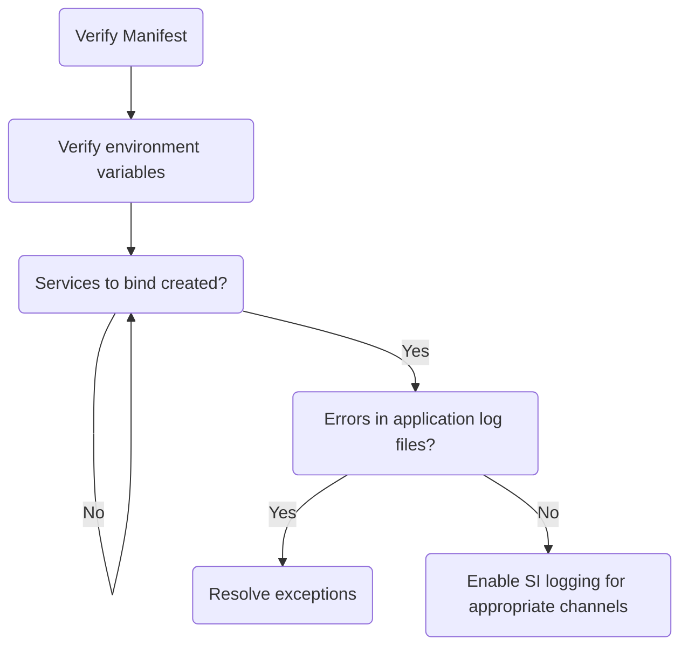
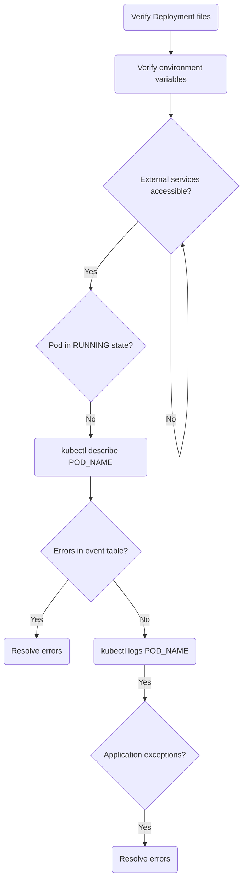
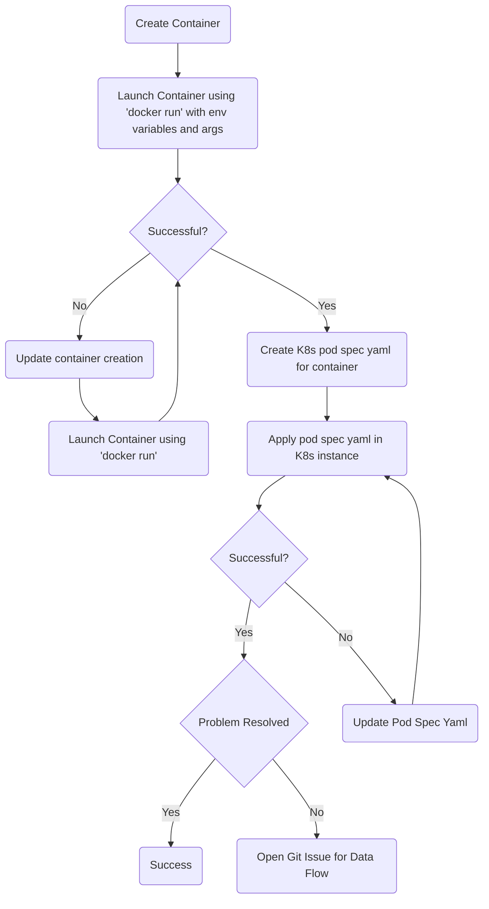

# Debugging Batch Applications

Applications should be runnable as a standard Java JAR and be invoked with `java -jar`.
All dependencies (such as databases and messaging middleware) should be available and tested manually for connection issues.
Running and debugging applications is independent of deploying with SCDF and running on a platform.

## Project Build Errors

The following diagram shows how to handle project build errors:

Fixing errors in the IDE depends on which IDE you use.
Verifying that the build is successful outside the IDE helps rule out project-specific issues.

## Application Startup Exceptions

The following diagram shows how to handle application startup exceptions:

When the application starts up, exceptions may occur due to general coding errors or connectivity issues.
Review the application log file to find the exceptions and fix them.
Ensure that all external services are reachable, correct credentials are provided, and any other required information is present and correct.

## General Application Debugging

The following diagram shows how to handle general application debugging:

Applications can be debugged as normal Java processes as well as by using verbose log output by setting the logging level to DEBUG.

To debug your application using a debugger, add the following JVM argument when you start your application:

`-agentlib:jdwp=transport=dt_socket,server=y,suspend=y,address=5005`

By adding this parameter, your application waits for a debugger to connect on port `5005` to start debugging.
This can be any port you choose that is not already in use.

Enabling DEBUG level logging can also be a useful aid.
There are two packages of interest in Spring Batch (`org.springframework.batch`) and Spring Cloud Task (`logging.level.org.springframework.cloud.task`).
To enable debug logging of the batch package, add the following JVM argument when starting your application:

`-Dlogging.level.org.springframework.batch=debug`

To enable debug logging of the task package, add the following JVM argument when starting your application:

`-Dlogging.level.org.springframework.cloud.task=debug`

## Task Execution Not Recorded to Database

The following diagram shows how to handle task execution not being recorded to the database:

Task applications record execution information to a database.
If that is not happening, ensure that the proper class level annotation `@EnableTask` is present. Also, verify that the proper database dependency is in your `pom.xml` or `build.gradle` file.
Finally, verify that the database connection properties are properly configured.

## Job Failed to Run

The following diagram shows how to handle the job failing to run:

Spring Batch requires the application to have access to a database and that the `@EnableBatchProcessing` be present.

A common issue raised is that a user launches a batch app after it has already been successfully launched but does not re-run the `Job`. This is because batch apps, by default, are restartable. Thus, if a batch `Job` fails during execution, it can be restarted and pick up at the step where it failed on the next execution.
Each batch `Job` instance is unique. Thus, if you want to start another `Job` instance, you need to update one of the `Job` parameters (one of the command-line arguments).
Alternatively, when building the `Job` in your code, you can establish a `Job` [incrementer](https://docs.spring.io/spring-batch/trunk/reference/html/configureJob.html#JobParametersIncrementer).

## Platforms

This section covers how to troubleshoot problems on specific platforms:

- Cloud Foundry
- Kubernetes

### Cloud Foundry

The following diagram shows how to handle errors on Cloud Foundry:

If an application runs locally but fails when deployed to Cloud Foundry, first inspect the deployment manifest (`manifest.yml`) for correctness.
This includes any environment variables that must be set, services to which to bind, and whether those services are created.
Inspect the application startup log for any exceptions to resolve.

### Kubernetes

The following diagram shows how to handle errors on Kubernetes:

If an application that runs locally fails when deployed to Kubernetes, first inspect the deployment files for correctness.
This includes any environment variables that must be set, properties that define service connections, and whether those services are available.
Describe the application pod's event table to see issues with creating the pod, such as image pull causes, health check failures, and others.
Inspect the application startup log for any exceptions to resolve.

#### Containers

The following diagram shows how to handle container errors:

As discussed earlier, the application may run as expected from your local platform but still fail when launched from Spring Cloud Data Flow.
This could be because of how the container is created by the tool that is being used to create the container: DockerFile, Spring Boot container Plugin, Jib, and others.
The preceding chart shows how to trouble shoot why apps may fail to launch because of container-related issues.

<!-- NOTE -->

Data Flow uses [Common application properties](https://docs.spring.io/spring-cloud-dataflow/docs/current/reference/htmlsingle/#_common_application_properties) and [Spring Boot Common Tags](https://docs.spring.io/spring-boot/docs/current/reference/html/production-ready-features.html#production-ready-metrics-common-tags) to apply common metrics tags to all deployed `Task` applications. Those properties often use [Spring placeholders](https://docs.spring.io/spring-boot/docs/current/reference/html/spring-boot-features.html#boot-features-external-config-placeholders-in-properties) to resolve their values -- for example: `management.metrics.tags.application=${task.name:unknown}-${task.execution.id:unknown}`.
Some image containers may not be able to parse this correctly and replace the embedded properties with empty strings, which may cause task apps to fail.
If you are not using metrics, you can disable these fields by setting the `spring.cloud.dataflow.applicationProperties.taskResource` to a non-existent file -- for example: `spring.cloud.dataflow.applicationProperties.taskResource=classpath:fake.yml`

<!-- END_NOTE -->
