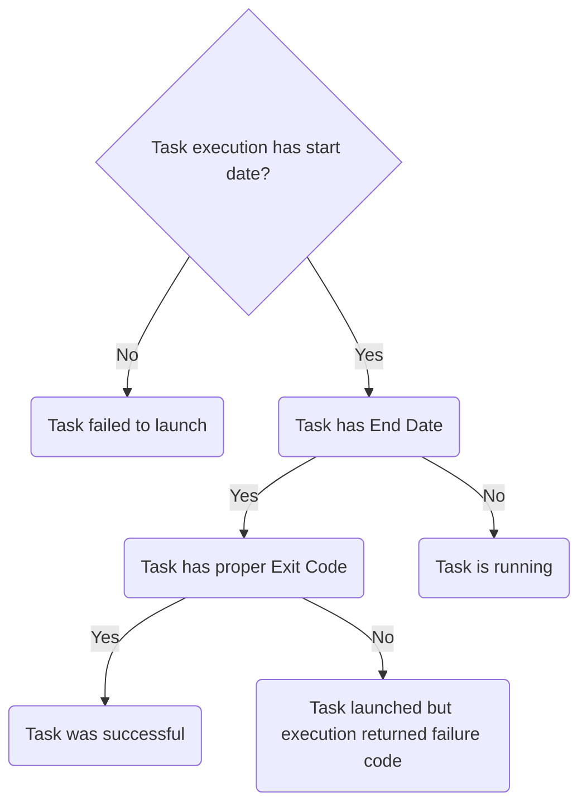
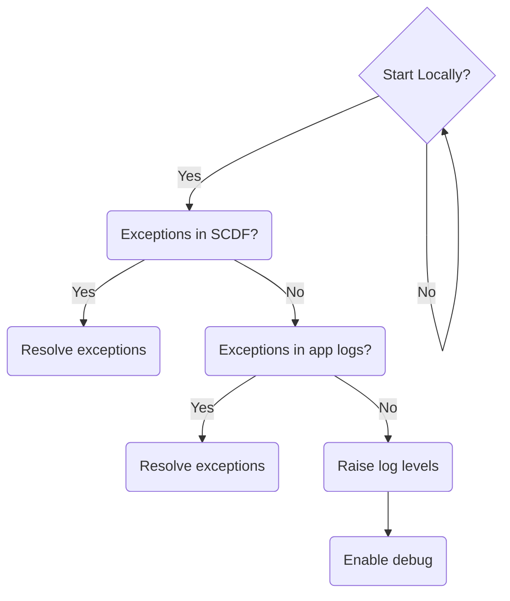
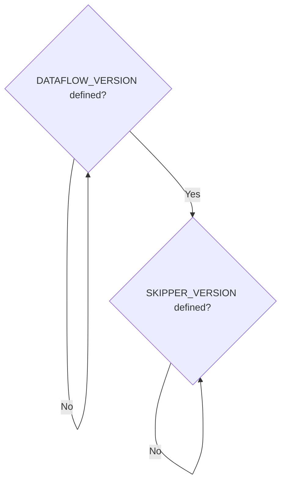
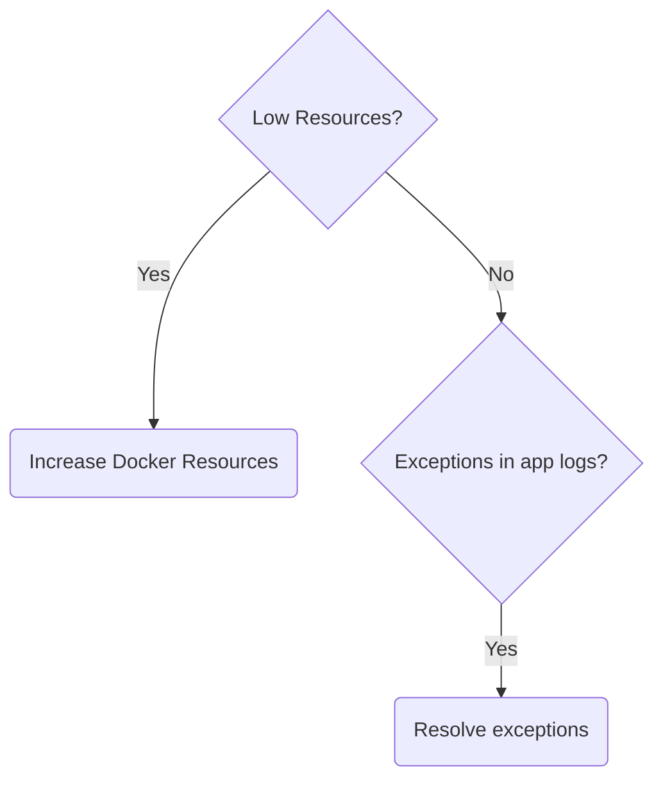
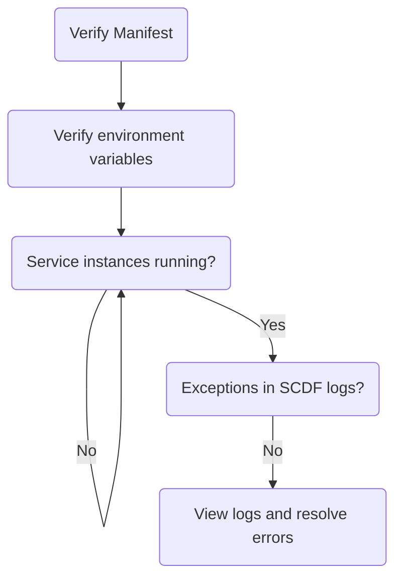
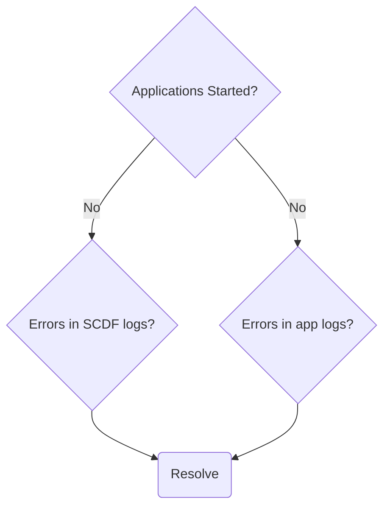
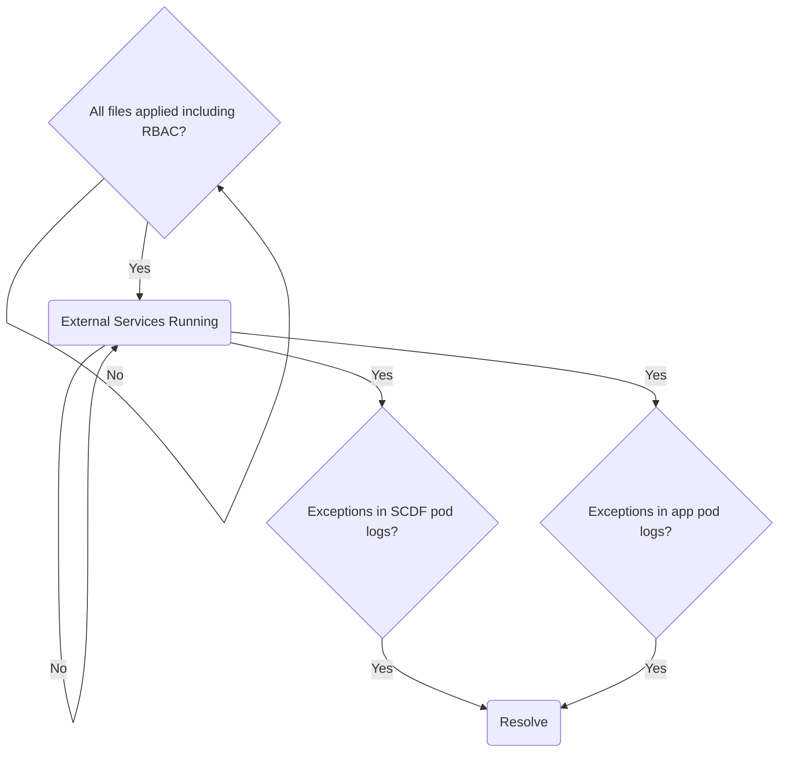
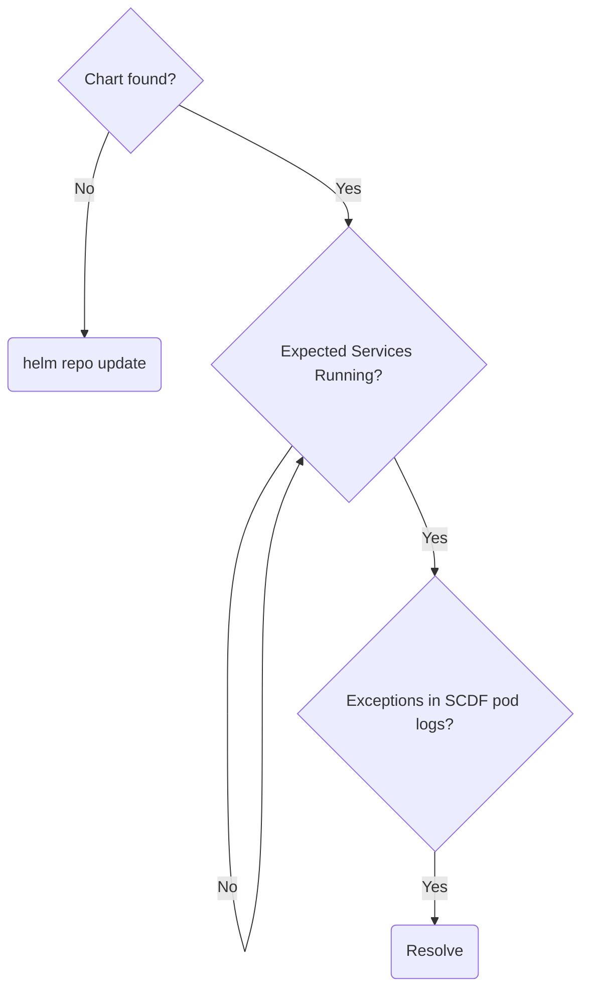
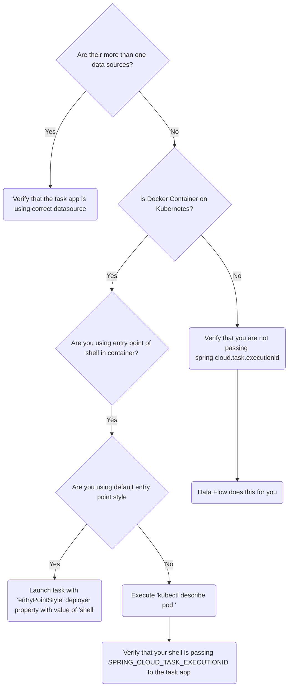
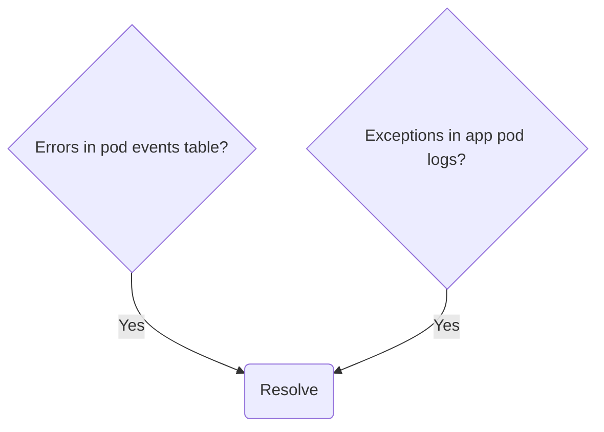

# Debugging Tasks

## Did the Task Launch?

To determine if your task executed properly, go to the Task Execution page of the UI or, from the shell, type `task execution list`.
Find the task execution entry for the task launch.

The following diagram shows how to handle task launch errors:



## What To Check If a Task Failed To Launch

If a task fails to launch:

- Ensure the latest GA of a particular release version is being used.
- Ensure the platform you chose meets at least the minimum supported version.
- Before launching task or batch applications in SCDF, ensure that the application has been successfully executed as a standalone application. See [Debugging Batch Applications](%currentPath%/batch-developer-guides/troubleshooting/debugging-task-apps/) before continuing.

SCDF is responsible for launching tasks.
Task launch failure messages can typically be found in the SCDF application logs.

## Platforms

This section covers how to troubleshoot problems on specific platforms:

- Local
- Cloud Foundry
- Kubernetes

### Local

This section covers how to troubleshoot problems with applications that run locally:

The following diagram shows how to handle local task launch errors:



You can inspect application log files on a per-application basis.
To aggregate logs from all applications into one, you can set the `inheritLogging=true` deployer property.
See
["Is it possible to aggregate Local deployments into a single log?"](%currentPath%/resources/faq/#aggregatelogs)
for more information and ["How do I enable DEBUG logs for platform deployments?"](%currentPath%/resources/faq/#debuglogs) for how to enable more log output.

You can enable debugging applications with JDWP by setting the `debugPort` deployer property.
See ["How do I remote debug deployed applications?"](%currentPath%/resources/faq/#remotedebug) for more information.

#### Docker Compose - Startup

The following diagram shows how to handle local task launch errors that involve Docker compose startup issues:



The `DATAFLOW_VERSION` and `SKIPPER_VERSION` environment variables must be available in the current terminal environment through `export` or by prefixing them to the `docker-compose` command.
See [Starting Docker Compose](%currentPath%/installation/local/docker/) for more information.

#### Docker Compose - Runtime

The following diagram shows how to handle local task launch errors that involve Docker compose runtime issues:



By default, the amount of memory allocated to Docker may be too low.
The recommended amount of memory to allocate is 8GB.
The `docker stats` command can provide useful information about resource usage.
If applications fail to launch due to resource constraints, increase resource allocations.
See the [Docker documentation](https://docs.docker.com/) for your platform.

As tasks are launched through SCDF, applications that are part of that task definition are launched as Java processes on the SCDF container.
For every part of a task definition, an application is launched.
The overall resource allocation (memory, CPU, and others) provided to Docker should account for the number of launched applications.

### Cloud Foundry

This section covers how to troubleshoot problems with applications on Cloud Foundry:

#### Startup Failures

The following diagram shows how to handle startup failures for applications that run on Cloud Foundry:



#### Application Failures

The following diagram shows how to handle application failures for applications that run on Cloud Foundry:



When debugging deployment issues, raising deployer-related and Cloud Foundry-related log levels may be useful.
See ["How do I enable DEBUG logs for platform deployments?"](%currentPath%/resources/faq/#debuglogs) for more information.

### Kubernetes

This section covers how to troubleshoot problems with applications on Cloud Foundry:

#### Distributed Deployment Files

The following diagram shows how to handle failures caused by distributed deployment files for applications that run on Kubernetes:



The following diagram shows how to handle Helm chart failures for applications that run on Kubernetes:

#### Helm Chart



#### An empty task execution id record is created before the task execution id



You may follow this decision tree if your task is not launching with the correct properties.

#### General

The following diagram shows how to handle general failures for applications that run on Kubernetes:



When describing a pod, the `events` table section provides useful information when debugging and can be invoked by the following:

`kubectl describe po/pod_name`

For example, the events from a successfully launched `timestamp-batch-task` application would look similar to:

```
Events:
  Type    Reason     Age   From               Message
  ----    ------     ----  ----               -------
  Normal  Scheduled  15s   default-scheduler  Successfully assigned default/timestamp-7138z511d8 to minikube
  Normal  Pulled     15s   kubelet, minikube  Container image "springcloudtask/timestamp-batch-task:latest" already present on machine
  Normal  Created    14s   kubelet, minikube  Created container
  Normal  Started    14s   kubelet, minikube  Started container
```

Application logs can be tailed to watch logs as they come in, as follows:

`kubectl logs -f po/pod_name`

## Troubleshooting Help

If none of these troubleshooting techniques helped and if you still need help, you can reach out to us on [StackOverflow](https://stackoverflow.com/tags/spring-cloud-dataflow/) with the relevant details (see: [Wiki](https://github.com/spring-cloud/spring-cloud-dataflow/wiki/Reporting-Issues)). We actively monitor the forum threads.
