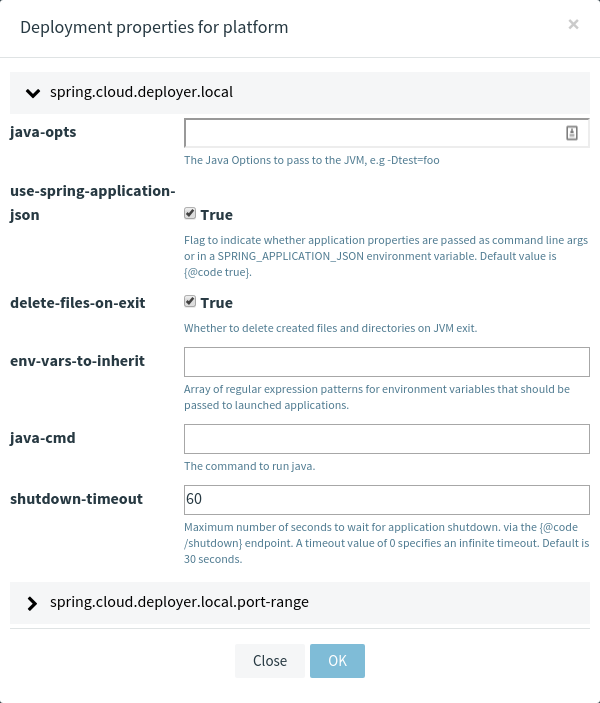
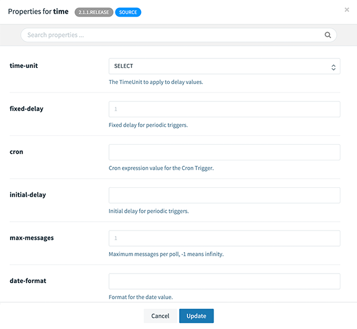
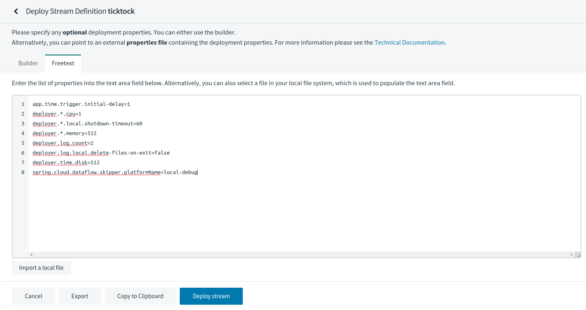

# Deployment Properties

When deploying a stream, properties fall into two groups:

- Properties that control how the apps are deployed to the target platform. These properties use a `deployer` prefix and are referred to as _deployer properties_.
- Properties that set application properties or override application properties set during stream creation are referred to as _application properties_.

You need to pick a defined platform configuration where each platform type, `local`, `cloudfoundry` or `kubernetes` will have a different set of possible deployment properties. There's a set of generic properties for every platform's `memory`, `cpu` and `disk` reservations and `count` to define how many instances platform should create.


Below you can see an example of how to override the `local` deployer properties. Also, note, these properties can be defined globally or per application.



Below you can see example of a `time` application properties.



You can switch betwewn _Freetext_ and _Builder_ based representation to define all needed properties.



Once when the above properties are applied, they get translated by SCDF to the well-defined properties as shown below.

<!--NOTE-->

Properties may have default values and if a value remains unchanged, it is removed from a derived properties list.

<!--END_NOTE-->

```
app.time.trigger.initial-delay=1
deployer.*.cpu=1
deployer.*.local.shutdown-timeout=60
deployer.*.memory=512
deployer.log.count=2
deployer.log.local.delete-files-on-exit=false
deployer.time.disk=512
spring.cloud.dataflow.skipper.platformName=local-debug
```

This above example in SCDF shell would look like.

```
dataflow:>stream deploy --name ticktock --properties "app.time.trigger.initial-delay=1,deployer.*.cpu=1,deployer.*.local.shutdown-timeout=60,deployer.*.memory=512,deployer.log.count=2,deployer.log.local.delete-files-on-exit=false,deployer.time.disk=512,spring.cloud.dataflow.skipper.platformName=local-debug"
Deployment request has been sent for stream 'ticktock'
```
