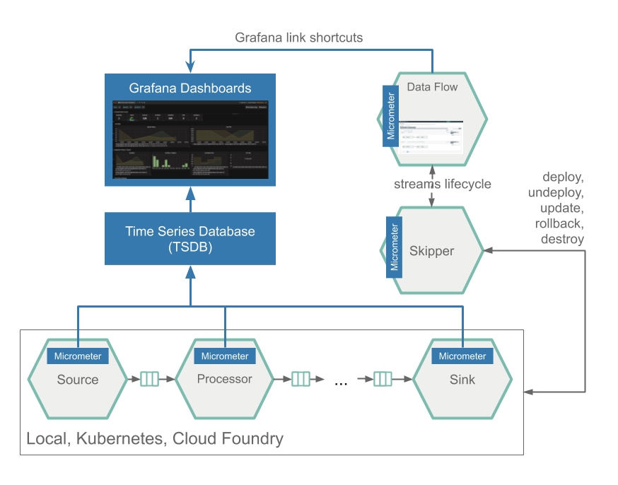

# Stream Monitoring with Prometheus and InfluxDB

This section describes how to monitor the applications that were deployed as part of a Stream. The setup for each platform is different, but the general architecture is the same across the platforms.

The Data Flow 2.x metrics architecture is designed around the [Micrometer](https://micrometer.io/) library, which is a vendor-neutral application metrics facade. It provides a simple facade over the instrumentation clients for the most popular monitoring systems. See the [Micrometer documentation](https://micrometer.io/docs) for the list of supported monitoring systems. Starting with Spring Boot 2.0, Micrometer is the instrumentation library that powers the delivery of application metrics from Spring Boot. Spring Integration provides [additional integration](https://docs.spring.io/spring-integration/docs/current/reference/html/#micrometer-integration) to expose metrics around message rates and errors, which is critical to the monitoring of deployed streams.

All the Spring Cloud Stream App Starters are configured to support two of the most popular monitoring systems, Prometheus and InfluxDB. You can declaratively select which monitoring system to use. If you do not use Prometheus or InfluxDB, you can customize the App starters to use a different monitoring system as well as include your preferred Micrometer monitoring system library in your own custom applications. To help you get started monitoring streams, Data Flow provides [Grafana](https://grafana.com/) Dashboards that you can install and customize for your needs.

The following image shows the general architecture of how applications are monitored:



To allow aggregating metrics per application type and per instance or per stream, the [Spring Cloud Stream Application Starters](https://docs.spring.io/spring-cloud-dataflow/docs/current/reference/htmlsingle/#applications) are configured to use the following Micrometer tags:

- `stream.name`: The name of the Stream that contains the applications that send the metrics
- `application.name`: The name or label of the application that reports the metrics
- `application.type`: The type (Source, Processor, or Sink) of the application that reports the metrics
- `application.guid`: Unique instance identifier of the application instance that reports the metrics
- `application.index`: Application instance ID (when available)

If the Data Flow server is started with the `spring.cloud.dataflow.grafana-info.url` property pointing to your Grafana URL, the Grafana feature is enabled and Data Flow UI provides you with Grafana-buttons that can open a particular dashboard for a given stream, application, or application instance. The following screenshots illustrate these buttons:


As setting up Prometheus and InfluxDB is different depending on the platform on which you run, we provide instructions for each platform. In Spring Cloud Data Flow 2.x, local server and Kubernetes instructions have been provided.

## Local

This section describes how to set up Prometheus and InfluxDB for a local machine.

### Prometheus

Prometheus is a popular pull-based time-series database that pulls the metrics from the target applications with pre-configured endpoints. Prometheus requires a Service Discovery component to automatically probe the configured endpoint for metrics. The Spring Cloud Data Flow server leverages the [Prometheus RSocket Proxy](https://github.com/micrometer-metrics/prometheus-rsocket-proxy), which uses `rsocket` protocol for the service-discovery mechanism.

Instead of having to install them manually, for a quick start, follow the [Monitoring with Prometheus and Grafana](%currentPath%/installation/local/docker-customize/#monitoring-with-prometheus-and-grafana) docker-compose instructions, which will bring up Spring Cloud Data Flow, Skipper, Apache Kafka, Prometheus, and prebuilt dashboards for Grafana.

Once the docker compose is up, you can access the [Spring Cloud Data Flow Dashboard](http://localhost:9393/dashboard).

Also you can reach the Prometheus UI at http://localhost:9090/graph and http://localhost:9090/targets

You can reach the Grafana dashboard at http://localhost:3000 with the following credentials:

- User: `admin`
- Password: `admin`

It comes with two provisioned dashboards:

- Streams: http://localhost:3000/d/scdf-streams/streams?refresh=10s
- Applications: http://localhost:3000/d/scdf-applications/applications?refresh=10s

Now you can deploy a simple stream that uses Kafka, as follows:

```bash
dataflow:>app import --uri https://dataflow.spring.io/kafka-maven-latest --force
dataflow:>stream create stream2 --definition "time --fixed-delay=10 --time-unit=MILLISECONDS | filter --expression=payload.contains('3') | log" --deploy
```

You should see dashboards similar to those shown in the following image:


### InfluxDB

InfluxDB is a popular open-source push-based time series database. It supports downsampling, automatically expiring and deleting unwanted data, and backup and restore. Analysis of data is done through an SQL-like query language.

Instead of having to install them manually, you can use the docker-compose instructions for [Monitoring with InfluxDB and Grafana](%currentPath%/installation/local/docker-customize/#monitoring-with-influxdb-and-grafana), which will bring up Spring Cloud Data Flow, Skipper, Apache Kafka, InfluxDB, and prebuilt dashboards for Grafana.

Once the docker compose is up, you can access the [Spring Cloud Data Flow Dashboard](http://localhost:9393/dashboard). Also you can reach the Grafana dashboard at http://localhost:3000 using the user: admin, password: admin credentials.

To validate the setup, you can log in to those containers by using the following commands:

```bash
docker exec -it influxdb /bin/sh
docker exec -it grafana /bin/bash
```

Then you can check the content of InfluxDB by running the following commands:

<!-- Rolling my own to disable erroneous formatting -->
<div class="gatsby-highlight" data-language="bash">
<pre class="language-bash"><code>root:/# influx
> show databases
> use myinfluxdb
> show measurements
> select * from spring_integration_send limit 10
</code></pre></div>

You can reach the Grafana dashboard at http://localhost:3000 with the following credentials:

- User: admin
- password: admin

It comes with two provisioned dashboards.

- Streams: http://localhost:3000/d/scdf-streams/streams?refresh=10s
- Applications: http://localhost:3000/d/scdf-applications/applications?refresh=10s

Now you can deploy a simple stream that uses Kafka, such as the following:

```bash
dataflow:>app import --uri https://dataflow.spring.io/kafka-maven-latest --force

dataflow:>stream create stream2 --definition "time --fixed-delay=10 --time-unit=MILLISECONDS | filter --expression=payload.contains('3') | log" --deploy
```

You should see dashboards similar to those shown in the following image:


## Kubernetes

This section describes how to set up Prometheus and InfluxDB for Kubernetes.

### Prometheus

Prometheus is a popular pull-based time series database that pulls metrics from the target applications from a pre-configured endpoint. When running in Kubernetes, Prometheus "scrapes" metrics from target applications that have a specific pod-level annotation. The endpoint to scrape is provided by Spring Boot, under the default path of `/actuator/prometheus`.

Out of the box, each binder middleware configuration file defines attributes to enable metrics and their supporting properties. You can find settings in: `src/kubernetes/server/server-config.yaml`. The main point of interest is the following configuration section:

```yaml
applicationProperties:
  stream:
    management:
      metrics:
        export:
          prometheus:
            enabled: true
      endpoints:
        web:
          exposure:
            include: 'prometheus,info,health'
    spring:
      cloud:
        streamapp:
          security:
            enabled: false
grafana-info:
  url: 'http://grafana:3000'
```

In this configuration, Prometheus metrics are enabled, along with the appropriate endpoints and security settings.

With Prometheus, Grafana, Spring Cloud Data Flow, and any other services as defined in the [Getting Started - Kubernetes](%currentPath%/installation/kubernetes) section up and running, you are ready to collect metrics.

<!--IMPORTANT-->

The address used to access the Grafana UI depends on the Kubernetes platform the system is deployed to. If you are using (for example) GKE, the load balancer address would be used. If using Minikube (which does not provide a load balancer implementation), the IP of the Minikube (along with an assigned port) is used. In the following examples, for simplicity, we use Minikube.

<!--END_IMPORTANT-->

To obtain the URL of the Grafana UI when it is deployed to Minikube, run the following command:

```bash
$ minikube service --url grafana
http://192.168.99.100:31595
```

In the preceding example, you can reach the Grafana dashboard at http://192.168.99.100:31595. The default credentials are as follows:

- User name: admin
- Password: password

The Grafana instance is pre-provisioned with two dashboards:

- Streams: http://192.168.99.100:31595/d/scdf-streams/streams?refresh=10s
- Applications: http://192.168.99.100:31595/d/scdf-applications/applications?refresh=10s

You can collect metrics on a per-application, per-stream basis or apply metrics collection to all deployed applications globally.

To deploy a single stream with metrics enabled, enter the following into the Spring Cloud Data Flow shell:

```bash
dataflow:>stream create metricstest --definition "time --fixed-delay=10 --time-unit=MILLISECONDS | filter --expression=payload.contains('3') | log"
dataflow:>stream deploy --name metricstest --properties "deployer.*.kubernetes.podAnnotations=prometheus.io/path:/actuator/prometheus,prometheus.io/port:8080,prometheus.io/scrape:true"
```

The preceding example creates a stream definition and sets the `podAnnotations` property on each application in the stream. The annotations applied to the pod indicate to Prometheus that it should be scraped for metrics by using the provided endpoint path and the port.

As a global setting, to deploy all streams with metrics enabled, you can append the following `podAnnotations` entry to the configuration in either `src/kubernetes/skipper/skipper-config-rabbit.yaml` (when using RabbitMQ) or `src/kubernetes/skipper/skipper-config-kafka.yaml` (when using Kafka):

```yaml
data:
  application.yaml: |-
    spring:
      cloud:
        skipper:
          server:
            platform:
              kubernetes:
                accounts:
                  myaccountname:
                    podAnnotations: 'prometheus.io/path:/actuator/prometheus,prometheus.io/port:8080,prometheus.io/scrape:true'
```

All streams and their containing applications then have the appropriate pod annotations applied, which instructs Prometheus to scrape metrics. The shell command to deploy the same stream shown earlier, for example becomes the following:

```bash
dataflow:>stream create metricstest --definition "time --fixed-delay=10 --time-unit=MILLISECONDS | filter --expression=payload.contains('3') | log" --deploy
```

Either way, metrics are enabled. After deploying a stream, you can visit the Grafana UI and see dashboard graphs similar to those shown in the following image:


