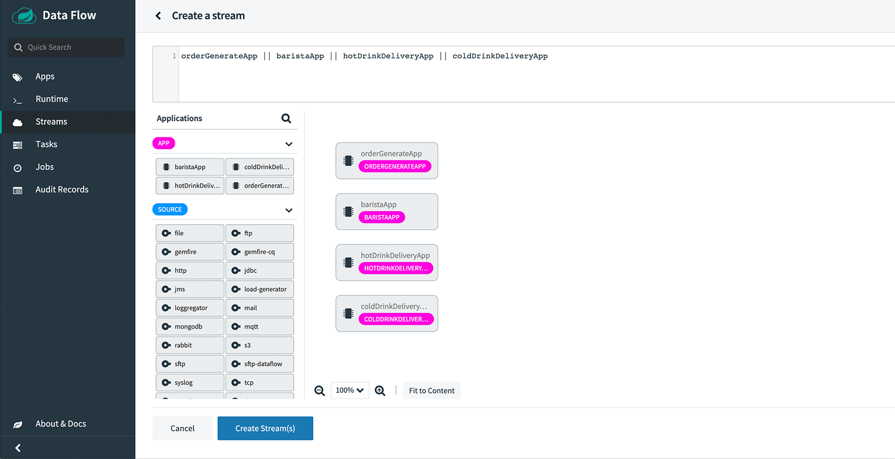

# Stream Application DSL

The Stream Pipeline DSL described in the previous section automatically sets the input and output binding properties of each Spring Cloud Stream application.
This can be done because only one input or output destination in a Spring Cloud Stream application uses the provided binding interface of a `Source`, `Processor`, or `Sink`.
However, a Spring Cloud Stream application can define a custom binding interface, such as the following:

```Java
public interface Barista {

    @Input
    SubscribableChannel orders();

    @Output
    MessageChannel hotDrinks();

    @Output
    MessageChannel coldDrinks();
}
```

The following example shows a custom interface for a Kafka Streams application:

```java
interface KStreamKTableBinding {

    @Input
    KStream<?, ?> inputStream();

    @Input
    KTable<?, ?> inputTable();
}
```

In cases with multiple input and output bindings, Data Flow cannot make any assumptions about the flow of data from one application to another.
Therefore, you need to set the binding properties to "wire up" the application.
The _Stream Application DSL_ uses a "double pipe" (instead of the "pipe symbol") to indicate that Data Flow should not configure the binding properties of the application. Think of `||` as meaning "in parallel".

The following example uses double pipe symbols to indicate that four streams should run in parallel:

`stream create --definition "orderGeneratorApp || baristaApp || hotDrinkDeliveryApp || coldDrinkDeliveryApp" --name myCafeStream`

A graphical representation of the stream would look similar to the following image:



There are four applications in this stream.
The baristaApp has two output destinations (`hotDrinks` and `coldDrinks`) that are intended to be consumed by the `hotDrinkDeliveryApp` and `coldDrinkDeliveryApp`, respectively.
When deploying this stream, you need to set the binding properties so that the `baristaApp` sends hot drink messages to the `hotDrinkDeliveryApp` destination and cold drink messages to the `coldDrinkDeliveryApp` destination.

The following example shows how to do so:

```
app.baristaApp.spring.cloud.stream.bindings.hotDrinks.destination=hotDrinksDest
app.baristaApp.spring.cloud.stream.bindings.coldDrinks.destination=coldDrinksDest
app.hotDrinkDeliveryApp.spring.cloud.stream.bindings.input.destination=hotDrinksDest
app.coldDrinkDeliveryApp.spring.cloud.stream.bindings.input.destination=coldDrinksDest
```

As with binding properties, you can configure the rest of the Spring Cloud Stream properties for the producers and consumers.
For example, if you want to use consumer groups, you need to set the Spring Cloud Stream application properties, `spring.cloud.stream.bindings.<channelName>.producer.requiredGroups` and `spring.cloud.stream.bindings.<channelName>.group`, on the producer and consumer applications respectively.

Another common use case for the Stream Application DSL is to deploy an HTTP gateway application that sends a synchronous request or reply message to a Kafka or RabbitMQ application.
In this case, both the HTTP gateway application and the Kafka or RabbitMQ application can be a Spring Integration application that does not use the Spring Cloud Stream library.

You can also deploy only a single application by using the Stream application DSL.
