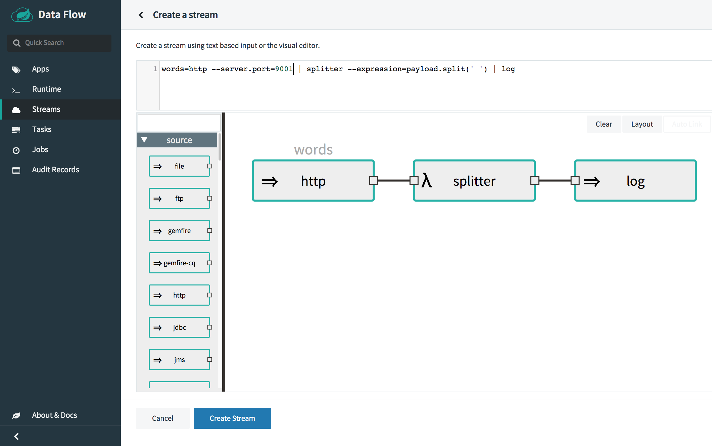
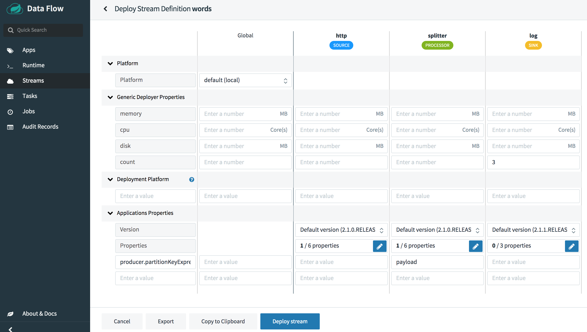
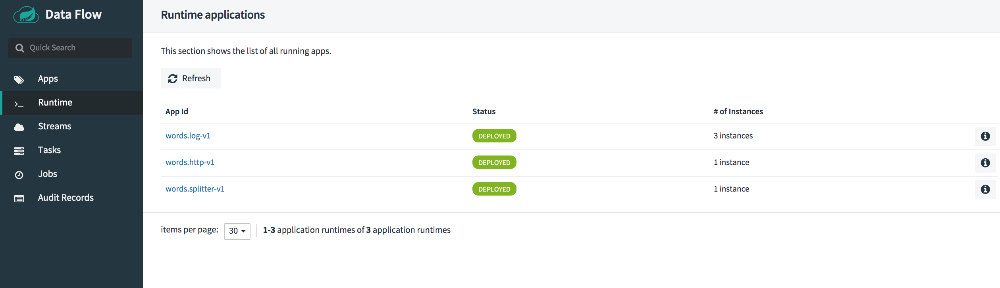

# Data Partitioning

Partitioning is a critical concept in stateful processing, for either performance or consistency reasons, to ensure that all related data is processed together.
For example, in a time-windowed average calculation example, it is important that all measurements from any given sensor are processed by the same application instance.
Alternatively, you may want to cache some data related to the incoming events so that it can be enriched without making a remote procedure call to retrieve the related data.

Partitioning support allows for content based routing of payloads to the downstream application instances in a streaming data pipeline.
This is especially useful when you want to have your downstream application instances processing data from specific partitions from the upstream application.
For instance, if a processor application in the data pipeline that is performing operations based on a unique identifier from the payload (e.g., customerId), the stream can be partitioned based on that unique identity.

### Stream partition properties

You can pass the following partition properties during stream deployment to declaratively configure a partitioning strategy to route each message to a specific consumer instance.

The following list shows variations of deploying partitioned streams:

- **app.[app/label name].producer.partitionKeyExtractorClass** - The class name of a PartitionKeyExtractorStrategy (default: null)

- **app.[app/label name].producer.partitionKeyExpression** - A SpEL expression, evaluated against the message, to determine the partition key. Only applies if partitionKeyExtractorClass is null. If both are null, the app is not partitioned (default: null)

- **app.[app/label name].producer.partitionSelectorClass** - The class name of a PartitionSelectorStrategy (default: null)

- **app.[app/label name].producer.partitionSelectorExpression** - A SpEL expression, evaluated against the partition key, to determine the partition index to which the message is routed. The final partition index is the return value (an integer) modulo [nextModule].count. If both the class and expression are null, the underlying binder’s default PartitionSelectorStrategy is applied to the key (default: null)

In summary, an app is partitioned if its deployment instances count is >1 and the previous app has a partitionKeyExtractorClass or partitionKeyExpression (partitionKeyExtractorClass takes precedence). When a partition key is extracted, the partitioned app instance is determined by invoking the partitionSelectorClass, if present, or the partitionSelectorExpression % partitionCount. partitionCount is application count, in the case of RabbitMQ, or the underlying partition count of the topic, in the case of Kafka.

If neither a `partitionSelectorClass` nor a `partitionSelectorExpression` is present, the result is key.hashCode() % partitionCount.

### Deploying a stream with partitioned downstream applications

You can setup Spring Cloud Data Flow and Spring Cloud Skipper servers using the [installation guide](../../../installation/).

We will use the out-of-the-box `http`, `splitter` and `log` applications in this example.

#### Create the stream

In this section, you will see how a partitioned stream can be created and deployed.

Let's consider the following stream:

- `http` source application listens at port 9001 for incoming text/sentence
- `splitter` processor application splits the sentence into words and partition the words based on their hash value (by using the `payload` as the partitionKeyExpression)
- `log` sink application is scaled to run three application instances and each instance is expected to receive unique hash values from the upstream

From the Spring Cloud Data Flow Dashboard UI, Select `Streams` from the left navigation bar. This will display the main Streams view.


Select `Create stream(s)` to display a graphical editor to create the stream definition.



You will see the `Source`, `Processor` and `Sink` applications, as registered above, in the left panel. Drag and drop each app to the canvas and then use the handles to connect them together.
Notice the equivalent Data Flow DSL definition in the top text panel.
You can also enter the Stream DSL text as follows:

```
words=http --server.port=9001 | splitter --expression=payload.split(' ') | log
```

Click `Create Stream`.

### Deploy the Stream

Click on the arrow head icon to deploy the stream.
This will take you to the Deploy Stream page from where you can enter additional deployment properties.

For this stream, we need to specify the following:

- upstream application's partitioning criteria
- downstream application count

In our case, we need to set the following properties:

```
app.splitter.producer.partitionKeyExpression=payload
deployer.log.count=3
```

From the Dashboard's stream deployment page, you can enter:

- `producer.partitionKeyExpression` set to `payload` for `splitter` application
- `count` set to `3` for `log` application

and click `Deploy stream` as follows:



You can check the status of the stream from the `Runtime` page.

When all the applications are running, the stream is successfully deployed.



Once all the applications are running, we can start posting data to the `http` source.

Let's post some data:

```
curl -X POST http://localhost:9001 -H "Content-Type: text/plain" -d "How much wood would a woodchuck chuck if a woodchuck could chuck wood"
```

To access the `log` application instances' log file,

Click `Runtime` page, and click the `log` application name `words.log-v1` to see the stdout log files location of each `log` application instances.

You can tail the stdout file of each `log` application instance.

From the log, you can see that the output data from `splitter` application is partitioned and received by the `log` application instances.

Log output of `log` instance 1:

```
2019-05-10 20:59:58.574  INFO 13673 --- [itter.words-0-1] log-sink                                 : much
2019-05-10 20:59:58.587  INFO 13673 --- [itter.words-0-1] log-sink                                 : wood
2019-05-10 20:59:58.600  INFO 13673 --- [itter.words-0-1] log-sink                                 : would
2019-05-10 20:59:58.604  INFO 13673 --- [itter.words-0-1] log-sink                                 : if
2019-05-10 20:59:58.609  INFO 13673 --- [itter.words-0-1] log-sink                                 : wood
```

Log output of `log` instance 2:

```
2019-05-10 20:59:58.579  INFO 13674 --- [itter.words-1-1] log-sink                                 : a
2019-05-10 20:59:58.589  INFO 13674 --- [itter.words-1-1] log-sink                                 : chuck
2019-05-10 20:59:58.595  INFO 13674 --- [itter.words-1-1] log-sink                                 : a
2019-05-10 20:59:58.598  INFO 13674 --- [itter.words-1-1] log-sink                                 : could
2019-05-10 20:59:58.602  INFO 13674 --- [itter.words-1-1] log-sink                                 : chuck
```

Log output of `log` instance 3:

```
2019-05-10 20:59:58.573  INFO 13675 --- [itter.words-2-1] log-sink                                 : How
2019-05-10 20:59:58.582  INFO 13675 --- [itter.words-2-1] log-sink                                 : woodchuck
2019-05-10 20:59:58.586  INFO 13675 --- [itter.words-2-1] log-sink                                 : woodchuck
```
