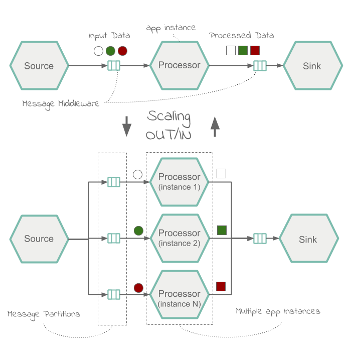

# Scaling

Let's start with a general definition of scalability, the types, and why it is useful.

[Scalability](https://en.wikipedia.org/wiki/Scalability) is the ability of a system to cope with increased load by adding resources. In Distributed Systems the ability to add resources such as CPUs, memory and storage to the existing nodes is known as [vertical scaling](https://en.wikipedia.org/wiki/Scalability#Vertical) (up/down), while [horizontal scaling](https://en.wikipedia.org/wiki/Scalability#Horizontal) (out/in) refers to the ability of adding additional nodes to the system.
Following paragraphs discuss the common concepts for applying `horizontal scaling` (e.g. scaling out or shared nothing) to streaming data pipelines.

[Stream processing](%currentPath%/concepts/streams/) in Spring Cloud Data Flow is implemented architecturally as a collection of independent event-driven streaming applications that connect using a messaging middleware of choice, for example RabbitMQ or Apache Kafka. The collection of independent applications come together at runtime to constitute a streaming data pipeline.
The ability of a streaming data pipeline to cope with increased data load depends on the following characteristics:

- _Messaging Middleware_ - [data partitioning](https://docs.spring.io/spring-cloud-stream/docs/current/reference/htmlsingle/#partitioning) is a widely used technique for scaling the messaging middleware infrastructure. Spring Cloud Data Flow through Spring Cloud Stream, provides excellent support for [streaming partitioning](%currentPath%/feature-guides/streams/partitioning/#data-partitioning/).

- _Event-driven Applications_ - Spring Cloud Stream provides support for data processing in parallel with multiple consumer instances, which is commonly referred to as application scaling.

Following diagram illustrates a typical scale-out architecture based on data partitioning and application parallelism:

Platforms such as Kubernetes and Cloud Foundry offer scaling features for the Operators to control system’s load. For example, Operators can leverage [cf scale](https://docs.cloudfoundry.org/devguide/deploy-apps/cf-scale.html) to [scale applications](https://docs.spring.io/spring-cloud-dataflow/docs/2.3.0.RELEASE/reference/htmlsingle/#configuration-cloudfoundry-scaling) in Cloud Foundry and likewise, use the [kubectl scale](https://jamesdefabia.github.io/docs/user-guide/kubectl/kubectl_scale/) to scale applications in Kubernetes. It is also possible to enable autoscaling features with the help of [App Autoscaler](https://docs.run.pivotal.io/appsman-services/autoscaler/using-autoscaler.html) in Cloud Foundry and [HPA](https://kubernetes.io/docs/tasks/run-application/horizontal-pod-autoscale/) or [KEDA](https://github.com/kedacore/keda) in Kubernetes respectively. The autoscaling is usually determined by the CPU or memory limit thresholds or message queue-depth and topic-offset-lag metrics.

While the scaling happens outside of the Spring Cloud Data Flow, the applications that are scaled can react to and handle the upstream load automatically. Developers only need to configure the message partitioning using properties such as [partitionKeyExpression](https://cloud.spring.io/spring-cloud-static/spring-cloud-stream/3.0.0.RELEASE/reference/html/spring-cloud-stream.html#spring-cloud-stream-overview-configuring-output-bindings-partitioning) and [partitionCount](https://cloud.spring.io/spring-cloud-static/spring-cloud-stream/3.0.0.RELEASE/reference/html/spring-cloud-stream.html#spring-cloud-stream-overview-configuring-output-bindings-partitioning).

In addition to the platform specific, low-level APIs, Spring Cloud Data Flow provides a dedicated, [Scale API](https://docs.spring.io/spring-cloud-dataflow/docs/%dataflow-version%/reference/htmlsingle/#api-guide-resources-stream-deployment-scale), designed for scaling data pipelines. The `Scale API` unifies the various platforms native scaling capabilities into a uniform and simple interface.
It can be used to implement scaling control based on specific application domain or business logic.
The Scale API is reusable across all the Spring Cloud Data Flow supported platforms. Developers can implement an auto-scale controller and reuse it with Kubernetes, Cloud Foundry or even with the Local platform for local testing purposes.

Visit the [Scaling Recipes](%currentPath%/recipes/scaling/) to find how to [scale applications using SCDF Shell](%currentPath%/recipes/scaling/manual-scaling/) or implement [autoscale streaming data pipelines with SCDF and Prometheus](%currentPath%/recipes/scaling/autoscaling/).
