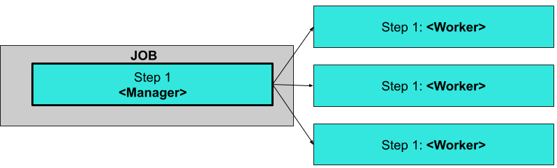

# Introduction to remote partitioning

The Batch Developer Guide showed you how to create the typical single threaded Spring Batch application.
While this is a great solution for most batch applications, there are cases where a particular step in the batch-job may take a significant amount time to do the work required.
Spring Batch has a solution that allows a [Batch Job](https://docs.spring.io/spring-batch/reference/html/domain.html#domainJob) to partition a [Step](https://docs.spring.io/spring-batch/reference/html/domain.html#domainStep) execution, where each partition handles a segment of work.
In short partitioning allows multiple instances of large batch applications to run concurrently.
The purpose of this is to reduce the elapsed time required to process long-running batch jobs.
Processes that can be successfully partitioned are those where the input file can be split and/or the main database tables partitioned to allow the application to run against different sets of data.

So lets say we have a 3 Step Job:



The Job runs on the left-hand side as a sequence of Step instances, In this case we have one step `Step 1` and it is the `Manager` for the partition.
The `Manager Step` is responsible for allocating the work to and launching each `worker`.
In this case the `worker` is a another instance of the Spring Batch application that is executed with a specific profile enabled.
The workers in our diagram are actually copies of our Spring Batch application that are deployed to the platform.
Spring Batch metadata in the `JobRepository` ensures that each worker is executed once and only once for each Job execution.

## Building our own Batch Application with Partitioning

In our sample application we will create a batch job that has a single step that will be partitioned and each partition will print its partition number.

You can view the completed project [here](https://github.com/spring-cloud/spring-cloud-task/tree/master/spring-cloud-task-samples/partitioned-batch-job).

### Initializr

1. Visit the [Spring Initializr site](https://start.spring.io/).
1. Select the latest release of spring boot.
1. Create a new Maven project with a Group name of `io.spring.cloud` and an Artifact name of `partition`.
1. In the Dependencies text box, type `task` to select the Cloud Task dependency.
1. In the Dependencies text box, type `jdbc` then select the JDBC dependency.
1. In the Dependencies text box, type `h2` then select the H2 dependency.
   1. We use H2 for unit testing.
1. In the Dependencies text box, type `mysql` then select mysql dependency (or your favorite database).
   1. We use MySql for the runtime database.
1. In the Dependencies text box, type `batch` then select Batch.
1. Click the Generate Project button.
1. Unzip the partition.zip file and import the project into your favorite IDE.

Another option instead of using the UI to initialize your project you can do the following:

1. Click the [here](https://start.spring.io/starter.zip?type=maven-project&language=java&bootVersion=2.1.5.RELEASE&baseDir=partition&groupId=io.spring.cloud&artifactId=partition&name=partition&description=Demo+project+for+Spring+Boot&packageName=io.spring.cloud.partition&packaging=jar&javaVersion=1.8&dependencies=cloud-task&dependencies=jdbc&dependencies=h2&dependencies=mysql&dependencies=batch) to download the preconfigured partition.zip.

2. Unzip the partition.zip file and import the project into your favorite IDE

### Setting up MySql

1. If you don't have an instance of MySql available to you, you can follow these instructions to run a MySql docker image for this example.

   1. Pull the MySql docker image

      ```bash
      docker pull mysql:5.7.25
      ```

   2. Start the MySql

   ```bash
   docker run -p 3306:3306 --name mysql -e MYSQL_ROOT_PASSWORD=password \
   -e MYSQL_DATABASE=task -d mysql:5.7.25
   ```

### Building The Application

1.  In your favorite IDE create the `io.spring.cloud.partition.configuration` package
1.  Using your favorite IDE add the following dependencies to your pom.xml.

```xml
		<dependency>
			<groupId>org.springframework.batch</groupId>
			<artifactId>spring-batch-integration</artifactId>
		</dependency>

		<dependency>
			<groupId>org.springframework.cloud</groupId>
			<artifactId>spring-cloud-deployer-local</artifactId>
			<version>2.0.2.BUILD-SNAPSHOT</version>
		</dependency>
```

1.  Let's create a Java configuration that will specify the beans required for the Partition `Job`. In this case create a [JobConfiguration](https://github.com/spring-cloud/spring-cloud-task/blob/master/spring-cloud-task-samples/partitioned-batch-job/src/main/java/io/spring/JobConfiguration.java) class in the `io.spring.cloud.partition.configuration` using your favorite IDE that looks like the contents below.

    ```java
    @Configuration
    public class JobConfiguration {

        private static final int GRID_SIZE = 4;
        @Autowired
        public JobBuilderFactory jobBuilderFactory;
        @Autowired
        public StepBuilderFactory stepBuilderFactory;
        @Autowired
        public DataSource dataSource;
        @Autowired
        public JobRepository jobRepository;
        @Autowired
        private ConfigurableApplicationContext context;
        @Autowired
        private DelegatingResourceLoader resourceLoader;
        @Autowired
        private Environment environment;

        @Bean // <1>
        public PartitionHandler partitionHandler(TaskLauncher taskLauncher, JobExplorer jobExplorer) throws Exception {
            Resource resource = this.resourceLoader
                .getResource("maven://io.spring.cloud:partition:0.0.1-SNAPSHOT");

            DeployerPartitionHandler partitionHandler =
                new DeployerPartitionHandler(taskLauncher, jobExplorer, resource, "workerStep");

            List<String> commandLineArgs = new ArrayList<>(3);
            commandLineArgs.add("--spring.profiles.active=worker");
            commandLineArgs.add("--spring.cloud.task.initialize.enable=false");
            commandLineArgs.add("--spring.batch.initializer.enabled=false");
            partitionHandler
                .setCommandLineArgsProvider(new PassThroughCommandLineArgsProvider(commandLineArgs));
            partitionHandler
                .setEnvironmentVariablesProvider(new SimpleEnvironmentVariablesProvider(this.environment));
            partitionHandler.setMaxWorkers(1);
            partitionHandler.setApplicationName("PartitionedBatchJobTask");

            return partitionHandler;
        }

        @Bean // <2>
        @Profile("!worker")
        public Job partitionedJob(PartitionHandler partitionHandler) throws Exception {
            Random random = new Random();
            return this.jobBuilderFactory.get("partitionedJob" + random.nextInt())
                .start(step1(partitionHandler))
                .build();
        }

        @Bean // <3>
        public Step step1(PartitionHandler partitionHandler) throws Exception {
            return this.stepBuilderFactory.get("step1")
                .partitioner(workerStep().getName(), partitioner())
                .step(workerStep())
                .partitionHandler(partitionHandler)
                .build();
        }

        @Bean   // <4>
        public Partitioner partitioner() {
            return new Partitioner() {
                @Override
                public Map<String, ExecutionContext> partition(int gridSize) {

                    Map<String, ExecutionContext> partitions = new HashMap<>(gridSize);

                    for (int i = 0; i < GRID_SIZE; i++) {
                        ExecutionContext context1 = new ExecutionContext();
                        context1.put("partitionNumber", i);

                        partitions.put("partition" + i, context1);
                    }

                    return partitions;
                }
            };
        }

        @Bean   // <5>
        @Profile("worker")
        public DeployerStepExecutionHandler stepExecutionHandler(JobExplorer jobExplorer) {
            return new DeployerStepExecutionHandler(this.context, jobExplorer, this.jobRepository);
        }

        @Bean // <6>
        public Step workerStep() {
            return this.stepBuilderFactory.get("workerStep")
                .tasklet(workerTasklet(null))
                .build();
        }

        @Bean // <7>
        @StepScope
        public Tasklet workerTasklet(
            final @Value("#{stepExecutionContext['partitionNumber']}") Integer partitionNumber) {

            return new Tasklet() {
                @Override
                public RepeatStatus execute(StepContribution contribution, ChunkContext chunkContext) throws Exception {
                    System.out.println("This tasklet ran partition: " + partitionNumber);

                    return RepeatStatus.FINISHED;
                }
            };
        }
    }
    ```

    - <1> The [PartitionHandler](https://docs.spring.io/spring-batch/reference/html/scalability.html#partitionHandler) is the component that knows how the Step is partitioned. It sends StepExecution requests to the remote Steps.
    - <2> The [Job](https://docs.spring.io/spring-batch/reference/html/configureJob.html) manages the batch process.
    - <3> This [Step](https://docs.spring.io/spring-batch/reference/html/configureStep.html) will be used by the manager to launch the worker steps
    - <4> The [Partitioner](https://docs.spring.io/spring-batch/reference/html/scalability.html#partitioning) generates execution contexts as input parameters for new step executions.
    - <5> The [DeployerStepExecutionHandler](https://docs.spring.io/spring-cloud-task/docs/%task-version%/reference/#batch-partitioning) utilizes [Spring Cloud Deployer](https://github.com/spring-cloud/spring-cloud-deployer) to launch the work step executions on the cloud platform.
    - <6> This [Step](https://docs.spring.io/spring-batch/reference/html/configureStep.html) will be used by the workers to execute the [Tasklet](https://docs.spring.io/spring-batch/reference/html/configureStep.html#taskletStep).
    - <7> The [Tasklet](https://docs.spring.io/spring-batch/reference/html/configureStep.html#taskletStep) that will execute the business logic for the partitioned set of work. In our case, printing the paritition number.

1.  Now let us add our `@EnableTask` and `@EnableBatchProcessing` annotations to the PartitionApplication class as follows:

```java
@SpringBootApplication
@EnableTask  // <1>
@EnableBatchProcessing // <2>
public class PartitionApplication {

	public static void main(String[] args) {
		SpringApplication.run(PartitionApplication.class, args);
	}
}
```

- <1> The `@EnableTask` annotation sets up a TaskRepository which stores information about the task execution such as the start and end time of the task and the exit code.
- <2> The `@EnableBatchProcessing` annotation enables Spring Batch features and provide a base configuration for setting up batch jobs.

## Deployment

### Local

1.  Now let’s take the next step of building the project.
    From a command line change directory to the location of your project and build the project using maven:
    `./mvnw clean install -DskipTests`.

2.  Now let’s execute the application with the configurations required to launch our Batch application.

    To configure the execution of the Batch application, add the following properties to your environment:

```
export spring_datasource_url=jdbc:mysql://localhost:3306/task?useSSL\=false // <1>
export spring_datasource_username=root // <2>
export spring_datasource_password=password // <3>
export spring_datasource_driverClassName=com.mysql.jdbc.Driver // <4>
export spring_batch_initializeSchema=always // <5>
java -jar target/partition-0.0.1-SNAPSHOT.jar
```

- <1> _spring.datasource.url_ - set the URL to your database instance. In the sample below we are connecting to a mysql `task` database on our local machine at port 3306.
- <2> _spring.datasource.username_ - the user name to be used for the MySql database. In the sample below it is `root`
- <3> _spring.datasource.password_ - the password to be used for the MySql database. In the sample below it is `password`
- <4> _spring.datasource.driverClassName_ - The driver to use to connect to the MySql database. In the sample below it is `com.mysql.jdbc.Driver`
- <5> _spring.batch.initializeSchema_ - initializes the database with the tables required for Spring Batch. In the sample below we state that we `always` want to do this. This will not overwrite the tables if they already exist.

#### Cleanup

To stop and remove the mysql container running in the docker instance:

```bash
docker stop mysql
docker rm mysql
```
