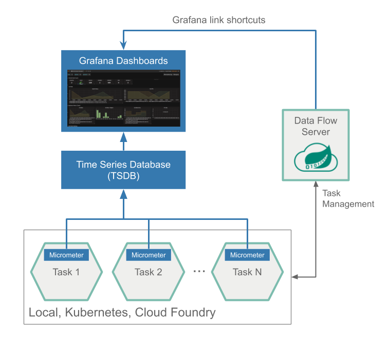
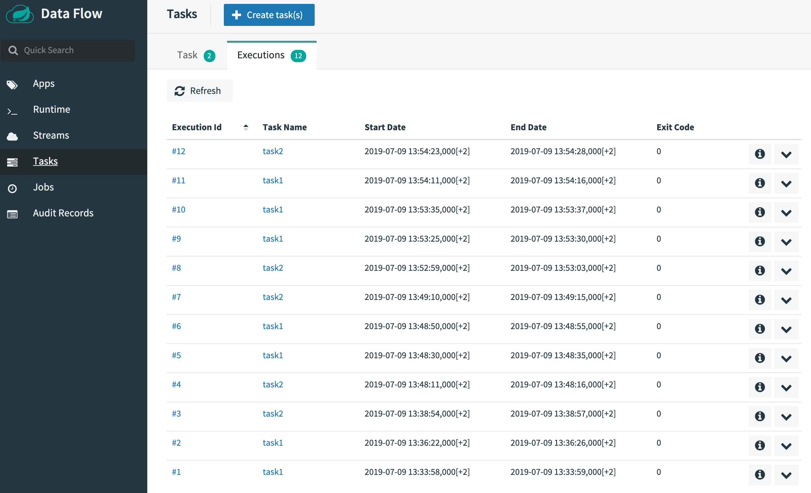

# Task and Batch Monitoring with InfluxDB

This section describes how to monitor the applications that were deployed as part of a Task definition in SCDF. The setup for each platform is different, but the general architecture is the same across the platforms.

The Data Flow 2.x metrics architecture is designed around the [Micrometer](https://micrometer.io/) library, which is a vendor-neutral application metrics facade. It provides a simple facade over the instrumentation clients for the most popular monitoring systems. See the [Micrometer documentation](https://micrometer.io/docs) for the list of supported monitoring systems. Starting with Spring Boot 2.0, Micrometer is the instrumentation library that powers the delivery of application metrics from Spring Boot. Spring Batch provides [additional integration](https://docs.spring.io/spring-batch/4.2.x/reference/html/monitoring-and-metrics.html) to expose metrics around task durations, rates and errors, which is critical to the monitoring of deployed batch-jobs.

The core of the Micrometer task integration is part of the Spring Cloud Task’s 2.2.0 release-line, which is a prerequisite for the Task-metrics and the Data Flow integration.
Task applications built on the Spring Cloud Task 2.2.0 version can be configured to emit Task and Batch metrics to the pre-configured monitoring systems supported by Micrometer.

<!--NOTE-->

To enable Task metrics integration with DataFlow you must add the `spring-boot-starter-actuator` and include the desired Micrometer registry as the dependency in the Task POM.

<!--END_NOTE-->

For example:

```
<dependency>
    <groupId>org.springframework.boot</groupId>
    <artifactId>spring-boot-starter-actuator</artifactId>
</dependency>
<dependency>
    <groupId>io.micrometer</groupId>
    <artifactId>micrometer-registry-influx</artifactId>
</dependency>
```

To help you get started monitoring tasks, Data Flow provides [Grafana](https://grafana.com/) Dashboards that you can install and customize for your needs.

The following image shows the general architecture of how applications are monitored:



To allow aggregating metrics per application type and per instance id or per task name, the Spring Cloud Task applications are configured to use the following Micrometer tags:

- `task.name`: The name of the Task that contains the applications that send the metrics
- `task.execution.id`: [The instance id of the executed task](https://docs.spring.io/spring-cloud-task/docs/2.2.0.BUILD-SNAPSHOT/reference/#features-generated_task_id).
- `task.external.execution.id`: The [external Task ID](https://docs.spring.io/spring-cloud-task/docs/2.2.0.BUILD-SNAPSHOT/reference/#features-external_task_id) as present on the target platform (such as Cloud Foundry or Kubernetes) The type (Source, Processor, or Sink) of the application that reports the metrics
- `task.parent.execution.id`: The [parent task ID](https://docs.spring.io/spring-cloud-task/docs/2.2.0.BUILD-SNAPSHOT/reference/#features-parent_task_id) used to identify task that executes another task or tasks.

As setting up InfluxDB is different depending on the platform on which you run, we provide instructions for each platform. In Spring Cloud Data Flow 2.x, local server and Cloud Foundry instructions for InfluxDB have been provided.

## Local

This section describes how to set up InfluxDB for a local machine.

### InfluxDB

InfluxDB is a popular open-source push-based time series database. It supports downsampling, automatically expiring and deleting unwanted data, and backup and restore. Analysis of data is done through an SQL-like query language.

To enable Micrometer’s Influx meter registry for Spring Cloud Task application starters, start the Data Flow server with the following properties:

```bash
--spring.cloud.dataflow.applicationProperties.task.management.metrics.export.influx.enabled=true
--spring.cloud.dataflow.applicationProperties.task.management.metrics.export.influx.db=myinfluxdb
--spring.cloud.dataflow.applicationProperties.task.management.metrics.export.influx.uri=http://localhost:8086
--spring.cloud.dataflow.grafana-info.url=http://localhost:3000
```

Instead of having to install them manually, for a quick bootstrap, Spring Cloud Data Flow provides a [Docker Compose Influx](https://github.com/spring-cloud/spring-cloud-dataflow/blob/master/spring-cloud-dataflow-server/docker-compose-influxdb.yml) file, which will bring up Spring Cloud Data Flow, Skipper, Apache Kafka, Influx, and prebuilt dashboards for Grafana. Instructions below leverage this approach..

[[tip | Upgrade to latest version of Docker ]]
| We recommended that you upgrade to the [latest version](https://docs.docker.com/compose/install/) of Docker before running the `docker-compose` command. We have tested with Docker Engine version `18.09.2`.

- Downloading the Docker Compose Influx file

To download the Spring Cloud Data Flow Server Docker Compose file, run the following command:

```bash
wget https://raw.githubusercontent.com/spring-cloud/spring-cloud-dataflow/master/spring-cloud-dataflow-server/docker-compose-influxdb.yml
```

- Starting Docker Compose

In the directory where you downloaded `docker-compose-influxdb.yml`, start the system, by running the following commands:

```bash
export DATAFLOW_VERSION=2.2.0.BUILD-SNAPSHOT
export SKIPPER_VERSION=2.1.0.BUILD-SNAPSHOT
docker-compose -f ./docker-compose-influxdb.yml up
```

Now that docker compose is up, you can access the [Spring Cloud Data Flow Dashboard](http://localhost:9393/dashboard). Also you can reach the Grafana dashboard at http://localhost:3000 using the user: admin, password: admin credentials.

Now you can deploy a custom Task application (`task-demo-metrics`) and define two tasks (`task1` and `task2`):

```bash
dataflow:>app register --name myTask --type task --uri https://github.com/tzolov/task-demo-metrics/raw/master/apps/task-demo-metrics-0.0.1-SNAPSHOT.jar

dataflow:>task create --name task1 --definition "myTask"
dataflow:>task create --name task2 --definition "myTask"
```

Launch the tasks several times:

```bash
dataflow:>task launch --name task1
dataflow:>task launch --name task2
```

In the [DataFlow task execution UI](http://localhost:9393/dashboard/#/tasks/executions) you should see list like this:


You should see dashboards similar to those shown in the following image:


## Cloud Foundry

This section describes how to set up InfluxDB for Cloud Foundry.

### InfluxDB

You can follow the general [Manifest based installation on Cloud Foundry](%currentPath%/installation/cloudfoundry/cf-cli/#manifest-based-installation-on-cloud-foundry) instructions for installing `Skipper` and `DataFlow` on Cloud Foundry.
To enabling the Task metrics integration you need to extend the [DataFlow manifest](%currentPath%/installation/cloudfoundry/cf-cli/#installing-using-a-manifest) with following `SPRING_APPLICATION_JSON` variable:

```json
{
  "spring.cloud.dataflow.applicationProperties.task.management.metrics.export.influx.enabled": true,
  "spring.cloud.dataflow.applicationProperties.task.management.metrics.export.influx.db": "yourinfluxdb",
  "spring.cloud.dataflow.applicationProperties.task.management.metrics.export.influx.autoCreateDb": false,
  "spring.cloud.dataflow.applicationProperties.task.management.metrics.export.influx.uri": "https://your-influx-uri:port",
  "spring.cloud.dataflow.applicationProperties.task.management.metrics.export.influx.userName": "influxusername",
  "spring.cloud.dataflow.applicationProperties.task.management.metrics.export.influx.password": "******",
  "spring.cloud.dataflow.grafana-info.url": "https://your-grafana-uri:443"
}
```

Check the [Influx Actuator properties](https://docs.spring.io/spring-boot/docs/2.2.0.M4/reference/html/#actuator-properties) for further details about the `management.metrics.export.influx.XXX` properties.

Complete example of a DataFlow manifest that enables metrics collection for both Stream and Tasks would look like this:

```yml
---
applications:
- name: data-flow-server
  host: data-flow-server
  memory: 2G
  disk_quota: 2G
  instances: 1
  path: ./spring-cloud-dataflow-server-2.2.0.BUILD-SNAPSHOT.jar
  env:
    SPRING_APPLICATION_NAME: data-flow-server
    SPRING_PROFILES_ACTIVE: cloud
    JBP_CONFIG_SPRING_AUTO_RECONFIGURATION: '{enabled: false}'
    MAVEN_REMOTEREPOSITORIES[REPO1]_URL: https://repo.spring.io/libs-snapshot
    SPRING_CLOUD_DATAFLOW_TASK_PLATFORM_CLOUDFOUNDRY_ACCOUNTS[default]_CONNECTION_URL: https://api.run.pivotal.io
    SPRING_CLOUD_DATAFLOW_TASK_PLATFORM_CLOUDFOUNDRY_ACCOUNTS[default]_CONNECTION_ORG: <org>
    SPRING_CLOUD_DATAFLOW_TASK_PLATFORM_CLOUDFOUNDRY_ACCOUNTS[default]_CONNECTION_SPACE: <space>
    SPRING_CLOUD_DATAFLOW_TASK_PLATFORM_CLOUDFOUNDRY_ACCOUNTS[default]_CONNECTION_DOMAIN: cfapps.io
    SPRING_CLOUD_DATAFLOW_TASK_PLATFORM_CLOUDFOUNDRY_ACCOUNTS[default]_CONNECTION_USERNAME: <email>
    SPRING_CLOUD_DATAFLOW_TASK_PLATFORM_CLOUDFOUNDRY_ACCOUNTS[default]_CONNECTION_PASSWORD: <password>
    SPRING_CLOUD_DATAFLOW_TASK_PLATFORM_CLOUDFOUNDRY_ACCOUNTS[default]_CONNECTION_SKIP_SSL_VALIDATION: true
    SPRING_CLOUD_DATAFLOW_TASK_PLATFORM_CLOUDFOUNDRY_ACCOUNTS[default]_DEPLOYMENT_SERVICES: mysql
    SPRING_CLOUD_SKIPPER_CLIENT_SERVER_URI: http://your-skipper-server-uri/api
    SPRING_APPLICATION_JSON: '{"spring.cloud.dataflow.applicationProperties.task.management.metrics.export.influx.enabled": true,"spring.cloud.dataflow.applicationProperties.task.management.metrics.export.influx.db": "defaultdb","spring.cloud.dataflow.applicationProperties.task.management.metrics.export.influx.autoCreateDb": false,"spring.cloud.dataflow.applicationProperties.task.management.metrics.export.influx.uri": "https://influx-uri:port","spring.cloud.dataflow.applicationProperties.task.management.metrics.export.influx.userName": "guest","spring.cloud.dataflow.applicationProperties.task.management.metrics.export.influx.password": "******","spring.cloud.dataflow.applicationProperties.stream.management.metrics.export.influx.enabled": true,"spring.cloud.dataflow.applicationProperties.stream.management.metrics.export.influx.db": "defaultdb","spring.cloud.dataflow.applicationProperties.stream.management.metrics.export.influx.autoCreateDb": false,"spring.cloud.dataflow.applicationProperties.stream.management.metrics.export.influx.uri": "https://influx-uri:port","spring.cloud.dataflow.applicationProperties.stream.management.metrics.export.influx.userName": "guest","spring.cloud.dataflow.applicationProperties.stream.management.metrics.export.influx.password": "******",
    "spring.cloud.dataflow.grafana-info.url": "https://grafana-uri:port"}'

services:
- mysql
```
