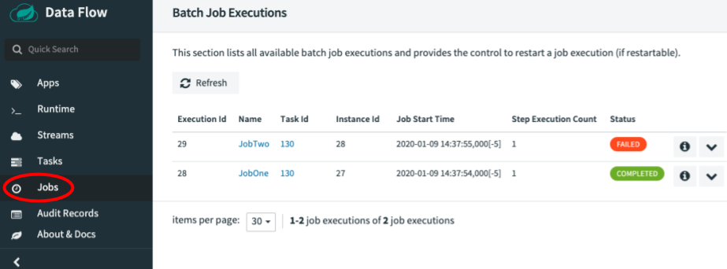
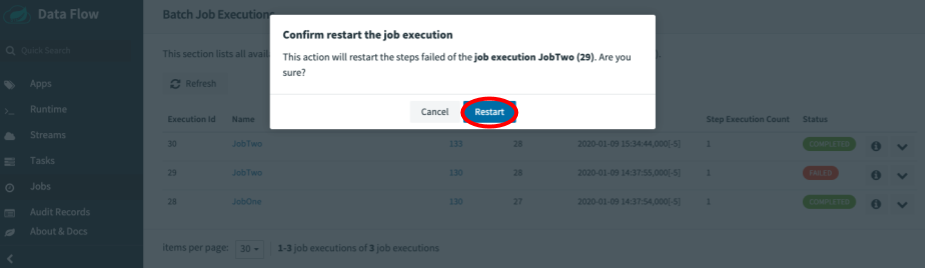

# Batch Job Restart

Spring Cloud Data Flow allows a user to restart a Spring Batch Job. For instance, if a Spring Batch Job fails to run, it can be restarted from SCDF Dashboard, so the batch-job can pick up the work from where it left off. In this section, we will show how you can restart batch-jobs.

## Restarting a Batch Job

To restart a Spring Batch Job, navigate to the Jobs page by pressing the `Jobs` tab located on the left hand side of the UI.

Now identify the job you wish to restart. In our example below, the `JobTwo` shows a status of `FAILED`, thus the UI provides an option to restart this batch-job.
To do this press the dropdown button associated with the `JobTwo` job and select `Restart the job`.

Now a dialog box will appear asking if you wish to restart the job. Press the `Restart` button.

At this point Spring Cloud Data Flow will relaunch the task for this Spring Batch Job.
Once the Job has finished its operation without any errors, you will see that `JobTwo` completed successfully.

