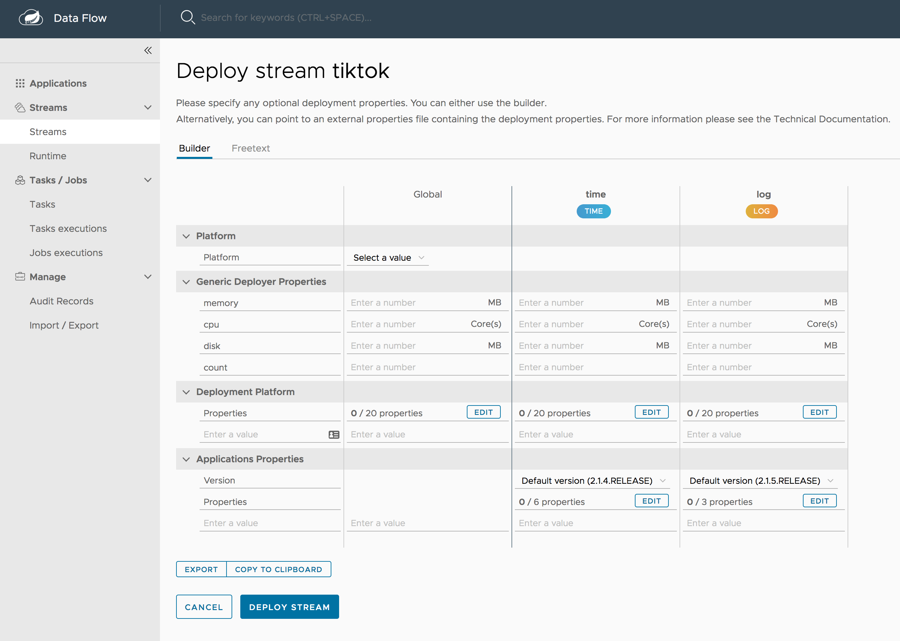
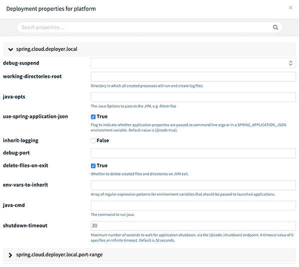
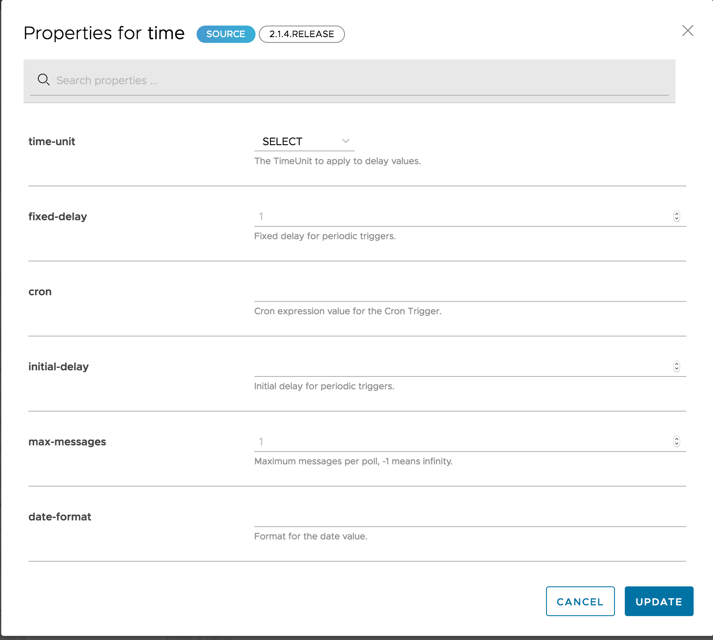
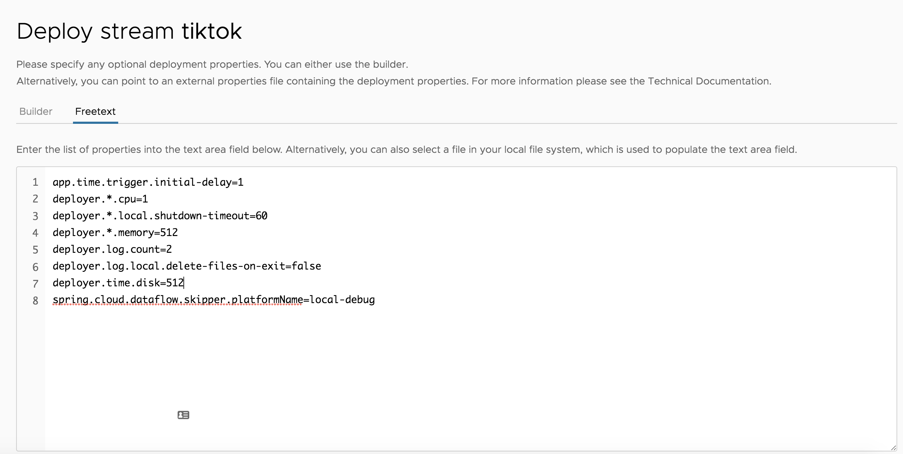

# Deployment Properties

When deploying a stream, properties fall into two groups:

- Properties that control how the apps are deployed to the target platform and that use a `deployer` prefix are referred to as _deployer properties_.
- Properties that control or override how the application behave and that are set during stream creation are referred to as _application properties_.

You need to pick a defined platform configuration where each platform type (`local`, `cloudfoundry` or `kubernetes`) has a different set of possible deployment properties. Every platform has a set of generic properties for `memory`, `cpu`, and `disk` reservations and `count` to define how many instances should be created on that platform. The following image shows the Deploy Stream Definition view, where you can set these properties:



The following image shows an example of how to override the `local` deployer properties (note that these properties can be defined globally or per application):



The following image shows an example of a `time` application's properties:



You can switch betwewn _Freetext_ and _Builder_ based representation to define properties. The following image shows the Freetext editor:



Once the properties are applied, they get translated by SCDF to well-defined properties, as shown in the next listing.

<!--NOTE-->

Properties may have default values. If a value remains unchanged, it is removed from a derived properties list.

<!--END_NOTE-->

```
app.time.trigger.initial-delay=1
deployer.*.cpu=1
deployer.*.local.shutdown-timeout=60
deployer.*.memory=512
deployer.log.count=2
deployer.log.local.delete-files-on-exit=false
deployer.time.disk=512
spring.cloud.dataflow.skipper.platformName=local-debug
```

The preceding example would be as follows in SCDF shell:

```
stream deploy --name ticktock --properties "app.time.trigger.initial-delay=1,deployer.*.cpu=1,deployer.*.local.shutdown-timeout=60,deployer.*.memory=512,deployer.log.count=2,deployer.log.local.delete-files-on-exit=false,deployer.time.disk=512,spring.cloud.dataflow.skipper.platformName=local-debug"
Deployment request has been sent for stream 'ticktock'
```
