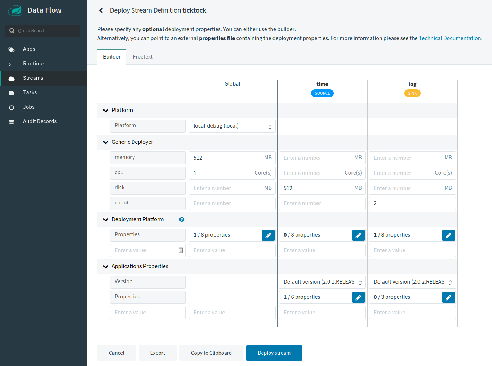
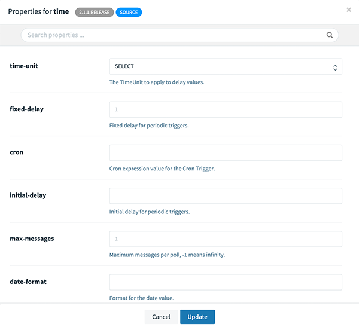
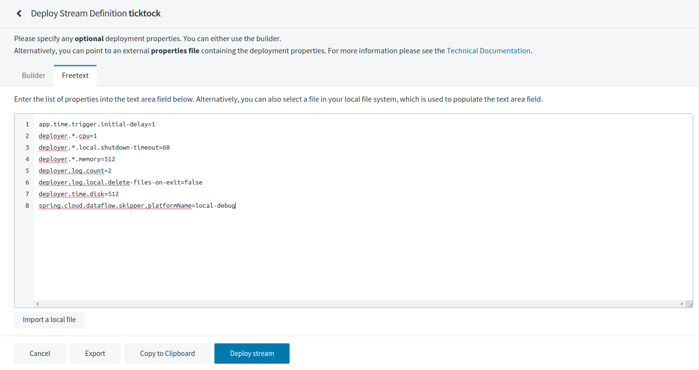

# Deployment Properties

When deploying a stream, properties fall into two groups:

- Deployer Properties: These properties control how the apps are deployed to the target platform and use a `deployer` prefix.
- Application Properties: These properties control or override how the application behaves and are set during stream creation.

You need to pick a defined platform configuration where each platform type (`local`, `cloudfoundry`, or `kubernetes`) has a different set of possible deployment properties. Every platform has a set of generic properties for `memory`, `cpu`, `disk` reservations, and `count` (to define how many instances should be created on that platform).

<!--TIP-->

You can view the deployment properties for each of the platforms by selecting one of the following links:

- [Local](https://docs.spring.io/spring-cloud-dataflow/docs/current/reference/htmlsingle/#configuration-local-deployer)
- [Cloud Foundry](https://docs.spring.io/spring-cloud-dataflow/docs/current/reference/htmlsingle/#configuration-cloudfoundry-deployer)
- [Kubernetes](https://docs.spring.io/spring-cloud-dataflow/docs/current/reference/htmlsingle/#configuration-kubernetes-deployer).

<!--END_TIP-->

The following image shows the Deploy Stream Definition view:



The following image shows an example of how to override the `local` deployer properties (note that these properties can be defined globally or per application):


The following image shows an example of a `time` application's properties:



You can switch between _Freetext_ and _Builder_ representation to define properties. The following image shows the Freetext editor:



Once the properties are applied, they get translated by SCDF to well-defined properties, as follows:

```
app.time.trigger.initial-delay=1
deployer.*.cpu=1
deployer.*.local.shutdown-timeout=60
deployer.*.memory=512
deployer.log.count=2
deployer.log.local.delete-files-on-exit=false
deployer.time.disk=512
spring.cloud.dataflow.skipper.platformName=local-debug
```

<!--NOTE-->

Properties can have default values. If a value remains unchanged, it is removed from a derived properties list.

<!--END_NOTE-->

The preceding example would be as follows in the SCDF shell:

```
stream deploy --name ticktock --properties "app.time.trigger.initial-delay=1,deployer.*.cpu=1,deployer.*.local.shutdown-timeout=60,deployer.*.memory=512,deployer.log.count=2,deployer.log.local.delete-files-on-exit=false,deployer.time.disk=512,spring.cloud.dataflow.skipper.platformName=local-debug"
Deployment request has been sent for stream 'ticktock'
```
