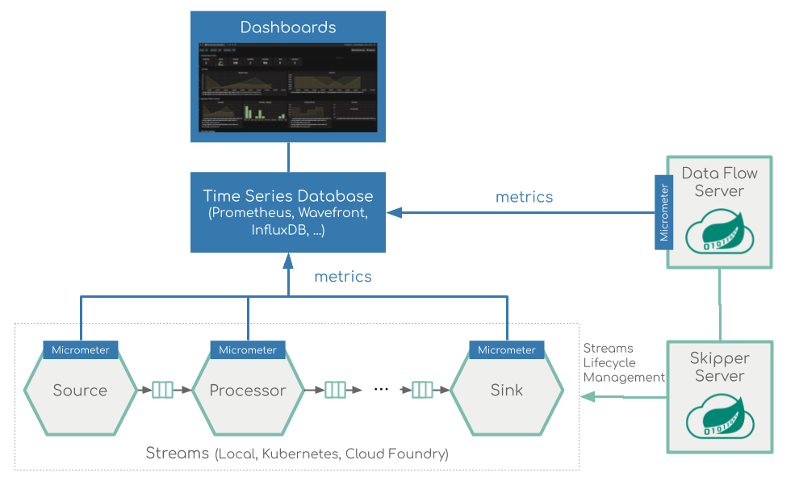
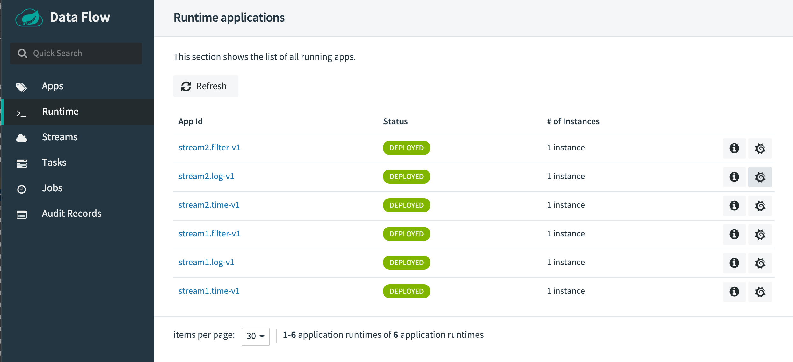
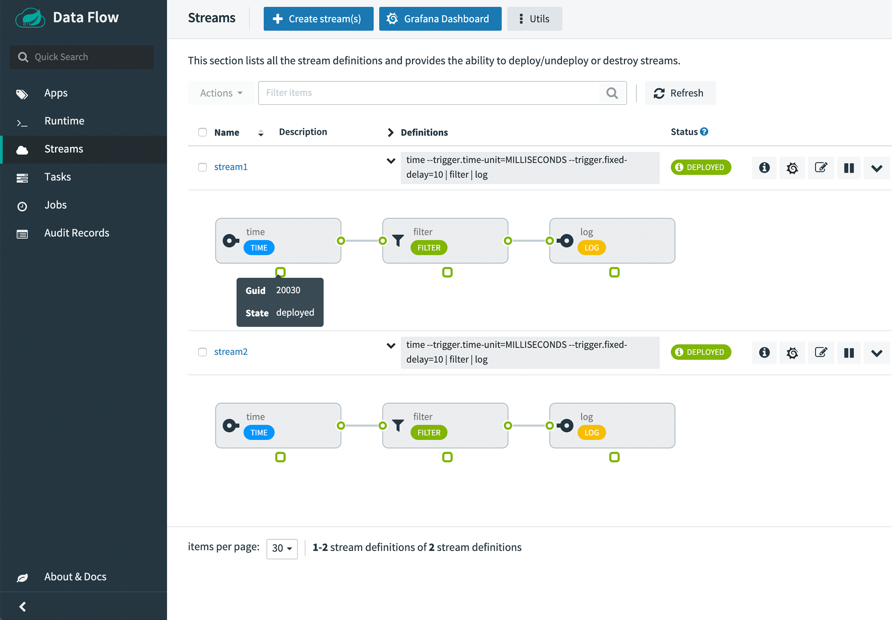
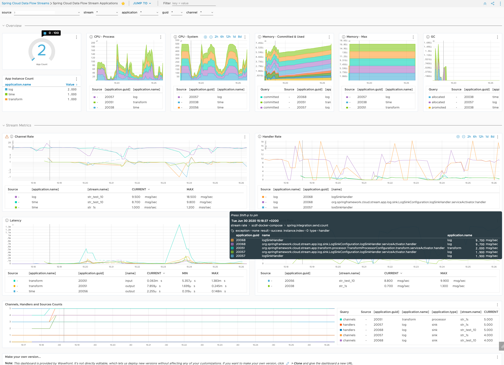
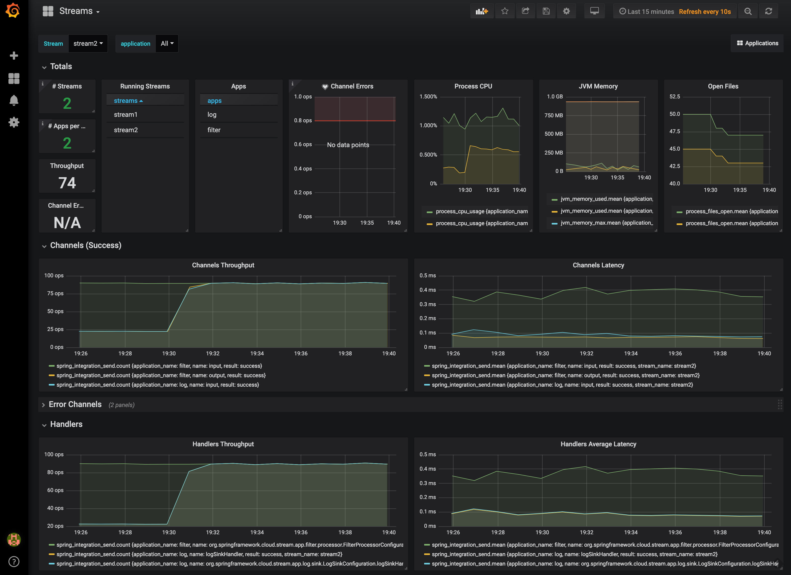

# Stream Monitoring with Prometheus, Wavefront and InfluxDB

This section describes how to monitor the applications that were deployed as part of a Stream. The setup for each platform is different, but the general architecture is the same across all the platforms.

The Data Flow metrics architecture is designed around the [Micrometer](https://micrometer.io/) library, which is a vendor-neutral application metrics facade. It provides a simple facade over the instrumentation clients for the most popular monitoring systems. See the [Micrometer documentation](https://micrometer.io/docs) for the list of supported monitoring systems. Micrometer is the instrumentation library that powers the delivery of application metrics from Spring Boot. Spring Integration provides [additional integration](https://docs.spring.io/spring-integration/docs/current/reference/html/system-management.html#micrometer-integration) to expose metrics around message rates and errors, which is critical to the monitoring of deployed streams.

All the Spring Cloud [Stream Applications](https://docs.spring.io/spring-cloud-dataflow/docs/current/reference/htmlsingle/#applications) are configured to support two of the most popular monitoring systems, [Prometheus](https://prometheus.io/), [Wavefront](https://www.wavefront.com/) and [InfluxDB](https://www.influxdata.com/). You can declaratively select which monitoring system the deployed applications will use.

[Wavefront](https://docs.wavefront.com/wavefront_introduction.html) is a high-performance streaming analytics platform that supports 3D observability (metrics, histograms, traces/spans). It scales to very high data ingestion rates and query loads while also collecting data many services and sources across your entire application stack.

[Prometheus](https://prometheus.io/) is a popular pull-based Time Series Database that pulls the metrics from the target applications with pre-configured endpoints and provides a query language to select and aggregate time series data in real time.

[InfluxDB](https://www.influxdata.com/) is a popular open-source push-based Time Series Database. It supports downsampling, automatically expiring and deleting unwanted data, and backup and restore. Analysis of data is done through an SQL-like query language.

To enable support for different monitoring systems, you can [customize the Stream Applications](https://docs.spring.io/spring-cloud-stream-app-starters/docs/current/reference/htmlsingle/#_patching_pre_built_applications) to use a different monitoring system.

To help you get started monitoring streams, Data Flow provides [Grafana](https://grafana.com/) dashboards (for Prometheus and InfluxDB) that you can install and customize for your needs. For Wavefront, you can use the Data Flow Integration tile for a rich and comprehensive metrics visualization.

The following image shows the general architecture of how streaming applications are monitored:



<!--NOTE-->

Prometheus requires a Service Discovery component to automatically probe the configured endpoint for metrics. The Spring Cloud Data Flow server leverages the [Prometheus RSocket Proxy](https://github.com/micrometer-metrics/prometheus-rsocket-proxy), which uses `rsocket` protocol for the service-discovery mechanism. The RSocket Proxy approach is used so that we can monitor tasks, which are short lived, as well as long lived stream applications using the same architecture. See the micrometer documentation on [short-lived task/batch applications](https://github.com/micrometer-metrics/prometheus-rsocket-proxy#support-for-short-lived-or-serverless-applications) for more information. In addition, the RSocket approach allows for the same monitoring architecture to be used across all the platforms. Prometheus is configured to scrape each proxy instance. Proxies in turn use the RSocket connection to pull metrics from each application. The scraped metrics are then viewable through Grafana dashboards.

<!--END_NOTE-->

#### Data Flow Metric Tags

To allow aggregating metrics per application type and per instance or per stream, the Spring Cloud Stream Application Starters are configured to use the following Micrometer tags:

- `stream.name`: The name of the Stream that contains the applications that send the metrics
- `application.name`: The name or label of the application that reports the metrics
- `application.type`: The type (Source, Processor, or Sink) of the application that reports the metrics
- `application.guid`: Unique instance identifier of the application instance that reports the metrics
- `application.index`: Application instance ID (when available)

If the Data Flow server is started with the `spring.cloud.dataflow.grafana-info.url` property pointing to your Grafana URL, the Grafana feature is enabled and the Data Flow UI provides you with Grafana buttons that can open a particular dashboard for a given stream, application, or application instance. The following screenshots illustrate these buttons, look for the spiral icon.





Choosing between Wavefront, Prometheus, or InfluxDB and installing necessary components is different depending on the platform on which you run. Links to installation instructions are provided in each section below.

## Local

This section describes how to view application metrics for streams using Prometheus or InfluxDB as the metrics store on your local machine. Wavefront is a cloud offering, but you still can deploy Data Flow locally can point it to a cloud-managed Wavefront monitoring system.

<!--TABS-->

<!--Prometheus -->

### Prometheus

To install Prometheus and Grafana, follow the [Monitoring with Prometheus and Grafana](%currentPath%/installation/local/docker-customize/#prometheus--grafana) Docker Compose instructions. This will bring up Spring Cloud Data Flow, Skipper, Apache Kafka, Prometheus, and prebuilt dashboards for Grafana.

Once all the containers are running, you can access the Spring Cloud Data Flow Dashboard at http://localhost:9393/dashboard

Also you can reach the Prometheus UI at http://localhost:9090/graph and http://localhost:9090/targets

You can access the Grafana dashboard at http://localhost:3000 using the credentials:

- user: `admin`
- password: `admin`

There are two provisioned dashboards:

- Streams: http://localhost:3000/d/scdf-streams/streams?refresh=10s
- Applications: http://localhost:3000/d/scdf-applications/applications?refresh=10s

To see the dashboard in action, deploy a simple stream that uses Kafka.

```bash
dataflow:>app import --uri https://dataflow.spring.io/kafka-maven-latest --force
dataflow:>stream create stream2 --definition "time --fixed-delay=10 --time-unit=MILLISECONDS | filter --expression=payload.contains('3') | log" --deploy
```

You should see dashboards similar to those shown in the following image:


<!--Wavefront -->

### Wavefront

To install Data Flow with Wavefront support, follow the [Monitoring with Wavefront](%currentPath%/installation/local/docker-customize/#wavefront) Docker Compose instructions. This will bring up Spring Cloud Data Flow, Skipper, Apache Kafka, and it will also point to the Wavefront's Data Flow Integration Tile automatically.

The Wavefront is a SaaS offering and you need to create a user account first. With that account, you will be able to set the `WAVEFRONT_KEY` and `WAVEFRONT_URI` environment variables as explained below.

You should see dashboards similar to those shown in the following image:



<!--InfluxDB -->

### InfluxDB

To install InfluxDB and Grafana, follow the [Monitoring with InfluxDB and Grafana](%currentPath%/installation/local/docker-customize/#monitoring-with-influxdb-and-grafana) Docker Compose instructions. This will bring up Spring Cloud Data Flow, Skipper, Apache Kafka, InfluxDB, and prebuilt dashboards for Grafana.

Once all the containers are running, you can access the Spring Cloud Data Flow Dashboard at http://localhost:9393/dashboard. You can access the Grafana dashboard at http://localhost:3000 using the credentials:

- user: `admin`
- password: `admin`

There are two provisioned dashboards:

- Streams: http://localhost:3000/d/scdf-streams/streams?refresh=10s
- Applications: http://localhost:3000/d/scdf-applications/applications?refresh=10s

Now you can deploy a simple stream that uses Kafka, such as the following:

```bash
dataflow:>app import --uri https://dataflow.spring.io/kafka-maven-latest --force

dataflow:>stream create stream2 --definition "time --fixed-delay=10 --time-unit=MILLISECONDS | filter --expression=payload.contains('3') | log" --deploy
```

You should see dashboards similar to those shown in the following image:



To validate the setup, you can log in to those containers by using the following commands:

```bash
docker exec -it influxdb /bin/sh
docker exec -it grafana /bin/bash
```

Then you can check the content of InfluxDB by running the following commands:

<div class="gatsby-highlight" data-language="bash">
<pre class="language-bash"><code>root:/# influx
> show databases
> use myinfluxdb
> show measurements
> select * from spring_integration_send limit 10
</code></pre></div>

<!--END_TABS-->

## Kubernetes

This section describes how to view application metrics for streams using Prometheus as the metrics store on Kubernetes.

<!--TABS-->

<!--Prometheus -->

### Prometheus

To install Prometheus and Grafana on Kubernetes, you will need to follow the instructions for a [kubectl based installation](%currentPath%/installation/kubernetes/kubectl/#deploy-prometheus-and-grafana).

<!--IMPORTANT-->

The address used to access the Grafana UI depends on the Kubernetes platform the system is deployed to. If you are using (for example) GKE, the load balancer address would be used. If using Minikube (which does not provide a load balancer implementation), the IP of the Minikube (along with an assigned port) is used. In the following examples, for simplicity, we use Minikube.

<!--END_IMPORTANT-->

To obtain the URL of the Grafana UI when it is deployed to Minikube, run the following command:

```bash
$ minikube service --url grafana
http://192.168.99.100:31595
```

You can access the Grafana dashboard at http://192.168.99.100:31595 usng the credentials:

- User name: admin
- Password: password

There are two provisioned dashboards:

- Streams: http://192.168.99.100:31595/d/scdf-streams/streams?refresh=10s
- Applications: http://192.168.99.100:31595/d/scdf-applications/applications?refresh=10s

You can collect metrics on a per-application, per-stream basis or apply metrics collection to all deployed applications globally.

To deploy a single stream with metrics enabled, enter the following into the Spring Cloud Data Flow shell:

```bash
dataflow:>stream create metricstest --definition "time --fixed-delay=10 --time-unit=MILLISECONDS | filter --expression=payload.contains('3') | log" --deploy
```

You should see dashboards similar to those shown in the following image:


<!--Wavefront -->

### Wavefront

The Wavefront is a SaaS offering. You need to create a user account first and obtain the `API-KEY` and `WAVEFRONT-URI` assigned to your account.

Follow the general [Data Flow Kubernetes installation instructions](<(%currentPath%/installation/kubernetes/)>).

Then add the following properties to your Spring Cloud Data Flow server configuration (e.g. `src/kubernetes/server/server-config.yaml`) for enabling the Wavefront Integration:

```yml
management:
  metrics:
    export:
      wavefront:
        enabled: true
        api-token: <YOUR API-KEY>
        uri: <YOUR WAVEFRONT-URI>
        source: demo-scdf-source
spring:
  cloud:
    dataflow:
      applicationProperties:
        stream:
          management:
            metrics:
              export:
                wavefront:
                  enabled: true
                  api-token: <YOUR API-KEY>
                  uri: <YOUR WAVEFRONT-URI>
                  source: demo-scdf-source
```

Then on the Wavefront portal, you should see dashboards similar to those shown in the following image:


<!--END_TABS-->

## Cloud Foundry

This section describes how to view application metrics for streams using Prometheus as the metrics store on Cloud Foundry.

<!--TABS-->

<!--Prometheus -->

### Prometheus

To configure the Data Flow server's manifest to send metrics data from stream applications to the Prometheus RSocket gateway, follow the [Manifest based installation instructions](%currentPath%/installation/cloudfoundry/cf-cli/#configuration-for-prometheus).

With Prometheus, Grafana, Spring Cloud Data Flow, and any other services as defined in the [Getting Started - Cloud Foundry](%currentPath%/installation/cloudfoundry/cf-cli) section up and running, you are ready to collect metrics.

Depending on where you have installed Grafana, access the Grafana dashboard using the credentials:

- User name: admin
- Password: password

There are two dashboards that can be installed using the following links.

- Streams: https://grafana.com/grafana/dashboards/9933
- Applications: https://grafana.com/grafana/dashboards/9934

Then you can collect metrics on a per-application, per-stream basis or apply metrics collection to all deployed applications globally.

To deploy a single stream with metrics enabled, enter the following into the Spring Cloud Data Flow shell:

```bash
dataflow:>stream create metricstest --definition "time --fixed-delay=10 --time-unit=MILLISECONDS | filter --expression=payload.contains('3') | log" --deploy
```

After deploying a stream, you can launch to view the Grafana dashboard as shown in the following image:


<!--Wavefront -->

### Wavefront

The Wavefront is a SaaS offering. You need to create a user account first and obtain the `API-KEY` and `WAVEFRONT-URI` assigned to your account.

To configure the Data Flow Server to send metrics data from stream applications to the Wavefront monitoring system, follow the [Manifest based Wavefront configuration instructions](%currentPath%/installation/cloudfoundry/cf-cli/#configuration-for-wavefront).

Then on the Wavefront portal you should see dashboards similar to those shown in the following image:


<!--END_TABS-->
