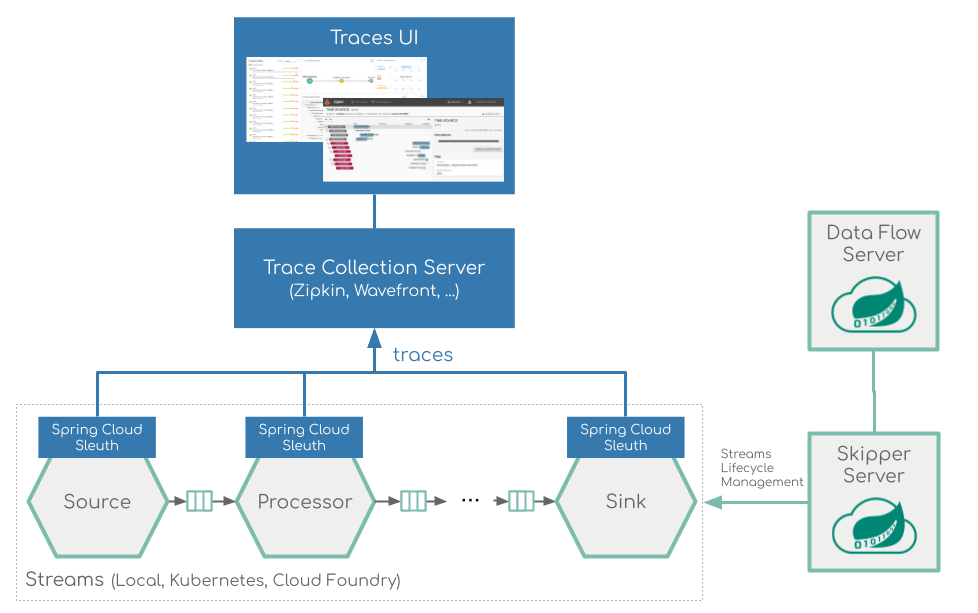
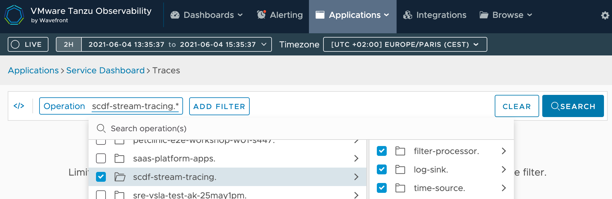
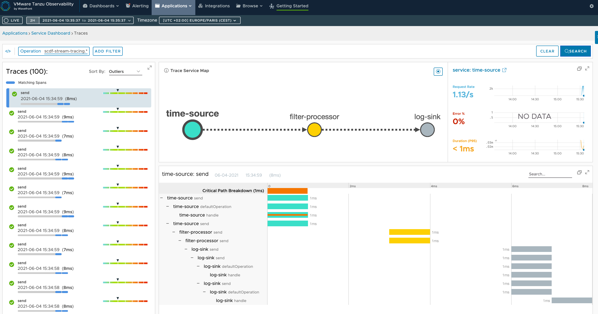
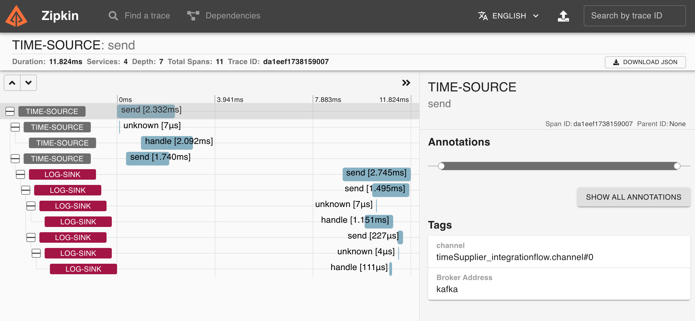
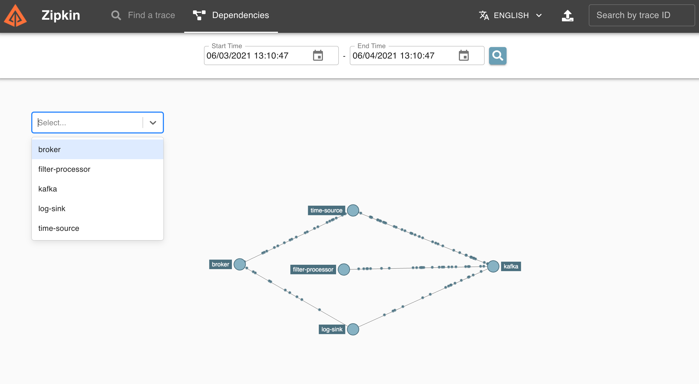

# Stream Distributed Tracing with Wavefront

This section describes how to trace the applications that were deployed as part of a Stream data pipeline.

The Data Flow distributed tracing architecture is designed around the [Spring Cloud Sleuth](https://spring.io/projects/spring-cloud-sleuth#overview) library, to provide API for distributed tracing solutions that integrates with [OpenZipkin Brave](https://github.com/openzipkin/brave).

Spring Cloud Sleuth is able to trace your streaming pipeline messages and export the tracing information to an external system to analyze and visualize. Spring Cloud Sleuth supports `OpenZipkin` compatible systems such as [Zipkin Server](https://github.com/openzipkin/zipkin/tree/master/zipkin-server) or [Wavefront Distributed Tracing](https://docs.wavefront.com/tracing_basics.html).

All Spring Cloud [Stream Applications](https://github.com/spring-cloud/stream-applications) are pre-configured to support message distributed tracing and exporting to `Zipkin Server` and/or `Wavefront Tracing`.
The tracing export is disabled by default! Use the `management.metrics.export.wavefront.enabled=true` and/or `spring.zipkin.enabled=true` to enable the tracing information export to Wavefront or Zipkin Server. Detailed instructions are provided below. Consult the [spring sleuth properties](https://docs.spring.io/spring-cloud-sleuth/docs/3.0.3/reference/html/appendix.html#appendix) for the Sleuth configuration properties.

The following image shows the general architecture of how streaming applications are monitored:



<!--NOTE-->

For streaming applications based on `Spring Cloud Function` prior version `3.1.x`, the `Spring Cloud Sleuth` library leverages the [Spring Integration for tracing instrumentation](https://docs.spring.io/spring-cloud-sleuth/docs/current/reference/htmlsingle/#sleuth-messaging-spring-integration-integration). Latter might produce unnecessary (noise) trace information for some Spring Integration internal components!

Starting with `Spring Cloud Function 3.1+`, the Spring Cloud Sleuth [tracing instrumentation](https://docs.spring.io/spring-cloud-sleuth/docs/current/reference/htmlsingle/#sleuth-messaging-spring-cloud-function-integration) offers a better tailored tracing information for SCF based applications.

<!--END_NOTE-->

## Instrument Custom Applications

To enable distributed tracing for your custom streaming application, you must add the following dependencies to your streaming application:

```xml
<dependencies>
	<dependency>
      <groupId>org.springframework.cloud</groupId>
      <artifactId>spring-cloud-starter-sleuth</artifactId>
  </dependency>
  <dependency>
      <groupId>org.springframework.boot</groupId>
      <artifactId>spring-boot-starter-actuator</artifactId>
  </dependency>
	<dependency>
      <groupId>org.springframework.cloud</groupId>
      <artifactId>spring-cloud-sleuth-zipkin</artifactId>
  </dependency>
	<dependency>
      <groupId>io.micrometer</groupId>
      <artifactId>micrometer-registry-wavefront</artifactId>
  </dependency>
</dependencies>

<dependencyManagement>
	<dependencies>
		<dependency>
			<groupId>org.springframework.cloud</groupId>
			<artifactId>spring-cloud-dependencies</artifactId>
			<version>${release.train.version}</version>
			<type>pom</type>
			<scope>import</scope>
		</dependency>
	</dependencies>
</dependencyManagement>
```

Also you must turn off the default tracing information exporting. Add the following properties to your `application.properties`:

```
management.metrics.export.wavefront.enabled=false
spring.zipkin.enabled=true
```

## Visualize Distributed Tracing

You can also export the tracing information to an external system to analyze and visualize. Spring Cloud Sleuth supports OpenZipkin compatible systems such as [Wavefront Distributed Tracing](https://docs.wavefront.com/tracing_basics.html) and [Zipkin Server](https://github.com/openzipkin/zipkin/tree/master/zipkin-server).

<!--TABS-->

<!--Wavefront -->

#### Visualize with Wavefront

You can use the [Wavefront to visualize the distributed tracing data](https://docs.wavefront.com/tracing_basics.html#visualize-distributed-tracing-data-in-wavefront) collected from your deployed streaming pipelines. Wavefront offers different dashboards and browsers to view information on your `applications` and `services` and you can navigate from one to another to gather more information.

The Wavefront uses the `application` and `service` concepts to group the distributed traces. For the purpose of Dataflow, the Wavefront `application` is mapped to a streaming pipeline which the `service` is mapped to streaming applications. Therefore all deployed Spring Cloud Stream Application Starters are configured with the following two properties:

- `wavefront.application.name`: The name of the stream that contains the applications that send the traces.
- `wavefront.application.service`: The name or label of the application that reports the traces.

To find your streams traces you should navigate the Wavefront dashboard menu to `Applications/Traces`:


Then you can search for application names that match your deployed stream names.
For example if you have deployed a stream pipeline named `scdf-stream-traces` you can select its traces collected in Wavefront like this:



Push the the `Search` button and the Wavefront dashboards will show similar to the following image:



<!--Zipkin Server -->

#### Visualize with Zipkin Server

The [Zipkin Server](https://zipkin.io/) allows collection and visualization of distributed tracing data from your deployed streaming pipelines. Zipkin offers different dashboards and browsers to view information.

Also you can reach the Zipkin UI at http://your-zipkin-hostname:9411/zipkin. It defaults to (http://localhost:9411/zipkin).

If you have a trace ID in a log file, you can jump directly to it. Otherwise, you can query based on attributes such as service, operation name, tags and duration. Some interesting data will be summarized for you, such as the percentage of time spent in a service, and whether or not operations failed.



The Zipkin UI also presents a Dependency diagram showing how many traced requests went through each application. This can be helpful for identifying aggregate behavior including error paths or calls to deprecated services.



<!--END_TABS-->

## Platform Installations

Following sections explain how to configure distributed tracing for different platform deployments of Spring Cloud Data Flow.

### Local

This section describes how to view application distributed traces for streams that use Wavefront or Zipkin Server as the trace store. Wavefront is a cloud offering, but you still can deploy Data Flow locally and point it to a cloud-managed Wavefront system.

<!--TABS-->

<!--Wavefront -->

#### Wavefront

To install Data Flow with Wavefront support, follow the [Monitoring with Wavefront](%currentPath%/installation/local/docker-customize/#wavefront) Docker Compose instructions. Doing so brings up Spring Cloud Data Flow, Skipper, and Apache Kafka.

The Wavefront is a SaaS offering, and you need to create a user account first. With that account, you can set the `WAVEFRONT_KEY` and `WAVEFRONT_URI` environment variables, as explained later in this document.

Once all the containers are running, deploy a simple stream that uses Kafka:

```
dataflow:>stream create scdf-stream-tracing --definition "time --fixed-delay=10 --time-unit=MILLISECONDS | filter --expression=payload.contains('3') | log" --deploy
```

Then follow the [visualize with Wavefront instructions](%currentPath%/feature-guides/streams/tracing/#visualize-distributed-tracing).

<!--Zipkin Server -->

#### Zipkin Server

You would need latest Stream Application staters (`2020.0.3-SNAPSHOT or newer`). Use the `STREAM_APPS_URI` variable to set the right apps version. (TODO).

To enable message trace collection for the `Zipkin Server` [Zipkin Server](%currentPath%/installation/local/docker-customize/#zipkin-server) Docker Compose instructions. Doing so brings up Spring Cloud Data Flow, Skipper, Apache Kafka, Zipkin Server and enables the message tracing for it.

Once all the containers are running, you can access the Spring Cloud Data Flow Dashboard at http://localhost:9393/dashboard

To see the dashboard in action, deploy a simple stream that uses Kafka:

```
dataflow:>stream create stream2 --definition "time --fixed-delay=10 --time-unit=MILLISECONDS | filter --expression=payload.contains('3') | log" --deploy
```

Open the Zipkin UI at http://localhost:9411/zipkin and then follow the [visualize with Zipkin Server instructions](%currentPath%/feature-guides/streams/tracing/#visualize-distributed-tracing).

<!--END_TABS-->

### Kubernetes

This section describes how to view streams distributed traces on a cloud-managed Wavefront system.

<!--TABS-->

<!--Wavefront -->

#### Wavefront

Wavefront is a SaaS offering. You need to create a user account first and obtain the `API-KEY` and `WAVEFRONT-URI` assigned to your account.

Follow the general [Data Flow Kubernetes installation instructions](%currentPath%/installation/kubernetes/).

Then add the following properties to your Spring Cloud Data Flow server configuration (for example, `src/kubernetes/server/server-config.yaml`) to enable the Wavefront integration:

```yml
management:
  metrics:
    export:
      wavefront:
        enabled: true
        api-token: <YOUR API-KEY>
        uri: <YOUR WAVEFRONT-URI>
        source: demo-scdf-source
```

Then follow the [visualize with Wavefront instructions](%currentPath%/feature-guides/streams/tracing/#visualize-distributed-tracing).

<!--Zipkin Server -->

#### Zipkin Server

Assuming that the Zipkin Server is running at `http://your-zipkin-server:9411` (it can be part of the Kubernetes cluster or and external service) can add the following environment variables to your Spring Cloud Data Flow deployment configuration:

```yml
env:
  - name: SPRING_CLOUD_DATAFLOW_APPLICATIONPROPERTIES_STREAM_SPRING_ZIPKIN_ENABLED
    value: true
  - name: SPRING_CLOUD_DATAFLOW_APPLICATIONPROPERTIES_STREAM_SPRING_ZIPKIN_BASEURL
    value: 'http://your-zipkin-server:9411'
```

Then follow the [visualize with Zipkin Server instructions](%currentPath%/feature-guides/streams/tracing/#visualize-distributed-tracing).

<!--END_TABS-->

### Cloud Foundry

This section describes how to view application distributed traces for streams that Wavefront store on Cloud Foundry.

<!--TABS-->

<!--Wavefront -->

#### Wavefront

Wavefront is a SaaS offering. You need to create a user account first and obtain the `API-KEY` and `WAVEFRONT-URI` assigned to your account.

To configure the Data Flow Server to send metrics data from stream applications to the Wavefront monitoring system, follow the [manifest-based Wavefront configuration instructions](%currentPath%/installation/cloudfoundry/cf-cli/#configuration-for-wavefront).

TThen follow the [visualize with Wavefront instructions](%currentPath%/feature-guides/streams/tracing/#visualize-with-wavefront).

<!--END_TABS-->
