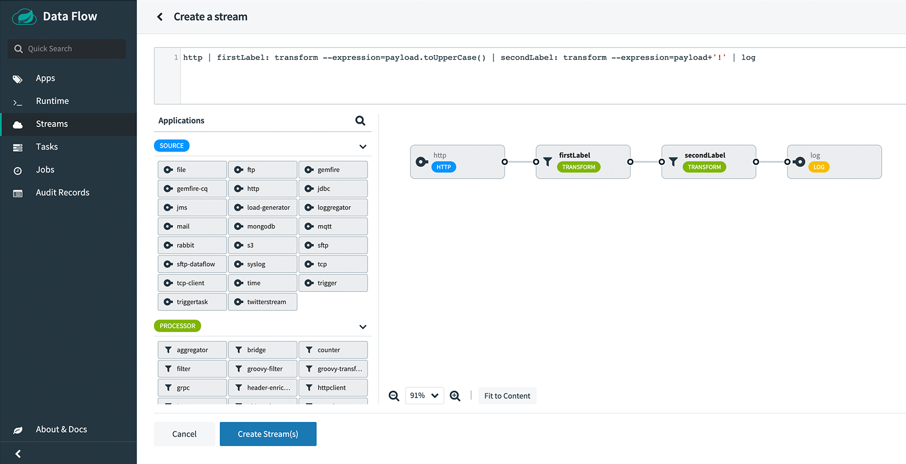

# Labeling Applications

You can use labels as an alternative reference to an application in the Stream or Batch DSL.
The syntax is to add the label before the application name.
Labels must be unique within the entire definition and suffixed with a colon `:`.

For example, when a a stream is made up of multiple apps with the same name, they must be qualified with labels so that they can be uniquely identified:

```bash
stream create --definition "http | firstLabel: transform --expression=payload.toUpperCase() | secondLabel: transform --expression=payload+'!' | log" --name myStreamWithLabels --deploy
```

This can be visualized in a graphical representation, as follows:



Alternatively, you can use them to help make the visualization of the Stream and Batch job more descriptive. The example in [Python Application](%currentPath%/recipes/polyglot/app) shows an example of this style of usage.
