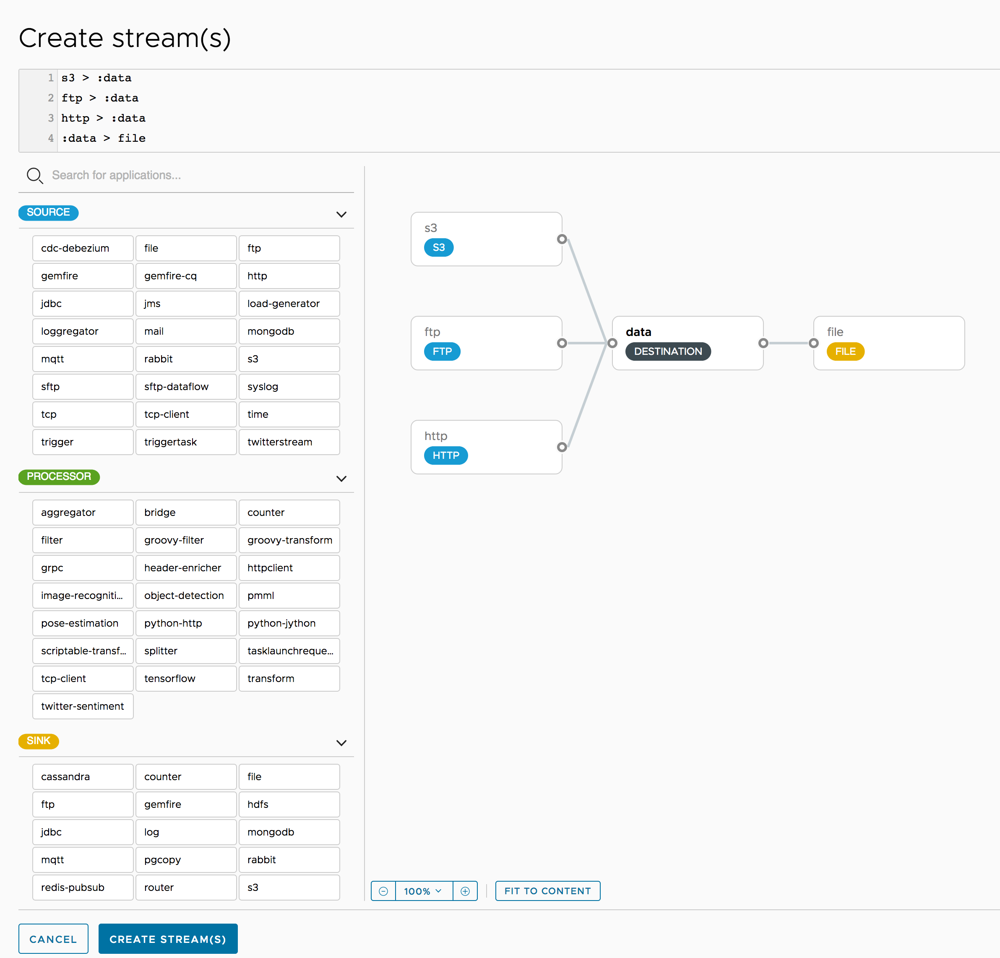

# Fan-in and Fan-out

By using [named destinations](https://docs.spring.io/spring-cloud-dataflow/docs/%dataflow-version%/reference/htmlsingle/#spring-cloud-dataflow-stream-dsl-named-destinations), you can support fan-in and fan-out use cases.
Fan-in use cases are when multiple sources all send data to the same named destination, as shown in the following example:

```
s3 > :data
ftp > :data
http > :data
```

The preceding example directs the data payloads from the Amazon S3, FTP, and HTTP sources to the same named destination, called `data`.
Then an additional stream created with the following DSL expression would have all the data from those three sources sent to the file sink:

`:data > file`

The following image shows a graphical representation of fan-in:



The fan-out use case is when you determine the destination of a stream based on some information that is known only at runtime.
In this case, you can use the [Router Application](https://docs.spring.io/spring-cloud-stream-app-starters/docs/%streaming-apps-version%/reference/html/spring-cloud-stream-modules-sinks.html#spring-cloud-stream-modules-router-sink) to specify how to direct the incoming message to one of N named destinations.

A nice [Video](https://youtu.be/l8SgHtP5QCI) showing Fan-in and Fan-out behavior is also available.
