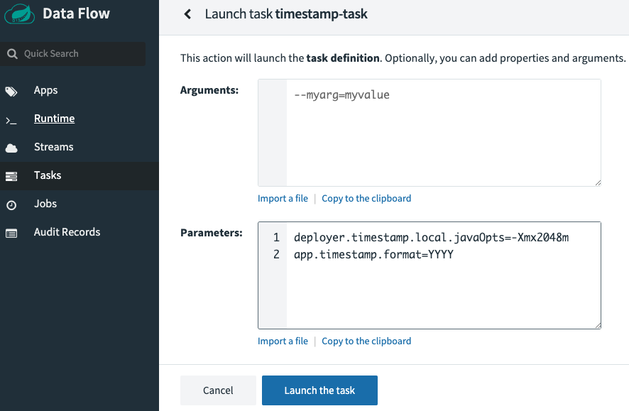

# Deployment Properties

When task definitions are launched to the target platforms (`local`, `cloudFoundry`, and `kubernetes`), you can provide the configuration properties that are applied to the task applications at launch time.
For instance, you can specify:

- Deployer Properties - These properties customize how tasks are launched.
- Application Properties - These are application-specific properties.

<!--TIP-->

You can view the deployment properties for each of the platforms by selecting one of the following links:

- [Local](https://docs.spring.io/spring-cloud-dataflow/docs/current/reference/htmlsingle/#configuration-local-deployer)
- [Cloud Foundry](https://docs.spring.io/spring-cloud-dataflow/docs/current/reference/htmlsingle/#configuration-cloudfoundry-deployer)
- [Kubernetes](https://docs.spring.io/spring-cloud-dataflow/docs/current/reference/htmlsingle/#configuration-kubernetes-deployer)

<!--END_TIP-->

## Deployer Properties

Deployer properties are those properties that tell Spring Cloud Data Flow's deployer how the application should be launched.
They are in the format of `deployer.<application name>.property`.
For example if you are launching to the local platform and you want to set the maximum heap to 2048m, you would need to set the following deployer property: `deployer.timestamp.local.javaOpts=-Xmx2048m`.

## Application Properties

Applications properties are those properties that were created by the application developers to specify the behavior of the application.
For example, the timestamp application lets you set the format of the timestamp through the arguments or properties.
The format for app properties is `app.<application name>.<property>`.
So the timestamp format property would be `app.timestamp.format=YYYY`.

## How to Set These Properties

Make sure you have registered your timestamp application and have created a definition for it, as discussed in the [Getting Started Guide](%currentPath%/batch-developer-guides/getting-started/).
So, by using the UI, we can launch the `timestamp-task` by pressing the `play` button (that's the middle icon that looks like an arrow head pointing right).
Doing so takes you to a form where you can add command line arguments and deployment parameters. As shown below:

Using the examples shown earlier, we will set an application property for the format of the timestamp to `YYYY` and use the javaOpts deployer property to set the max heap size.
First lets set the format of the timestamp. This is done by selecting the `edit` button under the `Applications Properties`
The following dialog will appear:

Now enter `YYYY` in the `format` field and click the `UPDATE` button.
Now select the `edit` button under the `Deployment Properties`.
The following dialog will appear:

Now enter `-Xmx2048m` in the `java-opts` field and click the `UPDATE` button.

Press **Launch the task**.
Doing so runs the task on the Data Flow server's task platform and records a new task `execution`.
When the execution is complete, the status turns green and shows `Complete.`
Select the **Executions** tab to view a summary of executions for this task.
