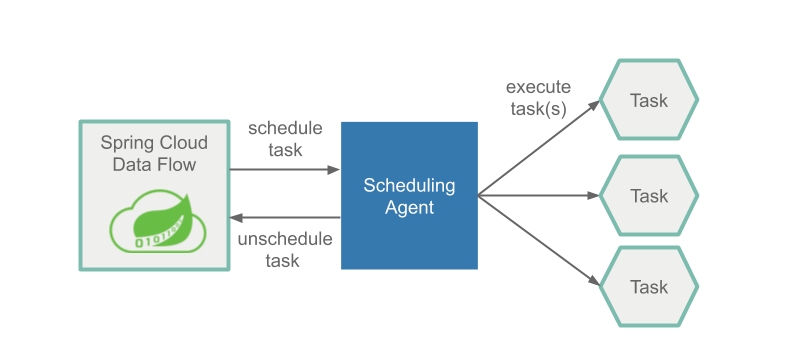
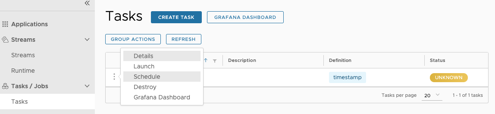
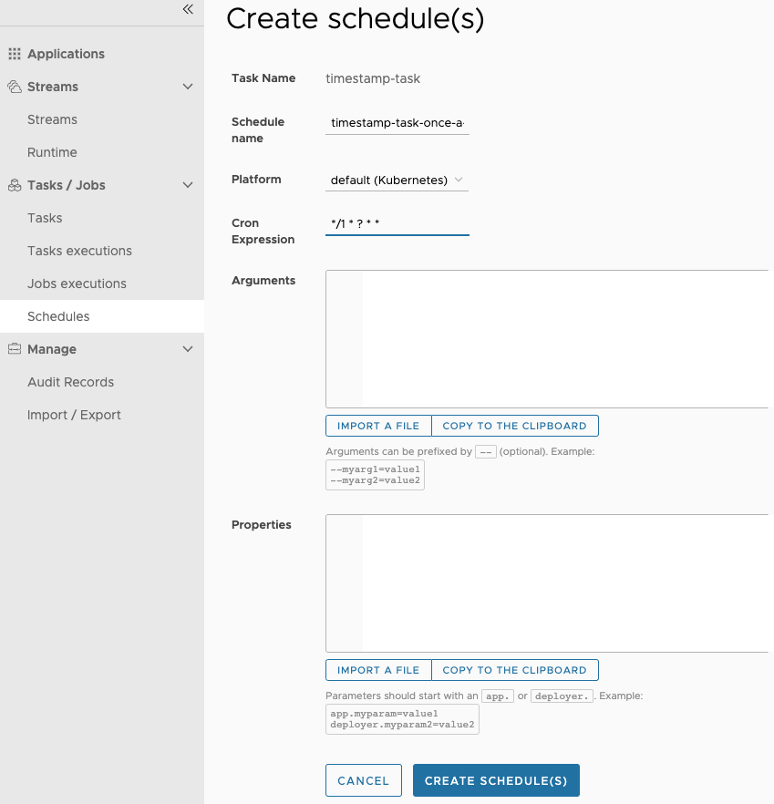
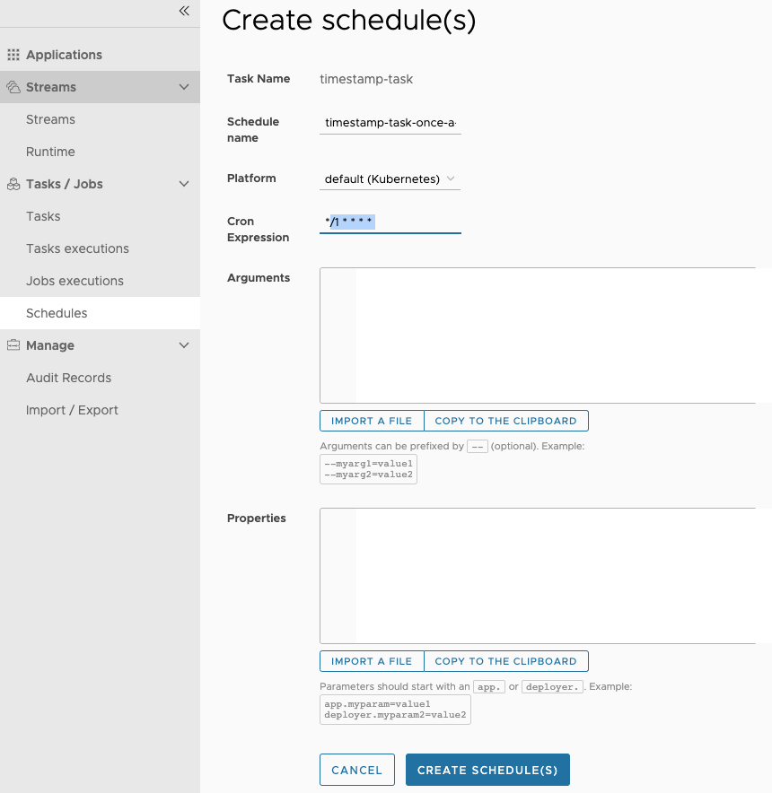
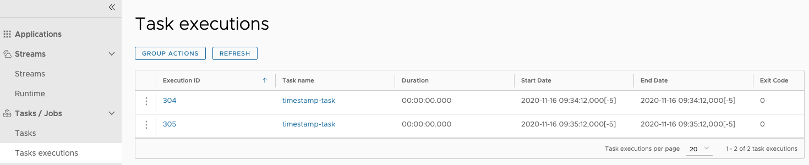
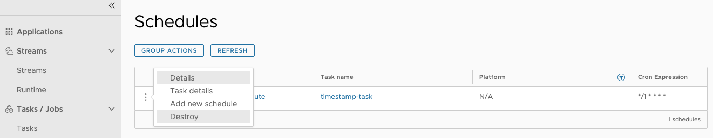
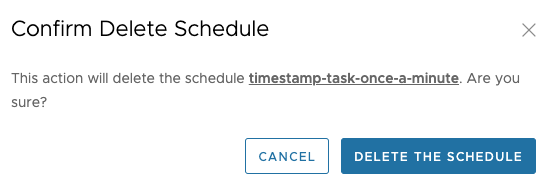

# Batch Job Scheduling

In [Batch Developers Guide](%currentPath%/batch-developer-guides/) we showed you how to build batch applications and launch them in an ad-hoc fashion.  
But typically batch jobs are launched at as scheduled time or based on some event.
In this section, we will show you how you can schedule the launch of the batch jobs using Spring Cloud Data Flow.

## Spring Cloud Data Flow Scheduling Overview

Spring Cloud Data Flow lets a user schedule the launching of tasks via a cron expression. A schedule can be created through the RESTful API or the Spring Cloud Data Flow UI.
Spring Cloud Data Flow will schedule the execution of its tasks via a scheduling agent that is available on the cloud platform.

When using the Cloud Foundry platform Spring Cloud Data Flow will use the PCF Scheduler.
When using Kubernetes, CronJobs will be used.

## Scheduling a Batch Job

Make sure you have registered your timestamp application and created a definition for it as discussed in the [Getting Started Guide](%currentPath%/batch-developer-guides/getting-started/).
So using the UI we will schedule the `timestamp-task` by pressing the `drop down` button and selecting the "Schedule Task" option as highlighted below:

So for this scenario we want to launch this application once a minute. To do this fill out the Schedule setup page as follows:

<!--TABS-->

<!--CloudFoundry-->

In the sample below we set the name of the schedule to `timestamp-task-once-a-minute` and the [cron expression](https://docs.pivotal.io/pcf-scheduler/1-2/using-jobs.html#schedule-job) to `*/1 * ? * *`.
Notice that the cron expression is expressed in the format used by Quartz.
Also notice we can add command line arguments and deployment parameters for this schedule, but we will not do so for this example.
Once you have entered the cron expression, press the `Schedule the task button`. Now PCF Scheduler will handle the scheduled launches for your batch application.

<!--Kubernetes-->

In the sample below we set the name of the schedule to `timestamp-task-once-a-minute`
and the [cron expression](https://kubernetes.io/docs/concepts/workloads/controllers/cron-jobs/) to `*/1 * * * *`.
Notice we can add command line arguments and deployment parameters for this schedule, but we will not do so for this example.
Now press the `Schedule the task button`. Now a Cron Job has been created to handle the scheduled launches for your batch application.

<!--Local-->

Spring Cloud Data Flow does not offer an out of the box solution for scheduling task launches on the local platform.  
However, there are at least two Spring Boot native solutions that provide a scheduling option, which can be custom implemented to make it work in SCDF running locally.

**Spring Boot Implementing a Quartz Scheduler**

One option is to create a Spring Boot application that utilizes the [Quartz scheduler](http://www.quartz-scheduler.org/) to execute [RESTful API](https://docs.spring.io/spring-cloud-dataflow/docs/current/reference/htmlsingle/#api-guide-resources-task-executions) calls to launch tasks on Spring Cloud Data Flow.
More information can be read about it [here](https://docs.spring.io/spring-boot/docs/current/reference/html/spring-boot-features.html#boot-features-quartz).

**Spring Boot Implementing the `@Scheduled` annotation**

Another option is to create a Spring Boot application that utilizes the `@Scheduled` annotation on a method that executes [RESTful API](https://docs.spring.io/spring-cloud-dataflow/docs/current/reference/htmlsingle/#api-guide-resources-task-executions) calls to launch tasks on Spring Cloud Data Flow.
More information can be read about it [here](https://docs.spring.io/spring-boot/docs/current/reference/html/spring-boot-features.html#boot-features-task-execution-scheduling).

<!--END_TABS-->

## Monitoring Task Launches

The status of each scheduled launch can be viewed on Spring Cloud Data Flow's `Executions` tab.

## Deleting a Schedule

From the `Schedules` tab, press the `drop down` button next to the schedule you want to remove and select the "Delete schedule" option as highlighted below:

When the confirmation dialog appears, press the `Delete Task Schedules(s)` button.

